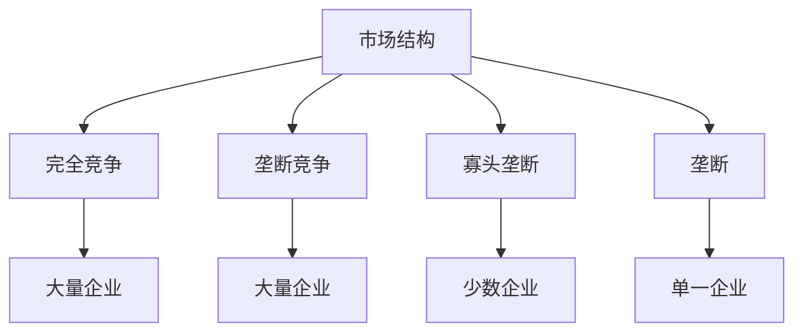
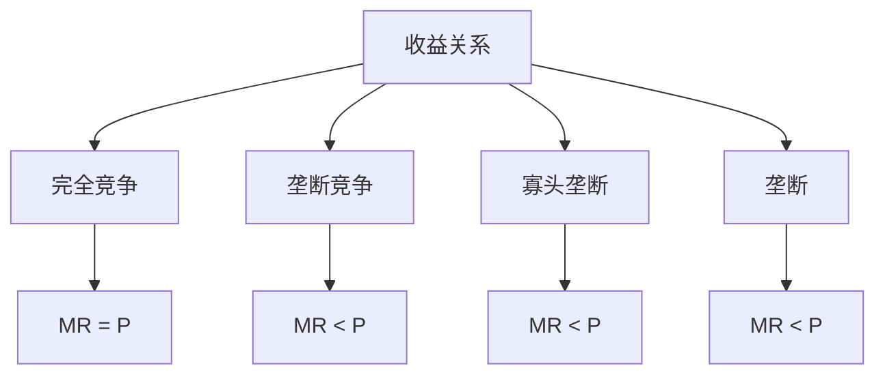
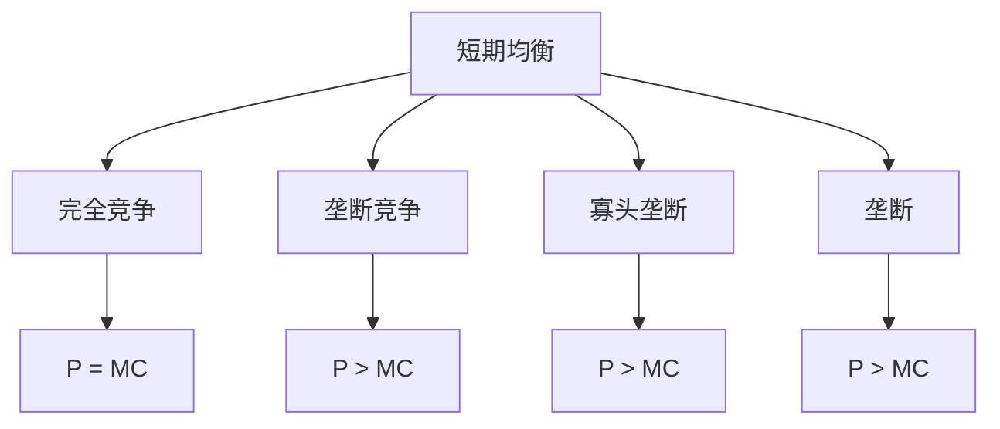
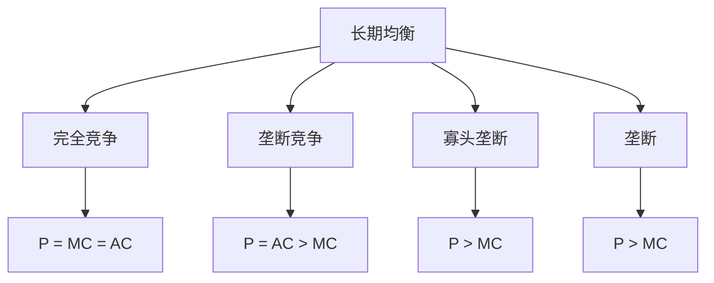
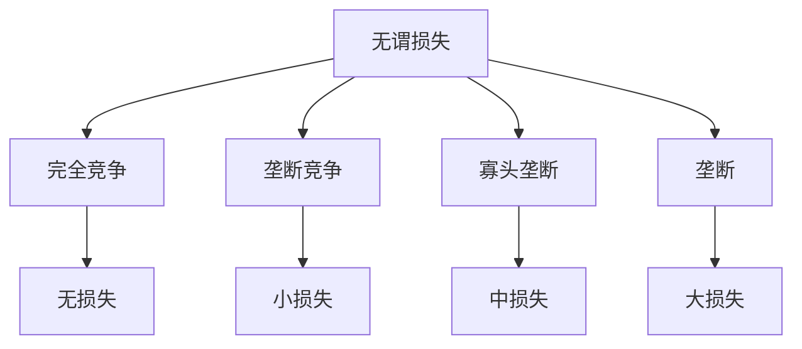
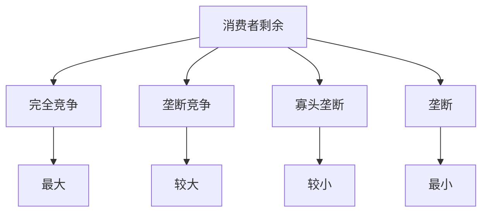

# 市场结构比较

## 核心框架

### 市场结构类型

## 市场结构特征比较

### 1. 基本特征

| 特征 | 完全竞争 | 垄断竞争 | 寡头垄断 | 垄断 |
|------|----------|----------|----------|------|
| **企业数量** | 大量 | 大量 | 少数 | 单一 |
| **产品性质** | 同质 | 差异化 | 同质或异质 | 无替代品 |
| **进入壁垒** | 无 | 无 | 有 | 有 |
| **价格控制** | 无 | 有限 | 有限 | 完全 |
| **信息** | 完全 | 完全 | 完全或不完全 | 完全 |

### 2. 需求曲线

#### 企业需求曲线

| 市场结构 | 需求曲线特征 | 原因 |
|----------|--------------|------|
| **完全竞争** | 水平线 | 价格接受者 |
| **垄断竞争** | 向下倾斜 | 产品差异化 |
| **寡头垄断** | 向下倾斜 | 市场势力 |
| **垄断** | 向下倾斜 | 完全市场势力 |

#### 市场需求曲线

| 市场结构 | 需求曲线特征 | 原因 |
|----------|--------------|------|
| **完全竞争** | 向下倾斜 | 市场需求规律 |
| **垄断竞争** | 向下倾斜 | 市场需求规律 |
| **寡头垄断** | 向下倾斜 | 市场需求规律 |
| **垄断** | 向下倾斜 | 市场需求规律 |

### 3. 收益分析

#### 收益特征

| 市场结构 | 总收益 | 平均收益 | 边际收益 |
|----------|--------|----------|----------|
| **完全竞争** | TR = PQ | AR = P | MR = P |
| **垄断竞争** | TR = PQ | AR = P | MR < P |
| **寡头垄断** | TR = PQ | AR = P | MR < P |
| **垄断** | TR = PQ | AR = P | MR < P |

#### 收益关系

## 市场均衡比较

### 1. 短期均衡

#### 均衡条件

| 市场结构 | 均衡条件 | 价格 | 产量 | 利润 |
|----------|----------|------|------|------|
| **完全竞争** | P = MC | P = MC | Qc | 零经济利润 |
| **垄断竞争** | MR = MC | P > MC | Qmc < Qc | 经济利润 |
| **寡头垄断** | MR = MC | P > MC | Qo < Qc | 经济利润 |
| **垄断** | MR = MC | P > MC | Qm < Qc | 经济利润 |

#### 均衡特征

### 2. 长期均衡

#### 均衡条件

| 市场结构 | 均衡条件 | 价格 | 产量 | 利润 |
|----------|----------|------|------|------|
| **完全竞争** | P = MC = AC | P = MC | Qc | 零经济利润 |
| **垄断竞争** | MR = MC, P = AC | P > MC | Qmc < Qc | 零经济利润 |
| **寡头垄断** | MR = MC | P > MC | Qo < Qc | 经济利润 |
| **垄断** | MR = MC | P > MC | Qm < Qc | 经济利润 |

#### 均衡特征

### 3. 均衡比较

#### 价格比较

| 市场结构 | 价格水平 | 相对关系 |
|----------|----------|----------|
| **完全竞争** | Pc | 最低 |
| **垄断竞争** | Pmc | Pc < Pmc |
| **寡头垄断** | Po | Pc < Po |
| **垄断** | Pm | Pc < Pmc < Po < Pm |

#### 产量比较

| 市场结构 | 产量水平 | 相对关系 |
|----------|----------|----------|
| **完全竞争** | Qc | 最高 |
| **垄断竞争** | Qmc | Qmc < Qc |
| **寡头垄断** | Qo | Qo < Qc |
| **垄断** | Qm | Qm < Qo < Qmc < Qc |

## 效率比较

### 1. 配置效率

#### 配置效率条件
- **边际成本** = **边际收益**
- **价格** = **边际成本**
- **资源配置最优**

#### 配置效率比较

| 市场结构 | 配置效率 | 原因 |
|----------|----------|------|
| **完全竞争** | 完全效率 | P = MC |
| **垄断竞争** | 无效率 | P > MC |
| **寡头垄断** | 无效率 | P > MC |
| **垄断** | 无效率 | P > MC |

#### 无谓损失比较

### 2. 生产效率

#### 生产效率条件
- **平均成本最小**
- **技术效率最高**
- **规模最优**

#### 生产效率比较

| 市场结构 | 生产效率 | 原因 |
|----------|----------|------|
| **完全竞争** | 完全效率 | AC最小 |
| **垄断竞争** | 无效率 | AC非最小 |
| **寡头垄断** | 可能无效率 | AC可能非最小 |
| **垄断** | 可能无效率 | AC可能非最小 |

### 3. 动态效率

#### 动态效率条件
- **技术进步**：促进技术进步
- **创新激励**：激励创新
- **长期增长**：促进长期增长

#### 动态效率比较

| 市场结构 | 动态效率 | 原因 |
|----------|----------|------|
| **完全竞争** | 可能无效率 | 创新激励不足 |
| **垄断竞争** | 可能无效率 | 创新激励不足 |
| **寡头垄断** | 可能无效率 | 创新激励不足 |
| **垄断** | 可能无效率 | 创新激励不足 |

## 福利比较

### 1. 消费者剩余

#### 消费者剩余比较

| 市场结构 | 消费者剩余 | 相对关系 |
|----------|------------|----------|
| **完全竞争** | 最大 | 最高 |
| **垄断竞争** | 较大 | 较高 |
| **寡头垄断** | 较小 | 较低 |
| **垄断** | 最小 | 最低 |

#### 消费者剩余分析

### 2. 生产者剩余

#### 生产者剩余比较

| 市场结构 | 生产者剩余 | 相对关系 |
|----------|------------|----------|
| **完全竞争** | 最小 | 最低 |
| **垄断竞争** | 较小 | 较低 |
| **寡头垄断** | 较大 | 较高 |
| **垄断** | 最大 | 最高 |

### 3. 总剩余

#### 总剩余比较

| 市场结构 | 总剩余 | 相对关系 |
|----------|--------|----------|
| **完全竞争** | 最大 | 最高 |
| **垄断竞争** | 较大 | 较高 |
| **寡头垄断** | 较小 | 较低 |
| **垄断** | 最小 | 最低 |

## 政策比较

### 1. 反垄断政策

#### 反垄断政策适用性

| 市场结构 | 反垄断政策 | 原因 |
|----------|------------|------|
| **完全竞争** | 不需要 | 已经竞争 |
| **垄断竞争** | 可能需要 | 竞争不足 |
| **寡头垄断** | 需要 | 竞争不足 |
| **垄断** | 需要 | 无竞争 |

#### 反垄断政策工具

| 政策工具 | 适用市场 | 效果 |
|----------|----------|------|
| **结构控制** | 寡头、垄断 | 促进竞争 |
| **行为控制** | 寡头、垄断 | 控制行为 |
| **绩效控制** | 所有市场 | 提高效率 |

### 2. 价格管制

#### 价格管制适用性

| 市场结构 | 价格管制 | 原因 |
|----------|----------|------|
| **完全竞争** | 不需要 | 价格合理 |
| **垄断竞争** | 可能需要 | 价格可能过高 |
| **寡头垄断** | 需要 | 价格过高 |
| **垄断** | 需要 | 价格过高 |

#### 价格管制工具

| 政策工具 | 适用市场 | 效果 |
|----------|----------|------|
| **价格上限** | 寡头、垄断 | 降低价格 |
| **价格下限** | 完全竞争 | 保护生产者 |
| **价格指导** | 所有市场 | 引导价格 |

### 3. 质量管制

#### 质量管制适用性

| 市场结构 | 质量管制 | 原因 |
|----------|----------|------|
| **完全竞争** | 可能需要 | 质量可能不足 |
| **垄断竞争** | 需要 | 质量可能不足 |
| **寡头垄断** | 需要 | 质量可能不足 |
| **垄断** | 需要 | 质量可能不足 |

## 实际应用

### 1. 市场识别

#### 市场识别方法
- **企业数量**：统计企业数量
- **产品性质**：分析产品性质
- **进入壁垒**：分析进入壁垒
- **价格控制**：分析价格控制

#### 市场识别标准

| 标准 | 完全竞争 | 垄断竞争 | 寡头垄断 | 垄断 |
|------|----------|----------|----------|------|
| **企业数量** | >100 | >50 | 2-10 | 1 |
| **产品性质** | 同质 | 差异化 | 同质或异质 | 无替代品 |
| **进入壁垒** | 无 | 无 | 有 | 有 |
| **价格控制** | 无 | 有限 | 有限 | 完全 |

### 2. 政策制定

#### 政策制定原则
- **市场结构**：根据市场结构制定政策
- **市场效率**：提高市场效率
- **消费者福利**：保护消费者福利
- **生产者福利**：保护生产者福利

#### 政策制定方法
- **市场分析**：分析市场结构
- **效率分析**：分析市场效率
- **福利分析**：分析市场福利
- **政策设计**：设计政策工具

### 3. 政策评估

#### 政策评估标准
- **效率标准**：提高市场效率
- **公平标准**：促进公平竞争
- **福利标准**：提高社会福利
- **成本标准**：降低政策成本

#### 政策评估方法
- **效果分析**：分析政策效果
- **成本分析**：分析政策成本
- **收益分析**：分析政策收益
- **比较分析**：比较不同政策

## 理论局限

### 1. 假设局限

#### 完全信息假设
- **假设**：信息完全
- **现实**：信息不对称
- **影响**：理论可能不适用

#### 静态分析假设
- **假设**：静态分析
- **现实**：市场动态
- **影响**：可能不适用动态情况

### 2. 现实局限

#### 市场复杂性
- **假设**：市场简单
- **现实**：市场复杂
- **影响**：理论可能不适用

#### 政策复杂性
- **假设**：政策简单
- **现实**：政策复杂
- **影响**：政策可能无效

### 3. 应用局限

#### 测量问题
- **问题**：难以测量
- **解决**：使用代理变量
- **局限**：可能不准确

#### 动态问题
- **问题**：动态变化
- **解决**：静态分析
- **局限**：可能不适用动态情况

## 刻意练习

### 概念理解
- [ ] 理解不同市场结构的特征
- [ ] 掌握市场结构比较方法
- [ ] 理解效率比较分析

### 计算应用
- [ ] 比较不同市场结构的均衡
- [ ] 分析效率差异
- [ ] 计算福利差异

### 实际应用
- [ ] 识别市场结构
- [ ] 制定市场政策
- [ ] 评估政策效果

---

**相关链接**：
- [[01-完全竞争市场]] - 完全竞争市场分析
- [[02-垄断市场]] - 垄断市场分析
- [[03-寡头垄断]] - 寡头垄断分析
- [[04-垄断竞争]] - 垄断竞争分析
