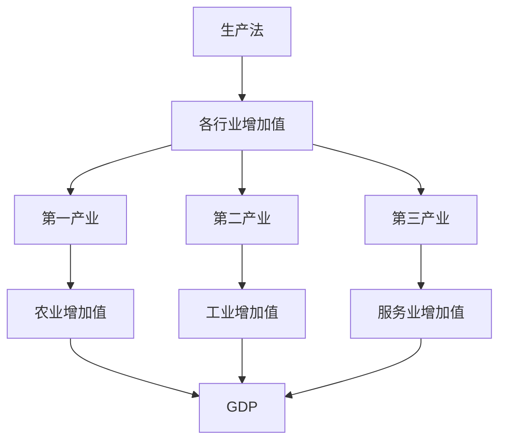
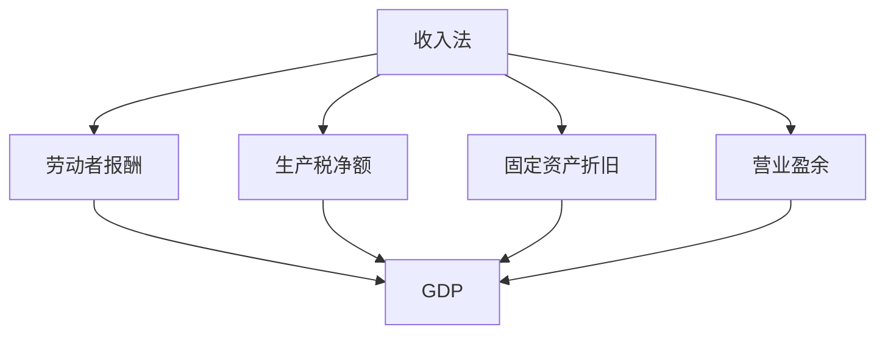
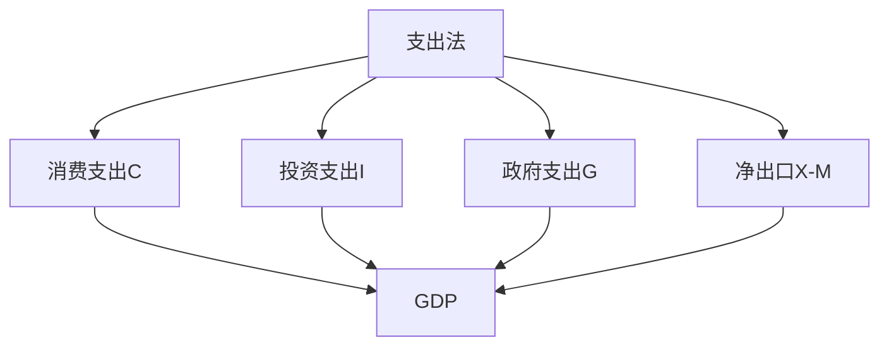

# GDP概念与计算

## 核心概念

### GDP定义
**GDP（国内生产总值）**：一个国家或地区在一定时期内（通常是一年）生产的所有最终商品和服务的市场价值。

> **费曼技巧**：GDP = 国内 + 生产 + 总值 = 一个国家生产的商品和服务的总价值

### GDP特征

| 特征 | 含义 | 例子 |
|------|------|------|
| **国内** | 在本国境内生产 | 中国境内的生产 |
| **生产** | 新生产的商品和服务 | 不包括二手交易 |
| **最终** | 最终使用的商品和服务 | 不包括中间产品 |
| **市场价值** | 按市场价格计算 | 市场价格 |

### GDP重要性

#### 经济意义
- **经济规模**：衡量经济规模
- **经济增长**：衡量经济增长
- **经济比较**：国际比较
- **政策制定**：政策制定依据

#### 社会意义
- **生活水平**：反映生活水平
- **就业状况**：反映就业状况
- **社会福利**：反映社会福利
- **发展水平**：反映发展水平

## GDP计算方法

### 1. 生产法（增加值法）

#### 计算公式
```
GDP = Σ(各行业增加值)
增加值 = 总产出 - 中间投入
```

#### 计算步骤
1. **计算各行业增加值**：总产出 - 中间投入
2. **汇总各行业增加值**：Σ(各行业增加值)
3. **得到GDP**：GDP = Σ(各行业增加值)

#### 生产法分析



### 2. 收入法（分配法）

#### 计算公式
```
GDP = 劳动者报酬 + 生产税净额 + 固定资产折旧 + 营业盈余
```

#### 收入构成

| 构成 | 含义 | 例子 |
|------|------|------|
| **劳动者报酬** | 劳动者获得的收入 | 工资、奖金 |
| **生产税净额** | 生产税减去生产补贴 | 增值税、消费税 |
| **固定资产折旧** | 固定资产折旧 | 设备折旧 |
| **营业盈余** | 企业利润 | 企业利润 |

#### 收入法分析



### 3. 支出法（使用法）

#### 计算公式
```
GDP = C + I + G + (X - M)
```

其中：
- **C**：消费支出
- **I**：投资支出
- **G**：政府支出
- **X**：出口
- **M**：进口

#### 支出构成

| 构成 | 含义 | 例子 |
|------|------|------|
| **消费支出** | 居民消费支出 | 食品、服装 |
| **投资支出** | 固定资产投资 | 厂房、设备 |
| **政府支出** | 政府消费支出 | 教育、医疗 |
| **净出口** | 出口减去进口 | 贸易差额 |

#### 支出法分析



## GDP相关概念

### 1. 名义GDP与实际GDP

#### 名义GDP
- **定义**：按当年价格计算的GDP
- **计算**：GDP = Σ(Pi × Qi)
- **特点**：包含价格变化

#### 实际GDP
- **定义**：按基年价格计算的GDP
- **计算**：GDP = Σ(P0 × Qi)
- **特点**：排除价格变化

#### 关系
```
实际GDP = 名义GDP / GDP平减指数
GDP平减指数 = 名义GDP / 实际GDP × 100
```

### 2. GDP与GNP

#### GDP（国内生产总值）
- **定义**：在本国境内生产的价值
- **计算**：按地域计算
- **特点**：包括外国人在本国的生产

#### GNP（国民生产总值）
- **定义**：本国国民生产的价值
- **计算**：按国民计算
- **特点**：包括本国人在外国的生产

#### 关系
```
GNP = GDP + 本国人在外国的收入 - 外国人在本国的收入
```

### 3. 人均GDP

#### 定义
**人均GDP**：GDP除以人口数量

#### 计算公式
```
人均GDP = GDP / 人口数量
```

#### 意义
- **生活水平**：反映生活水平
- **发展水平**：反映发展水平
- **国际比较**：国际比较指标

## GDP计算实例

### 实例1：生产法计算

```
某国各行业增加值：
农业：1000亿元
工业：3000亿元
服务业：2000亿元

GDP = 1000 + 3000 + 2000 = 6000亿元
```

### 实例2：收入法计算

```
某国收入构成：
劳动者报酬：3000亿元
生产税净额：600亿元
固定资产折旧：400亿元
营业盈余：2000亿元

GDP = 3000 + 600 + 400 + 2000 = 6000亿元
```

### 实例3：支出法计算

```
某国支出构成：
消费支出：4000亿元
投资支出：1500亿元
政府支出：800亿元
净出口：-300亿元

GDP = 4000 + 1500 + 800 + (-300) = 6000亿元
```

## GDP局限性

### 1. 测量局限

#### 非市场活动
- **问题**：非市场活动未计入
- **例子**：家务劳动、志愿服务
- **影响**：GDP可能低估

#### 地下经济
- **问题**：地下经济未计入
- **例子**：黑市交易、逃税活动
- **影响**：GDP可能低估

#### 质量变化
- **问题**：质量变化难以测量
- **例子**：产品质量提升
- **影响**：GDP可能低估

### 2. 福利局限

#### 收入分配
- **问题**：不反映收入分配
- **例子**：贫富差距
- **影响**：GDP可能高估福利

#### 环境成本
- **问题**：不反映环境成本
- **例子**：环境污染
- **影响**：GDP可能高估福利

#### 生活质量
- **问题**：不反映生活质量
- **例子**：工作压力、休闲时间
- **影响**：GDP可能高估福利

### 3. 比较局限

#### 价格差异
- **问题**：价格差异影响比较
- **例子**：不同国家价格水平
- **影响**：国际比较可能不准确

#### 汇率问题
- **问题**：汇率波动影响比较
- **例子**：汇率变化
- **影响**：国际比较可能不准确

#### 统计方法
- **问题**：统计方法不同
- **例子**：统计口径差异
- **影响**：国际比较可能不准确

## GDP应用

### 1. 经济分析

#### 经济增长分析
- **增长率**：GDP增长率
- **趋势分析**：GDP变化趋势
- **周期分析**：经济周期分析

#### 结构分析
- **产业结构**：三次产业结构
- **需求结构**：消费、投资、出口结构
- **地区结构**：地区GDP分布

### 2. 政策制定

#### 宏观经济政策
- **财政政策**：根据GDP制定财政政策
- **货币政策**：根据GDP制定货币政策
- **产业政策**：根据GDP制定产业政策

#### 发展规划
- **五年规划**：根据GDP制定五年规划
- **年度计划**：根据GDP制定年度计划
- **区域规划**：根据GDP制定区域规划

### 3. 国际比较

#### 经济实力比较
- **总量比较**：GDP总量比较
- **人均比较**：人均GDP比较
- **增长率比较**：GDP增长率比较

#### 发展水平比较
- **发展阶段**：根据GDP判断发展阶段
- **发展水平**：根据GDP判断发展水平
- **发展潜力**：根据GDP判断发展潜力

## 刻意练习

### 概念理解
- [ ] 理解GDP的定义和特征
- [ ] 掌握GDP的计算方法
- [ ] 理解GDP相关概念

### 计算应用
- [ ] 计算GDP（三种方法）
- [ ] 计算名义GDP和实际GDP
- [ ] 计算人均GDP

### 实际应用
- [ ] 分析GDP数据
- [ ] 比较不同国家GDP
- [ ] 评估GDP局限性

---

**相关链接**：
- [[02-国民收入循环]] - 国民收入循环分析
- [[03-价格指数]] - 价格指数分析
- [[04-失业率]] - 失业率分析
