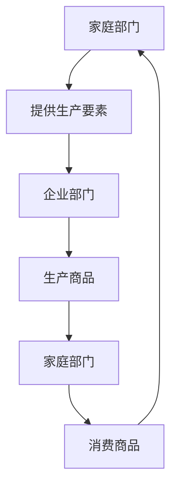
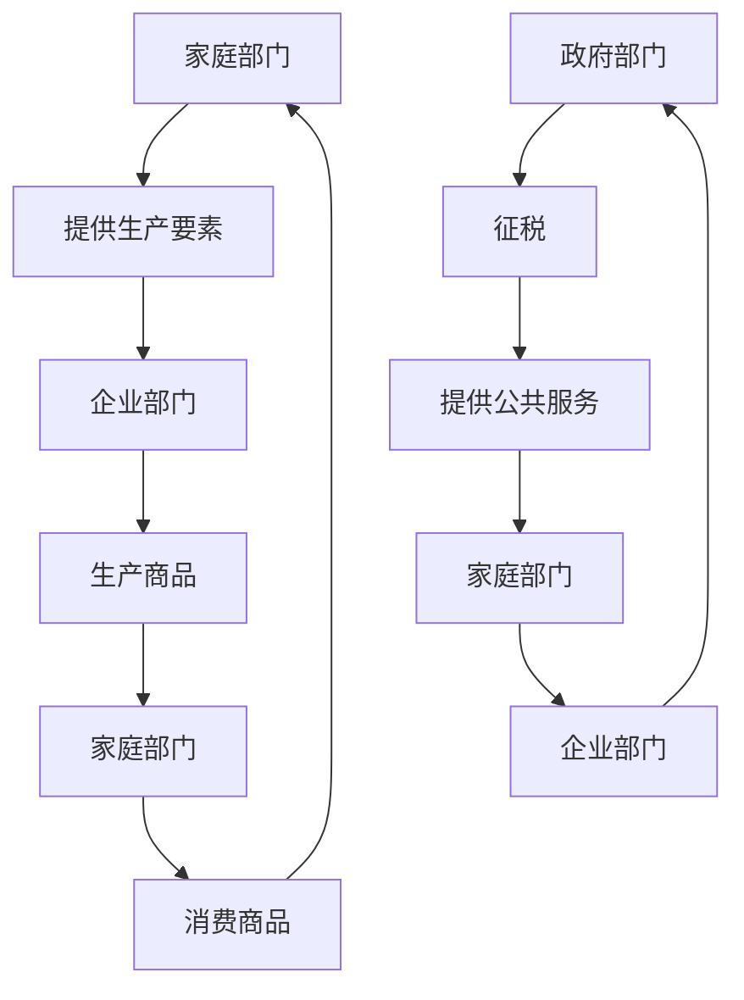
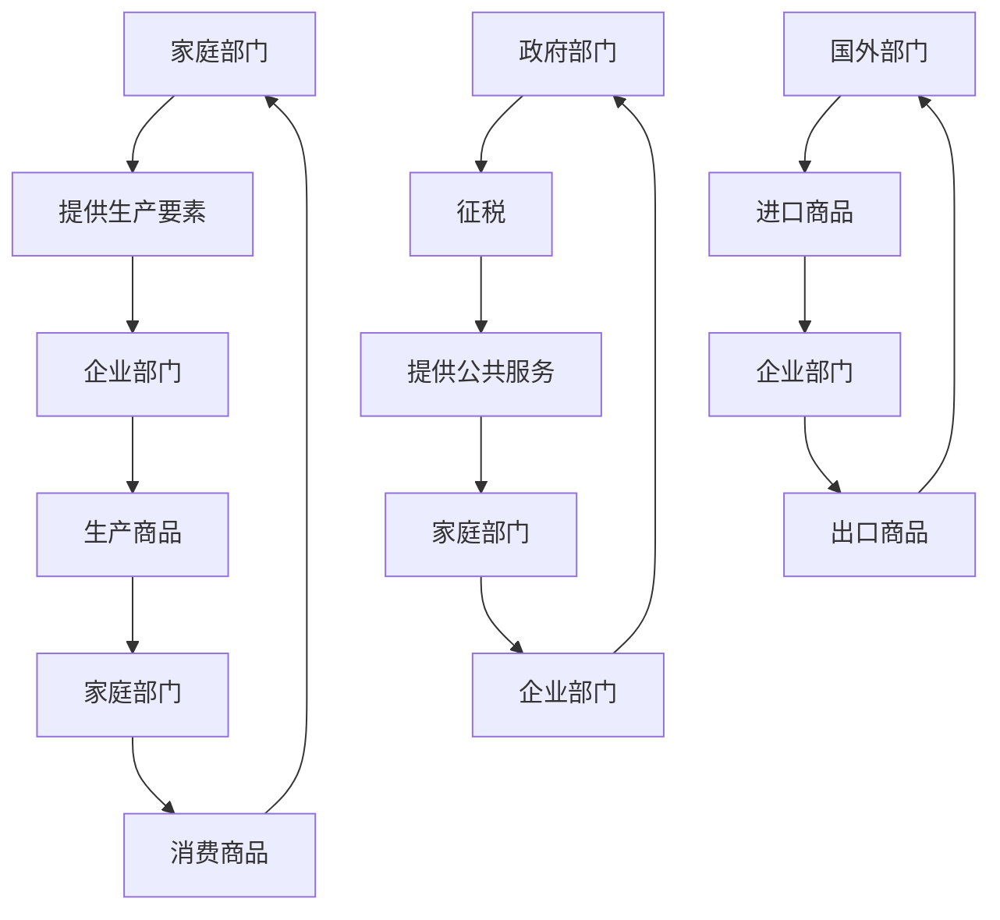
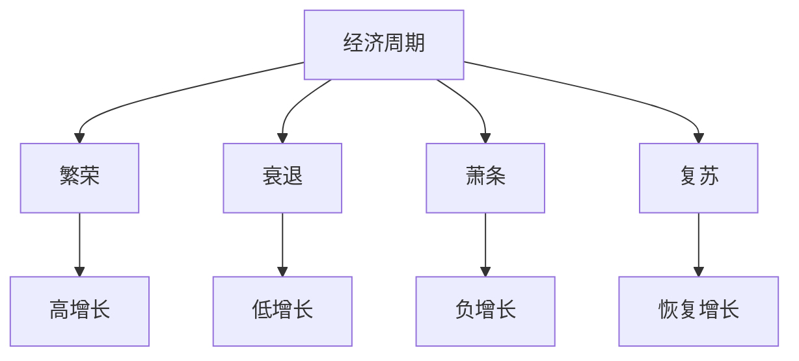

# 国民收入循环

## 核心概念

### 国民收入循环定义
**国民收入循环**：国民经济中收入、支出、生产、分配等经济活动相互联系、相互制约的循环过程。

> **费曼技巧**：国民收入循环 = 收入 → 支出 → 生产 → 分配 → 收入

### 循环特征

| 特征 | 含义 | 例子 |
|------|------|------|
| **循环性** | 经济活动循环进行 | 收入→支出→生产→收入 |
| **相互性** | 各环节相互影响 | 收入影响支出 |
| **平衡性** | 总供给等于总需求 | 供给=需求 |
| **动态性** | 循环过程动态变化 | 经济波动 |

## 两部门经济循环

### 1. 基本模型

#### 参与者
- **家庭部门**：提供生产要素，消费商品
- **企业部门**：使用生产要素，生产商品

#### 循环过程



#### 收入流向
- **家庭→企业**：生产要素收入
- **企业→家庭**：商品支出

### 2. 收入等式

#### 基本等式
```
Y = C + S
Y = C + I
```

其中：
- **Y**：国民收入
- **C**：消费
- **S**：储蓄
- **I**：投资

#### 均衡条件
```
S = I
```

### 3. 循环分析

#### 收入分析
- **总收入**：Y = C + S
- **总支出**：Y = C + I
- **均衡条件**：S = I

#### 储蓄投资分析
- **储蓄**：收入减去消费
- **投资**：企业投资支出
- **均衡**：储蓄等于投资

## 三部门经济循环

### 1. 基本模型

#### 参与者
- **家庭部门**：提供生产要素，消费商品
- **企业部门**：使用生产要素，生产商品
- **政府部门**：提供公共服务，征税

#### 循环过程



#### 收入流向
- **家庭→企业**：生产要素收入
- **企业→家庭**：商品支出
- **家庭→政府**：税收
- **政府→家庭**：转移支付
- **政府→企业**：政府购买

### 2. 收入等式

#### 基本等式
```
Y = C + S + T
Y = C + I + G
```

其中：
- **Y**：国民收入
- **C**：消费
- **S**：储蓄
- **T**：税收
- **I**：投资
- **G**：政府支出

#### 均衡条件
```
S + T = I + G
```

### 3. 循环分析

#### 收入分析
- **总收入**：Y = C + S + T
- **总支出**：Y = C + I + G
- **均衡条件**：S + T = I + G

#### 政府作用分析
- **税收**：政府收入来源
- **支出**：政府支出用途
- **平衡**：财政收支平衡

## 四部门经济循环

### 1. 基本模型

#### 参与者
- **家庭部门**：提供生产要素，消费商品
- **企业部门**：使用生产要素，生产商品
- **政府部门**：提供公共服务，征税
- **国外部门**：国际贸易，国际金融

#### 循环过程



#### 收入流向
- **家庭→企业**：生产要素收入
- **企业→家庭**：商品支出
- **家庭→政府**：税收
- **政府→家庭**：转移支付
- **政府→企业**：政府购买
- **企业→国外**：出口
- **国外→企业**：进口

### 2. 收入等式

#### 基本等式
```
Y = C + S + T
Y = C + I + G + (X - M)
```

其中：
- **Y**：国民收入
- **C**：消费
- **S**：储蓄
- **T**：税收
- **I**：投资
- **G**：政府支出
- **X**：出口
- **M**：进口

#### 均衡条件
```
S + T = I + G + (X - M)
```

### 3. 循环分析

#### 收入分析
- **总收入**：Y = C + S + T
- **总支出**：Y = C + I + G + (X - M)
- **均衡条件**：S + T = I + G + (X - M)

#### 国际收支分析
- **出口**：商品和服务出口
- **进口**：商品和服务进口
- **净出口**：出口减去进口
- **国际收支**：国际收支平衡

## 循环均衡分析

### 1. 均衡条件

#### 两部门经济
```
S = I
```

#### 三部门经济
```
S + T = I + G
```

#### 四部门经济
```
S + T = I + G + (X - M)
```

### 2. 均衡分析

#### 储蓄投资均衡
- **储蓄**：收入减去消费
- **投资**：企业投资支出
- **均衡**：储蓄等于投资

#### 政府收支均衡
- **政府收入**：税收
- **政府支出**：政府购买
- **均衡**：政府收支平衡

#### 国际收支均衡
- **出口**：商品和服务出口
- **进口**：商品和服务进口
- **均衡**：国际收支平衡

### 3. 均衡调整

#### 自动调整机制
- **价格机制**：价格自动调整
- **利率机制**：利率自动调整
- **汇率机制**：汇率自动调整

#### 政策调整机制
- **财政政策**：政府支出和税收
- **货币政策**：货币供应和利率
- **汇率政策**：汇率调整

## 循环波动分析

### 1. 经济周期

#### 周期阶段
- **繁荣**：经济高涨
- **衰退**：经济下降
- **萧条**：经济低迷
- **复苏**：经济恢复

#### 周期特征



### 2. 波动原因

#### 内部原因
- **投资波动**：投资需求波动
- **消费波动**：消费需求波动
- **技术变化**：技术进步
- **政策变化**：政策调整

#### 外部原因
- **国际环境**：国际经济环境
- **自然灾害**：自然灾害
- **政治事件**：政治事件
- **技术冲击**：技术冲击

### 3. 波动影响

#### 经济影响
- **产出影响**：产出波动
- **就业影响**：就业波动
- **价格影响**：价格波动
- **收入影响**：收入波动

#### 社会影响
- **生活水平**：生活水平波动
- **社会福利**：社会福利波动
- **社会稳定**：社会稳定波动
- **发展水平**：发展水平波动

## 循环政策分析

### 1. 财政政策

#### 政策工具
- **政府支出**：增加或减少政府支出
- **税收政策**：增加或减少税收
- **转移支付**：增加或减少转移支付

#### 政策效果
- **乘数效应**：政策乘数效应
- **挤出效应**：政策挤出效应
- **时滞效应**：政策时滞效应

### 2. 货币政策

#### 政策工具
- **货币供应**：增加或减少货币供应
- **利率政策**：提高或降低利率
- **汇率政策**：调整汇率

#### 政策效果
- **流动性效应**：流动性效应
- **利率效应**：利率效应
- **汇率效应**：汇率效应

### 3. 汇率政策

#### 政策工具
- **汇率调整**：调整汇率水平
- **汇率制度**：选择汇率制度
- **外汇管制**：外汇管制

#### 政策效果
- **贸易效应**：贸易效应
- **资本流动效应**：资本流动效应
- **价格效应**：价格效应

## 实际应用

### 1. 经济分析

#### 宏观经济分析
- **总量分析**：总量经济分析
- **结构分析**：结构经济分析
- **趋势分析**：趋势经济分析

#### 政策分析
- **政策效果**：政策效果分析
- **政策协调**：政策协调分析
- **政策优化**：政策优化分析

### 2. 政策制定

#### 宏观经济政策
- **财政政策**：制定财政政策
- **货币政策**：制定货币政策
- **汇率政策**：制定汇率政策

#### 发展规划
- **五年规划**：制定五年规划
- **年度计划**：制定年度计划
- **区域规划**：制定区域规划

### 3. 国际比较

#### 经济比较
- **总量比较**：总量经济比较
- **结构比较**：结构经济比较
- **政策比较**：政策比较

#### 发展比较
- **发展阶段**：发展阶段比较
- **发展水平**：发展水平比较
- **发展模式**：发展模式比较

## 理论局限

### 1. 假设局限

#### 完全信息假设
- **假设**：信息完全
- **现实**：信息不对称
- **影响**：理论可能不适用

#### 静态分析假设
- **假设**：静态分析
- **现实**：经济动态
- **影响**：可能不适用动态情况

### 2. 现实局限

#### 市场失灵
- **问题**：市场可能失灵
- **解决**：政府干预
- **局限**：政府干预可能无效

#### 政策时滞
- **问题**：政策时滞
- **解决**：政策协调
- **局限**：政策协调可能困难

### 3. 应用局限

#### 复杂经济
- **问题**：经济可能复杂
- **解决**：简化假设
- **局限**：可能偏离现实

#### 动态经济
- **问题**：经济可能动态
- **解决**：静态分析
- **局限**：可能不适用动态情况

## 刻意练习

### 概念理解
- [ ] 理解国民收入循环的定义和特征
- [ ] 掌握不同部门经济循环模型
- [ ] 理解循环均衡条件

### 分析应用
- [ ] 分析经济循环过程
- [ ] 分析循环均衡条件
- [ ] 分析循环波动原因

### 实际应用
- [ ] 分析宏观经济政策
- [ ] 制定经济发展规划
- [ ] 评估政策效果

---

**相关链接**：
- [[01-GDP概念与计算]] - GDP分析
- [[03-价格指数]] - 价格指数分析
- [[04-失业率]] - 失业率分析
