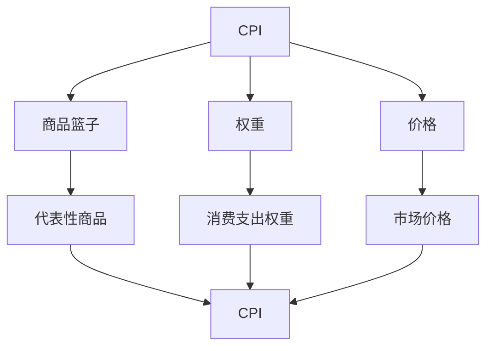
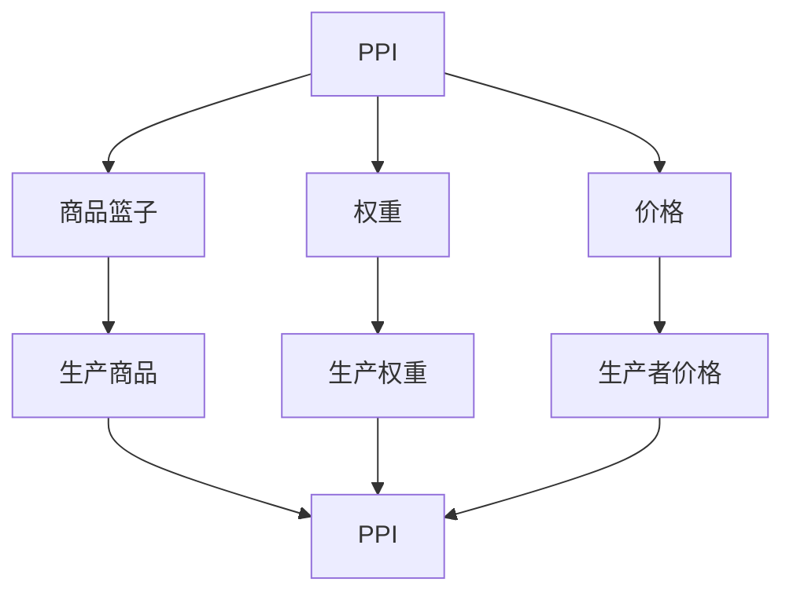
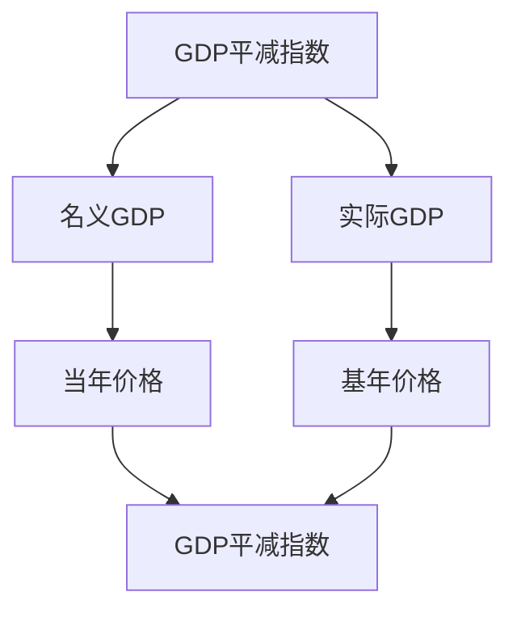
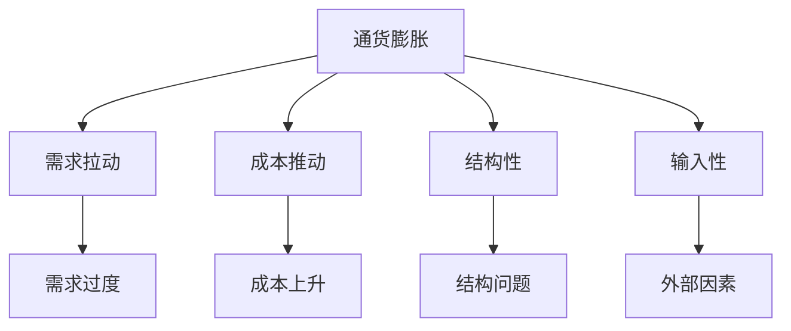

# 价格指数

## 核心概念

### 价格指数定义
**价格指数**：反映一组商品和服务价格水平变化趋势的相对数。

> **费曼技巧**：价格指数 = 价格变化趋势 = 通货膨胀指标

### 价格指数特征

| 特征 | 含义 | 例子 |
|------|------|------|
| **相对性** | 相对于基期的变化 | 基期=100 |
| **综合性** | 综合反映价格变化 | 多种商品 |
| **代表性** | 代表整体价格水平 | 典型商品 |
| **可比性** | 不同时期可比 | 时间序列 |

### 价格指数作用

#### 经济意义
- **通货膨胀**：衡量通货膨胀
- **经济分析**：经济分析工具
- **政策制定**：政策制定依据
- **国际比较**：国际比较指标

#### 社会意义
- **生活水平**：反映生活水平变化
- **收入调整**：收入调整依据
- **福利分析**：福利分析工具
- **社会政策**：社会政策依据

## 价格指数类型

### 1. 消费者价格指数（CPI）

#### 定义
**CPI**：反映消费者购买商品和服务价格水平变化的指数。

#### 计算步骤
1. **选择商品篮子**：选择代表性商品
2. **确定权重**：确定各商品权重
3. **收集价格**：收集各时期价格
4. **计算指数**：计算价格指数

#### 计算公式
```
CPI = Σ(Pi × Wi) / Σ(P0 × Wi) × 100
```

其中：
- **Pi**：报告期价格
- **P0**：基期价格
- **Wi**：权重

#### CPI分析



### 2. 生产者价格指数（PPI）

#### 定义
**PPI**：反映生产者销售商品价格水平变化的指数。

#### 计算步骤
1. **选择商品篮子**：选择代表性商品
2. **确定权重**：确定各商品权重
3. **收集价格**：收集各时期价格
4. **计算指数**：计算价格指数

#### 计算公式
```
PPI = Σ(Pi × Wi) / Σ(P0 × Wi) × 100
```

其中：
- **Pi**：报告期价格
- **P0**：基期价格
- **Wi**：权重

#### PPI分析



### 3. GDP平减指数

#### 定义
**GDP平减指数**：反映GDP中所有商品和服务价格水平变化的指数。

#### 计算公式
```
GDP平减指数 = 名义GDP / 实际GDP × 100
```

#### 特点
- **全面性**：包括所有商品和服务
- **自动性**：自动反映价格变化
- **准确性**：准确反映价格变化

#### GDP平减指数分析



## 价格指数计算

### 1. 拉氏指数

#### 定义
**拉氏指数**：以基期数量为权重的价格指数。

#### 计算公式
```
L = Σ(Pi × Q0) / Σ(P0 × Q0) × 100
```

其中：
- **Pi**：报告期价格
- **P0**：基期价格
- **Q0**：基期数量

#### 特点
- **基期权重**：以基期数量为权重
- **高估倾向**：可能高估价格变化
- **计算简单**：计算相对简单

### 2. 帕氏指数

#### 定义
**帕氏指数**：以报告期数量为权重的价格指数。

#### 计算公式
```
P = Σ(Pi × Qi) / Σ(P0 × Qi) × 100
```

其中：
- **Pi**：报告期价格
- **P0**：基期价格
- **Qi**：报告期数量

#### 特点
- **报告期权重**：以报告期数量为权重
- **低估倾向**：可能低估价格变化
- **计算复杂**：计算相对复杂

### 3. 费雪指数

#### 定义
**费氏指数**：拉氏指数和帕氏指数的几何平均数。

#### 计算公式
```
F = √(L × P)
```

其中：
- **L**：拉氏指数
- **P**：帕氏指数

#### 特点
- **几何平均**：拉氏和帕氏的几何平均
- **无偏性**：无高估或低估倾向
- **理想指数**：理想的价格指数

## 价格指数应用

### 1. 通货膨胀分析

#### 通货膨胀定义
**通货膨胀**：一般价格水平持续上升的现象。

#### 通货膨胀率
```
通货膨胀率 = (CPI - CPI(-1)) / CPI(-1) × 100%
```

#### 通货膨胀类型

| 类型 | 特征 | 原因 |
|------|------|------|
| **需求拉动** | 需求过度增长 | 需求增长过快 |
| **成本推动** | 成本上升 | 成本上升 |
| **结构性** | 结构性问题 | 结构性问题 |
| **输入性** | 外部输入 | 外部因素 |

#### 通货膨胀分析



### 2. 经济分析

#### 宏观经济分析
- **价格水平**：分析价格水平变化
- **经济周期**：分析经济周期
- **政策效果**：分析政策效果

#### 微观经济分析
- **消费者行为**：分析消费者行为
- **生产者行为**：分析生产者行为
- **市场结构**：分析市场结构

### 3. 政策制定

#### 货币政策
- **利率政策**：根据价格指数调整利率
- **货币供应**：根据价格指数调整货币供应
- **汇率政策**：根据价格指数调整汇率

#### 财政政策
- **税收政策**：根据价格指数调整税收
- **支出政策**：根据价格指数调整支出
- **转移支付**：根据价格指数调整转移支付

## 价格指数局限

### 1. 测量局限

#### 商品篮子问题
- **问题**：商品篮子可能不代表性
- **解决**：定期更新商品篮子
- **局限**：更新可能滞后

#### 权重问题
- **问题**：权重可能不准确
- **解决**：定期调整权重
- **局限**：调整可能滞后

#### 质量变化问题
- **问题**：质量变化难以测量
- **解决**：质量调整
- **局限**：调整可能不准确

### 2. 应用局限

#### 基期选择问题
- **问题**：基期选择可能影响结果
- **解决**：选择合适基期
- **局限**：基期选择可能主观

#### 地区差异问题
- **问题**：地区差异可能影响结果
- **解决**：地区调整
- **局限**：调整可能不准确

#### 时间差异问题
- **问题**：时间差异可能影响结果
- **解决**：时间调整
- **局限**：调整可能不准确

### 3. 政策局限

#### 政策时滞问题
- **问题**：政策时滞可能影响效果
- **解决**：政策协调
- **局限**：协调可能困难

#### 政策冲突问题
- **问题**：政策可能冲突
- **解决**：政策协调
- **局限**：协调可能困难

#### 政策效果问题
- **问题**：政策效果可能不确定
- **解决**：政策评估
- **局限**：评估可能不准确

## 价格指数比较

### 1. 不同指数比较

#### CPI vs PPI

| 比较项目 | CPI | PPI |
|----------|-----|-----|
| **覆盖范围** | 消费者商品 | 生产者商品 |
| **价格类型** | 零售价格 | 批发价格 |
| **用途** | 生活成本 | 生产成本 |
| **政策影响** | 货币政策 | 产业政策 |

#### CPI vs GDP平减指数

| 比较项目 | CPI | GDP平减指数 |
|----------|-----|-------------|
| **覆盖范围** | 消费者商品 | 所有商品 |
| **权重** | 消费权重 | 生产权重 |
| **计算** | 固定权重 | 可变权重 |
| **准确性** | 可能不准确 | 相对准确 |

### 2. 国际比较

#### 比较方法
- **汇率调整**：按汇率调整
- **购买力平价**：按购买力平价调整
- **国际标准**：按国际标准调整

#### 比较问题
- **汇率问题**：汇率波动影响比较
- **权重问题**：权重差异影响比较
- **质量问题**：质量差异影响比较

## 实际应用

### 1. 经济分析

#### 宏观经济分析
- **价格水平**：分析价格水平变化
- **经济周期**：分析经济周期
- **政策效果**：分析政策效果

#### 微观经济分析
- **消费者行为**：分析消费者行为
- **生产者行为**：分析生产者行为
- **市场结构**：分析市场结构

### 2. 政策制定

#### 货币政策
- **利率政策**：根据价格指数调整利率
- **货币供应**：根据价格指数调整货币供应
- **汇率政策**：根据价格指数调整汇率

#### 财政政策
- **税收政策**：根据价格指数调整税收
- **支出政策**：根据价格指数调整支出
- **转移支付**：根据价格指数调整转移支付

### 3. 社会政策

#### 收入政策
- **工资调整**：根据价格指数调整工资
- **养老金调整**：根据价格指数调整养老金
- **福利调整**：根据价格指数调整福利

#### 价格政策
- **价格管制**：根据价格指数进行价格管制
- **价格支持**：根据价格指数进行价格支持
- **价格指导**：根据价格指数进行价格指导

## 刻意练习

### 概念理解
- [ ] 理解价格指数的定义和特征
- [ ] 掌握不同价格指数的计算方法
- [ ] 理解价格指数的应用

### 计算应用
- [ ] 计算CPI
- [ ] 计算PPI
- [ ] 计算GDP平减指数

### 实际应用
- [ ] 分析通货膨胀
- [ ] 制定经济政策
- [ ] 评估政策效果

---

**相关链接**：
- [[01-GDP概念与计算]] - GDP分析
- [[02-国民收入循环]] - 国民收入循环分析
- [[04-失业率]] - 失业率分析
