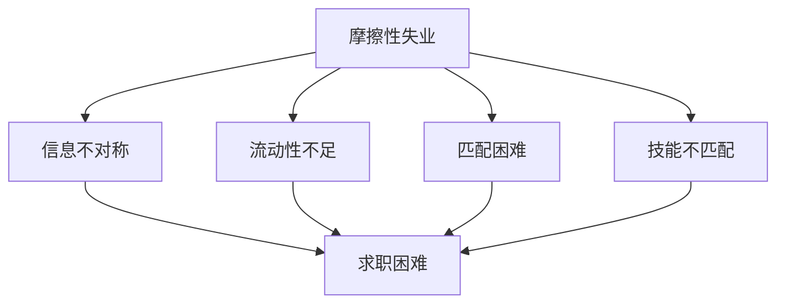
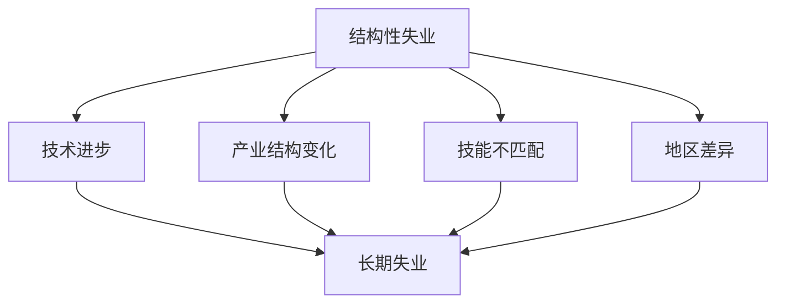
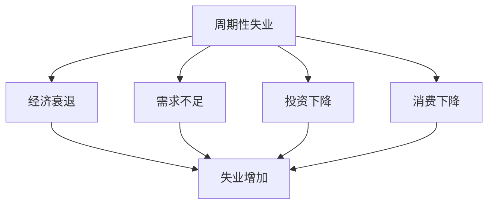
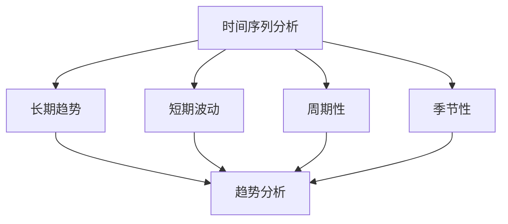

# 失业率

## 核心概念

### 失业率定义
**失业率**：失业人数占劳动力总数的百分比。

> **费曼技巧**：失业率 = 失业人数 / 劳动力总数 × 100%

### 失业率特征

| 特征 | 含义 | 例子 |
|------|------|------|
| **相对性** | 相对于劳动力总数 | 百分比 |
| **动态性** | 随时间变化 | 月度、年度 |
| **结构性** | 不同群体差异 | 年龄、性别、地区 |
| **周期性** | 随经济周期变化 | 经济波动 |

### 失业率重要性

#### 经济意义
- **经济健康**：反映经济健康状况
- **资源利用**：反映资源利用效率
- **政策制定**：政策制定依据
- **国际比较**：国际比较指标

#### 社会意义
- **社会稳定**：影响社会稳定
- **生活质量**：影响生活质量
- **社会政策**：社会政策依据
- **福利分析**：福利分析工具

## 失业率计算

### 1. 基本公式

#### 计算公式
```
失业率 = 失业人数 / 劳动力总数 × 100%
```

其中：
- **失业人数**：正在寻找工作但未找到工作的人数
- **劳动力总数**：就业人数 + 失业人数

#### 相关指标

| 指标 | 计算公式 | 含义 |
|------|----------|------|
| **就业率** | 就业人数 / 劳动力总数 × 100% | 就业比例 |
| **劳动参与率** | 劳动力总数 / 总人口 × 100% | 劳动参与比例 |
| **就业人口比** | 就业人数 / 总人口 × 100% | 就业人口比例 |

### 2. 数据来源

#### 数据收集方法
- **劳动力调查**：定期劳动力调查
- **就业统计**：就业统计
- **失业登记**：失业登记
- **企业调查**：企业调查

#### 数据质量
- **准确性**：数据准确性
- **及时性**：数据及时性
- **完整性**：数据完整性
- **可比性**：数据可比性

### 3. 计算实例

#### 实例1：基本计算
```
某国劳动力总数：1000万人
失业人数：50万人
就业人数：950万人

失业率 = 50 / 1000 × 100% = 5%
就业率 = 950 / 1000 × 100% = 95%
```

#### 实例2：分群体计算
```
某国分群体失业率：
男性：4%
女性：6%
青年（16-24岁）：12%
中年（25-54岁）：4%
老年（55岁以上）：3%
```

## 失业类型

### 1. 摩擦性失业

#### 定义
**摩擦性失业**：由于劳动力市场信息不对称和流动性不足造成的短期失业。

#### 特征
- **短期性**：短期失业
- **自愿性**：自愿失业
- **信息性**：信息不对称
- **流动性**：流动性不足

#### 原因
- **信息不对称**：求职信息不对称
- **流动性不足**：劳动力流动性不足
- **匹配困难**：求职匹配困难
- **技能不匹配**：技能不匹配

#### 摩擦性失业分析



### 2. 结构性失业

#### 定义
**结构性失业**：由于经济结构变化和技能不匹配造成的长期失业。

#### 特征
- **长期性**：长期失业
- **结构性**：结构性问题
- **技能性**：技能不匹配
- **地区性**：地区差异

#### 原因
- **技术进步**：技术进步
- **产业结构变化**：产业结构变化
- **技能不匹配**：技能不匹配
- **地区差异**：地区差异

#### 结构性失业分析



### 3. 周期性失业

#### 定义
**周期性失业**：由于经济周期波动造成的失业。

#### 特征
- **周期性**：随经济周期变化
- **波动性**：波动较大
- **宏观性**：宏观经济问题
- **政策性**：政策可调节

#### 原因
- **经济衰退**：经济衰退
- **需求不足**：需求不足
- **投资下降**：投资下降
- **消费下降**：消费下降

#### 周期性失业分析



### 4. 季节性失业

#### 定义
**季节性失业**：由于季节性因素造成的失业。

#### 特征
- **季节性**：随季节变化
- **可预测性**：可预测
- **行业性**：特定行业
- **临时性**：临时性

#### 原因
- **气候因素**：气候因素
- **节日因素**：节日因素
- **旅游因素**：旅游因素
- **农业因素**：农业因素

## 失业率分析

### 1. 时间序列分析

#### 趋势分析
- **长期趋势**：长期变化趋势
- **短期波动**：短期波动
- **周期性**：周期性变化
- **季节性**：季节性变化

#### 时间序列分析



### 2. 结构分析

#### 分群体分析
- **年龄结构**：不同年龄群体
- **性别结构**：不同性别群体
- **教育结构**：不同教育水平
- **地区结构**：不同地区

#### 分行业分析
- **第一产业**：农业
- **第二产业**：工业
- **第三产业**：服务业
- **新兴产业**：新兴产业

### 3. 国际比较

#### 比较方法
- **绝对比较**：绝对数值比较
- **相对比较**：相对数值比较
- **趋势比较**：趋势比较
- **结构比较**：结构比较

#### 比较问题
- **统计方法**：统计方法差异
- **定义差异**：定义差异
- **数据质量**：数据质量差异
- **时间差异**：时间差异

## 失业率影响

### 1. 经济影响

#### 产出影响
- **产出损失**：产出损失
- **效率损失**：效率损失
- **资源浪费**：资源浪费
- **增长影响**：增长影响

#### 收入影响
- **收入下降**：收入下降
- **消费下降**：消费下降
- **投资下降**：投资下降
- **储蓄下降**：储蓄下降

### 2. 社会影响

#### 社会稳定
- **社会不稳定**：社会不稳定
- **犯罪增加**：犯罪增加
- **社会问题**：社会问题
- **政治影响**：政治影响

#### 生活质量
- **生活质量下降**：生活质量下降
- **心理健康**：心理健康问题
- **家庭关系**：家庭关系问题
- **社会关系**：社会关系问题

### 3. 政策影响

#### 政策压力
- **政策压力**：政策压力
- **政策调整**：政策调整
- **政策创新**：政策创新
- **政策协调**：政策协调

#### 政策效果
- **政策效果**：政策效果
- **政策评估**：政策评估
- **政策优化**：政策优化
- **政策协调**：政策协调

## 失业率政策

### 1. 需求管理政策

#### 财政政策
- **政府支出**：增加政府支出
- **税收政策**：减税政策
- **转移支付**：增加转移支付
- **公共投资**：增加公共投资

#### 货币政策
- **利率政策**：降低利率
- **货币供应**：增加货币供应
- **信贷政策**：宽松信贷政策
- **汇率政策**：汇率政策

### 2. 供给管理政策

#### 教育政策
- **教育投资**：增加教育投资
- **技能培训**：技能培训
- **职业教育**：职业教育
- **终身学习**：终身学习

#### 就业政策
- **就业服务**：就业服务
- **职业介绍**：职业介绍
- **就业培训**：就业培训
- **就业补贴**：就业补贴

### 3. 结构政策

#### 产业政策
- **产业结构调整**：产业结构调整
- **新兴产业**：发展新兴产业
- **传统产业**：改造传统产业
- **服务业**：发展服务业

#### 区域政策
- **区域发展**：区域发展
- **区域平衡**：区域平衡
- **区域合作**：区域合作
- **区域协调**：区域协调

## 实际应用

### 1. 经济分析

#### 宏观经济分析
- **经济健康**：分析经济健康状况
- **经济周期**：分析经济周期
- **政策效果**：分析政策效果
- **国际比较**：国际比较

#### 微观经济分析
- **劳动力市场**：分析劳动力市场
- **就业结构**：分析就业结构
- **工资水平**：分析工资水平
- **劳动条件**：分析劳动条件

### 2. 政策制定

#### 就业政策
- **就业促进**：制定就业促进政策
- **失业保障**：制定失业保障政策
- **技能培训**：制定技能培训政策
- **就业服务**：制定就业服务政策

#### 经济政策
- **宏观经济政策**：制定宏观经济政策
- **产业政策**：制定产业政策
- **区域政策**：制定区域政策
- **社会政策**：制定社会政策

### 3. 国际比较

#### 经济比较
- **失业率比较**：比较失业率
- **就业率比较**：比较就业率
- **劳动参与率比较**：比较劳动参与率
- **就业结构比较**：比较就业结构

#### 政策比较
- **就业政策比较**：比较就业政策
- **失业保障比较**：比较失业保障
- **技能培训比较**：比较技能培训
- **就业服务比较**：比较就业服务

## 理论局限

### 1. 测量局限

#### 定义问题
- **问题**：失业定义可能不准确
- **解决**：统一失业定义
- **局限**：定义可能主观

#### 数据问题
- **问题**：数据可能不准确
- **解决**：提高数据质量
- **局限**：数据质量可能有限

### 2. 应用局限

#### 政策时滞
- **问题**：政策时滞可能影响效果
- **解决**：政策协调
- **局限**：协调可能困难

#### 政策冲突
- **问题**：政策可能冲突
- **解决**：政策协调
- **局限**：协调可能困难

### 3. 理论局限

#### 假设局限
- **假设**：完全信息
- **现实**：信息不对称
- **影响**：理论可能不适用

#### 静态分析
- **假设**：静态分析
- **现实**：动态变化
- **影响**：可能不适用动态情况

## 刻意练习

### 概念理解
- [ ] 理解失业率的定义和特征
- [ ] 掌握失业率的计算方法
- [ ] 理解不同类型失业

### 计算应用
- [ ] 计算失业率
- [ ] 计算就业率
- [ ] 计算劳动参与率

### 实际应用
- [ ] 分析失业率变化
- [ ] 制定就业政策
- [ ] 评估政策效果

---

**相关链接**：
- [[01-GDP概念与计算]] - GDP分析
- [[02-国民收入循环]] - 国民收入循环分析
- [[03-价格指数]] - 价格指数分析
