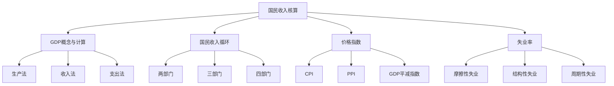
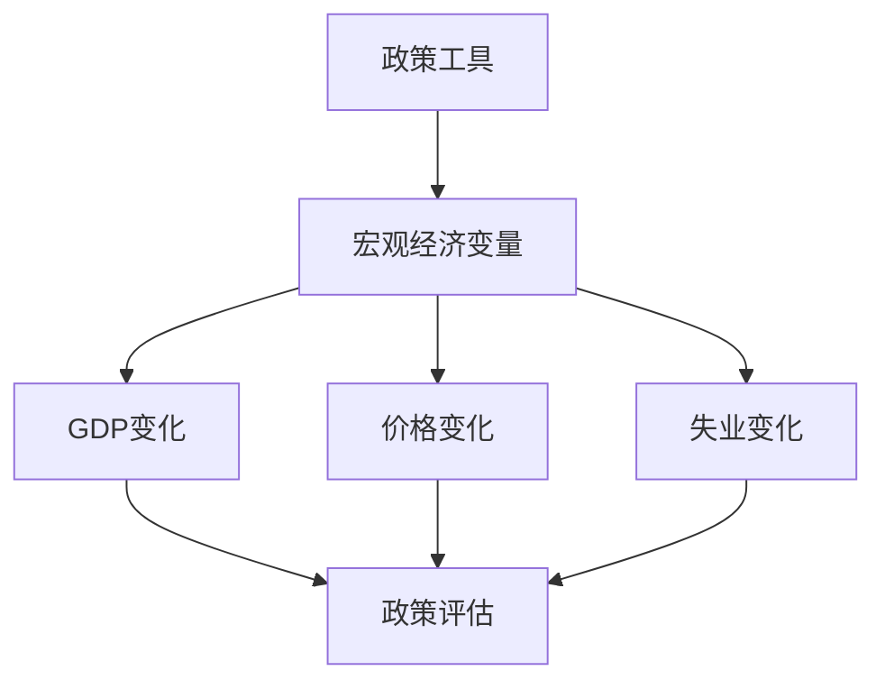

# 国民收入核算总结

## 核心框架

### 国民收入核算体系



## 理论体系

### 1. GDP概念与计算

#### 核心概念
- **GDP定义**：一个国家或地区在一定时期内生产的所有最终商品和服务的市场价值
- **GDP特征**：国内、生产、最终、市场价值
- **GDP重要性**：经济规模、经济增长、经济比较、政策制定

#### 计算方法

| 方法 | 公式 | 特点 |
|------|------|------|
| **生产法** | GDP = Σ(各行业增加值) | 从生产角度 |
| **收入法** | GDP = 劳动者报酬 + 生产税净额 + 固定资产折旧 + 营业盈余 | 从收入角度 |
| **支出法** | GDP = C + I + G + (X - M) | 从支出角度 |

#### 相关概念
- **名义GDP**：按当年价格计算
- **实际GDP**：按基年价格计算
- **人均GDP**：GDP除以人口数量
- **GNP**：国民生产总值

### 2. 国民收入循环

#### 循环模型

| 模型 | 参与者 | 均衡条件 |
|------|--------|----------|
| **两部门** | 家庭、企业 | S = I |
| **三部门** | 家庭、企业、政府 | S + T = I + G |
| **四部门** | 家庭、企业、政府、国外 | S + T = I + G + (X - M) |

#### 循环特征
- **循环性**：经济活动循环进行
- **相互性**：各环节相互影响
- **平衡性**：总供给等于总需求
- **动态性**：循环过程动态变化

#### 循环分析
- **收入分析**：收入流向分析
- **支出分析**：支出流向分析
- **均衡分析**：循环均衡分析
- **波动分析**：循环波动分析

### 3. 价格指数

#### 价格指数类型

| 类型 | 定义 | 特点 |
|------|------|------|
| **CPI** | 消费者价格指数 | 反映消费者价格变化 |
| **PPI** | 生产者价格指数 | 反映生产者价格变化 |
| **GDP平减指数** | GDP平减指数 | 反映所有商品价格变化 |

#### 计算方法
- **拉氏指数**：以基期数量为权重
- **帕氏指数**：以报告期数量为权重
- **费氏指数**：拉氏和帕氏的几何平均

#### 应用分析
- **通货膨胀**：衡量通货膨胀
- **经济分析**：经济分析工具
- **政策制定**：政策制定依据
- **国际比较**：国际比较指标

### 4. 失业率

#### 失业类型

| 类型 | 定义 | 特征 |
|------|------|------|
| **摩擦性失业** | 信息不对称造成的短期失业 | 短期、自愿 |
| **结构性失业** | 结构变化造成的长期失业 | 长期、结构性 |
| **周期性失业** | 经济周期造成的失业 | 周期性、波动性 |
| **季节性失业** | 季节性因素造成的失业 | 季节性、可预测 |

#### 失业率计算
```
失业率 = 失业人数 / 劳动力总数 × 100%
```

#### 失业率分析
- **时间序列分析**：趋势、周期、季节
- **结构分析**：分群体、分行业
- **国际比较**：国际比较分析

## 分析方法

### 1. 静态分析

#### 比较静态分析
- **GDP变化**：分析GDP变化
- **价格变化**：分析价格变化
- **失业变化**：分析失业变化
- **循环变化**：分析循环变化

#### 静态均衡分析
- **GDP均衡**：GDP均衡分析
- **价格均衡**：价格均衡分析
- **失业均衡**：失业均衡分析
- **循环均衡**：循环均衡分析

### 2. 动态分析

#### 时间序列分析
- **趋势分析**：长期趋势分析
- **周期分析**：经济周期分析
- **季节分析**：季节性分析
- **波动分析**：波动分析

#### 动态均衡分析
- **均衡路径**：均衡调整路径
- **均衡稳定性**：均衡稳定性
- **均衡预测**：均衡预测

### 3. 政策分析

#### 政策工具
- **财政政策**：政府支出、税收
- **货币政策**：货币供应、利率
- **汇率政策**：汇率调整
- **就业政策**：就业促进、失业保障

#### 政策效果


## 实际应用

### 1. 经济分析

#### 宏观经济分析
- **总量分析**：总量经济分析
- **结构分析**：结构经济分析
- **趋势分析**：趋势经济分析
- **周期分析**：周期经济分析

#### 微观经济分析
- **消费者行为**：消费者行为分析
- **生产者行为**：生产者行为分析
- **市场结构**：市场结构分析
- **价格机制**：价格机制分析

### 2. 政策制定

#### 宏观经济政策
- **财政政策**：制定财政政策
- **货币政策**：制定货币政策
- **汇率政策**：制定汇率政策
- **就业政策**：制定就业政策

#### 发展规划
- **五年规划**：制定五年规划
- **年度计划**：制定年度计划
- **区域规划**：制定区域规划
- **产业规划**：制定产业规划

### 3. 国际比较

#### 经济比较
- **总量比较**：总量经济比较
- **结构比较**：结构经济比较
- **趋势比较**：趋势经济比较
- **政策比较**：政策比较

#### 发展比较
- **发展阶段**：发展阶段比较
- **发展水平**：发展水平比较
- **发展模式**：发展模式比较
- **发展经验**：发展经验比较

## 理论扩展

### 1. 绿色GDP

#### 绿色GDP概念
- **定义**：考虑环境成本的GDP
- **计算**：GDP - 环境成本
- **意义**：可持续发展指标

#### 绿色GDP分析
- **环境成本**：环境成本计算
- **可持续发展**：可持续发展分析
- **政策制定**：环境政策制定

### 2. 幸福指数

#### 幸福指数概念
- **定义**：综合反映生活质量的指数
- **构成**：收入、健康、教育、环境等
- **意义**：生活质量指标

#### 幸福指数分析
- **生活质量**：生活质量分析
- **社会福利**：社会福利分析
- **政策制定**：社会政策制定

### 3. 数字经济

#### 数字经济概念
- **定义**：以数字技术为基础的经济
- **特征**：数字化、网络化、智能化
- **意义**：新经济形态

#### 数字经济分析
- **数字产业**：数字产业分析
- **数字技术**：数字技术分析
- **数字政策**：数字政策制定

## 理论局限

### 1. 测量局限

#### GDP测量局限
- **非市场活动**：非市场活动未计入
- **地下经济**：地下经济未计入
- **质量变化**：质量变化难以测量
- **环境成本**：环境成本未计入

#### 价格指数局限
- **商品篮子**：商品篮子可能不代表性
- **权重问题**：权重可能不准确
- **质量变化**：质量变化难以测量
- **基期选择**：基期选择可能影响结果

#### 失业率局限
- **定义问题**：失业定义可能不准确
- **数据问题**：数据可能不准确
- **统计方法**：统计方法可能不同
- **国际比较**：国际比较可能不准确

### 2. 应用局限

#### 政策时滞
- **识别时滞**：识别问题需要时间
- **决策时滞**：制定政策需要时间
- **执行时滞**：执行政策需要时间
- **效果时滞**：政策效果需要时间

#### 政策冲突
- **目标冲突**：不同政策目标冲突
- **工具冲突**：不同政策工具冲突
- **效果冲突**：不同政策效果冲突
- **协调困难**：政策协调困难

### 3. 理论局限

#### 假设局限
- **完全信息假设**：信息可能不完全
- **理性假设**：行为可能非理性
- **静态分析假设**：经济可能动态
- **封闭经济假设**：经济可能开放

#### 现实局限
- **市场失灵**：市场可能失灵
- **政府失灵**：政府可能失灵
- **制度问题**：制度可能不完善
- **文化差异**：文化可能不同

## 学习要点

### 1. 概念掌握
- [ ] 理解GDP、价格指数、失业率的概念
- [ ] 掌握国民收入循环模型
- [ ] 理解各指标的计算方法

### 2. 方法应用
- [ ] 运用国民收入核算分析实际问题
- [ ] 计算各种经济指标
- [ ] 分析政策对经济的影响

### 3. 批判思维
- [ ] 质疑国民收入核算的局限性
- [ ] 分析理论的适用条件
- [ ] 评估政策的有效性

---

**相关链接**：
- [[02-宏观经济模型]] - 宏观经济模型分析
- [[03-宏观经济政策]] - 宏观经济政策分析
- [[04-宏观经济学综合]] - 宏观经济学综合分析
