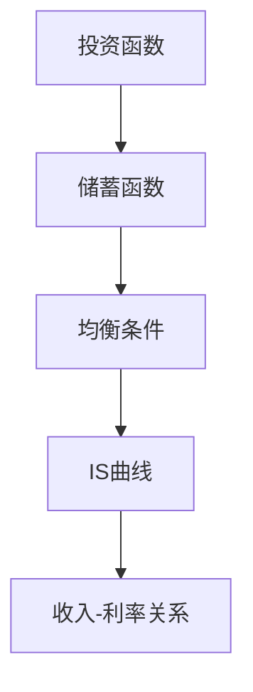
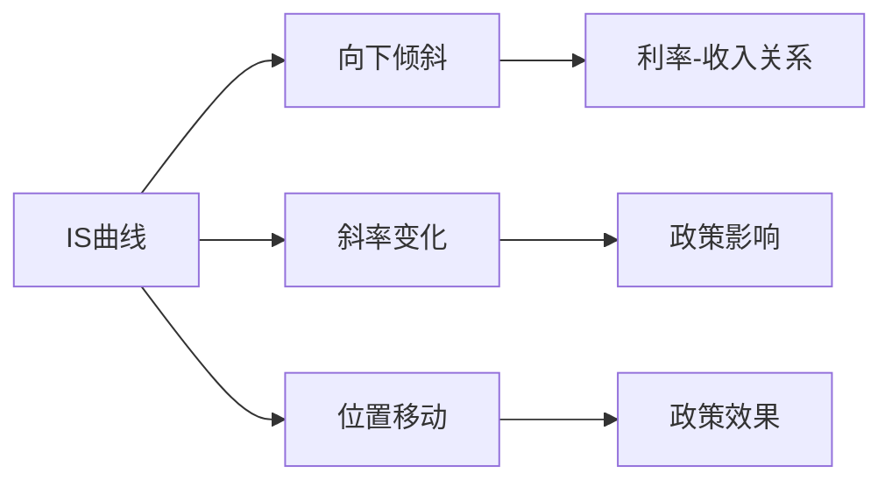
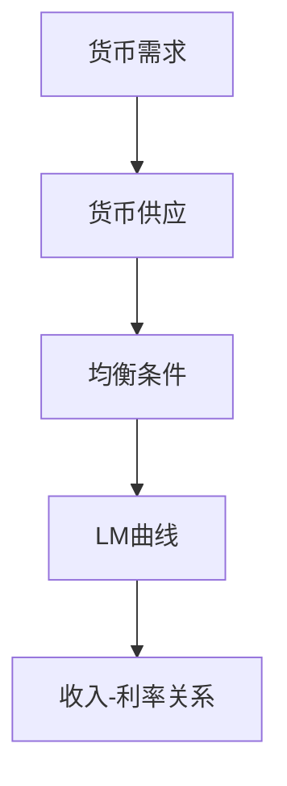
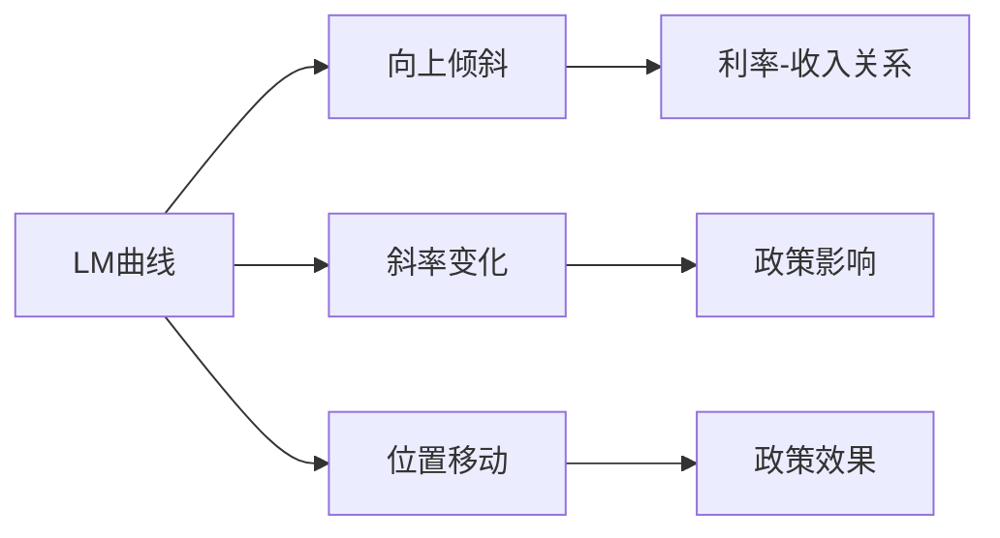
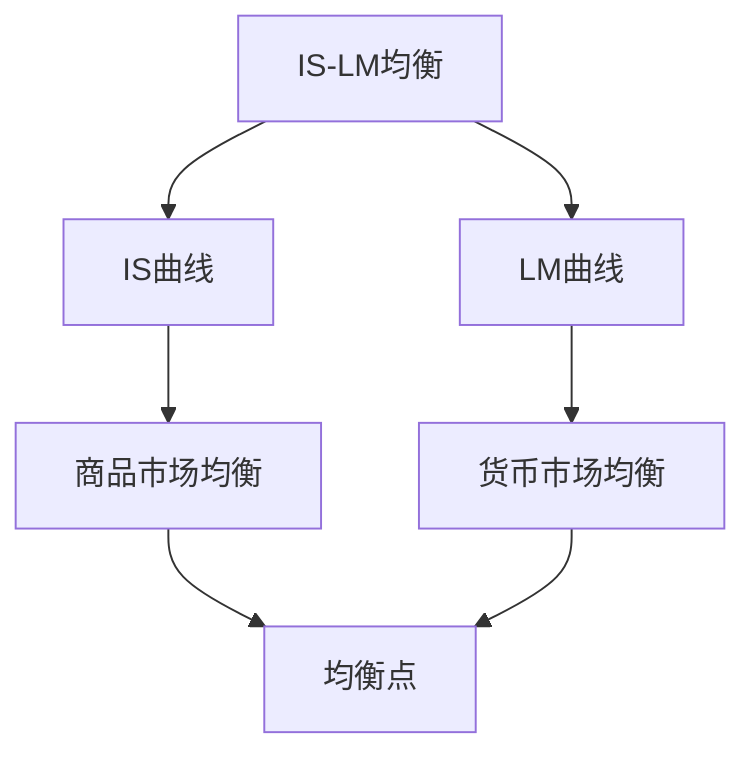
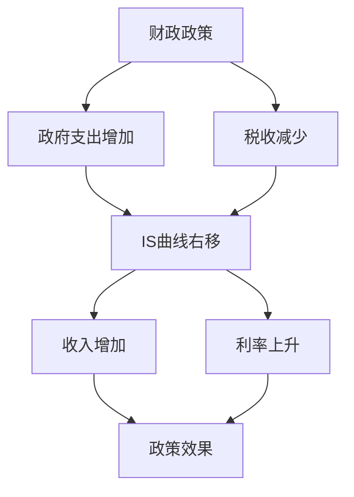
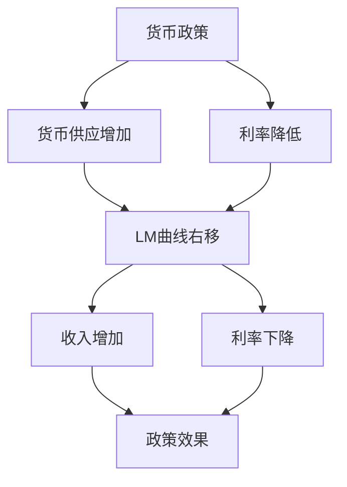

# IS-LM模型

## 核心概念

### IS-LM模型定义
**IS-LM模型**：分析商品市场和货币市场同时均衡的宏观经济模型。

> **费曼技巧**：IS-LM模型 = 商品市场均衡 + 货币市场均衡 = 双重均衡

### 模型特征

| 特征 | 含义 | 例子 |
|------|------|------|
| **双重均衡** | 商品市场和货币市场同时均衡 | IS曲线和LM曲线交点 |
| **静态分析** | 静态均衡分析 | 短期均衡 |
| **政策分析** | 政策效果分析 | 财政政策和货币政策 |
| **比较静态** | 比较静态分析 | 政策变化影响 |

### 模型假设

#### 基本假设
- **价格刚性**：价格在短期内不变
- **完全就业**：劳动力市场完全就业
- **封闭经济**：不考虑国际贸易
- **完全信息**：信息完全

#### 市场假设
- **商品市场**：商品市场均衡
- **货币市场**：货币市场均衡
- **劳动力市场**：劳动力市场完全就业
- **资本市场**：资本市场完全竞争

## IS曲线

### 1. IS曲线定义

#### 定义
**IS曲线**：商品市场均衡时，收入与利率关系的曲线。

#### 均衡条件
```
I(r) = S(Y)
```

其中：
- **I(r)**：投资函数
- **S(Y)**：储蓄函数
- **r**：利率
- **Y**：收入

#### IS曲线方程
```
Y = C(Y) + I(r) + G
```

其中：
- **C(Y)**：消费函数
- **I(r)**：投资函数
- **G**：政府支出

### 2. IS曲线推导

#### 推导过程
1. **投资函数**：I = I₀ - br
2. **储蓄函数**：S = -C₀ + (1-c)Y
3. **均衡条件**：I = S
4. **IS曲线**：Y = (C₀ + I₀ + G) / (1-c) - br / (1-c)

#### 推导图形



### 3. IS曲线特征

#### 斜率特征
- **向下倾斜**：利率上升，收入下降
- **斜率大小**：取决于投资对利率的敏感程度
- **斜率变化**：政策变化影响斜率

#### 位置特征
- **位置高低**：取决于自主支出
- **位置变化**：政策变化影响位置
- **位置移动**：政策变化导致移动

#### IS曲线分析



## LM曲线

### 1. LM曲线定义

#### 定义
**LM曲线**：货币市场均衡时，收入与利率关系的曲线。

#### 均衡条件
```
L(Y, r) = M/P
```

其中：
- **L(Y, r)**：货币需求函数
- **M/P**：实际货币供应
- **Y**：收入
- **r**：利率

#### LM曲线方程
```
M/P = L₁(Y) + L₂(r)
```

其中：
- **L₁(Y)**：交易性货币需求
- **L₂(r)**：投机性货币需求

### 2. LM曲线推导

#### 推导过程
1. **货币需求**：L = L₁(Y) + L₂(r)
2. **货币供应**：M/P = 常数
3. **均衡条件**：L = M/P
4. **LM曲线**：r = f(Y)

#### 推导图形



### 3. LM曲线特征

#### 斜率特征
- **向上倾斜**：收入上升，利率上升
- **斜率大小**：取决于货币需求对利率的敏感程度
- **斜率变化**：政策变化影响斜率

#### 位置特征
- **位置高低**：取决于货币供应
- **位置变化**：政策变化影响位置
- **位置移动**：政策变化导致移动

#### LM曲线分析



## IS-LM均衡

### 1. 均衡条件

#### 均衡条件
```
IS: I(r) = S(Y)
LM: L(Y, r) = M/P
```

#### 均衡解
- **均衡收入**：Y*
- **均衡利率**：r*
- **均衡点**：(Y*, r*)

#### 均衡分析



### 2. 均衡调整

#### 调整过程
1. **初始状态**：非均衡状态
2. **调整过程**：向均衡调整
3. **均衡状态**：达到均衡
4. **稳定性**：均衡稳定性

#### 调整机制
- **价格机制**：价格调整
- **利率机制**：利率调整
- **收入机制**：收入调整
- **政策机制**：政策调整

### 3. 均衡稳定性

#### 稳定性条件
- **IS曲线**：向下倾斜
- **LM曲线**：向上倾斜
- **交点**：唯一交点
- **稳定性**：局部稳定

#### 稳定性分析
- **局部稳定**：局部稳定
- **全局稳定**：全局稳定
- **稳定性条件**：稳定性条件
- **稳定性分析**：稳定性分析

## 政策分析

### 1. 财政政策

#### 政策工具
- **政府支出**：增加或减少政府支出
- **税收政策**：增加或减少税收
- **转移支付**：增加或减少转移支付

#### 政策效果
- **IS曲线移动**：IS曲线移动
- **均衡变化**：均衡收入变化
- **乘数效应**：政策乘数效应
- **挤出效应**：政策挤出效应

#### 财政政策分析



### 2. 货币政策

#### 政策工具
- **货币供应**：增加或减少货币供应
- **利率政策**：提高或降低利率
- **公开市场操作**：公开市场操作

#### 政策效果
- **LM曲线移动**：LM曲线移动
- **均衡变化**：均衡收入变化
- **流动性效应**：流动性效应
- **利率效应**：利率效应

#### 货币政策分析



### 3. 政策协调

#### 政策协调
- **财政货币政策协调**：财政货币政策协调
- **政策目标协调**：政策目标协调
- **政策工具协调**：政策工具协调
- **政策时机协调**：政策时机协调

#### 政策协调分析
- **协调效果**：协调效果
- **协调成本**：协调成本
- **协调难度**：协调难度
- **协调机制**：协调机制

## 模型扩展

### 1. 开放经济IS-LM模型

#### 开放经济特征
- **国际贸易**：考虑国际贸易
- **国际资本流动**：考虑国际资本流动
- **汇率**：考虑汇率
- **国际收支**：考虑国际收支

#### 开放经济模型
- **IS曲线**：包括净出口
- **LM曲线**：包括国际资本流动
- **BP曲线**：国际收支平衡曲线
- **三重均衡**：商品市场、货币市场、国际收支

### 2. 动态IS-LM模型

#### 动态特征
- **时间因素**：考虑时间因素
- **预期因素**：考虑预期因素
- **调整过程**：考虑调整过程
- **稳定性**：考虑稳定性

#### 动态模型
- **动态IS曲线**：动态IS曲线
- **动态LM曲线**：动态LM曲线
- **动态均衡**：动态均衡
- **动态稳定性**：动态稳定性

### 3. 随机IS-LM模型

#### 随机特征
- **随机冲击**：考虑随机冲击
- **不确定性**：考虑不确定性
- **风险因素**：考虑风险因素
- **波动性**：考虑波动性

#### 随机模型
- **随机IS曲线**：随机IS曲线
- **随机LM曲线**：随机LM曲线
- **随机均衡**：随机均衡
- **随机稳定性**：随机稳定性

## 实际应用

### 1. 经济分析

#### 宏观经济分析
- **经济周期**：分析经济周期
- **政策效果**：分析政策效果
- **经济预测**：经济预测
- **政策建议**：政策建议

#### 政策分析
- **政策效果**：分析政策效果
- **政策协调**：分析政策协调
- **政策优化**：政策优化
- **政策评估**：政策评估

### 2. 政策制定

#### 宏观经济政策
- **财政政策**：制定财政政策
- **货币政策**：制定货币政策
- **政策协调**：政策协调
- **政策评估**：政策评估

#### 政策工具
- **政策工具选择**：选择政策工具
- **政策工具组合**：政策工具组合
- **政策工具效果**：政策工具效果
- **政策工具优化**：政策工具优化

### 3. 国际比较

#### 经济比较
- **经济表现**：比较经济表现
- **政策效果**：比较政策效果
- **政策工具**：比较政策工具
- **政策协调**：比较政策协调

#### 发展比较
- **发展阶段**：比较发展阶段
- **发展水平**：比较发展水平
- **发展模式**：比较发展模式
- **发展经验**：比较发展经验

## 理论局限

### 1. 假设局限

#### 价格刚性假设
- **假设**：价格刚性
- **现实**：价格可能灵活
- **影响**：模型可能不适用

#### 完全就业假设
- **假设**：完全就业
- **现实**：可能存在失业
- **影响**：模型可能不适用

### 2. 现实局限

#### 市场失灵
- **问题**：市场可能失灵
- **解决**：政府干预
- **局限**：政府干预可能无效

#### 政策时滞
- **问题**：政策时滞
- **解决**：政策协调
- **局限**：协调可能困难

### 3. 应用局限

#### 复杂经济
- **问题**：经济可能复杂
- **解决**：简化假设
- **局限**：可能偏离现实

#### 动态经济
- **问题**：经济可能动态
- **解决**：静态分析
- **局限**：可能不适用动态情况

## 刻意练习

### 概念理解
- [ ] 理解IS-LM模型的定义和特征
- [ ] 掌握IS曲线和LM曲线的推导
- [ ] 理解IS-LM均衡分析

### 计算应用
- [ ] 推导IS曲线方程
- [ ] 推导LM曲线方程
- [ ] 求解IS-LM均衡

### 实际应用
- [ ] 分析财政政策效果
- [ ] 分析货币政策效果
- [ ] 分析政策协调

---

**相关链接**：
- [[02-AD-AS模型]] - AD-AS模型分析
- [[03-菲利普斯曲线]] - 菲利普斯曲线分析
- [[04-经济增长模型]] - 经济增长模型分析
