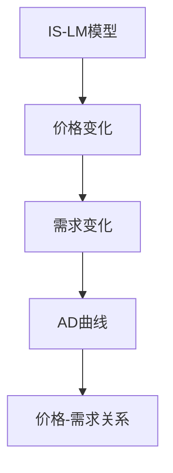
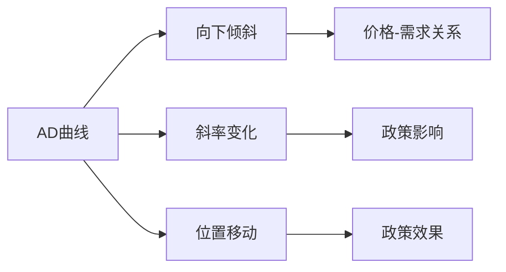
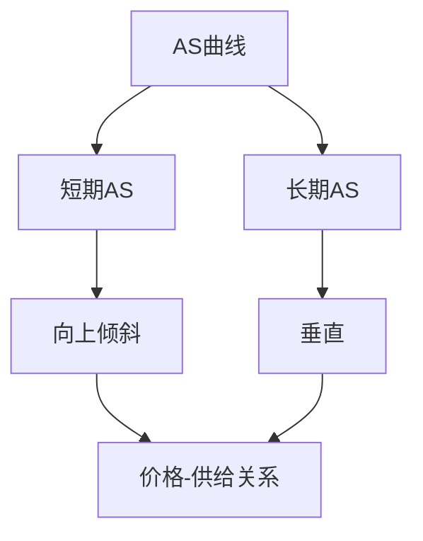
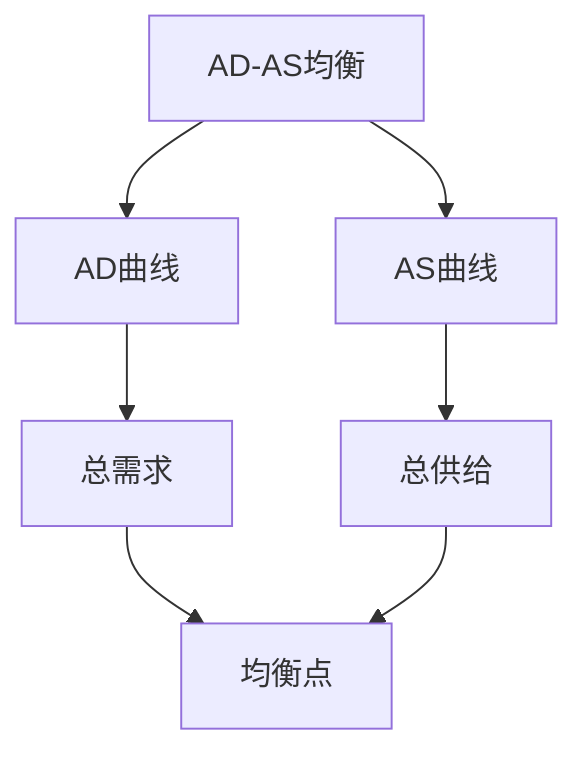
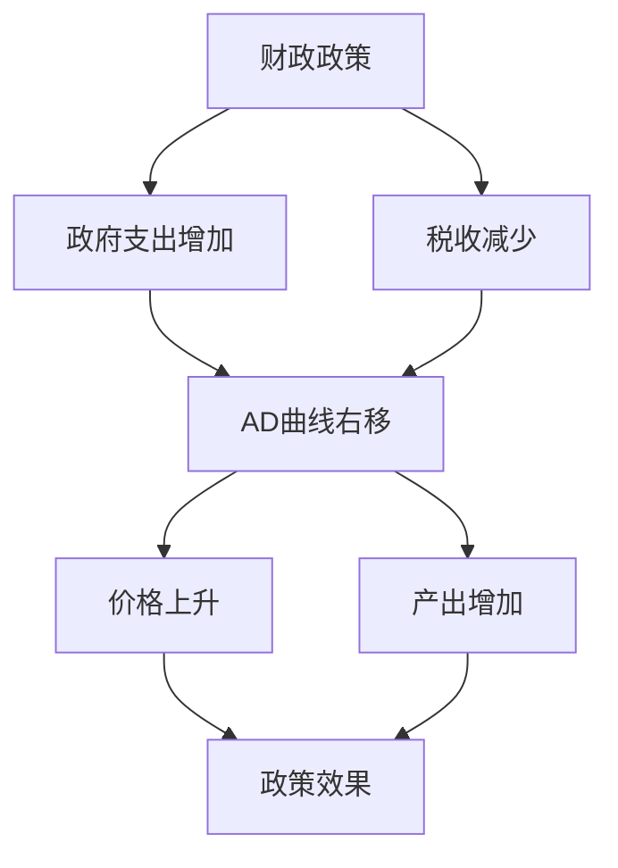
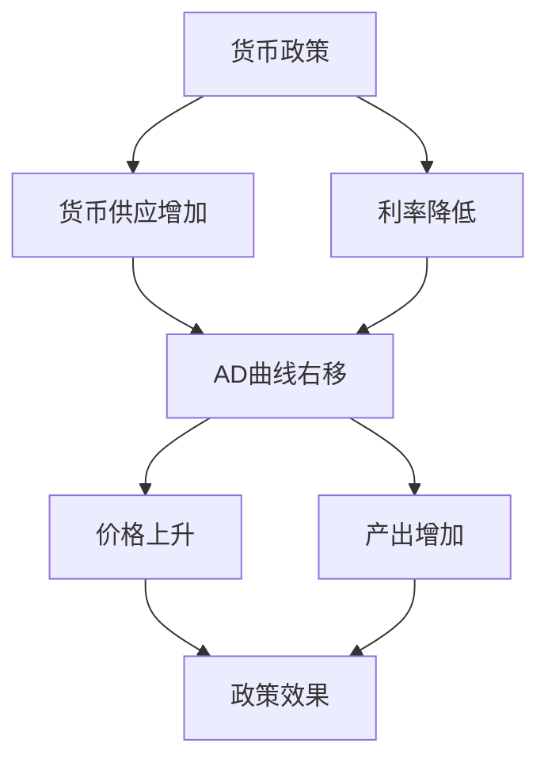
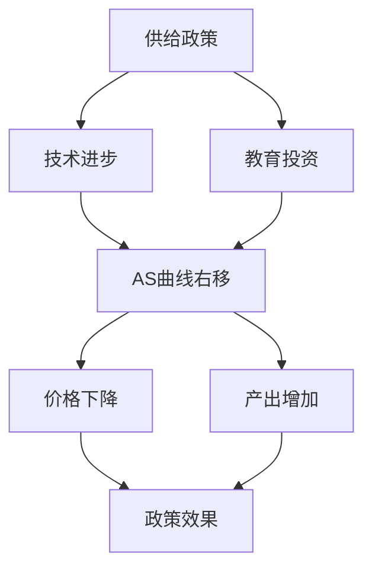

# AD-AS模型

## 核心概念

### AD-AS模型定义
**AD-AS模型**：分析总需求和总供给同时均衡的宏观经济模型。

> **费曼技巧**：AD-AS模型 = 总需求 + 总供给 = 价格水平决定

### 模型特征

| 特征 | 含义 | 例子 |
|------|------|------|
| **双重均衡** | 总需求和总供给同时均衡 | AD曲线和AS曲线交点 |
| **价格灵活** | 价格可以灵活调整 | 长期分析 |
| **政策分析** | 政策效果分析 | 财政政策和货币政策 |
| **比较静态** | 比较静态分析 | 政策变化影响 |

### 模型假设

#### 基本假设
- **价格灵活**：价格可以灵活调整
- **完全竞争**：市场完全竞争
- **封闭经济**：不考虑国际贸易
- **完全信息**：信息完全

#### 市场假设
- **商品市场**：商品市场均衡
- **货币市场**：货币市场均衡
- **劳动力市场**：劳动力市场均衡
- **资本市场**：资本市场完全竞争

## AD曲线

### 1. AD曲线定义

#### 定义
**AD曲线**：总需求曲线，表示在不同价格水平下，经济中所有部门愿意购买的商品和服务的总量。

#### 总需求构成
```
AD = C + I + G + (X - M)
```

其中：
- **C**：消费需求
- **I**：投资需求
- **G**：政府需求
- **X - M**：净出口需求

#### AD曲线方程
```
AD = C(Y) + I(r) + G + NX(e)
```

其中：
- **Y**：收入
- **r**：利率
- **e**：汇率

### 2. AD曲线推导

#### 推导过程
1. **IS-LM模型**：商品市场和货币市场均衡
2. **价格变化**：价格水平变化
3. **需求变化**：总需求变化
4. **AD曲线**：价格-需求关系

#### 推导图形



### 3. AD曲线特征

#### 斜率特征
- **向下倾斜**：价格上升，需求下降
- **斜率大小**：取决于价格对需求的影响
- **斜率变化**：政策变化影响斜率

#### 位置特征
- **位置高低**：取决于自主需求
- **位置变化**：政策变化影响位置
- **位置移动**：政策变化导致移动

#### AD曲线分析



## AS曲线

### 1. AS曲线定义

#### 定义
**AS曲线**：总供给曲线，表示在不同价格水平下，经济中所有部门愿意提供的商品和服务的总量。

#### 总供给构成
```
AS = 各行业供给之和
```

#### AS曲线方程
```
AS = f(P, W, K, T)
```

其中：
- **P**：价格水平
- **W**：工资水平
- **K**：资本存量
- **T**：技术水平

### 2. AS曲线类型

#### 短期AS曲线
- **特征**：向上倾斜
- **原因**：工资和价格刚性
- **斜率**：正斜率
- **移动**：成本变化导致移动

#### 长期AS曲线
- **特征**：垂直
- **原因**：完全就业
- **斜率**：无穷大
- **移动**：技术进步导致移动

#### AS曲线分析



### 3. AS曲线特征

#### 短期特征
- **向上倾斜**：价格上升，供给增加
- **斜率大小**：取决于工资和价格刚性
- **斜率变化**：政策变化影响斜率

#### 长期特征
- **垂直**：价格不影响供给
- **位置**：取决于技术水平
- **位置移动**：技术进步导致移动

## AD-AS均衡

### 1. 均衡条件

#### 均衡条件
```
AD = AS
```

#### 均衡解
- **均衡价格**：P*
- **均衡产出**：Y*
- **均衡点**：(P*, Y*)

#### 均衡分析



### 2. 均衡调整

#### 调整过程
1. **初始状态**：非均衡状态
2. **调整过程**：向均衡调整
3. **均衡状态**：达到均衡
4. **稳定性**：均衡稳定性

#### 调整机制
- **价格机制**：价格调整
- **数量机制**：数量调整
- **政策机制**：政策调整
- **市场机制**：市场调整

### 3. 均衡稳定性

#### 稳定性条件
- **AD曲线**：向下倾斜
- **AS曲线**：向上倾斜
- **交点**：唯一交点
- **稳定性**：局部稳定

#### 稳定性分析
- **局部稳定**：局部稳定
- **全局稳定**：全局稳定
- **稳定性条件**：稳定性条件
- **稳定性分析**：稳定性分析

## 政策分析

### 1. 财政政策

#### 政策工具
- **政府支出**：增加或减少政府支出
- **税收政策**：增加或减少税收
- **转移支付**：增加或减少转移支付

#### 政策效果
- **AD曲线移动**：AD曲线移动
- **均衡变化**：均衡价格和产出变化
- **乘数效应**：政策乘数效应
- **挤出效应**：政策挤出效应

#### 财政政策分析



### 2. 货币政策

#### 政策工具
- **货币供应**：增加或减少货币供应
- **利率政策**：提高或降低利率
- **公开市场操作**：公开市场操作

#### 政策效果
- **AD曲线移动**：AD曲线移动
- **均衡变化**：均衡价格和产出变化
- **流动性效应**：流动性效应
- **利率效应**：利率效应

#### 货币政策分析



### 3. 供给政策

#### 政策工具
- **技术进步**：促进技术进步
- **教育投资**：增加教育投资
- **基础设施**：改善基础设施
- **制度创新**：制度创新

#### 政策效果
- **AS曲线移动**：AS曲线移动
- **均衡变化**：均衡价格和产出变化
- **效率效应**：效率效应
- **增长效应**：增长效应

#### 供给政策分析



## 模型扩展

### 1. 开放经济AD-AS模型

#### 开放经济特征
- **国际贸易**：考虑国际贸易
- **国际资本流动**：考虑国际资本流动
- **汇率**：考虑汇率
- **国际收支**：考虑国际收支

#### 开放经济模型
- **AD曲线**：包括净出口
- **AS曲线**：包括进口成本
- **汇率**：汇率影响
- **国际收支**：国际收支影响

### 2. 动态AD-AS模型

#### 动态特征
- **时间因素**：考虑时间因素
- **预期因素**：考虑预期因素
- **调整过程**：考虑调整过程
- **稳定性**：考虑稳定性

#### 动态模型
- **动态AD曲线**：动态AD曲线
- **动态AS曲线**：动态AS曲线
- **动态均衡**：动态均衡
- **动态稳定性**：动态稳定性

### 3. 随机AD-AS模型

#### 随机特征
- **随机冲击**：考虑随机冲击
- **不确定性**：考虑不确定性
- **风险因素**：考虑风险因素
- **波动性**：考虑波动性

#### 随机模型
- **随机AD曲线**：随机AD曲线
- **随机AS曲线**：随机AS曲线
- **随机均衡**：随机均衡
- **随机稳定性**：随机稳定性

## 实际应用

### 1. 经济分析

#### 宏观经济分析
- **经济周期**：分析经济周期
- **政策效果**：分析政策效果
- **经济预测**：经济预测
- **政策建议**：政策建议

#### 政策分析
- **政策效果**：分析政策效果
- **政策协调**：分析政策协调
- **政策优化**：政策优化
- **政策评估**：政策评估

### 2. 政策制定

#### 宏观经济政策
- **财政政策**：制定财政政策
- **货币政策**：制定货币政策
- **供给政策**：制定供给政策
- **政策协调**：政策协调

#### 政策工具
- **政策工具选择**：选择政策工具
- **政策工具组合**：政策工具组合
- **政策工具效果**：政策工具效果
- **政策工具优化**：政策工具优化

### 3. 国际比较

#### 经济比较
- **经济表现**：比较经济表现
- **政策效果**：比较政策效果
- **政策工具**：比较政策工具
- **政策协调**：比较政策协调

#### 发展比较
- **发展阶段**：比较发展阶段
- **发展水平**：比较发展水平
- **发展模式**：比较发展模式
- **发展经验**：比较发展经验

## 理论局限

### 1. 假设局限

#### 价格灵活假设
- **假设**：价格灵活
- **现实**：价格可能刚性
- **影响**：模型可能不适用

#### 完全竞争假设
- **假设**：完全竞争
- **现实**：市场可能不完全竞争
- **影响**：模型可能不适用

### 2. 现实局限

#### 市场失灵
- **问题**：市场可能失灵
- **解决**：政府干预
- **局限**：政府干预可能无效

#### 政策时滞
- **问题**：政策时滞
- **解决**：政策协调
- **局限**：协调可能困难

### 3. 应用局限

#### 复杂经济
- **问题**：经济可能复杂
- **解决**：简化假设
- **局限**：可能偏离现实

#### 动态经济
- **问题**：经济可能动态
- **解决**：静态分析
- **局限**：可能不适用动态情况

## 刻意练习

### 概念理解
- [ ] 理解AD-AS模型的定义和特征
- [ ] 掌握AD曲线和AS曲线的推导
- [ ] 理解AD-AS均衡分析

### 计算应用
- [ ] 推导AD曲线方程
- [ ] 推导AS曲线方程
- [ ] 求解AD-AS均衡

### 实际应用
- [ ] 分析财政政策效果
- [ ] 分析货币政策效果
- [ ] 分析供给政策效果

---

**相关链接**：
- [[01-IS-LM模型]] - IS-LM模型分析
- [[03-菲利普斯曲线]] - 菲利普斯曲线分析
- [[04-经济增长模型]] - 经济增长模型分析
