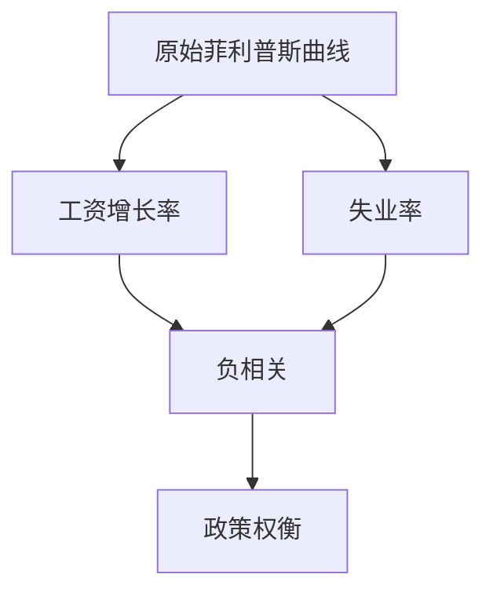
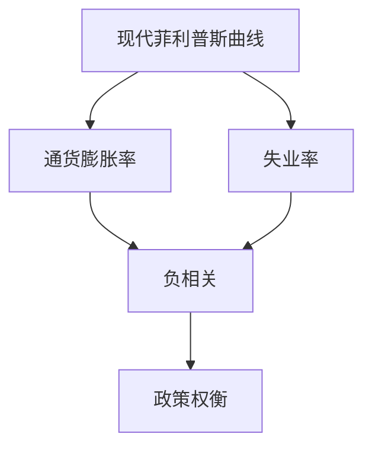
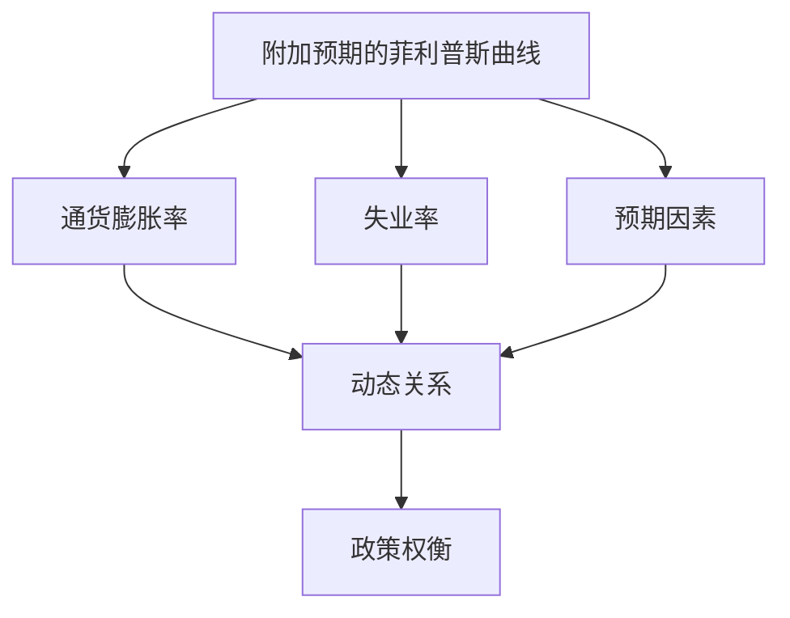
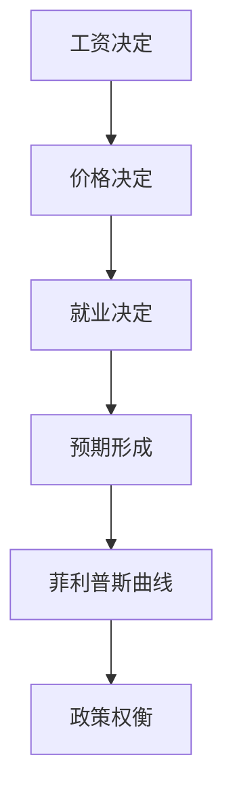
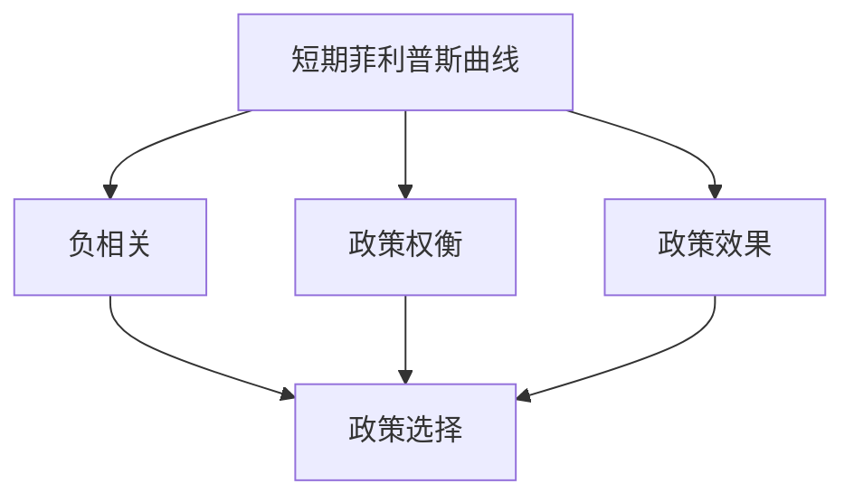
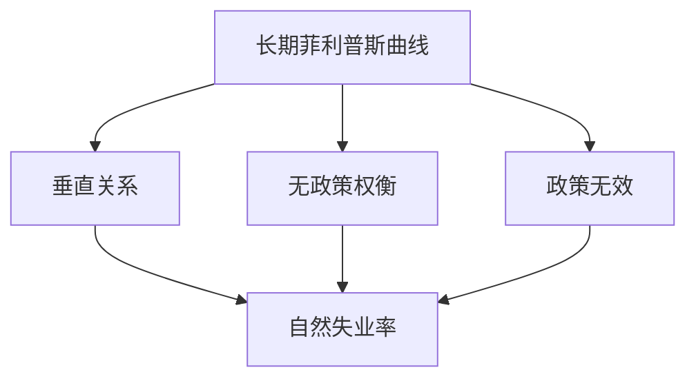
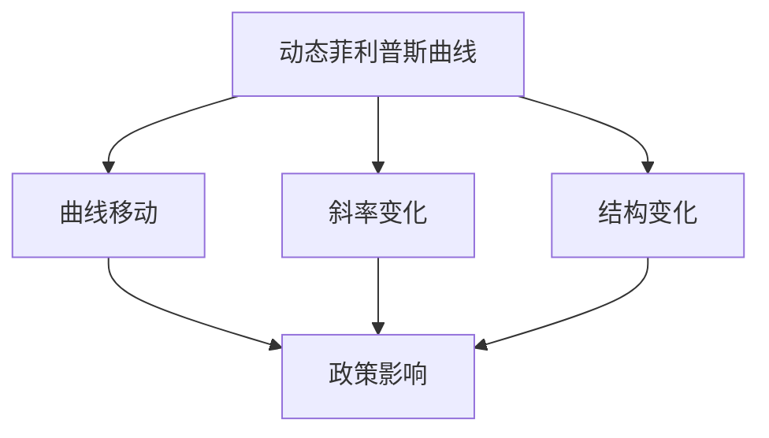
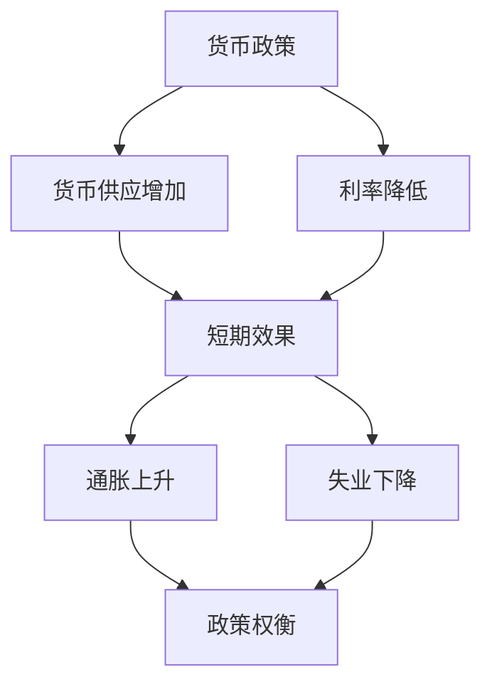
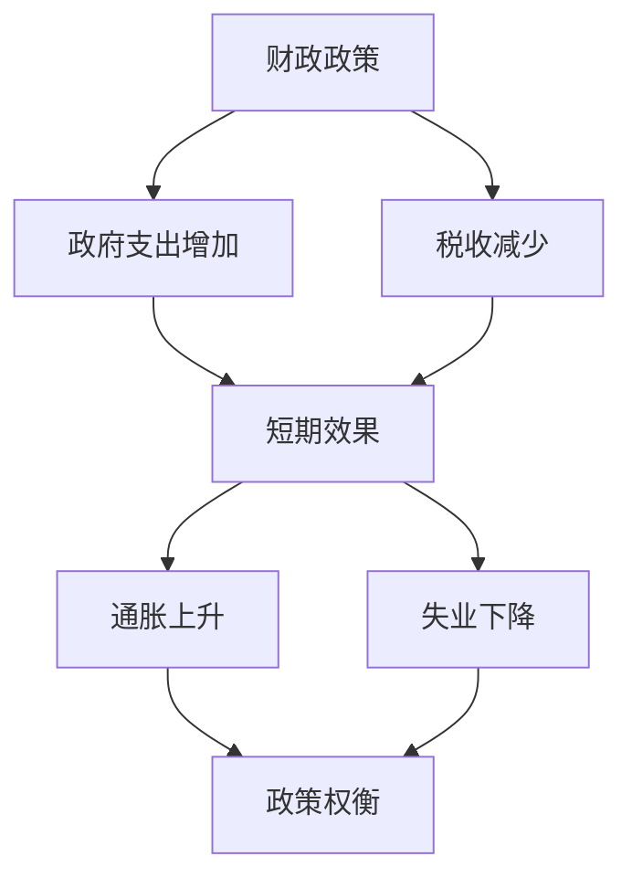
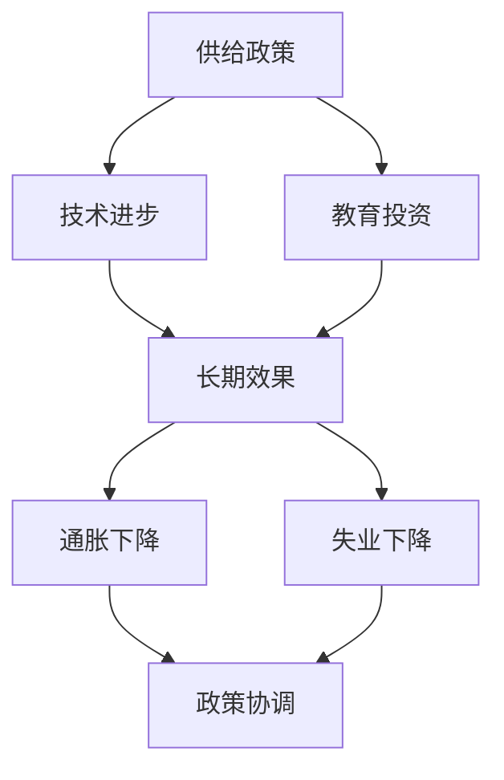

# 菲利普斯曲线

## 核心概念

### 菲利普斯曲线定义
**菲利普斯曲线**：描述通货膨胀率与失业率之间关系的曲线。

> **费曼技巧**：菲利普斯曲线 = 通货膨胀 + 失业率 = 政策权衡

### 曲线特征

| 特征 | 含义 | 例子 |
|------|------|------|
| **负相关** | 通货膨胀率与失业率负相关 | 高通胀低失业 |
| **政策权衡** | 政策目标权衡 | 通胀与失业权衡 |
| **短期关系** | 短期关系 | 短期政策效果 |
| **动态变化** | 曲线位置动态变化 | 政策变化影响 |

### 曲线重要性

#### 经济意义
- **政策权衡**：政策目标权衡
- **政策制定**：政策制定依据
- **经济分析**：经济分析工具
- **国际比较**：国际比较指标

#### 社会意义
- **社会稳定**：影响社会稳定
- **生活质量**：影响生活质量
- **社会政策**：社会政策依据
- **福利分析**：福利分析工具

## 菲利普斯曲线类型

### 1. 原始菲利普斯曲线

#### 定义
**原始菲利普斯曲线**：1958年菲利普斯提出的工资增长率与失业率关系的曲线。

#### 特征
- **负相关**：工资增长率与失业率负相关
- **非线性**：非线性关系
- **经验性**：基于经验数据
- **短期性**：短期关系

#### 原始曲线分析



### 2. 现代菲利普斯曲线

#### 定义
**现代菲利普斯曲线**：描述通货膨胀率与失业率关系的曲线。

#### 特征
- **负相关**：通货膨胀率与失业率负相关
- **线性**：线性关系
- **理论性**：基于理论分析
- **短期性**：短期关系

#### 现代曲线分析



### 3. 附加预期的菲利普斯曲线

#### 定义
**附加预期的菲利普斯曲线**：考虑预期因素的菲利普斯曲线。

#### 特征
- **预期因素**：考虑预期因素
- **动态性**：动态关系
- **理论性**：基于理论分析
- **长期性**：长期关系

#### 附加预期曲线分析



## 菲利普斯曲线推导

### 1. 理论推导

#### 推导基础
- **工资决定**：工资决定机制
- **价格决定**：价格决定机制
- **就业决定**：就业决定机制
- **预期形成**：预期形成机制

#### 推导过程
1. **工资方程**：W = W₀ + α(U₀ - U)
2. **价格方程**：P = (1 + m)W
3. **菲利普斯曲线**：π = π₀ - β(U₀ - U)

#### 推导图形



### 2. 数学推导

#### 数学方程
```
π = π₀ - β(U₀ - U) + ε
```

其中：
- **π**：通货膨胀率
- **π₀**：预期通货膨胀率
- **U**：失业率
- **U₀**：自然失业率
- **β**：参数
- **ε**：随机误差

#### 参数解释
- **π₀**：预期通货膨胀率
- **U₀**：自然失业率
- **β**：失业率对通货膨胀率的影响
- **ε**：随机冲击

### 3. 经验验证

#### 验证方法
- **时间序列分析**：时间序列分析
- **横截面分析**：横截面分析
- **面板数据分析**：面板数据分析
- **国际比较**：国际比较

#### 验证结果
- **短期关系**：短期关系存在
- **长期关系**：长期关系可能不存在
- **结构变化**：结构可能变化
- **政策影响**：政策可能影响

## 菲利普斯曲线分析

### 1. 短期分析

#### 短期特征
- **负相关**：通货膨胀率与失业率负相关
- **政策权衡**：政策目标权衡
- **政策效果**：政策效果明显
- **政策选择**：政策选择空间

#### 短期分析



### 2. 长期分析

#### 长期特征
- **垂直关系**：长期可能垂直
- **无政策权衡**：无政策权衡
- **政策无效**：政策可能无效
- **自然失业率**：自然失业率

#### 长期分析



### 3. 动态分析

#### 动态特征
- **曲线移动**：曲线位置移动
- **斜率变化**：曲线斜率变化
- **结构变化**：结构变化
- **政策影响**：政策影响

#### 动态分析



## 政策分析

### 1. 货币政策

#### 政策工具
- **货币供应**：增加或减少货币供应
- **利率政策**：提高或降低利率
- **公开市场操作**：公开市场操作

#### 政策效果
- **短期效果**：短期政策效果
- **长期效果**：长期政策效果
- **预期影响**：预期影响
- **政策协调**：政策协调

#### 货币政策分析



### 2. 财政政策

#### 政策工具
- **政府支出**：增加或减少政府支出
- **税收政策**：增加或减少税收
- **转移支付**：增加或减少转移支付

#### 政策效果
- **短期效果**：短期政策效果
- **长期效果**：长期政策效果
- **预期影响**：预期影响
- **政策协调**：政策协调

#### 财政政策分析



### 3. 供给政策

#### 政策工具
- **技术进步**：促进技术进步
- **教育投资**：增加教育投资
- **基础设施**：改善基础设施
- **制度创新**：制度创新

#### 政策效果
- **短期效果**：短期政策效果
- **长期效果**：长期政策效果
- **结构影响**：结构影响
- **政策协调**：政策协调

#### 供给政策分析



## 模型扩展

### 1. 新凯恩斯主义菲利普斯曲线

#### 新凯恩斯主义特征
- **价格刚性**：价格刚性
- **工资刚性**：工资刚性
- **不完全竞争**：不完全竞争
- **预期因素**：预期因素

#### 新凯恩斯主义模型
- **价格设定**：价格设定机制
- **工资设定**：工资设定机制
- **预期形成**：预期形成机制
- **政策影响**：政策影响

### 2. 新古典主义菲利普斯曲线

#### 新古典主义特征
- **价格灵活**：价格灵活
- **完全竞争**：完全竞争
- **理性预期**：理性预期
- **市场出清**：市场出清

#### 新古典主义模型
- **市场出清**：市场出清
- **理性预期**：理性预期
- **政策无效**：政策无效
- **自然失业率**：自然失业率

### 3. 混合菲利普斯曲线

#### 混合特征
- **价格刚性**：部分价格刚性
- **不完全竞争**：不完全竞争
- **预期因素**：预期因素
- **政策影响**：政策影响

#### 混合模型
- **价格设定**：价格设定机制
- **工资设定**：工资设定机制
- **预期形成**：预期形成机制
- **政策影响**：政策影响

## 实际应用

### 1. 经济分析

#### 宏观经济分析
- **经济周期**：分析经济周期
- **政策效果**：分析政策效果
- **经济预测**：经济预测
- **政策建议**：政策建议

#### 政策分析
- **政策效果**：分析政策效果
- **政策协调**：分析政策协调
- **政策优化**：政策优化
- **政策评估**：政策评估

### 2. 政策制定

#### 宏观经济政策
- **货币政策**：制定货币政策
- **财政政策**：制定财政政策
- **供给政策**：制定供给政策
- **政策协调**：政策协调

#### 政策工具
- **政策工具选择**：选择政策工具
- **政策工具组合**：政策工具组合
- **政策工具效果**：政策工具效果
- **政策工具优化**：政策工具优化

### 3. 国际比较

#### 经济比较
- **经济表现**：比较经济表现
- **政策效果**：比较政策效果
- **政策工具**：比较政策工具
- **政策协调**：比较政策协调

#### 发展比较
- **发展阶段**：比较发展阶段
- **发展水平**：比较发展水平
- **发展模式**：比较发展模式
- **发展经验**：比较发展经验

## 理论局限

### 1. 假设局限

#### 价格刚性假设
- **假设**：价格刚性
- **现实**：价格可能灵活
- **影响**：模型可能不适用

#### 完全竞争假设
- **假设**：完全竞争
- **现实**：市场可能不完全竞争
- **影响**：模型可能不适用

### 2. 现实局限

#### 市场失灵
- **问题**：市场可能失灵
- **解决**：政府干预
- **局限**：政府干预可能无效

#### 政策时滞
- **问题**：政策时滞
- **解决**：政策协调
- **局限**：协调可能困难

### 3. 应用局限

#### 复杂经济
- **问题**：经济可能复杂
- **解决**：简化假设
- **局限**：可能偏离现实

#### 动态经济
- **问题**：经济可能动态
- **解决**：静态分析
- **局限**：可能不适用动态情况

## 刻意练习

### 概念理解
- [ ] 理解菲利普斯曲线的定义和特征
- [ ] 掌握不同类型菲利普斯曲线
- [ ] 理解政策权衡分析

### 计算应用
- [ ] 推导菲利普斯曲线方程
- [ ] 分析政策效果
- [ ] 计算政策权衡

### 实际应用
- [ ] 分析货币政策效果
- [ ] 分析财政政策效果
- [ ] 分析供给政策效果

---

**相关链接**：
- [[01-IS-LM模型]] - IS-LM模型分析
- [[02-AD-AS模型]] - AD-AS模型分析
- [[04-经济增长模型]] - 经济增长模型分析
