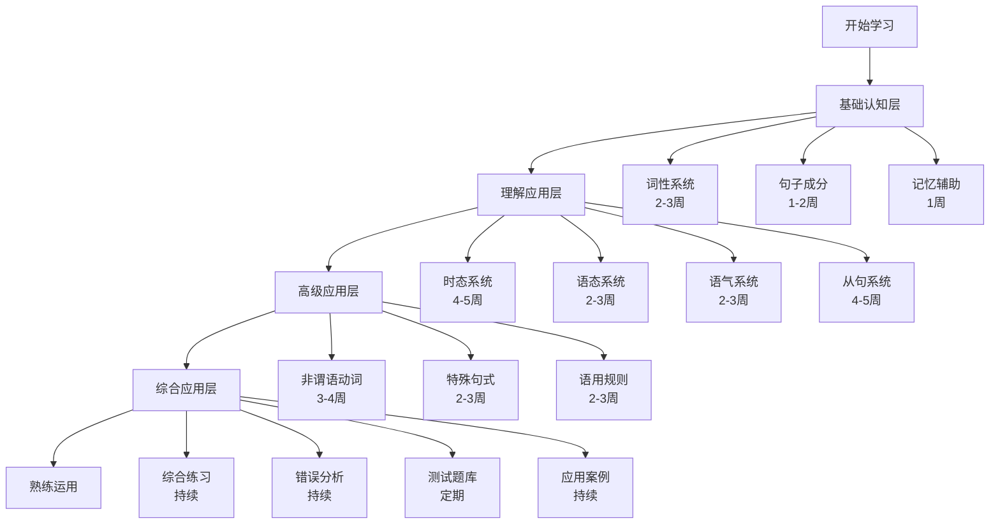

# 英语语法学习路径指南

## 🎯 学习目标
- 制定个性化的语法学习路径
- 建立科学的学习进度跟踪机制
- 实现高效的系统化学习

## 📈 学习路径总览

## 🗓️ 详细学习计划

### 第一阶段：基础认知层（4-6周）

#### 第1-2周：词性系统
- **学习内容**：[[01-名词系统]]、[[02-代词系统]]、[[03-动词系统]]
- **学习目标**：掌握核心词性的基本特征
- **练习重点**：词性识别与基本用法
- **检验标准**：能够准确识别句子中各类词性

#### 第3-4周：词性系统（续）
- **学习内容**：[[04-形容词系统]]、[[05-副词系统]]、[[06-介词系统]]、[[07-连词系统]]、[[08-冠词系统]]、[[09-数词系统]]
- **学习目标**：掌握所有词性的特征与用法
- **练习重点**：词性搭配与语法功能
- **检验标准**：能够正确使用各类词性

#### 第5-6周：句子成分与记忆辅助
- **学习内容**：[[02-句子成分]]、[[03-记忆辅助]]
- **学习目标**：理解句子结构，建立记忆方法
- **练习重点**：句子成分分析
- **检验标准**：能够分析简单句的成分结构

### 第二阶段：理解应用层（12-16周）

#### 第7-11周：时态系统
- **学习内容**：[[01-现在时态群]]、[[02-过去时态群]]、[[03-将来时态群]]、[[04-时态综合对比]]
- **学习目标**：掌握16种时态的准确使用
- **练习重点**：时态选择与时间表达
- **检验标准**：能够根据语境选择正确时态

#### 第12-14周：语态与语气系统
- **学习内容**：[[02-语态系统]]、[[03-语气系统]]
- **学习目标**：掌握语态转换与语气表达
- **练习重点**：主动被动转换，语气识别
- **检验标准**：能够进行语态转换，识别不同语气

#### 第15-22周：从句系统
- **学习内容**：[[04-从句系统]]（名词性从句、定语从句、状语从句）
- **学习目标**：掌握三大从句的构建与应用
- **练习重点**：从句识别与构建
- **检验标准**：能够构建和理解各类从句

### 第三阶段：高级应用层（7-10周）

#### 第23-26周：非谓语动词
- **学习内容**：[[01-非谓语动词]]（不定式、动名词、分词）
- **学习目标**：掌握非谓语动词的高级用法
- **练习重点**：非谓语动词的选择与使用
- **检验标准**：能够正确使用非谓语动词

#### 第27-29周：特殊句式
- **学习内容**：[[02-特殊句式]]（倒装、强调、省略、独立主格）
- **学习目标**：掌握特殊句式的构建规则
- **练习重点**：特殊句式的识别与构建
- **检验标准**：能够构建和理解特殊句式

#### 第30-32周：语用规则
- **学习内容**：[[03-语用规则]]（主谓一致、反义疑问句、直接间接引语）
- **学习目标**：掌握语法规则的实际应用
- **练习重点**：语用规则的准确运用
- **检验标准**：能够遵循语用规则进行表达

### 第四阶段：综合应用层（持续进行）

#### 第33周起：综合应用
- **学习内容**：[[01-语法综合练习]]、[[02-常见错误分析]]、[[03-语法测试题库]]、[[04-实际应用案例]]
- **学习目标**：在真实语境中熟练运用语法
- **练习重点**：综合语法能力提升
- **检验标准**：能够在写作、口语、阅读中准确运用语法

## 📊 学习进度跟踪表

| 阶段 | 内容 | 预计时间 | 完成状态 | 掌握程度 | 备注 |
|------|------|----------|----------|----------|------|
| 基础认知层 | 词性系统 | 4周 | ⬜ | ⬜⬜⬜ | |
| 基础认知层 | 句子成分 | 2周 | ⬜ | ⬜⬜⬜ | |
| 理解应用层 | 时态系统 | 5周 | ⬜ | ⬜⬜⬜ | |
| 理解应用层 | 语态系统 | 3周 | ⬜ | ⬜⬜⬜ | |
| 理解应用层 | 语气系统 | 3周 | ⬜ | ⬜⬜⬜ | |
| 理解应用层 | 从句系统 | 8周 | ⬜ | ⬜⬜⬜ | |
| 高级应用层 | 非谓语动词 | 4周 | ⬜ | ⬜⬜⬜ | |
| 高级应用层 | 特殊句式 | 3周 | ⬜ | ⬜⬜⬜ | |
| 高级应用层 | 语用规则 | 3周 | ⬜ | ⬜⬜⬜ | |
| 综合应用层 | 综合练习 | 持续 | ⬜ | ⬜⬜⬜ | |

## 🎯 学习策略建议

### 费曼学习法应用
1. **选择概念**：选择要学习的语法点
2. **教学讲解**：用简单语言向他人解释
3. **发现盲点**：找出解释不清的地方
4. **重新学习**：回到资料重新学习
5. **简化表达**：用更简单的语言重新表达

### 刻意练习方法
1. **分解练习**：将复杂语法点分解练习
2. **重复强化**：通过重复练习形成记忆
3. **及时反馈**：及时纠正错误
4. **渐进提升**：逐步提高练习难度

### INTJ学习者的特殊建议
1. **系统性思维**：建立完整的知识体系
2. **逻辑分析**：分析语法规则的逻辑关系
3. **深度理解**：不满足于表面理解，追求深层逻辑
4. **实践验证**：在真实语境中验证语法规则

## 📝 学习记录模板

### 每日学习记录
- **日期**：____
- **学习内容**：____
- **学习时间**：____
- **掌握程度**：⬜⬜⬜（1-3星）
- **遇到的问题**：____
- **解决方案**：____
- **明日计划**：____

### 每周学习总结
- **本周学习内容**：____
- **掌握情况**：____
- **存在问题**：____
- **下周计划**：____
- **学习心得**：____

## 🔗 相关链接
- [[01-语法体系总览]]：整体框架理解
- [[03-语法思维导图]]：可视化学习路径
- [[04-语法学习策略]]：具体学习方法
- [[01-学习计划]]：详细学习计划
- [[02-进度记录]]：进度记录模板

---
*本指南为英语语法学习提供系统化的路径规划，建议根据个人情况调整学习进度*
