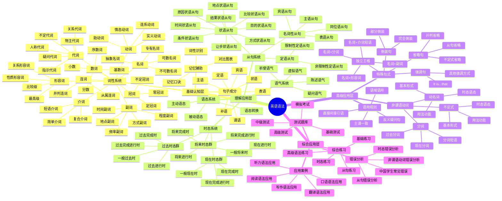
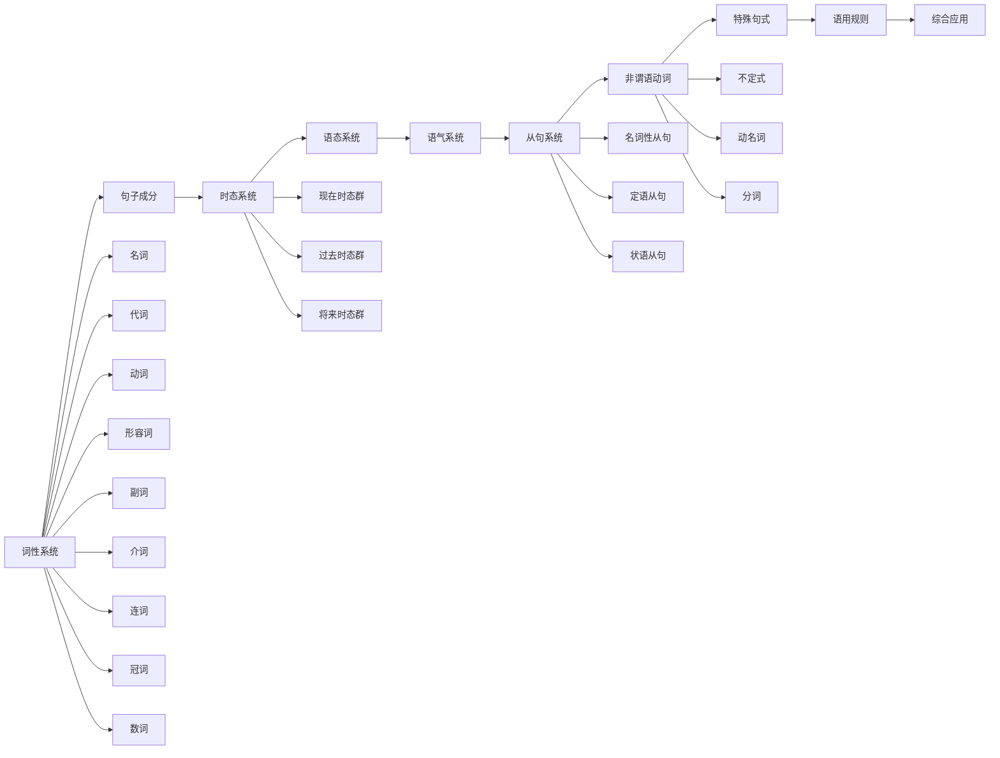
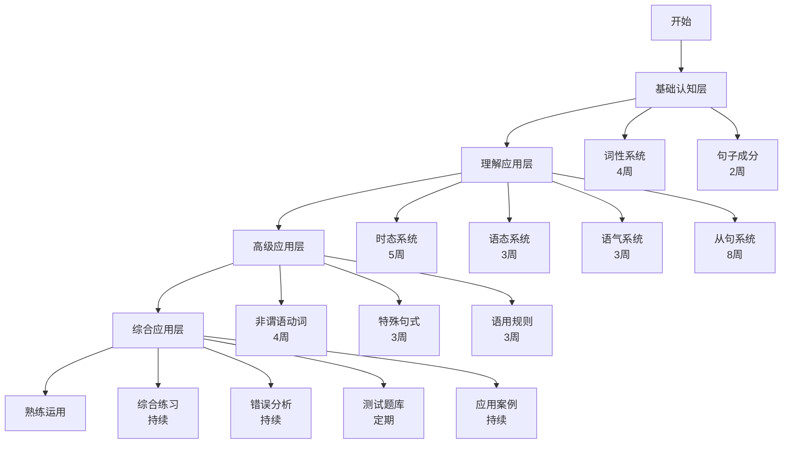
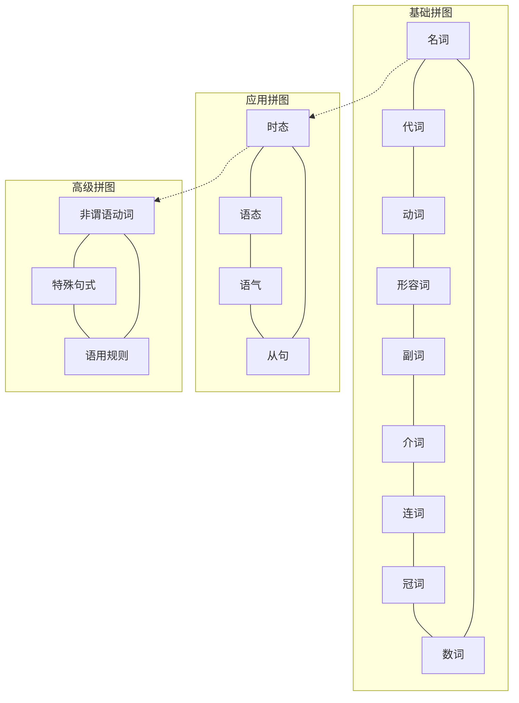
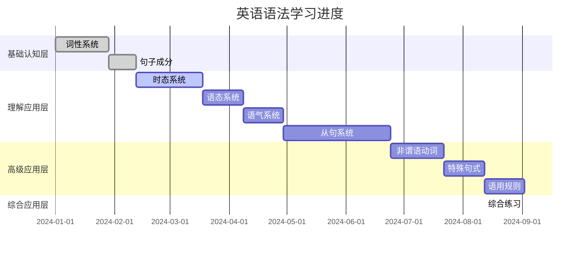
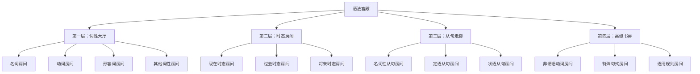

# 英语语法思维导图

## 🎯 学习目标
- 建立英语语法的可视化知识结构
- 理解知识点之间的逻辑关系
- 提高语法学习的系统性思维

## 🧠 核心思维导图

## 🔗 知识点关联网络

## 📊 学习优先级矩阵

| 重要性 | 难度 | 知识点 | 学习顺序 | 建议时间 |
|--------|------|--------|----------|----------|
| 高 | 低 | 词性系统 | 1 | 4周 |
| 高 | 中 | 时态系统 | 2 | 5周 |
| 高 | 高 | 从句系统 | 3 | 8周 |
| 中 | 中 | 语态系统 | 4 | 3周 |
| 中 | 中 | 语气系统 | 5 | 3周 |
| 中 | 高 | 非谓语动词 | 6 | 4周 |
| 低 | 高 | 特殊句式 | 7 | 3周 |
| 低 | 中 | 语用规则 | 8 | 3周 |

## 🎯 学习路径可视化

## 🧩 知识点拼图

## 📈 学习进度可视化

## 🎨 记忆宫殿设计

## 🔗 相关链接
- [[01-语法体系总览]]：整体框架理解
- [[raw/英语语法/00-语法总览/02-学习路径指南]]：详细学习路径
- [[04-语法学习策略]]：具体学习方法
- [[01-词性记忆口诀]]：记忆技巧
- [[02-词性对比图表]]：对比学习

---
*本思维导图为英语语法学习提供可视化的知识结构，帮助建立系统化的语法思维*
