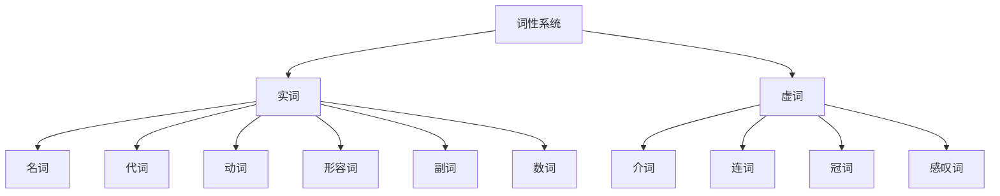
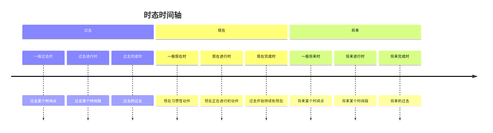
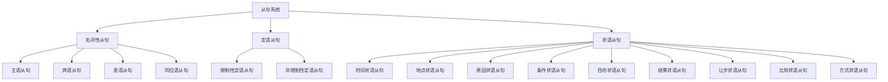
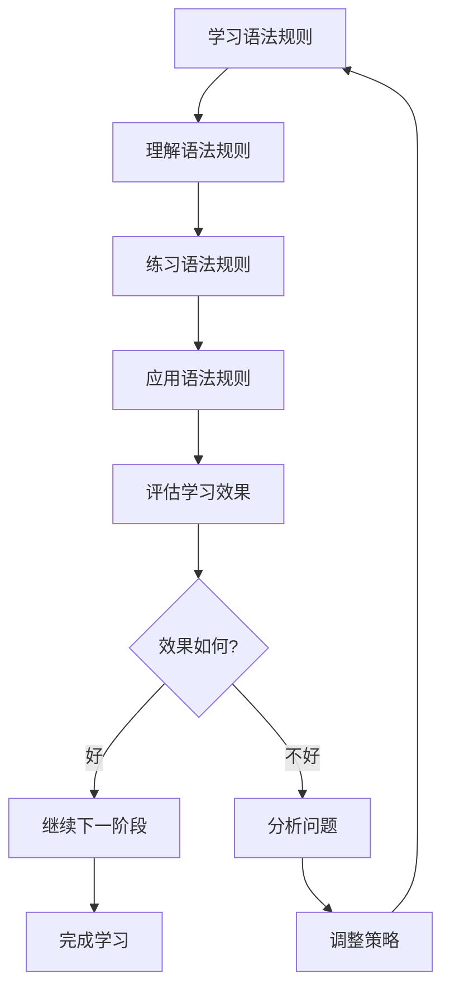

# 英语语法学习策略

## 🎯 学习目标
- 掌握高效的语法学习方法
- 建立个性化的学习策略
- 提高语法学习的效率和效果

## 🧠 核心学习策略

### 1. 费曼学习法
**原理**：通过教学来检验理解程度

**实施步骤**：
1. **选择概念**：选择要学习的语法点
2. **教学讲解**：用简单语言向他人解释
3. **发现盲点**：找出解释不清的地方
4. **重新学习**：回到资料重新学习
5. **简化表达**：用更简单的语言重新表达

**应用示例**：
- 学习时态时，尝试向朋友解释一般现在时的用法
- 发现解释不清的地方，重新学习相关规则
- 用更简单的语言重新表达时态概念

### 2. 刻意练习法
**原理**：通过有针对性的重复练习提高技能

**实施步骤**：
1. **分解练习**：将复杂语法点分解练习
2. **重复强化**：通过重复练习形成记忆
3. **及时反馈**：及时纠正错误
4. **渐进提升**：逐步提高练习难度

**应用示例**：
- 将从句学习分解为：识别从句→理解从句→构建从句→应用从句
- 每个阶段进行大量重复练习
- 及时纠正错误并调整方法

### 3. 金字塔学习法
**原理**：从基础到高级的层次化学习

**实施步骤**：
1. **建立基础**：掌握基础语法概念
2. **逐步深入**：学习更复杂的语法规则
3. **系统整合**：将知识点整合成体系
4. **应用验证**：在真实语境中验证

## 📚 具体学习方法

### 词性学习策略

#### 1. 分类记忆法

#### 2. 功能记忆法
- **名词**：表示人、事、物、概念
- **动词**：表示动作、状态、存在
- **形容词**：修饰名词，表示性质、特征
- **副词**：修饰动词、形容词、其他副词

#### 3. 位置记忆法
- **名词**：通常作主语、宾语、表语
- **动词**：通常作谓语
- **形容词**：通常作定语、表语
- **副词**：通常作状语

### 时态学习策略

#### 1. 时间轴法

#### 2. 对比分析法
| 时态 | 时间概念 | 动作特征 | 典型标志词 |
|------|----------|----------|------------|
| 一般现在时 | 现在 | 习惯性 | always, often, usually |
| 现在进行时 | 现在 | 进行中 | now, at the moment |
| 现在完成时 | 现在 | 已完成 | already, yet, just |
| 一般过去时 | 过去 | 已完成 | yesterday, last week |
| 过去进行时 | 过去 | 进行中 | at that time, then |
| 过去完成时 | 过去 | 过去的过去 | by the time, before |

#### 3. 语境练习法
- **写作练习**：用不同时态描述同一事件
- **口语练习**：在对话中自然使用各种时态
- **阅读练习**：分析文本中的时态使用

### 从句学习策略

#### 1. 结构分析法

#### 2. 功能记忆法
- **名词性从句**：在句中起名词作用
- **定语从句**：修饰名词，起形容词作用
- **状语从句**：修饰动词，起副词作用

#### 3. 连接词记忆法
- **名词性从句**：that, whether, if, what, who, which, when, where, why, how
- **定语从句**：who, whom, which, that, whose, when, where, why
- **状语从句**：when, where, because, if, so that, so...that, although, as...as

## 🎯 针对INTJ学习者的策略

### 1. 系统性思维
- **整体规划**：制定完整的学习计划
- **逻辑分析**：分析语法规则的逻辑关系
- **体系构建**：建立完整的知识体系

### 2. 深度理解
- **原理探究**：不满足于表面理解，追求深层逻辑
- **规则推导**：从基本原理推导具体规则
- **例外分析**：分析语法规则的例外情况

### 3. 实践验证
- **理论验证**：在真实语境中验证语法规则
- **错误分析**：分析错误原因并改进
- **持续优化**：根据学习效果调整策略

## 📊 学习效果评估

### 1. 自我评估
- **理解程度**：能否用简单语言解释语法规则
- **应用能力**：能否在真实语境中正确使用
- **错误识别**：能否识别和纠正语法错误

### 2. 他人评估
- **教学测试**：向他人讲解语法规则
- **对话练习**：在对话中自然使用语法
- **写作练习**：在写作中准确运用语法

### 3. 标准化测试
- **语法测试**：完成标准化语法测试
- **综合测试**：在综合测试中检验语法能力
- **实际应用**：在实际应用中验证语法水平

## 🔄 学习循环优化

## 📝 学习记录模板

### 每日学习记录
- **日期**：____
- **学习内容**：____
- **学习时间**：____
- **掌握程度**：⬜⬜⬜（1-3星）
- **遇到的问题**：____
- **解决方案**：____
- **明日计划**：____

### 每周学习总结
- **本周学习内容**：____
- **掌握情况**：____
- **存在问题**：____
- **下周计划**：____
- **学习心得**：____

### 每月学习回顾
- **本月学习内容**：____
- **学习进度**：____
- **主要收获**：____
- **存在问题**：____
- **下月计划**：____

## 🔗 相关链接
- [[01-语法体系总览]]：整体框架理解
- [[raw/英语语法/00-语法总览/02-学习路径指南]]：详细学习路径
- [[03-语法思维导图]]：可视化知识结构
- [[01-基础认知层/03-记忆辅助]]：记忆技巧
- [[04-综合应用/02-常见错误分析]]：错误分析

---
*本策略为英语语法学习提供系统化的方法指导，建议根据个人特点调整学习策略*
