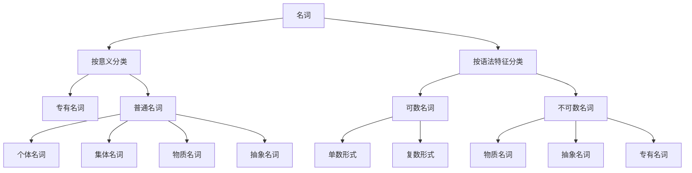

# 名词分类与特征

## 🎯 学习目标
- 掌握名词的基本分类方法
- 理解各类名词的特征
- 能够准确识别和使用不同类别的名词

## 📚 名词基本概念

### 定义
名词（Noun）是用来表示人、事物、地点、概念等名称的词类。

### 基本特征
- **语法功能**：可作主语、宾语、表语、定语
- **形态变化**：有单复数变化、所有格变化
- **修饰关系**：可被形容词、冠词修饰

## 🏷️ 名词分类体系

## 📖 按意义分类

### 1. 专有名词（Proper Nouns）
**定义**：表示特定的人、地点、机构等专有名称

**特征**：
- 首字母通常大写
- 一般没有复数形式
- 通常不与冠词连用

**分类**：

| 类别  | 示例                             | 说明   |
| --- | ------------------------------ | ---- |
| 人名  | John, Mary, Smith              | 个人姓名 |
| 地名  | Beijing, London, Mount Everest | 地理名称 |
| 机构名 | Harvard University, Microsoft  | 组织名称 |
| 节日名 | Christmas, New Year's Day      | 节日名称 |
| 书名  | Pride and Prejudice            | 作品名称 |

**用法示例**：
- ✅ John is my friend.
- ✅ I live in Beijing.
- ✅ Harvard University is famous.
- ❌ The John is my friend. (专有名词前通常不用冠词)

### 2. 普通名词（Common Nouns）
**定义**：表示一类人或事物的名称

#### 2.1 个体名词（Individual Nouns）
**定义**：表示单个的人或事物

**特征**：
- 可数，有单复数形式
- 可与冠词连用

**示例**：
- 人：teacher, student, doctor
- 动物：cat, dog, bird
- 物品：book, car, house
- 植物：tree, flower, grass

**用法示例**：
- ✅ A teacher is in the classroom.
- ✅ Three students are reading books.
- ✅ The cat is sleeping.

#### 2.2 集体名词（Collective Nouns）
**定义**：表示一群人或事物的集合

**特征**：
- 形式上是单数，但表示复数概念
- 谓语动词可用单数或复数

**分类**：

| 类别  | 示例                     | 说明    |
| --- | ---------------------- | ----- |
| 人群  | family, team, class    | 人的集合  |
| 动物群 | herd, flock, pack      | 动物的集合 |
| 物品群 | bunch, set, collection | 物品的集合 |

**用法示例**：
- ✅ The family is large. (强调整体)
- ✅ The family are arguing. (强调个体)
- ✅ A herd of cows is grazing. (强调整体)
- ✅ The team are playing well. (强调个体)

#### 2.3 物质名词（Material Nouns）
**定义**：表示物质、材料、液体等不可分割的物质

**特征**：
- 不可数，没有复数形式
- 表示数量时用量词

**分类**：

| 类别 | 示例 | 说明 |
|------|------|------|
| 金属 | gold, silver, iron | 金属材料 |
| 液体 | water, milk, oil | 液体物质 |
| 气体 | air, oxygen, hydrogen | 气体物质 |
| 食物 | bread, rice, meat | 食物材料 |
| 材料 | wood, paper, cloth | 制作材料 |

**用法示例**：
- ✅ Water is essential for life.
- ✅ A glass of water (用量词表示数量)
- ✅ Gold is expensive.
- ❌ Two waters (物质名词无复数)

#### 2.4 抽象名词（Abstract Nouns）
**定义**：表示抽象概念、情感、状态等

**特征**：
- 不可数，没有复数形式
- 表示抽象概念

**分类**：

| 类别 | 示例 | 说明 |
|------|------|------|
| 情感 | love, happiness, anger | 情感状态 |
| 品质 | courage, honesty, wisdom | 人的品质 |
| 概念 | freedom, justice, peace | 抽象概念 |
| 状态 | health, wealth, poverty | 状态概念 |
| 学科 | mathematics, physics, history | 学科名称 |

**用法示例**：
- ✅ Love is beautiful.
- ✅ Courage is important.
- ✅ Mathematics is difficult.
- ❌ Two loves (抽象名词无复数)

## 🔢 按语法特征分类

### 1. 可数名词（Countable Nouns）
**定义**：可以计数的名词

**特征**：
- 有单复数形式
- 可与数词连用
- 可与冠词a/an连用

**单复数变化规则**：

| 规则 | 示例 | 说明 |
|------|------|------|
| 一般情况 | book→books, cat→cats | 直接加-s |
| 以s,x,ch,sh结尾 | box→boxes, watch→watches | 加-es |
| 以辅音字母+y结尾 | city→cities, baby→babies | 变y为i加-es |
| 以f或fe结尾 | leaf→leaves, knife→knives | 变f/fe为v加-es |
| 不规则变化 | child→children, foot→feet | 特殊变化 |

**用法示例**：
- ✅ I have a book. (单数)
- ✅ I have three books. (复数)
- ✅ The books are interesting. (复数作主语)

### 2. 不可数名词（Uncountable Nouns）
**定义**：不可以计数的名词

**特征**：
- 没有复数形式
- 不能与数词直接连用
- 不能与冠词a/an连用

**分类**：
- 物质名词：water, milk, gold
- 抽象名词：love, happiness, courage
- 专有名词：Beijing, John

**表示数量的方法**：

| 方法 | 示例 | 说明 |
|------|------|------|
| 量词 | a glass of water | 用量词表示 |
| 容器 | a bottle of milk | 用容器表示 |
| 重量 | a kilo of rice | 用重量表示 |
| 长度 | a piece of paper | 用长度表示 |

**用法示例**：
- ✅ Water is important. (不可数)
- ✅ A glass of water (用量词)
- ❌ Two waters (错误)
- ❌ A water (错误)

## 🎯 名词识别技巧

### 1. 位置识别法
- **主语位置**：名词通常作主语
- **宾语位置**：名词通常作宾语
- **表语位置**：名词通常作表语

### 2. 修饰识别法
- **冠词修饰**：a/an/the + 名词
- **形容词修饰**：形容词 + 名词
- **数词修饰**：数词 + 名词

### 3. 功能识别法
- **可数性**：能否与数词连用
- **复数性**：是否有复数形式
- **冠词性**：能否与a/an连用

## 📊 名词分类对比表

| 分类标准 | 可数名词 | 不可数名词 |
|----------|----------|------------|
| 复数形式 | 有 | 无 |
| 冠词a/an | 可用 | 不可用 |
| 数词修饰 | 可直接用 | 需用量词 |
| 典型例子 | book, cat, student | water, love, gold |

## 🔗 相关链接
- [[02-可数不可数名词]]：详细的可数性规则
- [[03-名词单复数变化]]：复数变化规则
- [[04-名词所有格]]：所有格的使用
- [[05-名词易混点辨析]]：常见错误分析
- [[01-基本成分]]：名词在句子中的作用

## 💡 记忆口诀

**名词分类记忆法**：
- 专有名词首字母大写，不与冠词连用
- 个体名词可计数，有单复数变化
- 集体名词表集合，谓语动词可单可复
- 物质名词不可数，表示数量用量词
- 抽象名词表概念，没有复数形式

---
*掌握名词分类是语法学习的基础，为后续的语法学习奠定坚实基础*
