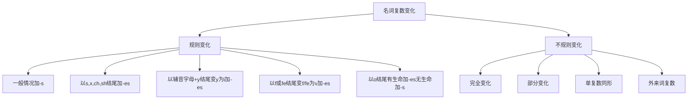

# 名词单复数变化

## 🎯 学习目标
- 掌握名词单复数变化的基本规则
- 熟练运用不规则复数变化
- 避免复数变化中的常见错误

## 📚 基本概念

### 单数（Singular）
**定义**：表示一个人或一个事物的名词形式

### 复数（Plural）
**定义**：表示两个或两个以上的人或事物的名词形式

### 变化原则
- 可数名词有单复数变化
- 不可数名词没有复数形式
- 专有名词一般没有复数形式

## 🔢 规则变化

### 1. 一般情况
**规则**：直接在词尾加-s

**示例**：

| 单数 | 复数 | 音标变化 |
|------|------|----------|
| book | books | /bʊk/ → /bʊks/ |
| cat | cats | /kæt/ → /kæts/ |
| dog | dogs | /dɔːɡ/ → /dɔːɡz/ |
| pen | pens | /pen/ → /penz/ |
| table | tables | /ˈteɪbl/ → /ˈteɪblz/ |

**发音规则**：
- 清辅音后读/s/
- 浊辅音和元音后读/z/
- s, z, sh, ch, x后读/ɪz/

### 2. 以s, x, ch, sh结尾
**规则**：在词尾加-es

**示例**：

| 单数 | 复数 | 说明 |
|------|------|------|
| box | boxes | 以x结尾 |
| watch | watches | 以ch结尾 |
| brush | brushes | 以sh结尾 |
| class | classes | 以s结尾 |
| fox | foxes | 以x结尾 |

**发音规则**：-es读作/ɪz/

### 3. 以辅音字母+y结尾
**规则**：变y为i，再加-es

**示例**：

| 单数 | 复数 | 说明 |
|------|------|------|
| city | cities | 辅音+y |
| baby | babies | 辅音+y |
| country | countries | 辅音+y |
| family | families | 辅音+y |
| story | stories | 辅音+y |

**例外**：以元音字母+y结尾直接加-s
- boy → boys
- day → days
- key → keys

### 4. 以f或fe结尾
**规则**：变f或fe为v，再加-es

**示例**：

| 单数 | 复数 | 说明 |
|------|------|------|
| leaf | leaves | 以f结尾 |
| knife | knives | 以fe结尾 |
| wife | wives | 以fe结尾 |
| life | lives | 以fe结尾 |
| half | halves | 以f结尾 |

**例外**：直接加-s
- roof → roofs
- proof → proofs
- chief → chiefs
- belief → beliefs

### 5. 以o结尾
**规则**：有生命的名词加-es，无生命的名词加-s

**示例**：

| 单数 | 复数 | 说明 |
|------|------|------|
| tomato | tomatoes | 有生命 |
| potato | potatoes | 有生命 |
| hero | heroes | 有生命 |
| photo | photos | 无生命 |
| piano | pianos | 无生命 |
| radio | radios | 无生命 |

**记忆技巧**：
- 有生命：tomato, potato, hero, echo, veto
- 无生命：photo, piano, radio, video, studio

## 🔄 不规则变化

### 1. 完全变化
**规则**：单复数形式完全不同

**示例**：

| 单数 | 复数 | 说明 |
|------|------|------|
| child | children | 完全变化 |
| foot | feet | 完全变化 |
| tooth | teeth | 完全变化 |
| mouse | mice | 完全变化 |
| goose | geese | 完全变化 |
| man | men | 完全变化 |
| woman | women | 完全变化 |
| person | people | 完全变化 |

### 2. 部分变化
**规则**：单复数形式部分相同

**示例**：

| 单数 | 复数 | 说明 |
|------|------|------|
| ox | oxen | 加-en |
| child | children | 加-ren |
| brother | brethren | 特殊变化 |

### 3. 单复数同形
**规则**：单复数形式完全相同

**示例**：
| 单数 | 复数 | 说明 |
|------|------|------|
| sheep | sheep | 单复数同形 |
| deer | deer | 单复数同形 |
| fish | fish | 单复数同形 |
| series | series | 单复数同形 |
| species | species | 单复数同形 |
| means | means | 单复数同形 |

### 4. 外来词复数
**规则**：保持原语言的复数形式

**示例**：

| 单数 | 复数 | 来源 |
|------|------|------|
| datum | data | 拉丁语 |
| medium | media | 拉丁语 |
| criterion | criteria | 希腊语 |
| phenomenon | phenomena | 希腊语 |
| analysis | analyses | 希腊语 |
| thesis | theses | 希腊语 |

## 📊 复数变化规则总览

## 🎯 特殊情况处理

### 1. 复合名词
**规则**：通常在主要名词后加复数

**示例**：

| 单数 | 复数 | 说明 |
|------|------|------|
| son-in-law | sons-in-law | 主要名词是son |
| passer-by | passers-by | 主要名词是passer |
| mother-in-law | mothers-in-law | 主要名词是mother |

**例外**：
- grown-up → grown-ups (整体复数)
- forget-me-not → forget-me-nots (整体复数)

### 2. 缩写词
**规则**：在缩写词后加-s

**示例**：

| 单数 | 复数 | 说明 |
|------|------|------|
| CD | CDs | 缩写词复数 |
| VIP | VIPs | 缩写词复数 |
| UFO | UFOs | 缩写词复数 |

### 3. 字母和数字
**规则**：在字母和数字后加-'s

**示例**：

| 单数 | 复数 | 说明 |
|------|------|------|
| A | A's | 字母复数 |
| 5 | 5's | 数字复数 |
| 1990 | 1990's | 年份复数 |

### 4. 专有名词
**规则**：专有名词复数通常加-s

**示例**：

| 单数 | 复数 | 说明 |
|------|------|------|
| the Smiths | the Smiths | 史密斯一家 |
| the Johnsons | the Johnsons | 约翰逊一家 |
| the Browns | the Browns | 布朗一家 |

## 🔍 复数变化判断技巧

### 1. 语音判断法
- 听发音判断复数形式
- 注意词尾的发音变化

### 2. 词形判断法
- 观察词尾字母
- 根据规则判断变化

### 3. 语境判断法
- 根据上下文判断单复数
- 注意主谓一致

## 🚫 常见错误分析

### 错误类型1：规则变化错误
**错误**：❌ boxs, watchs
**正确**：✅ boxes, watches
**分析**：以s, x, ch, sh结尾需要加-es

### 错误类型2：不规则变化错误
**错误**：❌ childs, foots
**正确**：✅ children, feet
**分析**：不规则变化需要特殊记忆

### 错误类型3：复合名词错误
**错误**：❌ son-in-laws
**正确**：✅ sons-in-law
**分析**：复合名词在主要名词后加复数

### 错误类型4：外来词错误
**错误**：❌ datas, criterions
**正确**：✅ data, criteria
**分析**：外来词保持原语言复数形式

## 📝 练习方法

### 1. 规则练习
- 给出单数，写出复数
- 给出复数，写出单数

### 2. 不规则练习
- 记忆不规则变化表
- 通过句子练习不规则复数

### 3. 综合练习
- 在真实语境中使用正确复数
- 写作中注意复数形式

## 🔗 相关链接
- [[01-名词分类与特征]]：名词基本分类
- [[02-可数不可数名词]]：可数性规则
- [[04-名词所有格]]：所有格的使用
- [[05-名词易混点辨析]]：常见错误分析
- [[01-基本成分]]：名词在句子中的作用

## 💡 记忆口诀

**复数变化记忆法**：
- 一般情况直接加s，清辅音后读/s/
- s,x,ch,sh结尾加es，发音读作/ɪz/
- 辅音字母y结尾，变y为i加es
- f或fe结尾变v加es，记住例外要特殊
- o结尾有生命加es，无生命直接加s
- 不规则变化要牢记，单复数同形也不少

---
*掌握名词单复数变化是语法学习的基础，需要大量练习才能熟练运用*
