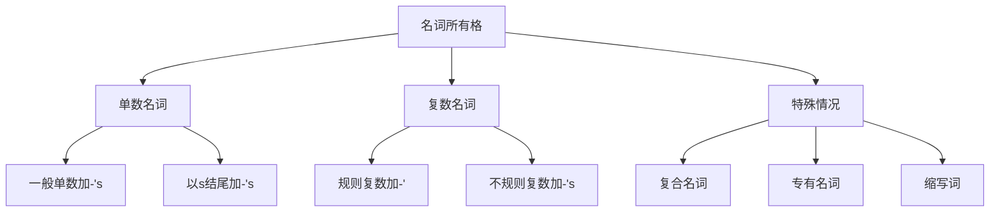
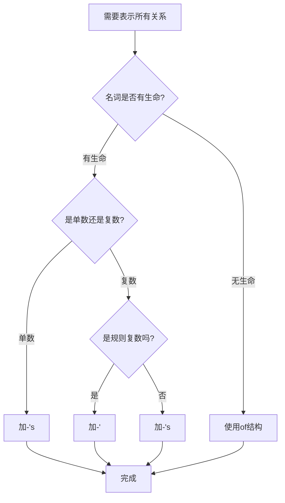

# 名词所有格

## 🎯 学习目标
- 掌握名词所有格的基本构成规则
- 理解所有格的不同表达方式
- 熟练运用所有格的各种用法

## 📚 基本概念

### 所有格（Possessive Case）
**定义**：表示名词与名词之间所属关系的语法形式

### 基本功能
- 表示所属关系
- 表示时间关系
- 表示空间关系
- 表示来源关系

## 🔧 构成规则

### 1. 单数名词所有格
**规则**：在单数名词后加-'s

**示例**：

| 原形 | 所有格 | 说明 |
|------|--------|------|
| boy | boy's | 男孩的 |
| cat | cat's | 猫的 |
| teacher | teacher's | 老师的 |
| student | student's | 学生的 |
| book | book's | 书的 |

**用法示例**：
- ✅ The boy's book (男孩的书)
- ✅ The cat's tail (猫的尾巴)
- ✅ The teacher's desk (老师的桌子)

### 2. 复数名词所有格
**规则**：在复数名词后加-'

**示例**：

| 原形 | 复数 | 所有格 | 说明 |
|------|------|--------|------|
| boy | boys | boys' | 男孩们的 |
| cat | cats | cats' | 猫们的 |
| teacher | teachers | teachers' | 老师们的 |
| student | students | students' | 学生们的 |
| book | books | books' | 书的 |

**用法示例**：
- ✅ The boys' books (男孩们的书)
- ✅ The cats' tails (猫们的尾巴)
- ✅ The teachers' desks (老师们的桌子)

### 3. 不规则复数所有格
**规则**：在不规则复数后加-'s

**示例**：

| 原形 | 复数 | 所有格 | 说明 |
|------|------|--------|------|
| child | children | children's | 孩子们的 |
| man | men | men's | 男人们的 |
| woman | women | women's | 女人们的 |
| person | people | people's | 人们的 |
| foot | feet | feet's | 脚的 |

**用法示例**：
- ✅ The children's toys (孩子们的玩具)
- ✅ The men's clothes (男人们的衣服)
- ✅ The women's bags (女人们的包)

### 4. 以s结尾的单数名词所有格
**规则**：在词尾加-'s

**示例**：

| 原形 | 所有格 | 说明 |
|------|--------|------|
| James | James's | 詹姆斯的 |
| Charles | Charles's | 查尔斯的 |
| boss | boss's | 老板的 |
| class | class's | 班级的 |

**用法示例**：
- ✅ James's car (詹姆斯的车)
- ✅ Charles's house (查尔斯的房子)
- ✅ The boss's office (老板的办公室)

## 📊 所有格构成规则总览

## 🎯 所有格用法

### 1. 表示所属关系
**功能**：表示某物属于某人

**示例**：
- ✅ John's book (约翰的书)
- ✅ The dog's bone (狗的骨头)
- ✅ My father's car (我父亲的车)
- ✅ The company's policy (公司的政策)

### 2. 表示时间关系
**功能**：表示时间的所有关系

**示例**：
- ✅ today's news (今天的新闻)
- ✅ yesterday's meeting (昨天的会议)
- ✅ next week's plan (下周的计划)
- ✅ this year's budget (今年的预算)

### 3. 表示空间关系
**功能**：表示地点的所有关系

**示例**：
- ✅ the city's center (市中心)
- ✅ the country's capital (国家的首都)
- ✅ the school's library (学校的图书馆)
- ✅ the hospital's entrance (医院的入口)

### 4. 表示来源关系
**功能**：表示来源或出处

**示例**：
- ✅ Shakespeare's plays (莎士比亚的戏剧)
- ✅ Einstein's theory (爱因斯坦的理论)
- ✅ Newton's laws (牛顿的定律)
- ✅ Darwin's evolution (达尔文的进化论)

### 5. 表示特征关系
**功能**：表示某物的特征或属性

**示例**：
- ✅ the book's title (书的标题)
- ✅ the car's color (车的颜色)
- ✅ the house's size (房子的大小)
- ✅ the problem's solution (问题的解决方案)

## 🔄 所有格的其他表达方式

### 1. of结构
**规则**：用of + 名词表示所有关系

**适用情况**：
- 无生命的名词
- 较长的名词短语
- 避免-'s结构过于复杂

**示例**：
- ✅ the cover of the book (书的封面)
- ✅ the door of the house (房子的门)
- ✅ the capital of China (中国的首都)
- ✅ the author of the novel (小说的作者)

### 2. 双重所有格
**规则**：用of + 名词所有格表示所有关系

**结构**：名词 + of + 名词所有格

**示例**：
- ✅ a friend of my father's (我父亲的一个朋友)
- ✅ a book of John's (约翰的一本书)
- ✅ a student of the teacher's (老师的一个学生)
- ✅ a car of my brother's (我兄弟的一辆车)

**用法说明**：
- 表示"其中之一"的概念
- 避免与the连用
- 常用于表示部分关系

### 3. 所有格代词
**规则**：用所有格代词代替名词所有格

**示例**：

| 人称 | 所有格代词 | 示例 |
|------|------------|------|
| 第一人称单数 | my | my book |
| 第二人称单数 | your | your car |
| 第三人称单数 | his/her/its | his house |
| 第一人称复数 | our | our school |
| 第二人称复数 | your | your family |
| 第三人称复数 | their | their children |

## 📝 所有格使用规则

### 1. 有生命名词
**规则**：通常用-'s结构

**示例**：
- ✅ the boy's toy (男孩的玩具)
- ✅ the cat's food (猫的食物)
- ✅ the teacher's book (老师的书)

### 2. 无生命名词
**规则**：通常用of结构

**示例**：
- ✅ the cover of the book (书的封面)
- ✅ the door of the house (房子的门)
- ✅ the color of the car (车的颜色)

### 3. 时间名词
**规则**：通常用-'s结构

**示例**：
- ✅ today's weather (今天的天气)
- ✅ yesterday's news (昨天的新闻)
- ✅ next week's plan (下周的计划)

### 4. 地点名词
**规则**：通常用-'s结构

**示例**：
- ✅ the city's population (城市的人口)
- ✅ the country's economy (国家的经济)
- ✅ the school's history (学校的历史)

## 🚫 常见错误分析

### 错误类型1：所有格构成错误
**错误**：❌ the boys's books
**正确**：✅ the boys' books
**分析**：规则复数名词所有格只加-'

### 错误类型2：所有格使用错误
**错误**：❌ the book's cover
**正确**：✅ the cover of the book
**分析**：无生命名词通常用of结构

### 错误类型3：双重所有格错误
**错误**：❌ a friend of my father
**正确**：✅ a friend of my father's
**分析**：双重所有格需要用名词所有格

### 错误类型4：所有格位置错误
**错误**：❌ the book John's
**正确**：✅ John's book
**分析**：所有格通常放在被修饰名词前

## 🎯 所有格选择决策树

## 📊 所有格用法对比表

| 情况 | 结构 | 示例 | 说明 |
|------|------|------|------|
| 有生命单数 | -'s | the boy's book | 男孩的书 |
| 有生命复数 | -' | the boys' books | 男孩们的书 |
| 无生命名词 | of | the cover of the book | 书的封面 |
| 时间名词 | -'s | today's news | 今天的新闻 |
| 地点名词 | -'s | the city's center | 市中心 |
| 双重所有格 | of + -'s | a friend of John's | 约翰的一个朋友 |

## 🔗 相关链接
- [[01-名词分类与特征]]：名词基本分类
- [[02-可数不可数名词]]：可数性规则
- [[03-名词单复数变化]]：复数变化规则
- [[05-名词易混点辨析]]：常见错误分析
- [[01-基本成分]]：名词在句子中的作用

## 💡 记忆口诀

**所有格构成记忆法**：
- 单数名词加's，复数名词加'
- 不规则复数加's，以s结尾也加's
- 有生命用's，无生命用of
- 时间地点用's，双重所有格要记牢

---
*掌握名词所有格是语法学习的重要基础，需要大量练习才能熟练运用*
