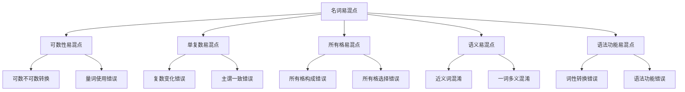

# 名词易混点辨析

## 🎯 学习目标
- 识别名词使用中的常见易混点
- 掌握易混点的正确用法
- 避免名词使用中的常见错误

## 🔍 易混点分类

## 🔢 可数性易混点

### 1. 可数不可数转换
**易混点**：某些名词在不同语境下可数性不同

**示例对比**：

| 名词 | 不可数用法 | 可数用法 | 说明 |
|------|------------|----------|------|
| chicken | I like chicken. (鸡肉) | I have a chicken. (鸡) | 物质vs个体 |
| coffee | I drink coffee. (咖啡) | I want a coffee. (一杯咖啡) | 物质vs容器 |
| paper | I need paper. (纸) | I read a paper. (报纸) | 材料vs物品 |
| glass | The glass is fragile. (玻璃) | I have a glass. (玻璃杯) | 材料vs容器 |
| iron | Iron is heavy. (铁) | I need an iron. (熨斗) | 材料vs工具 |

**辨析技巧**：
- 看语境：表示物质时不可数，表示个体时可数
- 看修饰词：与a/an连用时可数，与量词连用时不可数
- 看语义：具体物品可数，抽象概念不可数

### 2. 量词使用错误
**易混点**：不可数名词的量词使用不当

**错误示例**：
- ❌ two waters → ✅ two glasses of water
- ❌ three milks → ✅ three bottles of milk
- ❌ five breads → ✅ five pieces of bread
- ❌ two advices → ✅ two pieces of advice

**正确量词搭配**：

| 不可数名词 | 正确量词 | 示例 |
|------------|----------|------|
| water | glass/bottle | a glass of water |
| milk | bottle/cup | a bottle of milk |
| bread | piece/slice | a piece of bread |
| advice | piece | a piece of advice |
| information | piece | a piece of information |

## 🔄 单复数易混点

### 1. 复数变化错误
**易混点**：不规则复数变化记忆错误

**常见错误**：

| 错误 | 正确 | 说明 |
|------|------|------|
| childs | children | 不规则变化 |
| foots | feet | 不规则变化 |
| mouses | mice | 不规则变化 |
| gooses | geese | 不规则变化 |
| mans | men | 不规则变化 |
| womans | women | 不规则变化 |

**记忆技巧**：
- 不规则变化需要特殊记忆
- 通过句子练习加深印象
- 注意发音变化

### 2. 主谓一致错误
**易混点**：复数名词与谓语动词不一致

**错误示例**：
- ❌ The books is interesting. → ✅ The books are interesting.
- ❌ Three students is reading. → ✅ Three students are reading.
- ❌ Many people is here. → ✅ Many people are here.

**正确规则**：
- 复数名词作主语，谓语动词用复数
- 单数名词作主语，谓语动词用单数
- 注意主谓一致

### 3. 单复数同形易混点
**易混点**：单复数同形的名词使用错误

**常见名词**：

| 名词 | 单数 | 复数 | 说明 |
|------|------|------|------|
| sheep | sheep | sheep | 单复数同形 |
| deer | deer | deer | 单复数同形 |
| fish | fish | fish | 单复数同形 |
| series | series | series | 单复数同形 |
| species | species | species | 单复数同形 |

**使用注意**：
- 单复数同形，但谓语动词要一致
- 单数时用单数动词，复数时用复数动词
- 通过语境判断单复数

## 🏠 所有格易混点

### 1. 所有格构成错误
**易混点**：所有格构成规则混淆

**常见错误**：

| 错误 | 正确 | 说明 |
|------|------|------|
| the boys's books | the boys' books | 规则复数只加' |
| the childrens' toys | the children's toys | 不规则复数加's |
| James' car | James's car | 以s结尾加's |

**构成规则**：
- 单数名词：加-'s
- 规则复数：加-'
- 不规则复数：加-'s
- 以s结尾：加-'s

### 2. 所有格选择错误
**易混点**：-'s结构与of结构选择错误

**错误示例**：
- ❌ the book's cover → ✅ the cover of the book
- ❌ the house's door → ✅ the door of the house
- ❌ the car's color → ✅ the color of the car

**选择规则**：
- 有生命名词：用-'s结构
- 无生命名词：用of结构
- 时间名词：用-'s结构
- 地点名词：用-'s结构

### 3. 双重所有格错误
**易混点**：双重所有格构成错误

**错误示例**：
- ❌ a friend of my father → ✅ a friend of my father's
- ❌ a book of John → ✅ a book of John's
- ❌ a student of the teacher → ✅ a student of the teacher's

**构成规则**：
- 结构：名词 + of + 名词所有格
- 表示"其中之一"的概念
- 避免与the连用

## 📚 语义易混点

### 1. 近义词混淆
**易混点**：近义词使用不当

**常见近义词对比**：

| 近义词组 | 区别 | 示例 |
|----------|------|------|
| house/home | house指建筑物，home指家 | I live in a house. / I'm going home. |
| job/work | job指具体工作，work指工作活动 | I have a job. / I do work. |
| problem/question | problem指问题，question指疑问 | This is a problem. / I have a question. |
| advice/suggestion | advice指建议，suggestion指提议 | Give me advice. / Make a suggestion. |

**辨析技巧**：
- 看语境：不同语境使用不同词汇
- 看搭配：注意固定搭配
- 看语义：理解词汇的深层含义

### 2. 一词多义混淆
**易混点**：一词多义的使用错误

**常见多义词**：

| 多义词 | 不同含义 | 示例 |
|--------|----------|------|
| bank | 银行/河岸 | I go to the bank. / I sit by the bank. |
| watch | 手表/观看 | I wear a watch. / I watch TV. |
| book | 书/预订 | I read a book. / I book a room. |
| light | 光/轻的 | The light is bright. / The bag is light. |

**辨析技巧**：
- 看语境：根据语境判断含义
- 看词性：注意词性变化
- 看搭配：注意固定搭配

## 🔧 语法功能易混点

### 1. 词性转换错误
**易混点**：名词与其他词性转换错误

**常见转换**：

| 名词 | 动词 | 形容词 | 副词 |
|------|------|--------|------|
| success | succeed | successful | successfully |
| beauty | beautify | beautiful | beautifully |
| danger | endanger | dangerous | dangerously |
| friend | befriend | friendly | friendlily |

**使用注意**：
- 注意词性变化
- 注意语法功能
- 注意搭配关系

### 2. 语法功能错误
**易混点**：名词在句子中的语法功能错误

**常见错误**：
- ❌ I am student. → ✅ I am a student.
- ❌ She is teacher. → ✅ She is a teacher.
- ❌ He is doctor. → ✅ He is a doctor.

**正确规则**：
- 作表语时，可数名词单数需要冠词
- 注意语法功能的一致性
- 注意主谓一致

## 📊 易混点对比表

| 易混点类型 | 错误示例 | 正确示例 | 辨析要点 |
|------------|----------|----------|----------|
| 可数性 | two waters | two glasses of water | 用量词表达数量 |
| 复数变化 | childs | children | 不规则变化特殊记忆 |
| 主谓一致 | The books is... | The books are... | 复数名词用复数动词 |
| 所有格构成 | boys's | boys' | 规则复数只加' |
| 所有格选择 | book's cover | cover of the book | 无生命名词用of结构 |
| 双重所有格 | friend of father | friend of father's | 需要用名词所有格 |
| 近义词 | I go to home | I go home | home是副词，不需要to |
| 词性转换 | I success | I succeed | 注意词性变化 |

## 🎯 辨析技巧总结

### 1. 语境分析法
- 根据语境判断词汇含义
- 注意上下文关系
- 理解语言环境

### 2. 语法分析法
- 分析语法结构
- 注意语法功能
- 遵循语法规则

### 3. 对比分析法
- 对比相似词汇
- 找出差异点
- 强化记忆

### 4. 练习强化法
- 大量练习
- 及时纠正错误
- 形成正确习惯

## 🔗 相关链接
- [[01-名词分类与特征]]：名词基本分类
- [[02-可数不可数名词]]：可数性规则
- [[03-名词单复数变化]]：复数变化规则
- [[04-名词所有格]]：所有格的使用
- [[01-基本成分]]：名词在句子中的作用

## 💡 记忆口诀

**易混点辨析记忆法**：
- 可数不可数看语境，量词表达要准确
- 复数变化有规则，不规则变化要牢记
- 所有格构成要正确，有生命用's无生命用of
- 近义词辨析看搭配，多义词理解看语境
- 词性转换要注意，语法功能要一致

---
*掌握名词易混点辨析是提高语法准确性的关键，需要大量练习和对比分析*
