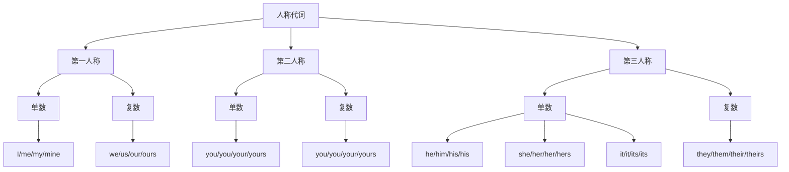

# 人称代词

## 🎯 学习目标
- 掌握人称代词的基本形式和用法
- 理解人称代词在句子中的语法功能
- 熟练运用人称代词的各种变化

## 📚 基本概念

### 人称代词（Personal Pronouns）
**定义**：用来代替人或事物的代词

### 基本特征
- 有人称、数、格的变化
- 在句中可作主语、宾语、表语
- 有主格、宾格、所有格形式

## 👥 人称代词分类

## 📊 人称代词变化表

### 完整变化表
| 人称 | 数 | 主格 | 宾格 | 所有格 | 名词性物主代词 |
|------|----|------|------|--------|----------------|
| 第一人称 | 单数 | I | me | my | mine |
| 第一人称 | 复数 | we | us | our | ours |
| 第二人称 | 单数 | you | you | your | yours |
| 第二人称 | 复数 | you | you | your | yours |
| 第三人称 | 单数 | he | him | his | his |
| 第三人称 | 单数 | she | her | her | hers |
| 第三人称 | 单数 | it | it | its | its |
| 第三人称 | 复数 | they | them | their | theirs |

## 🎯 主格用法

### 1. 作主语
**功能**：在句中作主语

**示例**：
- ✅ I am a student. (我是学生)
- ✅ You are my friend. (你是我的朋友)
- ✅ He is tall. (他很高)
- ✅ She is beautiful. (她很美丽)
- ✅ It is a book. (它是一本书)
- ✅ We are classmates. (我们是同学)
- ✅ They are teachers. (他们是老师)

### 2. 作表语
**功能**：在系动词后作表语

**示例**：
- ✅ It is I. (是我)
- ✅ It was he. (是他)
- ✅ It is she. (是她)
- ✅ It is we. (是我们)
- ✅ It is they. (是他们)

**注意**：在非正式语体中，表语位置常用宾格
- ✅ It is me. (非正式)
- ✅ It was him. (非正式)
- ✅ It is her. (非正式)

## 🎯 宾格用法

### 1. 作宾语
**功能**：在句中作动词宾语

**示例**：
- ✅ He helps me. (他帮助我)
- ✅ I see you. (我看见你)
- ✅ She loves him. (她爱他)
- ✅ We like her. (我们喜欢她)
- ✅ They know us. (他们认识我们)
- ✅ I understand them. (我理解他们)

### 2. 作介词宾语
**功能**：在介词后作宾语

**示例**：
- ✅ Give it to me. (把它给我)
- ✅ Look at you. (看着你)
- ✅ Talk to him. (和他说话)
- ✅ Listen to her. (听她说)
- ✅ Come with us. (和我们一起来)
- ✅ Go with them. (和他们一起去)

### 3. 作间接宾语
**功能**：在双宾语结构中作间接宾语

**示例**：
- ✅ Give me the book. (给我这本书)
- ✅ Tell him the news. (告诉他这个消息)
- ✅ Show her the picture. (给她看这张图片)
- ✅ Buy us some food. (给我们买些食物)
- ✅ Send them a letter. (给他们寄一封信)

## 🏠 所有格用法

### 1. 形容词性物主代词
**功能**：修饰名词，表示所属关系

**示例**：
- ✅ This is my book. (这是我的书)
- ✅ That is your car. (那是你的车)
- ✅ This is his house. (这是他的房子)
- ✅ That is her bag. (那是她的包)
- ✅ This is its tail. (这是它的尾巴)
- ✅ That is our school. (那是我们的学校)
- ✅ This is their home. (这是他们的家)

### 2. 名词性物主代词
**功能**：代替名词，表示所属关系

**示例**：
- ✅ This book is mine. (这本书是我的)
- ✅ That car is yours. (那辆车是你的)
- ✅ This house is his. (这座房子是他的)
- ✅ That bag is hers. (那个包是她的)
- ✅ This tail is its. (这个尾巴是它的)
- ✅ That school is ours. (那所学校是我们的)
- ✅ This home is theirs. (这个家是他们的)

## 🔄 特殊用法

### 1. 并列人称代词
**规则**：并列人称代词时，通常将第一人称放在最后

**示例**：
- ✅ You and I are friends. (你和我朋友)
- ✅ He and she are classmates. (他和她是同学)
- ✅ Tom and I went there. (汤姆和我去了那里)
- ✅ You, he and I are students. (你、他和我都是学生)

### 2. 强调用法
**规则**：用反身代词强调人称代词

**示例**：
- ✅ I myself did it. (我自己做的)
- ✅ You yourself said it. (你自己说的)
- ✅ He himself knows it. (他自己知道)
- ✅ She herself told me. (她自己告诉我的)

### 3. 省略用法
**规则**：在祈使句中省略主语you

**示例**：
- ✅ Come here. (来这里) = You come here.
- ✅ Go away. (走开) = You go away.
- ✅ Be quiet. (安静) = You be quiet.
- ✅ Don't worry. (别担心) = You don't worry.

## 📝 使用规则

### 1. 主格使用规则
- 作主语时用主格
- 作表语时用主格（正式语体）
- 在than/as后作主语时用主格

### 2. 宾格使用规则
- 作宾语时用宾格
- 作介词宾语时用宾格
- 作表语时用宾格（非正式语体）

### 3. 所有格使用规则
- 修饰名词时用形容词性物主代词
- 代替名词时用名词性物主代词
- 注意与名词所有格的区别

## 🚫 常见错误分析

### 错误类型1：主格宾格混用
**错误**：❌ Me am a student.
**正确**：✅ I am a student.
**分析**：作主语时用主格

### 错误类型2：所有格使用错误
**错误**：❌ This book is my.
**正确**：✅ This book is mine.
**分析**：代替名词时用名词性物主代词

### 错误类型3：并列人称代词顺序错误
**错误**：❌ I and you are friends.
**正确**：✅ You and I are friends.
**分析**：并列人称代词时，第一人称放在最后

### 错误类型4：第三人称单数性别错误
**错误**：❌ The baby is crying. He is hungry.
**正确**：✅ The baby is crying. It is hungry.
**分析**：不知道性别时用it

## 📊 人称代词功能对比表

| 功能 | 主格 | 宾格 | 所有格 | 示例 |
|------|------|------|--------|------|
| 主语 | ✅ | ❌ | ❌ | I am a student. |
| 宾语 | ❌ | ✅ | ❌ | He helps me. |
| 表语 | ✅ | ✅ | ❌ | It is I/me. |
| 定语 | ❌ | ❌ | ✅ | This is my book. |
| 代替名词 | ❌ | ❌ | ✅ | This book is mine. |

## 🎯 练习建议

### 1. 基础练习
- 给出人称，写出所有形式
- 给出句子，选择正确的人称代词

### 2. 应用练习
- 在真实语境中使用正确的人称代词
- 写作中注意人称代词的一致性

### 3. 对比练习
- 对比主格宾格的用法
- 对比所有格的不同形式

## 🔗 相关链接
- [[02-物主代词]]：物主代词的详细用法
- [[03-指示代词]]：指示代词的使用
- [[04-疑问代词]]：疑问代词的用法
- [[05-关系代词]]：关系代词的使用
- [[06-不定代词]]：不定代词的用法
- [[07-代词易混点辨析]]：常见错误分析
- [[01-基本成分]]：代词在句子中的作用

## 💡 记忆口诀

**人称代词记忆法**：
- 主格作主语，宾格作宾语
- 所有格分两种，形容词性和名词性
- 并列人称要注意，第一人称放最后
- 第三人称分性别，不知性别用it
- 祈使句中省略you，强调用法用反身

---
*掌握人称代词是语法学习的基础，需要大量练习才能熟练运用*
