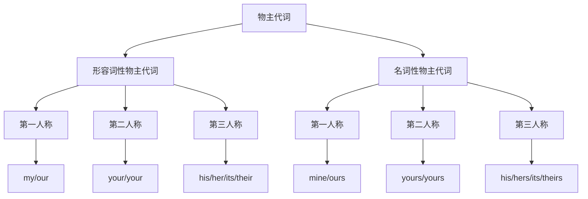

# 物主代词

## 🎯 学习目标
- 掌握物主代词的基本形式和用法
- 理解形容词性物主代词和名词性物主代词的区别
- 熟练运用物主代词的各种变化

## 📚 基本概念

### 物主代词（Possessive Pronouns）
**定义**：用来表示所有关系的代词

### 基本特征
- 有人称、数的变化
- 分为形容词性和名词性两种
- 在句中可作定语、表语、主语、宾语

## 🏠 物主代词分类

## 📊 物主代词变化表

### 完整变化表
| 人称 | 数 | 形容词性物主代词 | 名词性物主代词 |
|------|----|------------------|----------------|
| 第一人称 | 单数 | my | mine |
| 第一人称 | 复数 | our | ours |
| 第二人称 | 单数 | your | yours |
| 第二人称 | 复数 | your | yours |
| 第三人称 | 单数 | his | his |
| 第三人称 | 单数 | her | hers |
| 第三人称 | 单数 | its | its |
| 第三人称 | 复数 | their | theirs |

## 🎯 形容词性物主代词

### 基本特征
- 必须与名词连用
- 不能单独使用
- 在句中作定语

### 用法示例
| 人称 | 形容词性物主代词 | 示例 | 说明 |
|------|------------------|------|------|
| 第一人称单数 | my | my book | 我的书 |
| 第一人称复数 | our | our school | 我们的学校 |
| 第二人称单数 | your | your car | 你的车 |
| 第二人称复数 | your | your family | 你们的家庭 |
| 第三人称单数 | his | his house | 他的房子 |
| 第三人称单数 | her | her bag | 她的包 |
| 第三人称单数 | its | its tail | 它的尾巴 |
| 第三人称复数 | their | their home | 他们的家 |

### 语法功能
**1. 作定语**
- ✅ This is my book. (这是我的书)
- ✅ That is your car. (那是你的车)
- ✅ This is his house. (这是他的房子)
- ✅ That is her bag. (那是她的包)

**2. 修饰名词短语**
- ✅ my best friend (我最好的朋友)
- ✅ your new car (你的新车)
- ✅ his old house (他的老房子)
- ✅ her beautiful dress (她美丽的裙子)

## 🎯 名词性物主代词

### 基本特征
- 可以单独使用
- 不需要与名词连用
- 在句中可作主语、宾语、表语

### 用法示例
| 人称 | 名词性物主代词 | 示例 | 说明 |
|------|----------------|------|------|
| 第一人称单数 | mine | This book is mine. | 这本书是我的 |
| 第一人称复数 | ours | That school is ours. | 那所学校是我们的 |
| 第二人称单数 | yours | This car is yours. | 这辆车是你的 |
| 第二人称复数 | yours | That family is yours. | 那个家庭是你们的 |
| 第三人称单数 | his | This house is his. | 这座房子是他的 |
| 第三人称单数 | hers | That bag is hers. | 那个包是她的 |
| 第三人称单数 | its | This tail is its. | 这个尾巴是它的 |
| 第三人称复数 | theirs | That home is theirs. | 那个家是他们的 |

### 语法功能
**1. 作主语**
- ✅ Mine is red. (我的是红色的)
- ✅ Yours is blue. (你的是蓝色的)
- ✅ His is green. (他的是绿色的)
- ✅ Hers is yellow. (她的是黄色的)

**2. 作宾语**
- ✅ I like yours. (我喜欢你的)
- ✅ He wants mine. (他想要我的)
- ✅ She takes his. (她拿他的)
- ✅ We prefer theirs. (我们更喜欢他们的)

**3. 作表语**
- ✅ This book is mine. (这本书是我的)
- ✅ That car is yours. (那辆车是你的)
- ✅ This house is his. (这座房子是他的)
- ✅ That bag is hers. (那个包是她的)

## 🔄 两种物主代词的区别

### 1. 语法功能区别
| 功能 | 形容词性物主代词 | 名词性物主代词 |
|------|------------------|----------------|
| 作定语 | ✅ | ❌ |
| 作主语 | ❌ | ✅ |
| 作宾语 | ❌ | ✅ |
| 作表语 | ❌ | ✅ |

### 2. 使用方式区别
| 使用方式 | 形容词性物主代词 | 名词性物主代词 |
|----------|------------------|----------------|
| 与名词连用 | ✅ | ❌ |
| 单独使用 | ❌ | ✅ |
| 代替名词 | ❌ | ✅ |

### 3. 示例对比
| 形容词性物主代词 | 名词性物主代词 | 说明 |
|------------------|----------------|------|
| my book | This book is mine. | 我的书 vs 这本书是我的 |
| your car | That car is yours. | 你的车 vs 那辆车是你的 |
| his house | This house is his. | 他的房子 vs 这座房子是他的 |
| her bag | That bag is hers. | 她的包 vs 那个包是她的 |

## 📝 使用规则

### 1. 形容词性物主代词规则
- 必须与名词连用
- 在句中作定语
- 不能单独使用

### 2. 名词性物主代词规则
- 可以单独使用
- 在句中作主语、宾语、表语
- 代替名词使用

### 3. 选择规则
- 需要修饰名词时用形容词性物主代词
- 需要代替名词时用名词性物主代词
- 注意语法功能的一致性

## 🚫 常见错误分析

### 错误类型1：形容词性物主代词单独使用
**错误**：❌ This book is my.
**正确**：✅ This book is mine.
**分析**：形容词性物主代词不能单独使用

### 错误类型2：名词性物主代词与名词连用
**错误**：❌ This is mine book.
**正确**：✅ This is my book.
**分析**：名词性物主代词不能与名词连用

### 错误类型3：物主代词形式错误
**错误**：❌ This is her's.
**正确**：✅ This is hers.
**分析**：名词性物主代词hers没有撇号

### 错误类型4：物主代词与名词所有格混淆
**错误**：❌ This is John's.
**正确**：✅ This is John's book.
**分析**：名词所有格需要与名词连用

## 📊 物主代词与名词所有格对比

| 表达方式 | 示例 | 说明 |
|----------|------|------|
| 形容词性物主代词 | my book | 我的书 |
| 名词性物主代词 | This book is mine. | 这本书是我的 |
| 名词所有格 | John's book | 约翰的书 |
| 双重所有格 | a friend of mine | 我的一个朋友 |

## 🎯 特殊用法

### 1. 双重所有格
**结构**：名词 + of + 名词性物主代词

**示例**：
- ✅ a friend of mine (我的一个朋友)
- ✅ a book of yours (你的一本书)
- ✅ a car of his (他的一辆车)
- ✅ a dress of hers (她的一条裙子)

**用法说明**：
- 表示"其中之一"的概念
- 避免与the连用
- 常用于表示部分关系

### 2. 固定搭配
**示例**：
- ✅ on my own (独自)
- ✅ of your own (你自己的)
- ✅ in his own way (以他自己的方式)
- ✅ for her own good (为了她好)

### 3. 省略用法
**示例**：
- ✅ My book is red. (我的书是红色的)
- ✅ Yours is blue. (你的是蓝色的)
- ✅ His is green. (他的是绿色的)
- ✅ Hers is yellow. (她的是黄色的)

## 🔗 相关链接
- [[01-人称代词]]：人称代词的基本用法
- [[03-指示代词]]：指示代词的使用
- [[04-疑问代词]]：疑问代词的用法
- [[05-关系代词]]：关系代词的使用
- [[06-不定代词]]：不定代词的用法
- [[07-代词易混点辨析]]：常见错误分析
- [[01-基本成分]]：代词在句子中的作用

## 💡 记忆口诀

**物主代词记忆法**：
- 形容词性物主代词，必须与名词连用
- 名词性物主代词，可以单独使用
- 作定语用形容词性，作主宾表用名词性
- 双重所有格要记牢，of加名词性物主代词
- 固定搭配要掌握，省略用法要熟练

---
*掌握物主代词是语法学习的重要基础，需要大量练习才能熟练运用*
