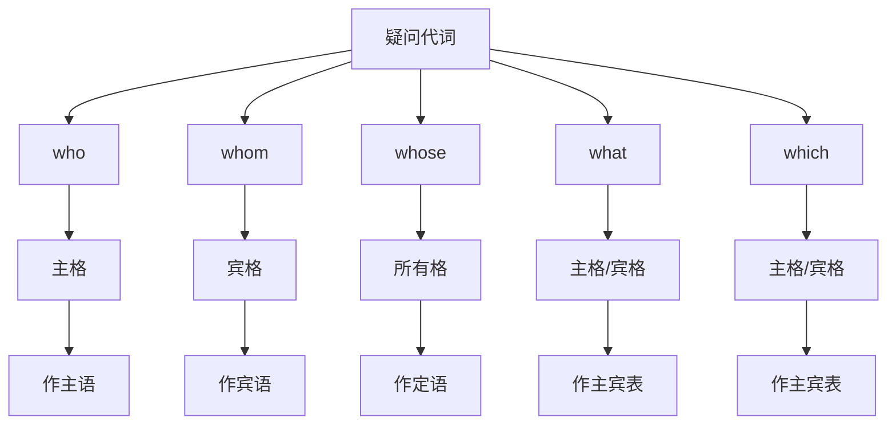

# 疑问代词

## 🎯 学习目标
- 掌握疑问代词的基本形式和用法
- 理解疑问代词在疑问句中的作用
- 熟练运用疑问代词的各种变化

## 📚 基本概念

### 疑问代词（Interrogative Pronouns）
**定义**：用来构成疑问句的代词

### 基本特征
- 用来询问人或事物
- 在疑问句中作主语、宾语、表语、定语
- 有主格、宾格、所有格的变化

## ❓ 疑问代词分类

## 📊 疑问代词变化表

### 基本变化表
| 疑问代词 | 主格 | 宾格 | 所有格 | 说明 |
|----------|------|------|--------|------|
| who | who | whom | whose | 谁 |
| what | what | what | - | 什么 |
| which | which | which | - | 哪一个 |
| whose | whose | whose | whose | 谁的 |

## 🎯 基本用法

### 1. who的用法
**功能**：询问人，作主语

**示例**：
- ✅ Who is that man? (那个人是谁？)
- ✅ Who are you? (你是谁？)
- ✅ Who is coming? (谁要来？)
- ✅ Who did it? (谁做的？)

**语法特点**：
- 作主语时用who
- 作宾语时用whom（正式语体）
- 作宾语时用who（非正式语体）

### 2. whom的用法
**功能**：询问人，作宾语

**示例**：
- ✅ Whom did you see? (你看见谁了？)
- ✅ Whom are you talking to? (你在和谁说话？)
- ✅ Whom do you like? (你喜欢谁？)
- ✅ Whom did you give it to? (你把它给谁了？)

**语法特点**：
- 作宾语时用whom（正式语体）
- 作宾语时用who（非正式语体）
- 在介词后必须用whom

### 3. whose的用法
**功能**：询问所有关系，作定语

**示例**：
- ✅ Whose book is this? (这是谁的书？)
- ✅ Whose car is that? (那是谁的车？)
- ✅ Whose house is big? (谁的房子很大？)
- ✅ Whose bag is red? (谁的包是红色的？)

**语法特点**：
- 作定语时用whose
- 可以修饰单数或复数名词
- 相当于疑问词+所有格

### 4. what的用法
**功能**：询问事物，作主语、宾语、表语

**示例**：
- ✅ What is this? (这是什么？)
- ✅ What do you want? (你想要什么？)
- ✅ What is your name? (你叫什么名字？)
- ✅ What are you doing? (你在做什么？)

**语法特点**：
- 可以作主语、宾语、表语
- 可以修饰名词作定语
- 可以询问职业、身份等

### 5. which的用法
**功能**：询问选择，作主语、宾语、表语

**示例**：
- ✅ Which is better? (哪一个更好？)
- ✅ Which do you prefer? (你更喜欢哪一个？)
- ✅ Which book is yours? (哪本书是你的？)
- ✅ Which car is faster? (哪辆车更快？)

**语法特点**：
- 可以作主语、宾语、表语
- 可以修饰名词作定语
- 表示从已知选项中选择

## 🔄 疑问代词的选择

### 1. 询问人的选择
| 情况 | 疑问代词 | 示例 | 说明 |
|------|----------|------|------|
| 作主语 | who | Who is he? | 他是谁？ |
| 作宾语（正式） | whom | Whom did you see? | 你看见谁了？ |
| 作宾语（非正式） | who | Who did you see? | 你看见谁了？ |
| 作定语 | whose | Whose book is this? | 这是谁的书？ |

### 2. 询问事物的选择
| 情况 | 疑问代词 | 示例 | 说明 |
|------|----------|------|------|
| 作主语 | what | What is this? | 这是什么？ |
| 作宾语 | what | What do you want? | 你想要什么？ |
| 作表语 | what | What is your job? | 你的工作是什么？ |
| 作定语 | what | What book do you like? | 你喜欢什么书？ |

### 3. 询问选择的选择
| 情况 | 疑问代词 | 示例 | 说明 |
|------|----------|------|------|
| 作主语 | which | Which is better? | 哪一个更好？ |
| 作宾语 | which | Which do you prefer? | 你更喜欢哪一个？ |
| 作表语 | which | Which is yours? | 哪一个是你的？ |
| 作定语 | which | Which book is yours? | 哪本书是你的？ |

## 📝 使用规则

### 1. 主格宾格规则
- 作主语时用主格
- 作宾语时用宾格（正式语体）
- 作宾语时用主格（非正式语体）

### 2. 所有格规则
- 作定语时用所有格
- 可以修饰单数或复数名词
- 相当于疑问词+所有格

### 3. 选择规则
- 询问人用who/whom/whose
- 询问事物用what
- 询问选择用which

## 🚫 常见错误分析

### 错误类型1：主格宾格混用
**错误**：❌ Whom is he?
**正确**：✅ Who is he?
**分析**：作主语时用who

### 错误类型2：所有格使用错误
**错误**：❌ Who book is this?
**正确**：✅ Whose book is this?
**分析**：询问所有关系用whose

### 错误类型3：疑问代词选择错误
**错误**：❌ What is your name?
**正确**：✅ What is your name?
**分析**：询问姓名用what

### 错误类型4：介词后疑问代词错误
**错误**：❌ To who did you give it?
**正确**：✅ To whom did you give it?
**分析**：介词后必须用whom

## 📊 疑问代词功能对比表

| 功能 | who | whom | whose | what | which |
|------|-----|------|-------|------|-------|
| 作主语 | ✅ | ❌ | ❌ | ✅ | ✅ |
| 作宾语 | ✅ | ✅ | ❌ | ✅ | ✅ |
| 作表语 | ✅ | ❌ | ❌ | ✅ | ✅ |
| 作定语 | ❌ | ❌ | ✅ | ✅ | ✅ |

## 🎯 特殊用法

### 1. 疑问代词+ever
**结构**：疑问代词+ever

**示例**：
- ✅ Whoever did this? (到底是谁做的？)
- ✅ Whatever do you want? (你到底想要什么？)
- ✅ Whichever is better? (到底哪一个更好？)
- ✅ Whosever book is this? (这到底是谁的书？)

**用法说明**：
- 表示强调
- 相当于"到底"
- 语气更强烈

### 2. 疑问代词作关系代词
**结构**：疑问代词引导定语从句

**示例**：
- ✅ I know who did it. (我知道是谁做的)
- ✅ I see what you mean. (我明白你的意思)
- ✅ I understand which is better. (我明白哪一个更好)
- ✅ I know whose book it is. (我知道这是谁的书)

**用法说明**：
- 在宾语从句中作关系代词
- 保持疑问代词的语法功能
- 注意主谓一致

### 3. 疑问代词的省略
**结构**：在特定语境下省略疑问代词

**示例**：
- ✅ What? (什么？)
- ✅ Who? (谁？)
- ✅ Which? (哪一个？)
- ✅ Whose? (谁的？)

**用法说明**：
- 在口语中常用
- 表示惊讶或疑问
- 需要语境支持

## 🔗 相关链接
- [[01-人称代词]]：人称代词的基本用法
- [[02-物主代词]]：物主代词的使用
- [[03-指示代词]]：指示代词的使用
- [[05-关系代词]]：关系代词的使用
- [[06-不定代词]]：不定代词的用法
- [[07-代词易混点辨析]]：常见错误分析
- [[01-基本成分]]：代词在句子中的作用

## 💡 记忆口诀

**疑问代词记忆法**：
- 询问人用who/whom/whose，询问物用what
- 询问选择用which，询问所有用whose
- 作主语用who，作宾语用whom
- 作定语用whose，作主宾表用what/which
- 介词后必须用whom，口语中可用who

---
*掌握疑问代词是语法学习的重要基础，需要大量练习才能熟练运用*
