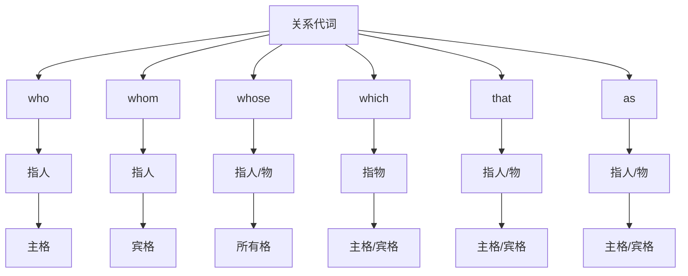

# 关系代词

## 🎯 学习目标
- 掌握关系代词的基本形式和用法
- 理解关系代词在定语从句中的作用
- 熟练运用关系代词的各种变化

## 📚 基本概念

### 关系代词（Relative Pronouns）
**定义**：用来引导定语从句的代词

### 基本特征
- 连接主句和定语从句
- 在定语从句中作主语、宾语、表语、定语
- 有主格、宾格、所有格的变化

## 🔗 关系代词分类

## 📊 关系代词变化表

### 基本变化表
| 关系代词 | 主格 | 宾格 | 所有格 | 指代对象 |
|----------|------|------|--------|----------|
| who | who | whom | whose | 人 |
| which | which | which | whose/of which | 物 |
| that | that | that | - | 人/物 |
| as | as | as | - | 人/物 |

## 🎯 基本用法

### 1. who的用法
**功能**：指人，在定语从句中作主语

**示例**：
- ✅ The man who is talking is my teacher. (正在说话的那个人是我的老师)
- ✅ The student who studies hard will succeed. (努力学习的学生会成功)
- ✅ The doctor who saved my life is here. (救了我命的医生在这里)
- ✅ The teacher who teaches English is kind. (教英语的老师很善良)

**语法特点**：
- 指人
- 在定语从句中作主语
- 不能省略

### 2. whom的用法
**功能**：指人，在定语从句中作宾语

**示例**：
- ✅ The man whom I met yesterday is my friend. (我昨天遇见的那个人是我的朋友)
- ✅ The student whom you helped is grateful. (你帮助的那个学生很感激)
- ✅ The doctor whom we visited is famous. (我们拜访的那个医生很有名)
- ✅ The teacher whom we respect is wise. (我们尊敬的那个老师很聪明)

**语法特点**：
- 指人
- 在定语从句中作宾语
- 可以省略（非正式语体）

### 3. whose的用法
**功能**：指人或物，在定语从句中作定语

**示例**：
- ✅ The man whose car is red is my neighbor. (车是红色的那个人是我的邻居)
- ✅ The student whose grades are good is smart. (成绩好的那个学生很聪明)
- ✅ The book whose cover is torn is old. (封面破了的书很旧)
- ✅ The house whose roof is blue is beautiful. (屋顶是蓝色的房子很美丽)

**语法特点**：
- 指人或物
- 在定语从句中作定语
- 不能省略

### 4. which的用法
**功能**：指物，在定语从句中作主语、宾语

**示例**：
- ✅ The book which is on the table is mine. (桌子上的书是我的)
- ✅ The car which I bought is expensive. (我买的车很贵)
- ✅ The house which we live in is big. (我们住的房子很大)
- ✅ The computer which works well is new. (运行良好的电脑是新的)

**语法特点**：
- 指物
- 在定语从句中作主语、宾语
- 作宾语时可以省略

### 5. that的用法
**功能**：指人或物，在定语从句中作主语、宾语

**示例**：
- ✅ The man that is talking is my teacher. (正在说话的那个人是我的老师)
- ✅ The book that I read is interesting. (我读的书很有趣)
- ✅ The car that we bought is red. (我们买的车是红色的)
- ✅ The house that has a garden is beautiful. (有花园的房子很美丽)

**语法特点**：
- 指人或物
- 在定语从句中作主语、宾语
- 作宾语时可以省略

## 🔄 关系代词的选择

### 1. 指人的选择
| 情况 | 关系代词 | 示例 | 说明 |
|------|----------|------|------|
| 作主语 | who/that | The man who/that is tall | 高的人 |
| 作宾语 | whom/that | The man whom/that I met | 我遇见的人 |
| 作定语 | whose | The man whose car is red | 车是红色的人 |

### 2. 指物的选择
| 情况 | 关系代词 | 示例 | 说明 |
|------|----------|------|------|
| 作主语 | which/that | The book which/that is red | 红色的书 |
| 作宾语 | which/that | The book which/that I read | 我读的书 |
| 作定语 | whose/of which | The book whose cover is torn | 封面破了的书 |

### 3. 选择规则
- 指人：作主语用who/that，作宾语用whom/that，作定语用whose
- 指物：作主语用which/that，作宾语用which/that，作定语用whose/of which
- 非限制性定语从句：指人用who/whom/whose，指物用which

## 📝 使用规则

### 1. 主格宾格规则
- 作主语时用主格
- 作宾语时用宾格
- 作定语时用所有格

### 2. 指代规则
- 指人用who/whom/whose
- 指物用which/whose/of which
- 指人或物用that

### 3. 省略规则
- 作宾语时可以省略
- 作主语时不能省略
- 作定语时不能省略

## 🚫 常见错误分析

### 错误类型1：关系代词选择错误
**错误**：❌ The man which is tall is my friend.
**正确**：✅ The man who is tall is my friend.
**分析**：指人用who，指物用which

### 错误类型2：主格宾格混用
**错误**：❌ The man whom is talking is my teacher.
**正确**：✅ The man who is talking is my teacher.
**分析**：作主语时用who

### 错误类型3：所有格使用错误
**错误**：❌ The man who car is red is my neighbor.
**正确**：✅ The man whose car is red is my neighbor.
**分析**：作定语时用whose

### 错误类型4：关系代词省略错误
**错误**：❌ The man is talking is my teacher.
**正确**：✅ The man who is talking is my teacher.
**分析**：作主语时不能省略关系代词

## 📊 关系代词功能对比表

| 功能 | who | whom | whose | which | that |
|------|-----|------|-------|-------|------|
| 指人 | ✅ | ✅ | ✅ | ❌ | ✅ |
| 指物 | ❌ | ❌ | ✅ | ✅ | ✅ |
| 作主语 | ✅ | ❌ | ❌ | ✅ | ✅ |
| 作宾语 | ✅ | ✅ | ❌ | ✅ | ✅ |
| 作定语 | ❌ | ❌ | ✅ | ❌ | ❌ |

## 🎯 特殊用法

### 1. 非限制性定语从句
**结构**：用逗号隔开的定语从句

**示例**：
- ✅ My father, who is a doctor, is kind. (我父亲是医生，他很善良)
- ✅ The book, which is interesting, is mine. (这本书很有趣，它是我的)
- ✅ The car, whose color is red, is expensive. (这辆车是红色的，它很贵)

**用法说明**：
- 用逗号隔开
- 指人用who/whom/whose
- 指物用which
- 不能省略关系代词

### 2. 介词+关系代词
**结构**：介词+关系代词

**示例**：
- ✅ The man with whom I talked is my teacher. (和我谈话的那个人是我的老师)
- ✅ The book about which we talked is interesting. (我们谈论的那本书很有趣)
- ✅ The house in which we live is big. (我们住的房子很大)

**用法说明**：
- 介词后必须用whom/which
- 不能省略关系代词
- 介词可以放在句末

### 3. 关系代词as的用法
**结构**：as引导定语从句

**示例**：
- ✅ Such books as you mentioned are useful. (你提到的那些书很有用)
- ✅ The same problem as we faced is difficult. (我们面临的同样问题很困难)
- ✅ As is known to all, English is important. (众所周知，英语很重要)

**用法说明**：
- 与such/same连用
- 可以指人或物
- 在从句中作主语、宾语

## 🔗 相关链接
- [[01-人称代词]]：人称代词的基本用法
- [[02-物主代词]]：物主代词的使用
- [[03-指示代词]]：指示代词的使用
- [[04-疑问代词]]：疑问代词的用法
- [[06-不定代词]]：不定代词的用法
- [[07-代词易混点辨析]]：常见错误分析
- [[01-基本成分]]：代词在句子中的作用

## 💡 记忆口诀

**关系代词记忆法**：
- 指人用who/whom/whose，指物用which/that
- 作主语用who/which/that，作宾语用whom/which/that
- 作定语用whose，介词后用whom/which
- 非限制性用逗号，关系代词不能省
- 选择规则要记牢，主谓一致要正确

---
*掌握关系代词是语法学习的重要基础，需要大量练习才能熟练运用*
