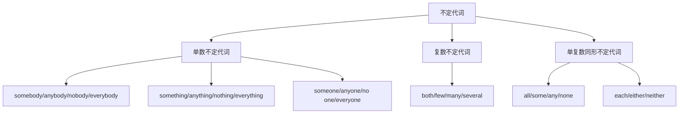

# 不定代词

## 🎯 学习目标
- 掌握不定代词的基本形式和用法
- 理解不定代词的数量和范围概念
- 熟练运用不定代词的各种变化

## 📚 基本概念

### 不定代词（Indefinite Pronouns）
**定义**：用来指代不特定的人或事物的代词

### 基本特征
- 表示不确定的数量或范围
- 在句中可作主语、宾语、表语、定语
- 有单数、复数、单复数同形的变化

## 🔢 不定代词分类

## 📊 不定代词变化表

### 基本变化表
| 类型 | 不定代词 | 说明 |
|------|----------|------|
| 单数 | somebody, anyone, nothing, everyone | 单数概念 |
| 复数 | both, few, many, several | 复数概念 |
| 单复数同形 | all, some, any, none | 根据语境判断 |

## 🎯 单数不定代词

### 1. somebody/someone的用法
**功能**：表示"某人"，用于肯定句

**示例**：
- ✅ Somebody is knocking at the door. (有人在敲门)
- ✅ Someone called you yesterday. (昨天有人给你打电话)
- ✅ I need somebody to help me. (我需要有人帮助我)
- ✅ Someone is waiting for you. (有人在等你)

**语法特点**：
- 用于肯定句
- 作主语时谓语动词用单数
- 可以作宾语、表语

### 2. anybody/anyone的用法
**功能**：表示"任何人"，用于疑问句和否定句

**示例**：
- ✅ Is anybody here? (这里有人吗？)
- ✅ I don't know anyone here. (我不认识这里的任何人)
- ✅ Can anyone help me? (有人能帮助我吗？)
- ✅ I haven't seen anyone today. (我今天没看见任何人)

**语法特点**：
- 用于疑问句和否定句
- 作主语时谓语动词用单数
- 可以作宾语、表语

### 3. nobody/no one的用法
**功能**：表示"没有人"，用于否定句

**示例**：
- ✅ Nobody is here. (这里没有人)
- ✅ No one knows the answer. (没有人知道答案)
- ✅ I saw nobody yesterday. (我昨天没看见任何人)
- ✅ No one can help me. (没有人能帮助我)

**语法特点**：
- 用于否定句
- 作主语时谓语动词用单数
- 可以作宾语、表语

### 4. everybody/everyone的用法
**功能**：表示"每个人"，用于肯定句

**示例**：
- ✅ Everybody is here. (每个人都在这里)
- ✅ Everyone knows the answer. (每个人都知道答案)
- ✅ I like everyone here. (我喜欢这里的每个人)
- ✅ Everyone is happy. (每个人都很高兴)

**语法特点**：
- 用于肯定句
- 作主语时谓语动词用单数
- 可以作宾语、表语

## 🎯 复数不定代词

### 1. both的用法
**功能**：表示"两者都"

**示例**：
- ✅ Both are correct. (两者都对)
- ✅ I like both. (我两个都喜欢)
- ✅ Both of them are students. (他们俩都是学生)
- ✅ Both books are interesting. (两本书都很有趣)

**语法特点**：
- 指两者
- 作主语时谓语动词用复数
- 可以作宾语、定语

### 2. few的用法
**功能**：表示"很少，几乎没有"

**示例**：
- ✅ Few are here. (很少有人在这里)
- ✅ I have few friends. (我朋友很少)
- ✅ Few of them are students. (他们中很少有人是学生)
- ✅ Few books are interesting. (很少有书有趣)

**语法特点**：
- 表示否定概念
- 作主语时谓语动词用复数
- 可以作宾语、定语

### 3. many的用法
**功能**：表示"很多"

**示例**：
- ✅ Many are here. (很多人在这里)
- ✅ I have many friends. (我有很多朋友)
- ✅ Many of them are students. (他们中很多是学生)
- ✅ Many books are interesting. (很多书都很有趣)

**语法特点**：
- 表示肯定概念
- 作主语时谓语动词用复数
- 可以作宾语、定语

### 4. several的用法
**功能**：表示"几个"

**示例**：
- ✅ Several are here. (几个人在这里)
- ✅ I have several friends. (我有几个朋友)
- ✅ Several of them are students. (他们中几个是学生)
- ✅ Several books are interesting. (几本书都很有趣)

**语法特点**：
- 表示不确定的数量
- 作主语时谓语动词用复数
- 可以作宾语、定语

## 🎯 单复数同形不定代词

### 1. all的用法
**功能**：表示"全部，所有"

**示例**：
- ✅ All are here. (所有人都在这里)
- ✅ All is ready. (一切都准备好了)
- ✅ I like all of them. (我喜欢他们所有人)
- ✅ All books are interesting. (所有书都很有趣)

**语法特点**：
- 根据语境判断单复数
- 指人时用复数，指物时用单数
- 可以作主语、宾语、定语

### 2. some的用法
**功能**：表示"一些"

**示例**：
- ✅ Some are here. (一些人在那里)
- ✅ Some is left. (还有一些剩余)
- ✅ I need some help. (我需要一些帮助)
- ✅ Some books are interesting. (一些书很有趣)

**语法特点**：
- 根据语境判断单复数
- 指人时用复数，指物时用单数
- 可以作主语、宾语、定语

### 3. any的用法
**功能**：表示"任何"

**示例**：
- ✅ Any are welcome. (任何人都受欢迎)
- ✅ Any is fine. (任何都可以)
- ✅ I don't have any money. (我没有钱)
- ✅ Any book is fine. (任何书都可以)

**语法特点**：
- 根据语境判断单复数
- 用于疑问句和否定句
- 可以作主语、宾语、定语

### 4. none的用法
**功能**：表示"没有"

**示例**：
- ✅ None are here. (没有人在这里)
- ✅ None is left. (没有剩余)
- ✅ I have none. (我没有)
- ✅ None of the books are interesting. (没有书有趣)

**语法特点**：
- 根据语境判断单复数
- 表示否定概念
- 可以作主语、宾语

## 📝 使用规则

### 1. 单复数规则
- 单数不定代词：作主语时谓语动词用单数
- 复数不定代词：作主语时谓语动词用复数
- 单复数同形：根据语境判断

### 2. 肯定否定规则
- 肯定句：用somebody, someone, everybody, everyone
- 疑问句：用anybody, anyone
- 否定句：用nobody, no one, anybody, anyone

### 3. 数量规则
- 两者：用both
- 少量：用few
- 大量：用many
- 几个：用several

## 🚫 常见错误分析

### 错误类型1：主谓不一致
**错误**：❌ Everybody are here.
**正确**：✅ Everybody is here.
**分析**：单数不定代词作主语时谓语动词用单数

### 错误类型2：肯定否定混用
**错误**：❌ I don't know somebody.
**正确**：✅ I don't know anybody.
**分析**：否定句中用anybody

### 错误类型3：数量概念错误
**错误**：❌ Both of them is correct.
**正确**：✅ Both of them are correct.
**分析**：both指两者，谓语动词用复数

### 错误类型4：单复数判断错误
**错误**：❌ All is students.
**正确**：✅ All are students.
**分析**：指人时all用复数

## 📊 不定代词功能对比表

| 不定代词 | 单复数 | 肯定/否定 | 数量概念 | 示例 |
|----------|--------|------------|----------|------|
| somebody | 单数 | 肯定 | 不确定 | Somebody is here. |
| anybody | 单数 | 疑问/否定 | 不确定 | Is anybody here? |
| nobody | 单数 | 否定 | 没有 | Nobody is here. |
| everybody | 单数 | 肯定 | 全部 | Everybody is here. |
| both | 复数 | 肯定 | 两者 | Both are correct. |
| few | 复数 | 否定 | 很少 | Few are here. |
| many | 复数 | 肯定 | 很多 | Many are here. |
| several | 复数 | 肯定 | 几个 | Several are here. |
| all | 单复数 | 肯定 | 全部 | All are here. |
| some | 单复数 | 肯定 | 一些 | Some are here. |
| any | 单复数 | 疑问/否定 | 任何 | Is any here? |
| none | 单复数 | 否定 | 没有 | None are here. |

## 🎯 特殊用法

### 1. 不定代词+of结构
**结构**：不定代词+of+名词/代词

**示例**：
- ✅ Some of them are students. (他们中一些是学生)
- ✅ Many of the books are interesting. (很多书都很有趣)
- ✅ All of us are here. (我们所有人都在这里)
- ✅ None of them are correct. (他们中没有一个是正确的)

**用法说明**：
- 表示部分关系
- 注意主谓一致
- 可以指人或物

### 2. 不定代词作定语
**结构**：不定代词+名词

**示例**：
- ✅ Some books are interesting. (一些书很有趣)
- ✅ Many students are here. (很多学生在这里)
- ✅ All people are equal. (所有人都是平等的)
- ✅ Few problems are difficult. (很少有问题困难)

**用法说明**：
- 修饰名词
- 注意单复数一致
- 可以指人或物

### 3. 不定代词的省略
**结构**：在特定语境下省略不定代词

**示例**：
- ✅ Some are here. (一些在这里)
- ✅ Many are students. (很多是学生)
- ✅ All are welcome. (所有人都受欢迎)
- ✅ None are correct. (没有一个是正确的)

**用法说明**：
- 在口语中常用
- 需要语境支持
- 注意主谓一致

## 🔗 相关链接
- [[01-人称代词]]：人称代词的基本用法
- [[02-物主代词]]：物主代词的使用
- [[03-指示代词]]：指示代词的使用
- [[04-疑问代词]]：疑问代词的用法
- [[05-关系代词]]：关系代词的使用
- [[07-代词易混点辨析]]：常见错误分析
- [[01-基本成分]]：代词在句子中的作用

## 💡 记忆口诀

**不定代词记忆法**：
- 单数不定代词用单数动词，复数不定代词用复数动词
- 肯定句用somebody/everybody，疑问否定句用anybody/nobody
- 两者用both，少量用few，大量用many，几个用several
- 全部用all，一些用some，任何用any，没有用none
- 主谓一致要记牢，数量概念要准确

---
*掌握不定代词是语法学习的重要基础，需要大量练习才能熟练运用*
