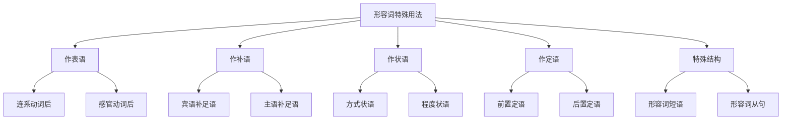

# 形容词特殊用法

## 🎯 学习目标
- 掌握形容词的特殊用法和规则
- 理解形容词的特殊语法功能
- 熟练运用形容词的各种特殊形式

## 📚 基本概念

### 形容词特殊用法（Special Uses of Adjectives）
**定义**：形容词在特定语境下的特殊使用方法和规则

### 基本特征
- 有特殊的语法功能
- 有特殊的用法规则
- 有特殊的语法意义
- 需要特殊记忆

## 🔄 形容词特殊用法分类

## 🎯 形容词作表语

### 1. 连系动词后作表语
**定义**：形容词在连系动词后作表语

**特征**：
- 在连系动词后
- 作表语
- 说明主语
- 位置固定

**示例**：
- ✅ The book is interesting. (书很有趣)
- ✅ The car is expensive. (车很贵)
- ✅ The house is big. (房子很大)
- ✅ The food is delicious. (食物很美味)
- ✅ The weather is nice. (天气很好)
- ✅ The music is beautiful. (音乐很美)

**语法特点**：
- 在连系动词后
- 作表语
- 说明主语
- 位置固定

### 2. 感官动词后作表语
**定义**：形容词在感官动词后作表语

**特征**：
- 在感官动词后
- 作表语
- 说明宾语
- 位置固定

**示例**：
- ✅ The food tastes good. (食物尝起来很好)
- ✅ The music sounds beautiful. (音乐听起来很美)
- ✅ The flower smells sweet. (花闻起来很香)
- ✅ The cloth feels soft. (布料摸起来很软)
- ✅ The picture looks nice. (图片看起来很好)
- ✅ The room appears clean. (房间看起来很干净)

**语法特点**：
- 在感官动词后
- 作表语
- 说明宾语
- 位置固定

## 🎯 形容词作补语

### 1. 宾语补足语
**定义**：形容词在宾语后作补语

**特征**：
- 在宾语后
- 作补语
- 说明宾语
- 位置固定

**示例**：
- ✅ I find the book interesting. (我发现书很有趣)
- ✅ I consider the car expensive. (我认为车很贵)
- ✅ I think the house big. (我认为房子很大)
- ✅ I believe the food delicious. (我相信食物很美味)
- ✅ I suppose the weather nice. (我猜想天气很好)
- ✅ I imagine the music beautiful. (我想象音乐很美)

**语法特点**：
- 在宾语后
- 作补语
- 说明宾语
- 位置固定

### 2. 主语补足语
**定义**：形容词在主语后作补语

**特征**：
- 在主语后
- 作补语
- 说明主语
- 位置固定

**示例**：
- ✅ The book is found interesting. (书被发现很有趣)
- ✅ The car is considered expensive. (车被认为很贵)
- ✅ The house is thought big. (房子被认为很大)
- ✅ The food is believed delicious. (食物被认为很美味)
- ✅ The weather is supposed nice. (天气被认为很好)
- ✅ The music is imagined beautiful. (音乐被认为很美)

**语法特点**：
- 在主语后
- 作补语
- 说明主语
- 位置固定

## 🎯 形容词作状语

### 1. 方式状语
**定义**：形容词表示动作的方式

**特征**：
- 表示方式
- 作状语
- 修饰动词
- 位置灵活

**示例**：
- ✅ He walked slow. (他走得很慢)
- ✅ She spoke loud. (她说得很响)
- ✅ He ran fast. (他跑得很快)
- ✅ She sang beautiful. (她唱得很美)
- ✅ He worked hard. (他工作得很努力)
- ✅ She studied careful. (她学习得很仔细)

**语法特点**：
- 表示方式
- 作状语
- 修饰动词
- 位置灵活

### 2. 程度状语
**定义**：形容词表示动作的程度

**特征**：
- 表示程度
- 作状语
- 修饰动词
- 位置灵活

**示例**：
- ✅ He is very tall. (他很高)
- ✅ She is quite beautiful. (她很美)
- ✅ He is rather old. (他相当老)
- ✅ She is extremely smart. (她极其聪明)
- ✅ He is fairly good. (他相当好)
- ✅ She is pretty nice. (她很不错)

**语法特点**：
- 表示程度
- 作状语
- 修饰动词
- 位置灵活

## 🎯 形容词作定语

### 1. 前置定语
**定义**：形容词在名词前作定语

**特征**：
- 在名词前
- 作定语
- 修饰名词
- 位置固定

**示例**：
- ✅ a big house (大房子)
- ✅ a small car (小车)
- ✅ a good book (好书)
- ✅ a bad day (糟糕的一天)
- ✅ a happy child (快乐的孩子)
- ✅ a tired worker (疲惫的工人)

**语法特点**：
- 在名词前
- 作定语
- 修饰名词
- 位置固定

### 2. 后置定语
**定义**：形容词在名词后作定语

**特征**：
- 在名词后
- 作定语
- 修饰名词
- 位置固定

**示例**：
- ✅ something big (大的东西)
- ✅ anything good (好的东西)
- ✅ nothing bad (没有坏的东西)
- ✅ everything possible (一切可能的)
- ✅ someone important (重要的人)
- ✅ anyone interested (感兴趣的人)

**语法特点**：
- 在名词后
- 作定语
- 修饰名词
- 位置固定

## 🎯 形容词特殊结构

### 1. 形容词短语
**定义**：由形容词和修饰语组成的短语

**特征**：
- 由形容词和修饰语组成
- 作定语或表语
- 修饰名词
- 位置灵活

**示例**：
- ✅ a book interesting to read (一本有趣的书)
- ✅ a car expensive to buy (一辆昂贵的车)
- ✅ a house big enough (一座足够大的房子)
- ✅ a child happy to play (一个快乐的孩子)
- ✅ a worker tired from work (一个疲惫的工人)
- ✅ a student eager to learn (一个渴望学习的学生)

**语法特点**：
- 由形容词和修饰语组成
- 作定语或表语
- 修饰名词
- 位置灵活

### 2. 形容词从句
**定义**：由形容词引导的从句

**特征**：
- 由形容词引导
- 作定语
- 修饰名词
- 位置固定

**示例**：
- ✅ a book that is interesting (一本有趣的书)
- ✅ a car that is expensive (一辆昂贵的车)
- ✅ a house that is big (一座大房子)
- ✅ a child who is happy (一个快乐的孩子)
- ✅ a worker who is tired (一个疲惫的工人)
- ✅ a student who is eager (一个渴望学习的学生)

**语法特点**：
- 由形容词引导
- 作定语
- 修饰名词
- 位置固定

## 📊 形容词特殊用法对比表

| 用法 | 位置 | 功能 | 示例 | 说明 |
|------|------|------|------|------|
| 作表语 | 连系动词后 | 说明主语 | The book is interesting. | 在连系动词后 |
| 作表语 | 感官动词后 | 说明宾语 | The food tastes good. | 在感官动词后 |
| 作补语 | 宾语后 | 说明宾语 | I find the book interesting. | 在宾语后 |
| 作补语 | 主语后 | 说明主语 | The book is found interesting. | 在主语后 |
| 作状语 | 动词后 | 修饰动词 | He walked slow. | 修饰动词 |
| 作定语 | 名词前 | 修饰名词 | a big house | 在名词前 |
| 作定语 | 名词后 | 修饰名词 | something big | 在名词后 |

## 🚫 常见错误分析

### 错误类型1：形容词位置错误
**错误**：❌ The book interesting is.
**正确**：✅ The book is interesting.
**分析**：形容词作表语时在连系动词后

### 错误类型2：形容词功能错误
**错误**：❌ I find the book is interesting.
**正确**：✅ I find the book interesting.
**分析**：形容词作宾语补足语时不需要系动词

### 错误类型3：形容词修饰错误
**错误**：❌ He walked slowly.
**正确**：✅ He walked slow.
**分析**：形容词作状语时用形容词形式

### 错误类型4：形容词结构错误
**错误**：❌ a book that interesting
**正确**：✅ a book that is interesting
**分析**：形容词从句需要系动词

## 🔗 相关链接
- [[01-形容词分类与位置]]：形容词的基本分类
- [[02-形容词比较级最高级]]：形容词的比较级和最高级
- [[04-形容词易混点辨析]]：常见错误分析
- [[01-基本成分]]：形容词在句子中的作用

## 💡 记忆口诀

**形容词特殊用法记忆法**：
- 连系动词后作表语，感官动词后作表语
- 宾语后作宾语补足语，主语后作主语补足语
- 动词后作方式状语，程度状语修饰动词
- 名词前作前置定语，名词后作后置定语
- 形容词短语位置灵活，形容词从句位置固定
- 语法功能要分清，位置规则要记牢

---
*掌握形容词特殊用法是语法学习的重要基础，需要大量练习才能熟练运用*
