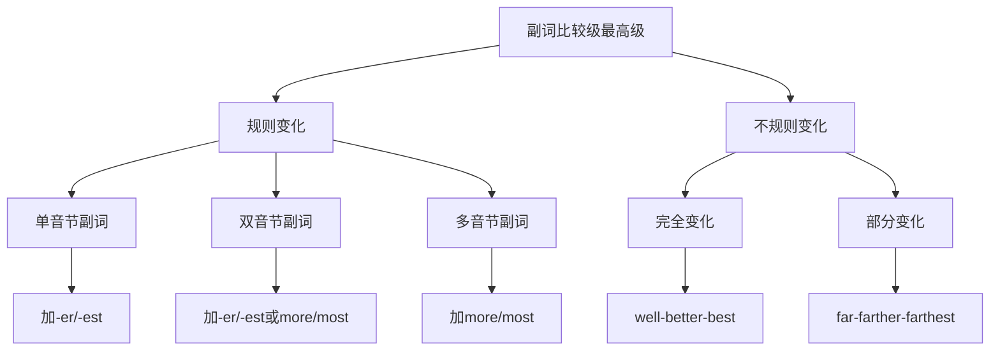

# 副词比较级最高级

## 🎯 学习目标
- 掌握副词比较级和最高级的构成规则
- 理解副词比较级和最高级的用法
- 能够正确使用副词的比较形式

## 📚 核心概念

### 1. 副词比较级最高级的定义
**副词比较级**表示两者之间的比较，**副词最高级**表示三者或三者以上之间的比较。

**基本概念**：
- **原级**: 副词的基本形式
- **比较级**: 表示"更..."的比较形式
- **最高级**: 表示"最..."的最高形式

**例句对比**：
| 比较类型 | 例句 | 说明 |
|----------|------|------|
| **原级** | He runs **fast**. | 基本形式 |
| **比较级** | He runs **faster** than me. | 两者比较 |
| **最高级** | He runs **fastest** of all. | 三者以上比较 |

## 🔍 副词比较级最高级详解

### 2. 构成规则

#### 2.1 规则变化
**构成规律**：
- **单音节副词**: 加-er/-est
- **双音节副词**: 加-er/-est 或 more/most
- **多音节副词**: 加 more/most

**规则变化表**：
| 原级 | 比较级 | 最高级 | 变化规律 |
|------|--------|--------|----------|
| **fast** | **faster** | **fastest** | 加-er/-est |
| **hard** | **harder** | **hardest** | 加-er/-est |
| **late** | **later** | **latest** | 加-er/-est |
| **early** | **earlier** | **earliest** | 加-er/-est |
| **quickly** | **more quickly** | **most quickly** | 加 more/most |
| **carefully** | **more carefully** | **most carefully** | 加 more/most |
| **beautifully** | **more beautifully** | **most beautifully** | 加 more/most |

#### 2.2 不规则变化
**不规则变化表**：
| 原级 | 比较级 | 最高级 | 变化特点 |
|------|--------|--------|----------|
| **well** | **better** | **best** | 完全变化 |
| **badly** | **worse** | **worst** | 完全变化 |
| **much** | **more** | **most** | 完全变化 |
| **little** | **less** | **least** | 完全变化 |
| **far** | **farther/further** | **farthest/furthest** | 两种形式 |

**特殊说明**：
- **far**: farther/farthest 表示距离，further/furthest 表示程度
- **well**: 作为副词时用 better/best，作为形容词时用 good/better/best

#### 2.3 变化规律总结

### 3. 用法规则

#### 3.1 比较级用法
**基本结构**：
- **A + 副词比较级 + than + B**: A比B更...
- **A + 副词比较级 + than + 从句**: A比...更...

**例句分析**：
| 结构 | 例句 | 说明 |
|------|------|------|
| **A + 比较级 + than + B** | He runs **faster** than me. | 两者比较 |
| **A + 比较级 + than + 从句** | He runs **faster** than I do. | 从句比较 |
| **A + 比较级 + than + 时间** | He runs **faster** than before. | 时间比较 |

**特殊用法**：
- **越来越**: 比较级 + and + 比较级
- **越...越**: the + 比较级, the + 比较级

**例句对比**：
| 用法 | 例句 | 说明 |
|------|------|------|
| **越来越** | He runs **faster and faster**. | 程度递增 |
| **越...越** | **The faster** he runs, **the more** tired he gets. | 条件结果 |

#### 3.2 最高级用法
**基本结构**：
- **A + 副词最高级 + of/in + 范围**: 在...范围内最...
- **A + 副词最高级 + 从句**: 在...情况下最...

**例句分析**：
| 结构 | 例句 | 说明 |
|------|------|------|
| **A + 最高级 + of + 范围** | He runs **fastest** of all. | 范围比较 |
| **A + 最高级 + in + 范围** | He runs **fastest** in the class. | 范围比较 |
| **A + 最高级 + 从句** | He runs **fastest** when he is happy. | 条件比较 |

**注意事项**：
- 最高级前通常加 the
- 最高级后通常有比较范围
- 最高级可以单独使用

#### 3.3 原级用法
**基本结构**：
- **as + 副词原级 + as**: 和...一样...
- **not as/so + 副词原级 + as**: 不如...那样...

**例句分析**：
| 结构 | 例句 | 说明 |
|------|------|------|
| **as + 原级 + as** | He runs **as fast as** me. | 同等比较 |
| **not as + 原级 + as** | He doesn't run **as fast as** me. | 否定比较 |
| **not so + 原级 + as** | He doesn't run **so fast as** me. | 否定比较 |

### 4. 特殊用法

#### 4.1 倍数表达
**倍数结构**：
- **A + 倍数 + as + 副词原级 + as + B**: A是B的...倍
- **A + 倍数 + 副词比较级 + than + B**: A比B...倍

**例句对比**：
| 结构 | 例句 | 说明 |
|------|------|------|
| **倍数 + as + 原级 + as** | He runs **twice as fast as** me. | 倍数比较 |
| **倍数 + 比较级 + than** | He runs **twice faster than** me. | 倍数比较 |

#### 4.2 程度修饰
**程度修饰词**：
- **much, far, a lot**: 修饰比较级
- **very, quite, rather**: 修饰原级
- **by far**: 修饰最高级

**例句分析**：
| 修饰词 | 例句 | 说明 |
|--------|------|------|
| **much** | He runs **much faster** than me. | 程度修饰 |
| **far** | He runs **far faster** than me. | 程度修饰 |
| **very** | He runs **very fast**. | 程度修饰 |
| **by far** | He runs **by far the fastest**. | 程度修饰 |

#### 4.3 否定比较
**否定结构**：
- **not as/so + 副词原级 + as**: 不如...那样...
- **less + 副词原级 + than**: 不如...那样...

**例句对比**：
| 结构 | 例句 | 说明 |
|------|------|------|
| **not as + 原级 + as** | He doesn't run **as fast as** me. | 否定比较 |
| **less + 原级 + than** | He runs **less fast than** me. | 否定比较 |

### 5. 常见错误分析

#### 5.1 构成错误
**常见错误**：
- ❌ **more fast** → ✅ **faster**
- ❌ **most fast** → ✅ **fastest**
- ❌ **gooder** → ✅ **better**
- ❌ **badder** → ✅ **worse**

**错误原因**：
- 混淆形容词和副词的比较级
- 不规则变化记忆不准确
- 规则变化应用错误

#### 5.2 用法错误
**常见错误**：
- ❌ **He runs fast than me.** → ✅ **He runs faster than me.**
- ❌ **He runs the fastest than me.** → ✅ **He runs faster than me.**
- ❌ **He runs as faster as me.** → ✅ **He runs as fast as me.**

**错误原因**：
- 比较级和最高级混用
- 比较结构不完整
- 比较对象不明确

## 📊 副词比较级最高级总结表

| 比较类型 | 构成规律 | 基本结构 | 例句 | 注意事项 |
|----------|----------|----------|------|----------|
| **原级** | 基本形式 | as + 原级 + as | He runs **as fast as** me. | 同等比较 |
| **比较级** | 加-er或more | 比较级 + than | He runs **faster** than me. | 两者比较 |
| **最高级** | 加-est或most | 最高级 + of/in | He runs **fastest** of all. | 三者以上比较 |
| **不规则** | 特殊变化 | 特殊形式 | He runs **better** than me. | 记忆特殊形式 |
| **倍数** | 倍数修饰 | 倍数 + 比较形式 | He runs **twice as fast**. | 倍数表达 |

## 🎯 学习要点

### 6. 记忆技巧
1. **规则记忆**: 掌握规则变化规律
2. **特殊记忆**: 重点记忆不规则变化
3. **对比记忆**: 对比形容词和副词的比较级
4. **应用记忆**: 通过应用加深记忆

### 7. 使用技巧
1. **结构完整**: 确保比较结构完整
2. **对象明确**: 明确比较对象
3. **程度适当**: 适当使用程度修饰词
4. **逻辑清晰**: 确保比较逻辑清晰

## 🔗 相关链接
- [[01-副词分类]] - 副词分类详解
- [[02-副词位置规则]] - 副词位置规则
- [[04-副词易混点辨析]] - 副词易混点辨析
- [[02-形容词比较级最高级]] - 形容词比较级

## 📝 练习建议
1. **构成练习**: 练习副词比较级最高级的构成
2. **用法练习**: 练习副词比较级最高级的用法
3. **错误纠正**: 纠正副词比较级最高级的错误
4. **应用练习**: 在实际语境中应用副词比较级最高级

---
*学习建议: 掌握副词比较级最高级是提高英语表达能力的重要技能，要多练习不同形式的比较*
