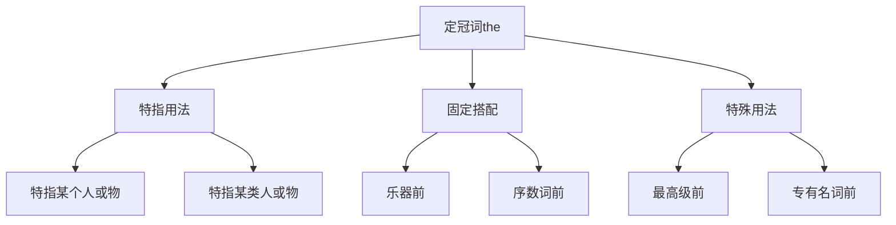

# 定冠词the

## 🎯 学习目标
- 掌握定冠词the的基本概念和用法
- 理解the的使用规则
- 熟练运用定冠词的各种形式

## 📚 基本概念

### 定冠词（Definite Article）
**定义**：用于特指名词的冠词，表示"这个"、"那个"或"这些"、"那些"

### 基本特征
- 用于特指名词
- 表示特指
- 只有the一种形式
- 可用于单数和复数名词

## 🔄 定冠词分类

## 📊 定冠词用法表

### 基本用法表
| 用法 | 示例 | 说明 |
|------|------|------|
| 特指某个人或物 | the book on the table | 特指某个人或物 |
| 特指某类人或物 | the rich, the poor | 特指某类人或物 |
| 乐器前 | play the piano | 乐器前用the |
| 序数词前 | the first, the second | 序数词前用the |
| 最高级前 | the best, the most | 最高级前用the |

## 🎯 特指用法

### 1. 特指某个人或物
**功能**：特指某个人或物

**示例**：
- ✅ The book on the table is mine. (桌子上的书是我的)
- ✅ The car in the garage is red. (车库里的车是红色的)
- ✅ The student in the classroom is Tom. (教室里的学生是汤姆)
- ✅ The house on the hill is beautiful. (山上的房子很美丽)
- ✅ The dog in the garden is sleeping. (花园里的狗在睡觉)

**语法特点**：
- 特指某个人或物
- 有明确的指代对象
- 放在名词前
- 可用于单数和复数

### 2. 特指某类人或物
**功能**：特指某类人或物

**示例**：
- ✅ The rich should help the poor. (富人应该帮助穷人)
- ✅ The young are full of energy. (年轻人充满活力)
- ✅ The old need care. (老人需要照顾)
- ✅ The sick need treatment. (病人需要治疗)
- ✅ The disabled need support. (残疾人需要支持)

**语法特点**：
- 特指某类人或物
- 表示一类人
- 放在形容词前
- 表示复数概念

### 3. 特指上文提到的人或物
**功能**：特指上文提到的人或物

**示例**：
- ✅ I have a book. The book is interesting. (我有一本书。这本书很有趣)
- ✅ She bought a car. The car is expensive. (她买了一辆车。这辆车很贵)
- ✅ He met a girl. The girl is beautiful. (他遇到了一个女孩。这个女孩很美丽)
- ✅ We saw a movie. The movie was good. (我们看了一部电影。这部电影很好)
- ✅ They visited a city. The city is big. (他们访问了一个城市。这个城市很大)

**语法特点**：
- 特指上文提到的人或物
- 有明确的指代对象
- 放在名词前
- 表示特指

## 🎯 固定搭配

### 1. 乐器前
**功能**：乐器前用the

**示例**：
- ✅ I play the piano. (我弹钢琴)
- ✅ She plays the violin. (她拉小提琴)
- ✅ He plays the guitar. (他弹吉他)
- ✅ We play the drums. (我们打鼓)
- ✅ They play the flute. (他们吹长笛)

**语法特点**：
- 乐器前用the
- 表示演奏乐器
- 放在乐器名词前
- 固定搭配

### 2. 序数词前
**功能**：序数词前用the

**示例**：
- ✅ This is the first time. (这是第一次)
- ✅ She is the second student. (她是第二个学生)
- ✅ He is the third person. (他是第三个人)
- ✅ We are the fourth team. (我们是第四队)
- ✅ They are the fifth group. (他们是第五组)

**语法特点**：
- 序数词前用the
- 表示顺序
- 放在序数词前
- 固定搭配

### 3. 最高级前
**功能**：最高级前用the

**示例**：
- ✅ This is the best book. (这是最好的书)
- ✅ She is the most beautiful girl. (她是最美丽的女孩)
- ✅ He is the tallest boy. (他是最高的男孩)
- ✅ We are the most intelligent students. (我们是最聪明的学生)
- ✅ They are the fastest runners. (他们是最快的跑步者)

**语法特点**：
- 最高级前用the
- 表示最高程度
- 放在最高级前
- 固定搭配

## 🎯 特殊用法

### 1. 专有名词前
**功能**：某些专有名词前用the

**示例**：
- ✅ the United States (美国)
- ✅ the United Kingdom (英国)
- ✅ the Pacific Ocean (太平洋)
- ✅ the Great Wall (长城)
- ✅ the White House (白宫)

**语法特点**：
- 某些专有名词前用the
- 表示特指
- 放在专有名词前
- 固定搭配

### 2. 表示方向
**功能**：表示方向

**示例**：
- ✅ The sun rises in the east. (太阳从东方升起)
- ✅ The wind blows from the west. (风从西方吹来)
- ✅ The river flows to the south. (河流向南流)
- ✅ The mountain is in the north. (山在北方)
- ✅ The city is in the center. (城市在中心)

**语法特点**：
- 表示方向
- 放在方向名词前
- 表示特指
- 固定搭配

### 3. 表示时间
**功能**：表示时间

**示例**：
- ✅ in the morning (在早上)
- ✅ in the afternoon (在下午)
- ✅ in the evening (在晚上)
- ✅ in the past (在过去)
- ✅ in the future (在未来)

**语法特点**：
- 表示时间
- 放在时间名词前
- 表示特指
- 固定搭配

## 🎯 易混点辨析

### 1. the和a/an的选择
**易混点**：the和a/an的选择错误

**常见错误**：

| 错误 | 正确 | 分析 |
|------|------|------|
| I have the book. | I have a book. | 泛指用不定冠词 |
| I have a book on the table. | I have the book on the table. | 特指用定冠词 |
| I want to buy a car. | I want to buy a car. | 泛指用不定冠词 |
| I want to buy the car. | I want to buy the car. | 特指用定冠词 |

**辨析技巧**：
- 泛指用不定冠词
- 特指用定冠词
- 根据语境判断
- 注意上下文

### 2. the和零冠词的选择
**易混点**：the和零冠词的选择错误

**常见错误**：

| 错误 | 正确 | 分析 |
|------|------|------|
| I like the music. | I like music. | 泛指音乐不用冠词 |
| I have the money. | I have money. | 泛指金钱不用冠词 |
| I eat the bread. | I eat bread. | 泛指面包不用冠词 |
| I drink the water. | I drink water. | 泛指水不用冠词 |

**辨析技巧**：
- 泛指不用冠词
- 特指用定冠词
- 根据语境判断
- 注意名词性质

### 3. 固定搭配的记忆
**易混点**：固定搭配的记忆错误

**常见错误**：

| 错误 | 正确 | 分析 |
|------|------|------|
| play piano | play the piano | 乐器前用the |
| first time | the first time | 序数词前用the |
| best book | the best book | 最高级前用the |
| in morning | in the morning | 时间前用the |

**辨析技巧**：
- 乐器前用the
- 序数词前用the
- 最高级前用the
- 时间前用the

## 📊 定冠词用法对比表

| 用法 | 示例 | 说明 |
|------|------|------|
| 特指某个人或物 | the book on the table | 特指某个人或物 |
| 特指某类人或物 | the rich, the poor | 特指某类人或物 |
| 特指上文提到的人或物 | I have a book. The book is interesting. | 特指上文提到的人或物 |
| 乐器前 | play the piano | 乐器前用the |
| 序数词前 | the first, the second | 序数词前用the |
| 最高级前 | the best, the most | 最高级前用the |
| 专有名词前 | the United States | 专有名词前用the |
| 表示方向 | the east, the west | 表示方向 |
| 表示时间 | in the morning | 表示时间 |

## 🚫 常见错误分析

### 错误类型1：定冠词使用错误
**错误**：❌ I have book.
**正确**：✅ I have a book.
**分析**：泛指用不定冠词

### 错误类型2：定冠词遗漏
**错误**：❌ play piano
**正确**：✅ play the piano
**分析**：乐器前用定冠词

### 错误类型3：定冠词多余
**错误**：❌ I like the music.
**正确**：✅ I like music.
**分析**：泛指音乐不用冠词

### 错误类型4：固定搭配错误
**错误**：❌ first time
**正确**：✅ the first time
**分析**：序数词前用定冠词

## 🔗 相关链接
- [[02-不定冠词a_an]]：不定冠词的用法
- [[03-零冠词]]：零冠词的用法
- [[04-冠词易混点辨析]]：冠词的易混点辨析
- [[01-基础认知层/01-词性系统/01-名词系统]]：名词系统

## 💡 记忆口诀

**定冠词the记忆法**：
- 定冠词用于特指名词，表示"这个"、"那个"
- 特指某个人或物用the，特指某类人或物用the
- 乐器前用the，序数词前用the，最高级前用the
- 专有名词前用the，表示方向用the，表示时间用the
- 泛指不用冠词，特指用定冠词
- 固定搭配要记牢，语境判断要准确

---
*掌握定冠词the是语法学习的重要基础，需要大量练习才能熟练运用*
