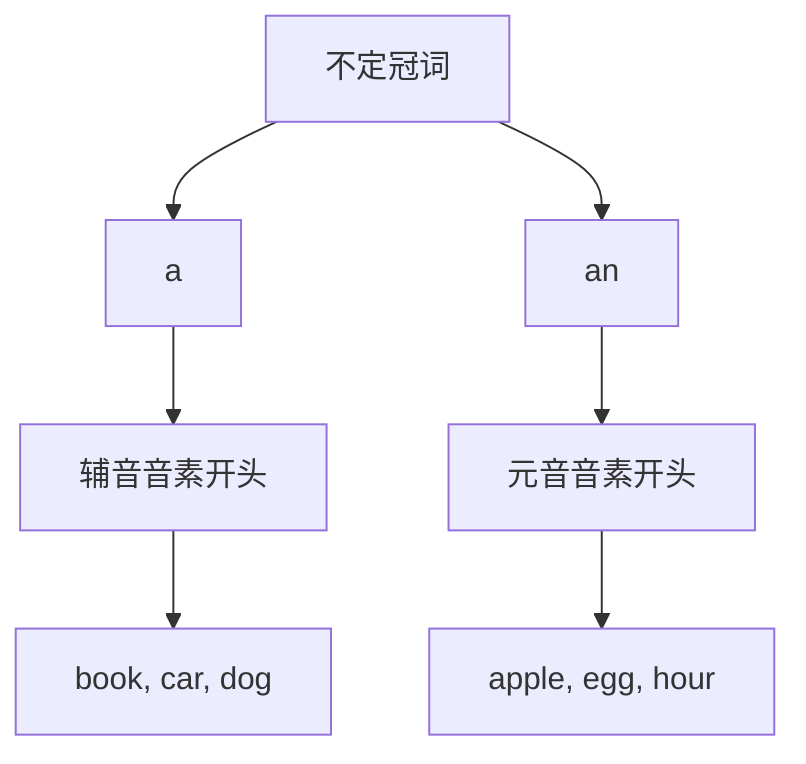

# 不定冠词a/an

## 🎯 学习目标
- 掌握不定冠词a/an的基本概念和用法
- 理解a和an的选择规则
- 熟练运用不定冠词的各种形式

## 📚 基本概念

### 不定冠词（Indefinite Article）
**定义**：用于泛指单数可数名词的冠词，表示"一个"或"某个"

### 基本特征
- 用于单数可数名词
- 表示泛指
- 有a和an两种形式
- 根据发音选择

## 🔄 不定冠词分类

## 📊 不定冠词选择规则

### 基本选择规则
| 规则 | 示例 | 说明 |
|------|------|------|
| 辅音音素开头用a | a book, a car, a dog | 辅音音素开头 |
| 元音音素开头用an | an apple, an egg, an hour | 元音音素开头 |
| 注意：不是看字母，而是看发音 | a university, an umbrella | 看发音不看字母 |

## 🎯 a的用法

### 1. 用于辅音音素开头的单数可数名词
**功能**：用于辅音音素开头的单数可数名词

**示例**：
- ✅ a book (一本书)
- ✅ a car (一辆车)
- ✅ a dog (一只狗)
- ✅ a house (一座房子)
- ✅ a student (一个学生)

**语法特点**：
- 用于辅音音素开头
- 单数可数名词
- 表示泛指
- 放在名词前

### 2. 用于辅音字母开头的单词
**功能**：用于辅音字母开头的单词

**示例**：
- ✅ a university (一所大学)
- ✅ a European (一个欧洲人)
- ✅ a one-way street (一条单行道)
- ✅ a useful tool (一个有用的工具)
- ✅ a uniform (一套制服)

**语法特点**：
- 用于辅音字母开头
- 但发音是辅音音素
- 单数可数名词
- 表示泛指

### 3. 用于表示职业、身份
**功能**：用于表示职业、身份

**示例**：
- ✅ I am a teacher. (我是老师)
- ✅ She is a doctor. (她是医生)
- ✅ He is a student. (他是学生)
- ✅ We are students. (我们是学生)
- ✅ They are workers. (他们是工人)

**语法特点**：
- 用于表示职业、身份
- 单数可数名词
- 表示泛指
- 放在名词前

## 🎯 an的用法

### 1. 用于元音音素开头的单数可数名词
**功能**：用于元音音素开头的单数可数名词

**示例**：
- ✅ an apple (一个苹果)
- ✅ an egg (一个鸡蛋)
- ✅ an hour (一个小时)
- ✅ an umbrella (一把雨伞)
- ✅ an orange (一个橙子)

**语法特点**：
- 用于元音音素开头
- 单数可数名词
- 表示泛指
- 放在名词前

### 2. 用于元音字母开头的单词
**功能**：用于元音字母开头的单词

**示例**：
- ✅ an apple (一个苹果)
- ✅ an egg (一个鸡蛋)
- ✅ an orange (一个橙子)
- ✅ an umbrella (一把雨伞)
- ✅ an hour (一个小时)

**语法特点**：
- 用于元音字母开头
- 发音是元音音素
- 单数可数名词
- 表示泛指

### 3. 用于表示职业、身份
**功能**：用于表示职业、身份

**示例**：
- ✅ I am an engineer. (我是工程师)
- ✅ She is an artist. (她是艺术家)
- ✅ He is an actor. (他是演员)
- ✅ We are actors. (我们是演员)
- ✅ They are artists. (他们是艺术家)

**语法特点**：
- 用于表示职业、身份
- 单数可数名词
- 表示泛指
- 放在名词前

## 🎯 特殊用法

### 1. 用于表示数量"一"
**功能**：用于表示数量"一"

**示例**：
- ✅ I have a book. (我有一本书)
- ✅ She has an apple. (她有一个苹果)
- ✅ He has a car. (他有一辆车)
- ✅ We have a house. (我们有一座房子)
- ✅ They have an umbrella. (他们有一把雨伞)

**语法特点**：
- 表示数量"一"
- 单数可数名词
- 表示泛指
- 放在名词前

### 2. 用于表示类别
**功能**：用于表示类别

**示例**：
- ✅ A dog is a pet. (狗是宠物)
- ✅ An apple is a fruit. (苹果是水果)
- ✅ A car is a vehicle. (汽车是交通工具)
- ✅ An elephant is an animal. (大象是动物)
- ✅ A book is a thing. (书是物品)

**语法特点**：
- 表示类别
- 单数可数名词
- 表示泛指
- 放在名词前

### 3. 用于表示频率
**功能**：用于表示频率

**示例**：
- ✅ I go to school once a week. (我一周去一次学校)
- ✅ She visits her parents twice a month. (她一个月看望父母两次)
- ✅ He exercises three times a day. (他一天锻炼三次)
- ✅ We have meetings once a year. (我们一年开一次会)
- ✅ They travel twice a year. (他们一年旅行两次)

**语法特点**：
- 表示频率
- 单数可数名词
- 表示泛指
- 放在名词前

## 🎯 易混点辨析

### 1. a和an的选择
**易混点**：a和an的选择错误

**常见错误**：

| 错误 | 正确 | 分析 |
|------|------|------|
| a apple | an apple | 元音音素开头用an |
| an book | a book | 辅音音素开头用a |
| a hour | an hour | hour发音是元音音素开头 |
| an university | a university | university发音是辅音音素开头 |

**辨析技巧**：
- 看发音不看字母
- 元音音素开头用an
- 辅音音素开头用a
- 注意特殊单词

### 2. 不定冠词和定冠词的选择
**易混点**：不定冠词和定冠词的选择错误

**常见错误**：

| 错误 | 正确 | 分析 |
|------|------|------|
| I have the book. | I have a book. | 泛指用不定冠词 |
| I have a book on the table. | I have the book on the table. | 特指用定冠词 |
| I want to buy a car. | I want to buy a car. | 泛指用不定冠词 |
| I want to buy the car. | I want to buy the car. | 特指用定冠词 |

**辨析技巧**：
- 泛指用不定冠词
- 特指用定冠词
- 根据语境判断
- 注意上下文

### 3. 不定冠词和零冠词的选择
**易混点**：不定冠词和零冠词的选择错误

**常见错误**：

| 错误 | 正确 | 分析 |
|------|------|------|
| I like a music. | I like music. | 不可数名词不用冠词 |
| I have a money. | I have money. | 不可数名词不用冠词 |
| I eat a bread. | I eat bread. | 不可数名词不用冠词 |
| I drink a water. | I drink water. | 不可数名词不用冠词 |

**辨析技巧**：
- 可数名词用冠词
- 不可数名词不用冠词
- 根据名词性质判断
- 注意名词分类

## 📊 不定冠词用法对比表

| 用法 | 示例 | 说明 |
|------|------|------|
| 表示数量"一" | I have a book. | 表示数量"一" |
| 表示类别 | A dog is a pet. | 表示类别 |
| 表示频率 | once a week | 表示频率 |
| 表示职业身份 | I am a teacher. | 表示职业身份 |
| 泛指单数可数名词 | a car, an apple | 泛指单数可数名词 |

## 🚫 常见错误分析

### 错误类型1：a和an选择错误
**错误**：❌ a apple
**正确**：✅ an apple
**分析**：元音音素开头用an

### 错误类型2：不定冠词使用错误
**错误**：❌ I have book.
**正确**：✅ I have a book.
**分析**：单数可数名词需要冠词

### 错误类型3：冠词多余
**错误**：❌ I like a music.
**正确**：✅ I like music.
**分析**：不可数名词不用冠词

### 错误类型4：冠词遗漏
**错误**：❌ I am teacher.
**正确**：✅ I am a teacher.
**分析**：表示职业身份需要冠词

## 🔗 相关链接
- [[01-定冠词the]]：定冠词的用法
- [[03-零冠词]]：零冠词的用法
- [[04-冠词易混点辨析]]：冠词的易混点辨析
- [[01-基础认知层/01-词性系统/01-名词系统]]：名词系统

## 💡 记忆口诀

**不定冠词a/an记忆法**：
- 不定冠词用于单数可数名词，表示泛指和数量"一"
- 辅音音素开头用a，元音音素开头用an
- 看发音不看字母，注意特殊单词
- 表示职业身份用冠词，表示频率用冠词
- 可数名词用冠词，不可数名词不用冠词
- 泛指用不定冠词，特指用定冠词

---
*掌握不定冠词a/an是语法学习的重要基础，需要大量练习才能熟练运用*
