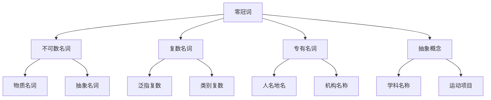

# 零冠词

## 🎯 学习目标
- 掌握零冠词的基本概念和用法
- 理解零冠词的使用规则
- 熟练运用零冠词的各种形式

## 📚 基本概念

### 零冠词（Zero Article）
**定义**：名词前不使用任何冠词的情况

### 基本特征
- 名词前不使用冠词
- 表示泛指或抽象概念
- 用于不可数名词和复数名词
- 有特定的使用规则

## 🔄 零冠词分类

## 📊 零冠词用法表

### 基本用法表
| 用法 | 示例 | 说明 |
|------|------|------|
| 不可数名词 | water, milk, bread | 不可数名词不用冠词 |
| 复数名词 | books, cars, students | 复数名词不用冠词 |
| 专有名词 | Tom, Beijing, China | 专有名词不用冠词 |
| 抽象概念 | love, happiness, freedom | 抽象概念不用冠词 |
| 学科名称 | English, math, physics | 学科名称不用冠词 |

## 🎯 不可数名词

### 1. 物质名词
**功能**：物质名词不用冠词

**示例**：
- ✅ Water is important for life. (水对生命很重要)
- ✅ Milk is good for health. (牛奶对健康有益)
- ✅ Bread is a staple food. (面包是主食)
- ✅ Rice is eaten in Asia. (亚洲人吃米饭)
- ✅ Coffee is popular worldwide. (咖啡在全世界很受欢迎)

**语法特点**：
- 物质名词不用冠词
- 表示泛指
- 不可数
- 放在句首或句中

### 2. 抽象名词
**功能**：抽象名词不用冠词

**示例**：
- ✅ Love is beautiful. (爱是美丽的)
- ✅ Happiness is important. (快乐很重要)
- ✅ Freedom is precious. (自由是珍贵的)
- ✅ Knowledge is power. (知识就是力量)
- ✅ Time is money. (时间就是金钱)

**语法特点**：
- 抽象名词不用冠词
- 表示泛指
- 不可数
- 放在句首或句中

### 3. 学科名称
**功能**：学科名称不用冠词

**示例**：
- ✅ English is interesting. (英语很有趣)
- ✅ Math is difficult. (数学很难)
- ✅ Physics is important. (物理很重要)
- ✅ Chemistry is useful. (化学很有用)
- ✅ Biology is fascinating. (生物学很迷人)

**语法特点**：
- 学科名称不用冠词
- 表示泛指
- 不可数
- 放在句首或句中

## 🎯 复数名词

### 1. 泛指复数
**功能**：泛指复数名词不用冠词

**示例**：
- ✅ Books are useful. (书很有用)
- ✅ Cars are expensive. (汽车很贵)
- ✅ Students study hard. (学生学习努力)
- ✅ Teachers work hard. (老师工作努力)
- ✅ Children play games. (孩子们玩游戏)

**语法特点**：
- 泛指复数名词不用冠词
- 表示泛指
- 复数形式
- 放在句首或句中

### 2. 类别复数
**功能**：表示类别的复数名词不用冠词

**示例**：
- ✅ Dogs are loyal. (狗是忠诚的)
- ✅ Cats are independent. (猫是独立的)
- ✅ Birds can fly. (鸟会飞)
- ✅ Fish live in water. (鱼生活在水中)
- ✅ Trees produce oxygen. (树产生氧气)

**语法特点**：
- 表示类别的复数名词不用冠词
- 表示泛指
- 复数形式
- 放在句首或句中

## 🎯 专有名词

### 1. 人名
**功能**：人名不用冠词

**示例**：
- ✅ Tom is my friend. (汤姆是我的朋友)
- ✅ Mary is a teacher. (玛丽是老师)
- ✅ John works in a company. (约翰在公司工作)
- ✅ Lisa studies English. (丽莎学英语)
- ✅ David plays football. (大卫踢足球)

**语法特点**：
- 人名不用冠词
- 表示特指
- 单数形式
- 放在句首或句中

### 2. 地名
**功能**：地名不用冠词

**示例**：
- ✅ Beijing is the capital of China. (北京是中国的首都)
- ✅ Shanghai is a big city. (上海是大城市)
- ✅ China is a large country. (中国是大国)
- ✅ America is powerful. (美国很强大)
- ✅ Europe is beautiful. (欧洲很美丽)

**语法特点**：
- 地名不用冠词
- 表示特指
- 单数形式
- 放在句首或句中

### 3. 机构名称
**功能**：机构名称不用冠词

**示例**：
- ✅ Harvard is famous. (哈佛很著名)
- ✅ Microsoft is successful. (微软很成功)
- ✅ Apple is innovative. (苹果很创新)
- ✅ Google is popular. (谷歌很受欢迎)
- ✅ Facebook is social. (脸书很社交)

**语法特点**：
- 机构名称不用冠词
- 表示特指
- 单数形式
- 放在句首或句中

## 🎯 抽象概念

### 1. 运动项目
**功能**：运动项目不用冠词

**示例**：
- ✅ Football is popular. (足球很受欢迎)
- ✅ Basketball is exciting. (篮球很刺激)
- ✅ Tennis is fun. (网球很有趣)
- ✅ Swimming is healthy. (游泳很健康)
- ✅ Running is good exercise. (跑步是很好的运动)

**语法特点**：
- 运动项目不用冠词
- 表示泛指
- 不可数
- 放在句首或句中

### 2. 时间概念
**功能**：时间概念不用冠词

**示例**：
- ✅ Spring is beautiful. (春天很美丽)
- ✅ Summer is hot. (夏天很热)
- ✅ Autumn is colorful. (秋天很多彩)
- ✅ Winter is cold. (冬天很冷)
- ✅ Monday is busy. (星期一很忙)

**语法特点**：
- 时间概念不用冠词
- 表示泛指
- 不可数
- 放在句首或句中

### 3. 节日名称
**功能**：节日名称不用冠词

**示例**：
- ✅ Christmas is festive. (圣诞节很喜庆)
- ✅ New Year is exciting. (新年很兴奋)
- ✅ Thanksgiving is traditional. (感恩节很传统)
- ✅ Easter is religious. (复活节很宗教)
- ✅ Halloween is fun. (万圣节很有趣)

**语法特点**：
- 节日名称不用冠词
- 表示特指
- 不可数
- 放在句首或句中

## 🎯 易混点辨析

### 1. 零冠词和不定冠词的选择
**易混点**：零冠词和不定冠词的选择错误

**常见错误**：

| 错误 | 正确 | 分析 |
|------|------|------|
| I like a music. | I like music. | 不可数名词不用冠词 |
| I have a money. | I have money. | 不可数名词不用冠词 |
| I eat a bread. | I eat bread. | 不可数名词不用冠词 |
| I drink a water. | I drink water. | 不可数名词不用冠词 |

**辨析技巧**：
- 不可数名词不用冠词
- 可数名词用冠词
- 根据名词性质判断
- 注意名词分类

### 2. 零冠词和定冠词的选择
**易混点**：零冠词和定冠词的选择错误

**常见错误**：

| 错误 | 正确 | 分析 |
|------|------|------|
| I like the music. | I like music. | 泛指音乐不用冠词 |
| I have the money. | I have money. | 泛指金钱不用冠词 |
| I eat the bread. | I eat bread. | 泛指面包不用冠词 |
| I drink the water. | I drink water. | 泛指水不用冠词 |

**辨析技巧**：
- 泛指不用冠词
- 特指用定冠词
- 根据语境判断
- 注意名词性质

### 3. 固定搭配的记忆
**易混点**：固定搭配的记忆错误

**常见错误**：

| 错误 | 正确 | 分析 |
|------|------|------|
| go to the school | go to school | 上学不用冠词 |
| go to the hospital | go to hospital | 看病不用冠词 |
| go to the church | go to church | 做礼拜不用冠词 |
| go to the bed | go to bed | 睡觉不用冠词 |

**辨析技巧**：
- 固定搭配要记牢
- 根据语境判断
- 注意名词性质
- 多练习多记忆

## 📊 零冠词用法对比表

| 用法 | 示例 | 说明 |
|------|------|------|
| 不可数名词 | water, milk, bread | 不可数名词不用冠词 |
| 复数名词 | books, cars, students | 复数名词不用冠词 |
| 专有名词 | Tom, Beijing, China | 专有名词不用冠词 |
| 抽象概念 | love, happiness, freedom | 抽象概念不用冠词 |
| 学科名称 | English, math, physics | 学科名称不用冠词 |
| 运动项目 | football, basketball, tennis | 运动项目不用冠词 |
| 时间概念 | spring, summer, autumn | 时间概念不用冠词 |
| 节日名称 | Christmas, New Year | 节日名称不用冠词 |

## 🚫 常见错误分析

### 错误类型1：零冠词使用错误
**错误**：❌ I like a music.
**正确**：✅ I like music.
**分析**：不可数名词不用冠词

### 错误类型2：零冠词遗漏
**错误**：❌ go to the school
**正确**：✅ go to school
**分析**：固定搭配不用冠词

### 错误类型3：零冠词多余
**错误**：❌ I have the money.
**正确**：✅ I have money.
**分析**：泛指金钱不用冠词

### 错误类型4：固定搭配错误
**错误**：❌ go to the bed
**正确**：✅ go to bed
**分析**：固定搭配不用冠词

## 🔗 相关链接
- [[01-定冠词the]]：定冠词的用法
- [[02-不定冠词a_an]]：不定冠词的用法
- [[04-冠词易混点辨析]]：冠词的易混点辨析
- [[01-基础认知层/01-词性系统/01-名词系统]]：名词系统

## 💡 记忆口诀

**零冠词记忆法**：
- 零冠词用于名词前不使用任何冠词，表示泛指或抽象概念
- 不可数名词不用冠词，复数名词不用冠词
- 专有名词不用冠词，抽象概念不用冠词
- 学科名称不用冠词，运动项目不用冠词
- 时间概念不用冠词，节日名称不用冠词
- 固定搭配要记牢，语境判断要准确

---
*掌握零冠词是语法学习的重要基础，需要大量练习才能熟练运用*
