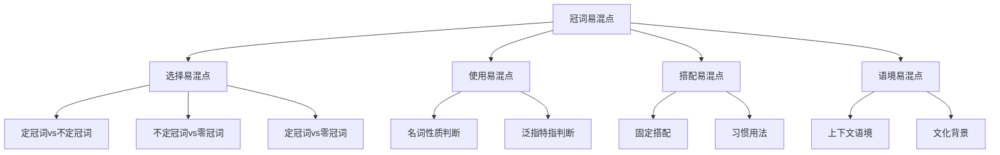

# 冠词易混点辨析

## 🎯 学习目标
- 识别冠词使用中的常见易混点
- 掌握易混点的正确用法
- 避免冠词使用中的常见错误

## 🔍 易混点分类

## 🔄 选择易混点

### 1. 定冠词vs不定冠词
**易混点**：定冠词和不定冠词的选择错误

**常见错误**：

| 错误 | 正确 | 分析 |
|------|------|------|
| I have the book. | I have a book. | 泛指用不定冠词 |
| I have a book on the table. | I have the book on the table. | 特指用定冠词 |
| I want to buy a car. | I want to buy a car. | 泛指用不定冠词 |
| I want to buy the car. | I want to buy the car. | 特指用定冠词 |

**辨析技巧**：
- 泛指用不定冠词
- 特指用定冠词
- 根据语境判断
- 注意上下文

**示例对比**：
- ✅ I have a book. (我有一本书) - 泛指
- ✅ I have the book. (我有这本书) - 特指
- ✅ I want to buy a car. (我想买一辆车) - 泛指
- ✅ I want to buy the car. (我想买这辆车) - 特指

### 2. 不定冠词vs零冠词
**易混点**：不定冠词和零冠词的选择错误

**常见错误**：

| 错误 | 正确 | 分析 |
|------|------|------|
| I like a music. | I like music. | 不可数名词不用冠词 |
| I have a money. | I have money. | 不可数名词不用冠词 |
| I eat a bread. | I eat bread. | 不可数名词不用冠词 |
| I drink a water. | I drink water. | 不可数名词不用冠词 |

**辨析技巧**：
- 可数名词用冠词
- 不可数名词不用冠词
- 根据名词性质判断
- 注意名词分类

**示例对比**：
- ✅ I have a book. (我有一本书) - 可数名词
- ✅ I have money. (我有钱) - 不可数名词
- ✅ I eat an apple. (我吃一个苹果) - 可数名词
- ✅ I eat bread. (我吃面包) - 不可数名词

### 3. 定冠词vs零冠词
**易混点**：定冠词和零冠词的选择错误

**常见错误**：

| 错误 | 正确 | 分析 |
|------|------|------|
| I like the music. | I like music. | 泛指音乐不用冠词 |
| I have the money. | I have money. | 泛指金钱不用冠词 |
| I eat the bread. | I eat bread. | 泛指面包不用冠词 |
| I drink the water. | I drink water. | 泛指水不用冠词 |

**辨析技巧**：
- 泛指不用冠词
- 特指用定冠词
- 根据语境判断
- 注意名词性质

**示例对比**：
- ✅ I like music. (我喜欢音乐) - 泛指
- ✅ I like the music. (我喜欢这音乐) - 特指
- ✅ I have money. (我有钱) - 泛指
- ✅ I have the money. (我有这笔钱) - 特指

## 🎯 使用易混点

### 1. 名词性质判断错误
**易混点**：名词性质判断错误

**常见错误**：

| 错误 | 正确 | 分析 |
|------|------|------|
| I have a information. | I have information. | information是不可数名词 |
| I have a advice. | I have advice. | advice是不可数名词 |
| I have a news. | I have news. | news是不可数名词 |
| I have a furniture. | I have furniture. | furniture是不可数名词 |

**辨析技巧**：
- 判断名词是否可数
- 可数名词用冠词
- 不可数名词不用冠词
- 注意特殊名词

**示例对比**：
- ✅ I have a book. (我有一本书) - 可数名词
- ✅ I have information. (我有信息) - 不可数名词
- ✅ I have an apple. (我有一个苹果) - 可数名词
- ✅ I have advice. (我有建议) - 不可数名词

### 2. 泛指特指判断错误
**易混点**：泛指特指判断错误

**常见错误**：

| 错误 | 正确 | 分析 |
|------|------|------|
| I want to buy the car. | I want to buy a car. | 泛指用不定冠词 |
| I have a book on the table. | I have the book on the table. | 特指用定冠词 |
| I like the music. | I like music. | 泛指音乐不用冠词 |
| I have the money. | I have money. | 泛指金钱不用冠词 |

**辨析技巧**：
- 判断是泛指还是特指
- 泛指用不定冠词或零冠词
- 特指用定冠词
- 根据语境判断

**示例对比**：
- ✅ I want to buy a car. (我想买一辆车) - 泛指
- ✅ I want to buy the car. (我想买这辆车) - 特指
- ✅ I like music. (我喜欢音乐) - 泛指
- ✅ I like the music. (我喜欢这音乐) - 特指

## 🔄 搭配易混点

### 1. 固定搭配错误
**易混点**：固定搭配错误

**常见错误**：

| 错误 | 正确 | 分析 |
|------|------|------|
| play piano | play the piano | 乐器前用the |
| first time | the first time | 序数词前用the |
| best book | the best book | 最高级前用the |
| in morning | in the morning | 时间前用the |

**辨析技巧**：
- 乐器前用the
- 序数词前用the
- 最高级前用the
- 时间前用the

**示例对比**：
- ✅ play the piano (弹钢琴) - 乐器前用the
- ✅ play football (踢足球) - 运动项目不用冠词
- ✅ the first time (第一次) - 序数词前用the
- ✅ first time (第一次) - 错误用法

### 2. 习惯用法错误
**易混点**：习惯用法错误

**常见错误**：

| 错误 | 正确 | 分析 |
|------|------|------|
| go to the school | go to school | 上学不用冠词 |
| go to the hospital | go to hospital | 看病不用冠词 |
| go to the church | go to church | 做礼拜不用冠词 |
| go to the bed | go to bed | 睡觉不用冠词 |

**辨析技巧**：
- 固定搭配要记牢
- 根据语境判断
- 注意名词性质
- 多练习多记忆

**示例对比**：
- ✅ go to school (上学) - 固定搭配
- ✅ go to the school (去学校) - 特指某个学校
- ✅ go to hospital (看病) - 固定搭配
- ✅ go to the hospital (去医院) - 特指某个医院

## 🎯 语境易混点

### 1. 上下文语境错误
**易混点**：上下文语境错误

**常见错误**：

| 错误 | 正确 | 分析 |
|------|------|------|
| I have book. | I have a book. | 单数可数名词需要冠词 |
| I have books. | I have books. | 复数名词不用冠词 |
| I have money. | I have money. | 不可数名词不用冠词 |
| I have the money. | I have the money. | 特指用定冠词 |

**辨析技巧**：
- 根据上下文判断
- 注意名词性质
- 判断泛指特指
- 考虑语境因素

**示例对比**：
- ✅ I have a book. (我有一本书) - 单数可数名词
- ✅ I have books. (我有书) - 复数名词
- ✅ I have money. (我有钱) - 不可数名词
- ✅ I have the money. (我有这笔钱) - 特指

### 2. 文化背景错误
**易混点**：文化背景错误

**常见错误**：

| 错误 | 正确 | 分析 |
|------|------|------|
| the China | China | 国家名称不用冠词 |
| the Beijing | Beijing | 城市名称不用冠词 |
| the Tom | Tom | 人名不用冠词 |
| the Harvard | Harvard | 大学名称不用冠词 |

**辨析技巧**：
- 专有名词不用冠词
- 注意文化背景
- 根据习惯用法
- 多学习多积累

**示例对比**：
- ✅ China (中国) - 国家名称
- ✅ Beijing (北京) - 城市名称
- ✅ Tom (汤姆) - 人名
- ✅ Harvard (哈佛) - 大学名称

## 📊 易混点对比表

| 易混点类型 | 错误示例 | 正确示例 | 辨析要点 |
|------------|----------|----------|----------|
| 定冠词vs不定冠词 | I have the book. | I have a book. | 泛指用不定冠词 |
| 不定冠词vs零冠词 | I like a music. | I like music. | 不可数名词不用冠词 |
| 定冠词vs零冠词 | I like the music. | I like music. | 泛指音乐不用冠词 |
| 名词性质判断 | I have a information. | I have information. | information是不可数名词 |
| 泛指特指判断 | I want to buy the car. | I want to buy a car. | 泛指用不定冠词 |
| 固定搭配 | play piano | play the piano | 乐器前用the |
| 习惯用法 | go to the school | go to school | 上学不用冠词 |
| 上下文语境 | I have book. | I have a book. | 单数可数名词需要冠词 |
| 文化背景 | the China | China | 国家名称不用冠词 |

## 🎯 辨析技巧总结

### 1. 名词性质分析法
- 判断名词是否可数
- 可数名词用冠词
- 不可数名词不用冠词
- 注意特殊名词

### 2. 泛指特指判断法
- 判断是泛指还是特指
- 泛指用不定冠词或零冠词
- 特指用定冠词
- 根据语境判断

### 3. 固定搭配记忆法
- 乐器前用the
- 序数词前用the
- 最高级前用the
- 时间前用the

### 4. 语境分析法
- 根据上下文判断
- 注意名词性质
- 判断泛指特指
- 考虑语境因素

## 🔗 相关链接
- [[01-定冠词the]]：定冠词的用法
- [[02-不定冠词a_an]]：不定冠词的用法
- [[03-零冠词]]：零冠词的用法
- [[01-基础认知层/01-词性系统/01-名词系统]]：名词系统

## 💡 记忆口诀

**冠词易混点辨析记忆法**：
- 泛指用不定冠词，特指用定冠词，泛指不用冠词
- 可数名词用冠词，不可数名词不用冠词
- 乐器前用the，序数词前用the，最高级前用the
- 固定搭配要记牢，习惯用法要掌握
- 上下文语境要分析，文化背景要考虑
- 名词性质要判断，泛指特指要分清

---
*掌握冠词易混点辨析是提高语法准确性的关键，需要大量练习和对比分析*
