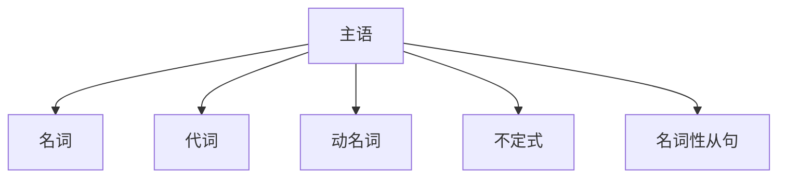
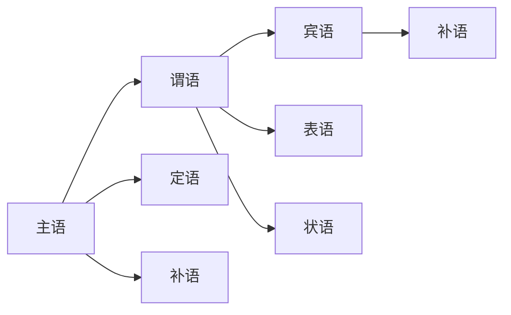

# 句子基本成分

## 核心概念
句子成分是构成句子的基本要素，理解句子成分是掌握英语语法的基石。

## 主要成分

### 1. 主语 (Subject)
**定义**: 句子中执行动作或被描述的人或事物
**位置**: 通常位于句首
**词性**: 名词、代词、动名词、不定式等

**示例**:
- The book is interesting. (名词作主语)
- She is beautiful. (代词作主语)
- Reading is fun. (动名词作主语)
- To learn English is important. (不定式作主语)

### 2. 谓语 (Predicate)
**定义**: 说明主语的动作、状态或特征
**构成**: 动词 + 其他成分
**分类**: 
- 简单谓语：单个动词
- 复合谓语：助动词 + 实义动词

**示例**:
- He runs fast. (简单谓语)
- She is reading. (复合谓语)
- They have finished. (复合谓语)

### 3. 宾语 (Object)
**定义**: 动作的承受者或涉及的对象
**分类**:
- 直接宾语：动作的直接承受者
- 间接宾语：动作的间接承受者

**示例**:
- I read books. (books是直接宾语)
- She gave me a gift. (me是间接宾语，gift是直接宾语)

### 4. 表语 (Predicative)
**定义**: 位于系动词后，说明主语的性质、状态、特征
**位置**: 系动词之后
**词性**: 名词、形容词、副词、介词短语等

**示例**:
- He is a teacher. (名词作表语)
- The flower is beautiful. (形容词作表语)
- The book is on the desk. (介词短语作表语)

## 次要成分

### 5. 定语 (Attribute)
**定义**: 修饰名词或代词的成分
**位置**: 前置定语或后置定语
**词性**: 形容词、名词、代词、介词短语等

**示例**:
- A beautiful flower (前置定语)
- The book on the desk (后置定语)

### 6. 状语 (Adverbial)
**定义**: 修饰动词、形容词、副词或整个句子的成分
**分类**: 时间、地点、方式、原因、目的、结果、条件、让步等
**位置**: 句首、句中、句末

**示例**:
- He runs quickly. (方式状语)
- I study in the library. (地点状语)
- Because it's raining, we stay home. (原因状语)

### 7. 补语 (Complement)
**定义**: 补充说明主语或宾语的成分
**分类**:
- 主语补语：补充说明主语
- 宾语补语：补充说明宾语

**示例**:
- He was elected president. (主语补语)
- We made him happy. (宾语补语)

## 成分关系图

## 记忆口诀
> **主谓宾，定状补，表语系动词后住**
> **主语动作主，谓语动词当**
> **宾语动作受，表语性质说**
> **定语修饰名，状语修饰动**
> **补语补充全，句子成分清**

## 刻意练习

### 练习1: 成分识别
分析下列句子的成分：
1. The clever student studies English carefully.
2. She became a doctor last year.
3. We consider him our friend.

### 练习2: 成分转换
将下列句子改写，改变句子成分：
1. He reads books → Books are read by him.
2. She is beautiful → Her beauty is amazing.

## 相关链接
- [[02-句子结构类型]] - 了解句子结构类型
- [[03-成分关系图]] - 深入理解成分关系
- [[04-句子成分易混点辨析]] - 避免常见错误

## 学习要点
1. **理解**: 掌握各成分的定义和特征
2. **识别**: 能够准确识别句子中的各种成分
3. **应用**: 在写作中正确使用各种句子成分
4. **对比**: 区分相似成分的差异

---
*学习建议: 从简单句开始练习成分分析，逐步过渡到复杂句*
