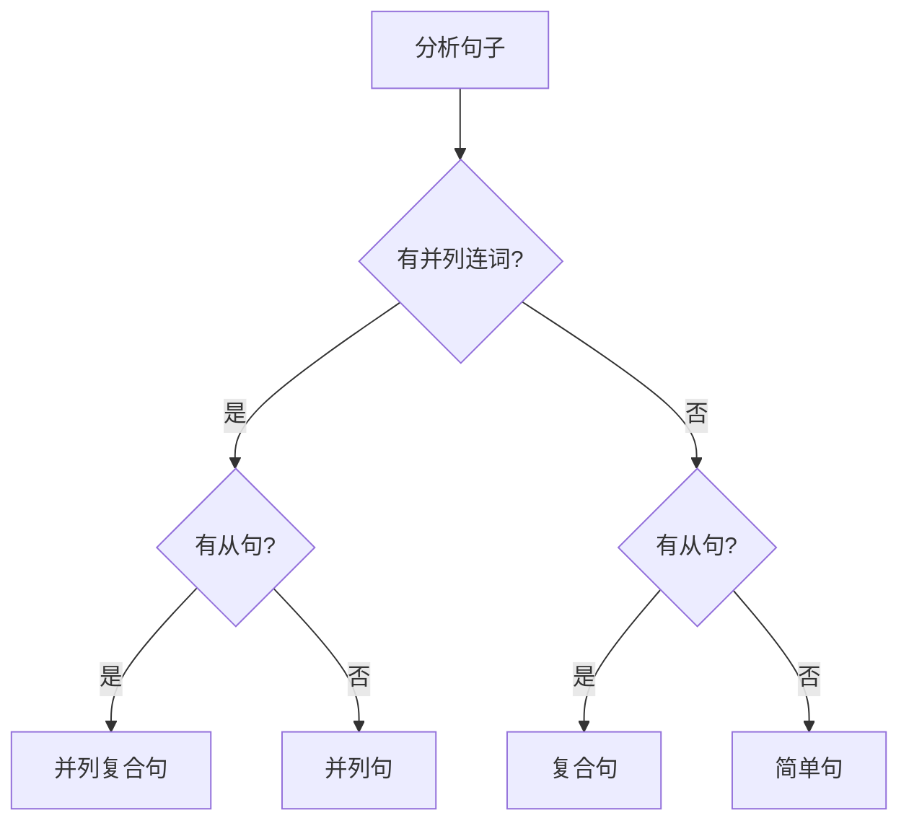

# 句子结构类型

## 核心概念
句子结构类型是根据句子内部成分的组合方式对句子进行的分类，是理解英语语法的重要基础。

## 按结构分类

### 1. 简单句 (Simple Sentence)
**定义**: 只包含一个主谓结构的句子
**特点**: 
- 只有一个主语和一个谓语
- 表达一个完整的意思
- 结构简单明了

**结构模式**:
```
主语 + 谓语 (+ 宾语/表语/状语)
```

**示例**:
- Birds fly. (主语 + 谓语)
- She reads books. (主语 + 谓语 + 宾语)
- He is a teacher. (主语 + 系动词 + 表语)
- They work hard. (主语 + 谓语 + 状语)

### 2. 并列句 (Compound Sentence)
**定义**: 由两个或两个以上的简单句通过并列连词连接而成的句子
**特点**:
- 包含多个独立的主谓结构
- 各分句地位平等
- 用并列连词连接

**常用并列连词**:
- and (和)
- but (但是)
- or (或者)
- so (所以)
- for (因为)
- yet (然而)

**结构模式**:
```
简单句1 + 并列连词 + 简单句2
```

**示例**:
- I like apples, and she likes oranges.
- He is tired, but he continues working.
- Study hard, or you will fail the exam.

### 3. 复合句 (Complex Sentence)
**定义**: 包含一个主句和一个或多个从句的句子
**特点**:
- 主句表达主要意思
- 从句表达次要意思
- 从句不能独立成句

**结构模式**:
```
主句 + 从句
或
从句 + 主句
```

**示例**:
- I know that he is honest. (主句 + 宾语从句)
- When it rains, we stay home. (时间状语从句 + 主句)
- The book which I bought is interesting. (主句 + 定语从句)

### 4. 并列复合句 (Compound-Complex Sentence)
**定义**: 既包含并列关系又包含主从关系的句子
**特点**:
- 至少有两个主句
- 至少有一个从句
- 结构最复杂

**结构模式**:
```
主句1 + 并列连词 + 主句2 + 从句
或
从句 + 主句1 + 并列连词 + 主句2
```

**示例**:
- I like apples, and she likes oranges that are sweet.
- When it rains, we stay home, but when it's sunny, we go out.

## 句子结构对比表

| 类型 | 主句数量 | 从句数量 | 并列连词 | 复杂度 |
|------|----------|----------|----------|--------|
| 简单句 | 1 | 0 | 无 | 低 |
| 并列句 | 2+ | 0 | 有 | 中 |
| 复合句 | 1 | 1+ | 无 | 中 |
| 并列复合句 | 2+ | 1+ | 有 | 高 |

## 结构识别流程图



## 按功能分类

### 1. 陈述句 (Declarative Sentence)
**定义**: 陈述事实或观点的句子
**特点**: 句末用句号
**示例**: The sun rises in the east.

### 2. 疑问句 (Interrogative Sentence)
**定义**: 用来提问的句子
**分类**:
- 一般疑问句: Do you like coffee?
- 特殊疑问句: What is your name?
- 选择疑问句: Do you want tea or coffee?
- 反义疑问句: You like coffee, don't you?

### 3. 祈使句 (Imperative Sentence)
**定义**: 表达命令、请求、建议的句子
**特点**: 通常省略主语，动词用原形
**示例**: Please close the door.

### 4. 感叹句 (Exclamatory Sentence)
**定义**: 表达强烈感情的句子
**特点**: 句末用感叹号
**示例**: What a beautiful day!

## 记忆口诀
> **简单一句主谓宾，并列两句平等分**
> **复合主从有层次，并列复合最复杂**
> **陈述疑问祈使叹，功能不同语气变**

## 刻意练习

### 练习1: 结构识别
判断下列句子的结构类型：
1. I study English every day.
2. He likes music, and she likes art.
3. I know that he is coming.
4. When it rains, we stay home, but when it's sunny, we go out.

### 练习2: 结构转换
将简单句改写为其他结构类型：
1. 原句: I like apples.
2. 改写为并列句: I like apples, and she likes oranges.
3. 改写为复合句: I know that I like apples.

### 练习3: 功能转换
将陈述句改写为其他功能类型：
1. 原句: You are a student.
2. 疑问句: Are you a student?
3. 祈使句: Be a good student.
4. 感叹句: What a good student you are!

## 相关链接
- [[01-基本成分]] - 理解句子基本成分
- [[03-成分关系图]] - 分析成分关系
- [[04-句子成分易混点辨析]] - 避免常见错误

## 学习要点
1. **识别**: 能够准确识别各种句子结构类型
2. **转换**: 掌握不同结构类型之间的转换
3. **应用**: 在写作中灵活运用各种句子结构
4. **分析**: 能够分析复杂句子的结构层次

---
*学习建议: 从简单句开始，逐步掌握复杂句的结构特点*
