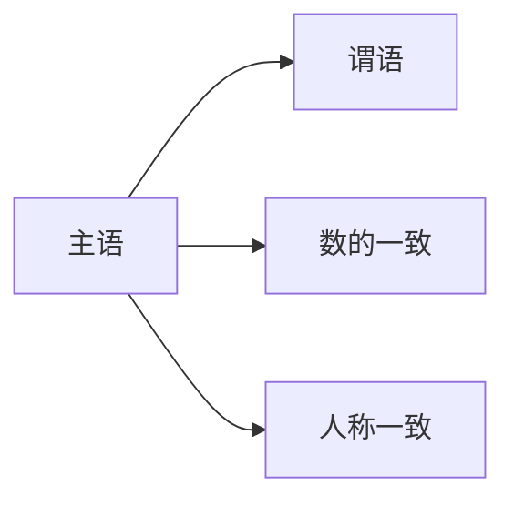
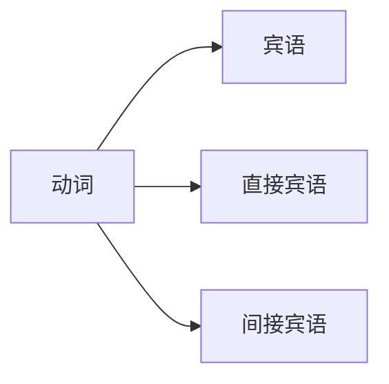
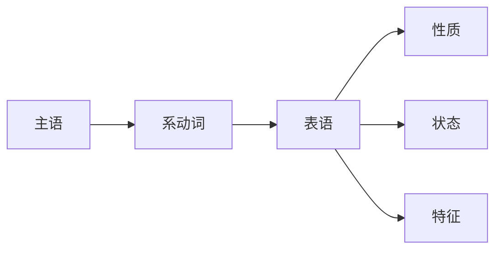
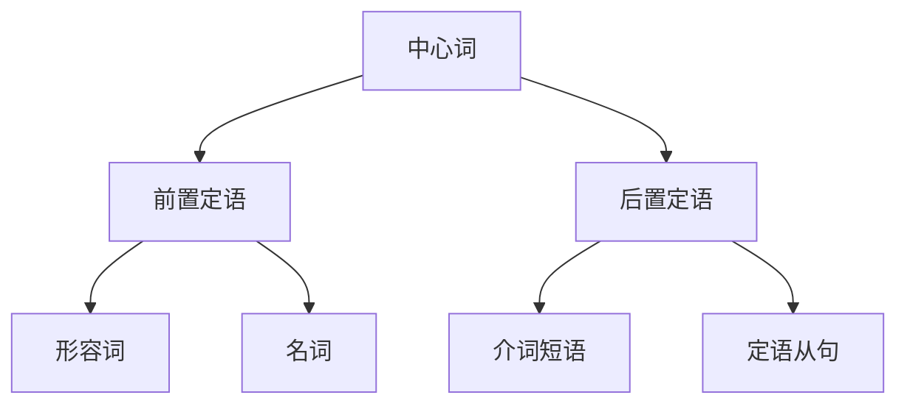
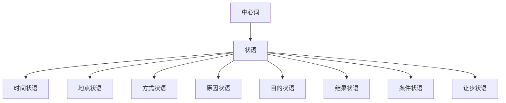
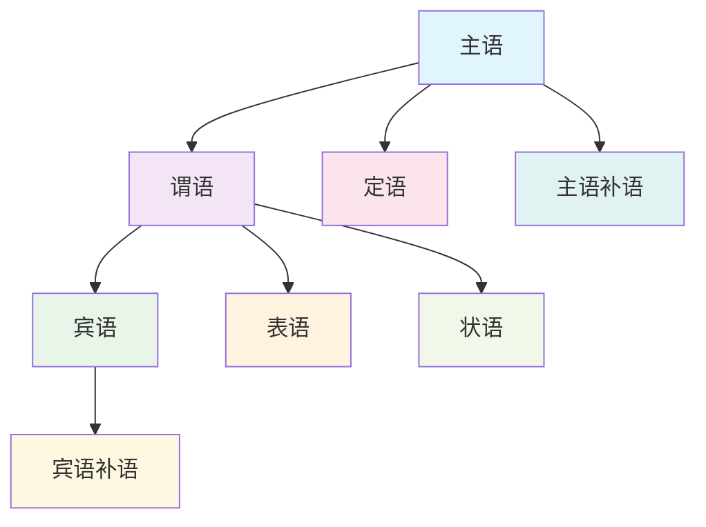
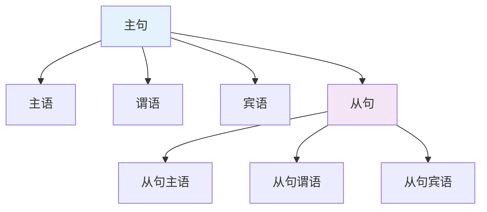

# 句子成分关系图

## 核心概念
句子成分关系图通过可视化方式展示句子各成分之间的逻辑关系，帮助理解句子的内在结构。

## 基本关系图

### 1. 主谓关系
**关系**: 主语与谓语之间的核心关系
**特点**: 主语决定谓语的数和人称

**示例**:
- He reads books. (第三人称单数)
- They read books. (第三人称复数)

### 2. 动宾关系
**关系**: 动词与宾语之间的动作关系
**特点**: 宾语是动作的承受者

**示例**:
- She gave me a book. (me: 间接宾语, book: 直接宾语)

### 3. 系表关系
**关系**: 系动词与表语之间的说明关系
**特点**: 表语说明主语的性质、状态

**示例**:
- He is a teacher. (表语说明身份)
- The flower is beautiful. (表语说明性质)

## 修饰关系图

### 4. 定中关系
**关系**: 定语与中心词之间的修饰关系
**位置**: 前置定语或后置定语

**示例**:
- A beautiful flower (前置定语)
- The book on the desk (后置定语)

### 5. 状中关系
**关系**: 状语与中心词之间的修饰关系
**范围**: 修饰动词、形容词、副词或整个句子

**示例**:
- He runs quickly. (方式状语)
- I study in the library. (地点状语)

## 补足关系图

### 6. 主补关系
**关系**: 主语与补语之间的补充关系
**功能**: 补语补充说明主语

**示例**:
- He was elected president. (president补充说明he)

### 7. 宾补关系
**关系**: 宾语与补语之间的补充关系
**功能**: 补语补充说明宾语

**示例**:
- We made him happy. (happy补充说明him)

## 完整句子关系图

### 8. 简单句关系图

### 9. 复合句关系图

## 关系类型总结表

| 关系类型 | 主要成分 | 次要成分 | 关系特点 |
|----------|----------|----------|----------|
| 主谓关系 | 主语 + 谓语 | 无 | 核心关系，数人称一致 |
| 动宾关系 | 动词 + 宾语 | 无 | 动作关系，宾语承受动作 |
| 系表关系 | 系动词 + 表语 | 无 | 说明关系，表语说明主语 |
| 定中关系 | 定语 + 中心词 | 定语 | 修饰关系，定语修饰中心词 |
| 状中关系 | 状语 + 中心词 | 状语 | 修饰关系，状语修饰中心词 |
| 主补关系 | 主语 + 补语 | 补语 | 补充关系，补语补充主语 |
| 宾补关系 | 宾语 + 补语 | 补语 | 补充关系，补语补充宾语 |

## 关系分析步骤

### 步骤1: 识别主要成分
1. 找出主语和谓语
2. 确定谓语类型（及物/不及物/系动词）
3. 识别宾语或表语

### 步骤2: 识别次要成分
1. 找出定语（修饰名词）
2. 找出状语（修饰动词、形容词、副词）
3. 找出补语（补充说明）

### 步骤3: 分析关系
1. 确定各成分之间的逻辑关系
2. 理解修饰和被修饰的关系
3. 掌握补充和被补充的关系

## 记忆口诀
> **主谓宾表是核心，定状补语是辅助**
> **主谓数人称一致，动宾动作承受者**
> **系表说明主性质，定中修饰名代词**
> **状中修饰动形副，补语补充主宾语**

## 刻意练习

### 练习1: 关系识别
分析下列句子中各成分的关系：
1. The clever student studies English carefully.
2. She became a doctor last year.
3. We consider him our friend.

### 练习2: 关系图绘制
为下列句子绘制成分关系图：
1. I like the book on the desk.
2. He runs fast in the morning.

### 练习3: 关系转换
改变句子成分关系，保持意思不变：
1. 原句: She gave me a book.
2. 转换: A book was given to me by her.

## 相关链接
- [[01-基本成分]] - 理解句子基本成分
- [[02-句子结构类型]] - 掌握句子结构类型
- [[04-句子成分易混点辨析]] - 避免常见错误

## 学习要点
1. **理解**: 掌握各成分关系的本质
2. **识别**: 能够准确识别成分关系
3. **分析**: 能够分析复杂句子的成分关系
4. **应用**: 在写作中正确运用成分关系

---
*学习建议: 通过大量例句练习，逐步掌握成分关系的分析方法*
