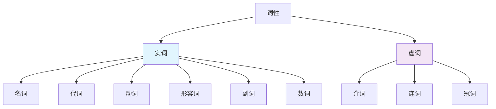

# 词性对比图表

## 核心概念
词性对比图表通过表格形式直观展示不同词性之间的相似点和差异点，帮助学习者快速掌握词性的特点和用法。

## 主要词性对比

### 1. 名词 vs 代词

| 对比方面 | 名词 | 代词 |
|----------|------|------|
| **定义** | 表示人、事物、概念 | 代替名词 |
| **功能** | 作主语、宾语、表语 | 作主语、宾语、表语 |
| **变化** | 有单复数变化 | 有格的变化 |
| **分类** | 可数/不可数 | 人称/物主/指示等 |
| **示例** | book, student, love | he, his, this |
| **特点** | 具体或抽象 | 指代性强 |

**记忆要点**:
- 名词是"被代替者"，代词是"代替者"
- 名词有单复数，代词有主格宾格
- 名词可以独立使用，代词必须有所指代

### 2. 动词 vs 名词

| 对比方面 | 动词 | 名词 |
|----------|------|------|
| **定义** | 表示动作或状态 | 表示人、事物、概念 |
| **功能** | 作谓语 | 作主语、宾语、表语 |
| **变化** | 有时态语态变化 | 有单复数变化 |
| **分类** | 及物/不及物 | 可数/不可数 |
| **示例** | run, study, be | book, student, love |
| **特点** | 动态性 | 静态性 |

**记忆要点**:
- 动词表示"做什么"，名词表示"是什么"
- 动词有动作性，名词有实体性
- 动词作谓语，名词作主语宾语

### 3. 形容词 vs 副词

| 对比方面 | 形容词 | 副词 |
|----------|---------|------|
| **定义** | 修饰名词 | 修饰动词、形容词、副词 |
| **功能** | 作定语、表语 | 作状语 |
| **位置** | 名词前后 | 动词前后 |
| **变化** | 有比较级最高级 | 有比较级最高级 |
| **示例** | beautiful, big | quickly, very |
| **特点** | 描述性质 | 描述方式程度 |

**记忆要点**:
- 形容词修饰"什么"，副词修饰"怎样"
- 形容词描述性质，副词描述方式
- 形容词作定语表语，副词作状语

### 4. 介词 vs 连词

| 对比方面 | 介词 | 连词 |
|----------|------|------|
| **定义** | 连接词与词 | 连接词、短语、句子 |
| **功能** | 构成介词短语 | 连接并列或从属关系 |
| **位置** | 名词前 | 词句间 |
| **分类** | 时间/地点/方式 | 并列/从属 |
| **示例** | in, on, at | and, but, because |
| **特点** | 构成短语 | 连接关系 |

**记忆要点**:
- 介词连接"词与词"，连词连接"句与句"
- 介词构成短语，连词表示关系
- 介词短语作状语，连词连接成分

### 5. 定冠词 vs 不定冠词

| 对比方面 | 定冠词the | 不定冠词a/an |
|----------|-----------|--------------|
| **定义** | 特指某个 | 泛指某个 |
| **功能** | 限定特指 | 限定泛指 |
| **使用** | 双方都知道 | 初次提及 |
| **位置** | 名词前 | 名词前 |
| **示例** | the book | a book, an apple |
| **特点** | 特指性 | 泛指性 |

**记忆要点**:
- the表示"那个"，a/an表示"一个"
- the用于特指，a/an用于泛指
- the双方都知道，a/an初次提及

## 词性功能对比表

### 句子成分功能对比

| 词性 | 主语 | 谓语 | 宾语 | 表语 | 定语 | 状语 | 补语 |
|------|------|------|------|------|------|------|------|
| **名词** | ✅ | ❌ | ✅ | ✅ | ✅ | ❌ | ✅ |
| **代词** | ✅ | ❌ | ✅ | ✅ | ✅ | ❌ | ✅ |
| **动词** | ❌ | ✅ | ❌ | ❌ | ❌ | ❌ | ❌ |
| **形容词** | ❌ | ❌ | ❌ | ✅ | ✅ | ❌ | ✅ |
| **副词** | ❌ | ❌ | ❌ | ❌ | ❌ | ✅ | ❌ |
| **介词** | ❌ | ❌ | ❌ | ❌ | ✅ | ✅ | ❌ |
| **连词** | ❌ | ❌ | ❌ | ❌ | ❌ | ❌ | ❌ |
| **冠词** | ❌ | ❌ | ❌ | ❌ | ✅ | ❌ | ❌ |
| **数词** | ✅ | ❌ | ✅ | ✅ | ✅ | ❌ | ✅ |

### 词性变化对比表

| 词性 | 单复数 | 格变化 | 时态 | 语态 | 比较级 | 最高级 |
|------|--------|--------|------|------|--------|--------|
| **名词** | ✅ | ✅ | ❌ | ❌ | ❌ | ❌ |
| **代词** | ✅ | ✅ | ❌ | ❌ | ❌ | ❌ |
| **动词** | ❌ | ❌ | ✅ | ✅ | ❌ | ❌ |
| **形容词** | ❌ | ❌ | ❌ | ❌ | ✅ | ✅ |
| **副词** | ❌ | ❌ | ❌ | ❌ | ✅ | ✅ |
| **介词** | ❌ | ❌ | ❌ | ❌ | ❌ | ❌ |
| **连词** | ❌ | ❌ | ❌ | ❌ | ❌ | ❌ |
| **冠词** | ❌ | ❌ | ❌ | ❌ | ❌ | ❌ |
| **数词** | ❌ | ❌ | ❌ | ❌ | ❌ | ❌ |

## 词性关系图

## 词性特点总结

### 实词特点
1. **有实际意义**: 能够独立表达概念
2. **可以独立使用**: 不依赖其他词
3. **有语法变化**: 单复数、时态等
4. **作主要成分**: 主语、谓语、宾语等

### 虚词特点
1. **语法功能**: 主要起语法作用
2. **不能独立使用**: 必须与其他词搭配
3. **无语法变化**: 形式固定
4. **作辅助成分**: 定语、状语等

## 记忆技巧

### 技巧1: 功能记忆
- **名词**: 表示"什么" → 作主语宾语
- **动词**: 表示"做什么" → 作谓语
- **形容词**: 表示"什么样的" → 作定语表语
- **副词**: 表示"怎样地" → 作状语

### 技巧2: 位置记忆
- **名词**: 句首、动词后
- **动词**: 句中核心位置
- **形容词**: 名词前后
- **副词**: 动词前后

### 技巧3: 变化记忆
- **有变化**: 名词、代词、动词、形容词、副词
- **无变化**: 介词、连词、冠词、数词

## 刻意练习

### 练习1: 词性识别
判断下列单词的词性：
1. beautiful, quickly, book, he, run
2. in, and, the, three, happy

### 练习2: 功能分析
分析下列句子中各词的功能：
1. The beautiful flower is on the table.
2. She runs quickly in the morning.

### 练习3: 对比练习
对比下列词对的差异：
1. book vs he (名词 vs 代词)
2. beautiful vs quickly (形容词 vs 副词)
3. the vs a (定冠词 vs 不定冠词)

## 相关链接
- [[01-词性记忆口诀]] - 学习词性记忆口诀
- [[03-词性练习游戏]] - 进行词性练习游戏
- [[01-名词分类与特征]] - 深入学习名词

## 学习要点
1. **对比**: 掌握不同词性的对比要点
2. **功能**: 理解各词性的语法功能
3. **变化**: 掌握各词性的变化规律
4. **应用**: 在实际中正确运用词性知识

---
*学习建议: 通过对比练习，加深对词性差异的理解*
