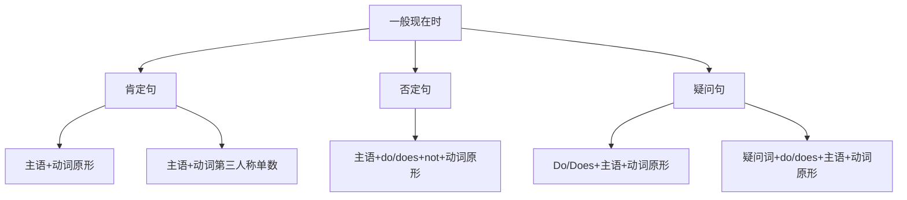

# 一般现在时

## 🎯 学习目标
- 掌握一般现在时的基本概念和构成
- 理解一般现在时的各种用法
- 熟练运用一般现在时的各种形式

## 📚 基本概念

### 一般现在时（Simple Present Tense）
**定义**：表示经常性、习惯性的动作或状态，以及客观事实和真理

### 基本特征
- 表示经常性、习惯性
- 表示客观事实和真理
- 有肯定、否定、疑问形式
- 有第三人称单数变化

## 🔄 一般现在时构成

## 📊 一般现在时变化表

### 基本变化表
| 人称 | 肯定句 | 否定句 | 疑问句 |
|------|--------|--------|--------|
| 第一人称单数 | I work. | I do not work. | Do I work? |
| 第二人称单数 | You work. | You do not work. | Do you work? |
| 第三人称单数 | He works. | He does not work. | Does he work? |
| 第一人称复数 | We work. | We do not work. | Do we work? |
| 第二人称复数 | You work. | You do not work. | Do you work? |
| 第三人称复数 | They work. | They do not work. | Do they work? |

## 🎯 基本用法

### 1. 表示经常性、习惯性的动作
**功能**：表示经常发生或习惯性的动作

**示例**：
- ✅ I get up at 6:00 every day. (我每天6点起床)
- ✅ She goes to school by bus. (她乘公共汽车上学)
- ✅ He plays football on weekends. (他周末踢足球)
- ✅ We have lunch at 12:00. (我们12点吃午饭)
- ✅ They watch TV in the evening. (他们晚上看电视)

**语法特点**：
- 表示经常性动作
- 常与频率副词连用
- 动词用原形或第三人称单数

### 2. 表示客观事实和真理
**功能**：表示客观存在的事实和普遍真理

**示例**：
- ✅ The sun rises in the east. (太阳从东方升起)
- ✅ Water boils at 100°C. (水在100°C时沸腾)
- ✅ The earth goes around the sun. (地球围绕太阳转)
- ✅ Birds can fly. (鸟会飞)
- ✅ Fish live in water. (鱼生活在水中)

**语法特点**：
- 表示客观事实
- 表示普遍真理
- 动词用原形或第三人称单数

### 3. 表示现在的状态
**功能**：表示现在存在的状态

**示例**：
- ✅ I am a student. (我是学生)
- ✅ She is beautiful. (她很美丽)
- ✅ He has a car. (他有车)
- ✅ We live in Beijing. (我们住在北京)
- ✅ They are happy. (他们很快乐)

**语法特点**：
- 表示现在状态
- 用be动词或实义动词
- 动词用原形或第三人称单数

### 4. 表示按计划、安排将要发生的动作
**功能**：表示按计划、安排将要发生的动作

**示例**：
- ✅ The train leaves at 8:00. (火车8点发车)
- ✅ The meeting starts at 9:00. (会议9点开始)
- ✅ The plane arrives at 10:00. (飞机10点到达)
- ✅ The shop opens at 8:00. (商店8点开门)
- ✅ The school begins at 8:30. (学校8:30开始)

**语法特点**：
- 表示按计划安排
- 常用于时间表、时刻表
- 动词用原形或第三人称单数

## 🎯 时间状语

### 1. 频率副词
**功能**：表示动作发生的频率

**示例**：
- ✅ I always get up early. (我总是早起)
- ✅ She usually goes to school by bus. (她通常乘公共汽车上学)
- ✅ He often plays football. (他经常踢足球)
- ✅ We sometimes have lunch together. (我们有时一起吃午饭)
- ✅ They rarely watch TV. (他们很少看电视)
- ✅ I never smoke. (我从不吸烟)

**语法特点**：
- 表示频率
- 放在实义动词前
- 放在be动词后

### 2. 时间短语
**功能**：表示动作发生的时间

**示例**：
- ✅ I work every day. (我每天工作)
- ✅ She goes to school on weekdays. (她工作日上学)
- ✅ He plays football on weekends. (他周末踢足球)
- ✅ We have lunch at noon. (我们中午吃午饭)
- ✅ They watch TV in the evening. (他们晚上看电视)
- ✅ I get up early in the morning. (我早上早起)

**语法特点**：
- 表示时间
- 放在句首或句末
- 常用介词短语

## 🎯 特殊用法

### 1. 在条件状语从句中
**功能**：在条件状语从句中表示将来

**示例**：
- ✅ If it rains tomorrow, I will stay at home. (如果明天下雨，我就待在家里)
- ✅ If you study hard, you will pass the exam. (如果你努力学习，你就会通过考试)
- ✅ If he comes, I will tell him. (如果他来，我就告诉他)
- ✅ If we have time, we will visit you. (如果我们有时间，我们就去看你)

**语法特点**：
- 在条件状语从句中
- 表示将来
- 用一般现在时

### 2. 在时间状语从句中
**功能**：在时间状语从句中表示将来

**示例**：
- ✅ When I finish my homework, I will watch TV. (当我完成作业时，我就看电视)
- ✅ After he arrives, we will start. (他到达后，我们就开始)
- ✅ Before you leave, please close the door. (你离开前，请关门)
- ✅ As soon as I see him, I will tell him. (我一见到他，就告诉他)

**语法特点**：
- 在时间状语从句中
- 表示将来
- 用一般现在时

### 3. 在宾语从句中
**功能**：在宾语从句中表示客观事实

**示例**：
- ✅ I know that he works hard. (我知道他工作努力)
- ✅ She believes that the earth is round. (她相信地球是圆的)
- ✅ He thinks that water boils at 100°C. (他认为水在100°C时沸腾)
- ✅ We understand that practice makes perfect. (我们明白熟能生巧)

**语法特点**：
- 在宾语从句中
- 表示客观事实
- 用一般现在时

## 📊 一般现在时用法对比表

| 用法 | 示例 | 说明 |
|------|------|------|
| 经常性动作 | I get up at 6:00 every day. | 表示经常发生的动作 |
| 客观事实 | The sun rises in the east. | 表示客观存在的事实 |
| 现在状态 | I am a student. | 表示现在存在的状态 |
| 按计划安排 | The train leaves at 8:00. | 表示按计划安排的动作 |
| 条件从句 | If it rains, I will stay at home. | 在条件从句中表示将来 |
| 时间从句 | When I finish, I will watch TV. | 在时间从句中表示将来 |
| 宾语从句 | I know that he works hard. | 在宾语从句中表示客观事实 |

## 🚫 常见错误分析

### 错误类型1：第三人称单数错误
**错误**：❌ He work every day.
**正确**：✅ He works every day.
**分析**：第三人称单数主语后动词加-s

### 错误类型2：be动词使用错误
**错误**：❌ I am work every day.
**正确**：✅ I work every day.
**分析**：实义动词作谓语时不用be动词

### 错误类型3：助动词使用错误
**错误**：❌ I do work every day.
**正确**：✅ I work every day.
**分析**：肯定句中不用助动词do

### 错误类型4：时间状语位置错误
**错误**：❌ I every day work.
**正确**：✅ I work every day.
**分析**：时间状语通常放在句末

## 🔗 相关链接
- [[02-现在进行时]]：现在进行时的用法
- [[03-现在完成时]]：现在完成时的用法
- [[04-现在完成进行时]]：现在完成进行时的用法
- [[05-现在时态对比分析]]：现在时态的对比分析
- [[03-动词基本形式]]：动词的基本形式

## 💡 记忆口诀

**一般现在时记忆法**：
- 经常性动作用一般现在时，客观事实用一般现在时
- 现在状态用一般现在时，按计划安排用一般现在时
- 第三人称单数加-s/-es，其他情况用原形
- 否定句用do/does+not，疑问句用do/does
- 频率副词表频率，时间短语表时间
- 条件从句时间从句用一般现在时表示将来

---
*掌握一般现在时是语法学习的基础，需要大量练习才能熟练运用*
