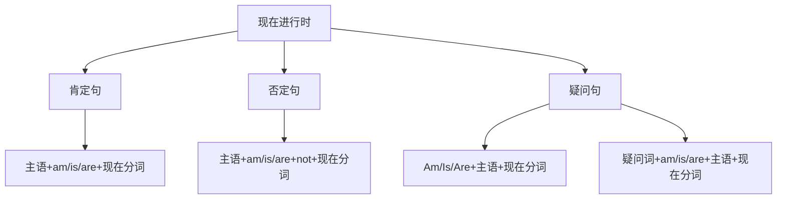

# 现在进行时

## 🎯 学习目标
- 掌握现在进行时的基本概念和构成
- 理解现在进行时的各种用法
- 熟练运用现在进行时的各种形式

## 📚 基本概念

### 现在进行时（Present Continuous Tense）
**定义**：表示现在正在进行的动作或状态

### 基本特征
- 表示现在正在进行的动作
- 表示现阶段正在进行的动作
- 有肯定、否定、疑问形式
- 用be动词+现在分词构成

## 🔄 现在进行时构成

## 📊 现在进行时变化表

### 基本变化表
| 人称 | 肯定句 | 否定句 | 疑问句 |
|------|--------|--------|--------|
| 第一人称单数 | I am working. | I am not working. | Am I working? |
| 第二人称单数 | You are working. | You are not working. | Are you working? |
| 第三人称单数 | He is working. | He is not working. | Is he working? |
| 第一人称复数 | We are working. | We are not working. | Are we working? |
| 第二人称复数 | You are working. | You are not working. | Are you working? |
| 第三人称复数 | They are working. | They are not working. | Are they working? |

## 🎯 基本用法

### 1. 表示现在正在进行的动作
**功能**：表示说话时正在进行的动作

**示例**：
- ✅ I am reading a book now. (我现在正在读书)
- ✅ She is watching TV at the moment. (她此刻正在看电视)
- ✅ He is playing football now. (他现在正在踢足球)
- ✅ We are having lunch now. (我们现在正在吃午饭)
- ✅ They are studying English now. (他们现在正在学英语)

**语法特点**：
- 表示现在正在进行的动作
- 常与now, at the moment等时间状语连用
- 用be动词+现在分词构成

### 2. 表示现阶段正在进行的动作
**功能**：表示现阶段正在进行的动作，但不一定是说话时正在进行的

**示例**：
- ✅ I am learning English these days. (我这些天在学英语)
- ✅ She is writing a novel this month. (她这个月在写小说)
- ✅ He is working on a project this week. (他这个星期在做一个项目)
- ✅ We are preparing for the exam this term. (我们这个学期在准备考试)
- ✅ They are building a new house this year. (他们今年在建新房子)

**语法特点**：
- 表示现阶段正在进行的动作
- 常与these days, this month等时间状语连用
- 用be动词+现在分词构成

### 3. 表示按计划、安排将要发生的动作
**功能**：表示按计划、安排将要发生的动作

**示例**：
- ✅ I am leaving for Beijing tomorrow. (我明天要去北京)
- ✅ She is coming to see us next week. (她下星期要来看我们)
- ✅ He is starting a new job next month. (他下个月要开始新工作)
- ✅ We are moving to a new house next year. (我们明年要搬到新房子)
- ✅ They are getting married next month. (他们下个月要结婚)

**语法特点**：
- 表示按计划安排
- 常用于表示将来的动作
- 用be动词+现在分词构成

### 4. 表示经常性动作（带有感情色彩）
**功能**：表示经常性动作，带有感情色彩

**示例**：
- ✅ He is always complaining. (他总是抱怨)
- ✅ She is constantly talking. (她不停地说话)
- ✅ He is forever asking questions. (他总是问问题)
- ✅ We are always helping others. (我们总是帮助别人)
- ✅ They are constantly making noise. (他们不停地制造噪音)

**语法特点**：
- 表示经常性动作
- 带有感情色彩
- 常与always, constantly等副词连用

## 🎯 时间状语

### 1. 现在时间状语
**功能**：表示现在的时间

**示例**：
- ✅ I am working now. (我现在正在工作)
- ✅ She is studying at the moment. (她此刻正在学习)
- ✅ He is playing football right now. (他现在正在踢足球)
- ✅ We are having dinner at present. (我们现在正在吃晚饭)
- ✅ They are watching TV currently. (他们现在正在看电视)

**语法特点**：
- 表示现在时间
- 放在句首或句末
- 常用now, at the moment等

### 2. 现阶段时间状语
**功能**：表示现阶段的时间

**示例**：
- ✅ I am learning English these days. (我这些天在学英语)
- ✅ She is writing a book this month. (她这个月在写书)
- ✅ He is working on a project this week. (他这个星期在做一个项目)
- ✅ We are preparing for the exam this term. (我们这个学期在准备考试)
- ✅ They are building a house this year. (他们今年在建房子)

**语法特点**：
- 表示现阶段时间
- 放在句首或句末
- 常用these days, this month等

## 🎯 现在分词构成

### 1. 规则变化
**规则**：动词原形+ing

**变化规则**：
| 规则 | 示例 | 说明 |
|------|------|------|
| 一般情况 | work→working, play→playing | 直接加-ing |
| 以e结尾 | live→living, hope→hoping | 去e加-ing |
| 以辅音字母+y结尾 | study→studying, try→trying | 直接加-ing |
| 以重读闭音节结尾 | stop→stopping, plan→planning | 双写辅音字母加-ing |

**示例**：
- ✅ work → working (工作)
- ✅ play → playing (玩)
- ✅ live → living (生活)
- ✅ hope → hoping (希望)
- ✅ study → studying (学习)
- ✅ try → trying (尝试)
- ✅ stop → stopping (停止)
- ✅ plan → planning (计划)

**语法特点**：
- 规则变化
- 直接加-ing
- 有特殊变化规则

### 2. 不规则变化
**规则**：不规则动词的现在分词

**示例**：
- ✅ go → going (去)
- ✅ come → coming (来)
- ✅ see → seeing (看)
- ✅ do → doing (做)
- ✅ have → having (有)
- ✅ be → being (是)

**语法特点**：
- 不规则变化
- 需要特殊记忆
- 大多数不规则动词现在分词规则

## 🎯 特殊用法

### 1. 表示将来动作
**功能**：表示按计划、安排将要发生的动作

**示例**：
- ✅ I am leaving tomorrow. (我明天要离开)
- ✅ She is coming next week. (她下星期要来)
- ✅ He is starting a new job next month. (他下个月要开始新工作)
- ✅ We are moving to a new house next year. (我们明年要搬到新房子)
- ✅ They are getting married next month. (他们下个月要结婚)

**语法特点**：
- 表示将来动作
- 按计划安排
- 用现在进行时

### 2. 表示经常性动作（带感情色彩）
**功能**：表示经常性动作，带有感情色彩

**示例**：
- ✅ He is always complaining. (他总是抱怨)
- ✅ She is constantly talking. (她不停地说话)
- ✅ He is forever asking questions. (他总是问问题)
- ✅ We are always helping others. (我们总是帮助别人)
- ✅ They are constantly making noise. (他们不停地制造噪音)

**语法特点**：
- 表示经常性动作
- 带有感情色彩
- 常与always, constantly等副词连用

### 3. 表示变化过程
**功能**：表示正在发生的变化过程

**示例**：
- ✅ The weather is getting warmer. (天气正在变暖)
- ✅ The leaves are turning yellow. (叶子正在变黄)
- ✅ The prices are rising. (价格正在上涨)
- ✅ The population is growing. (人口正在增长)
- ✅ The technology is developing. (技术正在发展)

**语法特点**：
- 表示变化过程
- 用现在进行时
- 表示正在发生的变化

## 📊 现在进行时用法对比表

| 用法 | 示例 | 说明 |
|------|------|------|
| 现在正在进行的动作 | I am reading now. | 表示说话时正在进行的动作 |
| 现阶段正在进行的动作 | I am learning English these days. | 表示现阶段正在进行的动作 |
| 按计划安排的动作 | I am leaving tomorrow. | 表示按计划安排的动作 |
| 经常性动作（带感情色彩） | He is always complaining. | 表示经常性动作，带感情色彩 |
| 变化过程 | The weather is getting warmer. | 表示正在发生的变化过程 |

## 🚫 常见错误分析

### 错误类型1：be动词使用错误
**错误**：❌ I working now.
**正确**：✅ I am working now.
**分析**：现在进行时需要用be动词

### 错误类型2：现在分词构成错误
**错误**：❌ I am work now.
**正确**：✅ I am working now.
**分析**：现在进行时需要用现在分词

### 错误类型3：时间状语使用错误
**错误**：❌ I am working yesterday.
**正确**：✅ I was working yesterday.
**分析**：过去时间用过去进行时

### 错误类型4：状态动词使用错误
**错误**：❌ I am knowing English.
**正确**：✅ I know English.
**分析**：状态动词不用进行时

## 🔗 相关链接
- [[01-一般现在时]]：一般现在时的用法
- [[03-现在完成时]]：现在完成时的用法
- [[04-现在完成进行时]]：现在完成进行时的用法
- [[05-现在时态对比分析]]：现在时态的对比分析
- [[03-动词基本形式]]：动词的基本形式

## 💡 记忆口诀

**现在进行时记忆法**：
- 现在正在进行的动作用现在进行时，现阶段正在进行的动作用现在进行时
- 按计划安排的动作用现在进行时，经常性动作带感情色彩用现在进行时
- 构成：be动词+现在分词，be动词随人称变化
- 现在分词：动词原形+ing，有特殊变化规则
- 时间状语：now, at the moment, these days, this month
- 状态动词不用进行时，变化过程用进行时

---
*掌握现在进行时是语法学习的重要基础，需要大量练习才能熟练运用*
