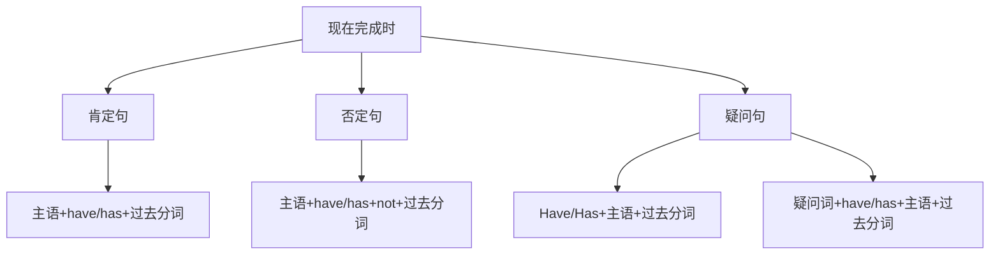

# 现在完成时

## 🎯 学习目标
- 掌握现在完成时的基本概念和构成
- 理解现在完成时的各种用法
- 熟练运用现在完成时的各种形式

## 📚 基本概念

### 现在完成时（Present Perfect Tense）
**定义**：表示过去发生的动作对现在造成的影响或结果，或者表示从过去开始一直持续到现在的动作或状态

### 基本特征
- 表示过去与现在的联系
- 表示动作的完成或持续
- 有肯定、否定、疑问形式
- 用have/has+过去分词构成

## 🔄 现在完成时构成

## 📊 现在完成时变化表

### 基本变化表
| 人称 | 肯定句 | 否定句 | 疑问句 |
|------|--------|--------|--------|
| 第一人称单数 | I have worked. | I have not worked. | Have I worked? |
| 第二人称单数 | You have worked. | You have not worked. | Have you worked? |
| 第三人称单数 | He has worked. | He has not worked. | Has he worked? |
| 第一人称复数 | We have worked. | We have not worked. | Have we worked? |
| 第二人称复数 | You have worked. | You have not worked. | Have you worked? |
| 第三人称复数 | They have worked. | They have not worked. | Have they worked? |

## 🎯 基本用法

### 1. 表示过去发生的动作对现在造成的影响或结果
**功能**：表示过去发生的动作对现在造成的影响或结果

**示例**：
- ✅ I have finished my homework. (我已经完成了作业)
- ✅ She has lost her keys. (她丢了钥匙)
- ✅ He has broken the window. (他打破了窗户)
- ✅ We have bought a new car. (我们买了一辆新车)
- ✅ They have moved to a new house. (他们搬到了新房子)

**语法特点**：
- 表示过去动作对现在的影响
- 强调结果
- 用have/has+过去分词构成

### 2. 表示从过去开始一直持续到现在的动作或状态
**功能**：表示从过去开始一直持续到现在的动作或状态

**示例**：
- ✅ I have lived here for 10 years. (我在这里住了10年)
- ✅ She has worked in this company since 2010. (她从2010年就在这家公司工作)
- ✅ He has studied English for 5 years. (他学英语已经5年了)
- ✅ We have known each other for a long time. (我们认识很久了)
- ✅ They have been married for 20 years. (他们结婚已经20年了)

**语法特点**：
- 表示持续的动作或状态
- 常与for, since连用
- 用have/has+过去分词构成

### 3. 表示过去的经历
**功能**：表示过去的经历

**示例**：
- ✅ I have been to Beijing. (我去过北京)
- ✅ She has seen this movie. (她看过这部电影)
- ✅ He has read this book. (他读过这本书)
- ✅ We have visited many countries. (我们访问过许多国家)
- ✅ They have met the president. (他们见过总统)

**语法特点**：
- 表示过去的经历
- 强调经历
- 用have/has+过去分词构成

### 4. 表示刚刚完成的动作
**功能**：表示刚刚完成的动作

**示例**：
- ✅ I have just finished my work. (我刚刚完成工作)
- ✅ She has just arrived. (她刚刚到达)
- ✅ He has just left. (他刚刚离开)
- ✅ We have just started. (我们刚刚开始)
- ✅ They have just finished. (他们刚刚完成)

**语法特点**：
- 表示刚刚完成的动作
- 常与just连用
- 用have/has+过去分词构成

## 🎯 时间状语

### 1. 表示不确定时间的状语
**功能**：表示不确定的时间

**示例**：
- ✅ I have already finished my homework. (我已经完成了作业)
- ✅ She has never been to Japan. (她从未去过日本)
- ✅ He has ever seen this movie. (他曾经看过这部电影)
- ✅ We have just arrived. (我们刚刚到达)
- ✅ They have recently moved. (他们最近搬了家)

**语法特点**：
- 表示不确定时间
- 常用already, never, ever, just, recently等
- 放在have/has和过去分词之间

### 2. 表示持续时间的状语
**功能**：表示持续的时间

**示例**：
- ✅ I have lived here for 10 years. (我在这里住了10年)
- ✅ She has worked here since 2010. (她从2010年就在这里工作)
- ✅ He has studied English for 5 years. (他学英语已经5年了)
- ✅ We have known each other for a long time. (我们认识很久了)
- ✅ They have been married for 20 years. (他们结婚已经20年了)

**语法特点**：
- 表示持续时间
- 常用for, since连用
- for后接时间段，since后接时间点

### 3. 表示次数的状语
**功能**：表示动作发生的次数

**示例**：
- ✅ I have been to Beijing twice. (我去过北京两次)
- ✅ She has seen this movie three times. (她看过这部电影三次)
- ✅ He has read this book once. (他读过这本书一次)
- ✅ We have visited this place many times. (我们访问过这个地方多次)
- ✅ They have met each other several times. (他们见过几次面)

**语法特点**：
- 表示次数
- 常用once, twice, three times, many times等
- 放在句末

## 🎯 过去分词构成

### 1. 规则变化
**规则**：动词原形+ed

**变化规则**：
| 规则 | 示例 | 说明 |
|------|------|------|
| 一般情况 | work→worked, play→played | 直接加-ed |
| 以e结尾 | live→lived, hope→hoped | 直接加-d |
| 以辅音字母+y结尾 | study→studied, try→tried | 变y为i加-ed |
| 以重读闭音节结尾 | stop→stopped, plan→planned | 双写辅音字母加-ed |

**示例**：
- ✅ work → worked (工作)
- ✅ play → played (玩)
- ✅ live → lived (生活)
- ✅ hope → hoped (希望)
- ✅ study → studied (学习)
- ✅ try → tried (尝试)
- ✅ stop → stopped (停止)
- ✅ plan → planned (计划)

**语法特点**：
- 规则变化
- 直接加-ed
- 有特殊变化规则

### 2. 不规则变化
**规则**：不规则动词的过去分词

**示例**：
- ✅ go → gone (去)
- ✅ come → come (来)
- ✅ see → seen (看)
- ✅ do → done (做)
- ✅ have → had (有)
- ✅ be → been (是)

**语法特点**：
- 不规则变化
- 需要特殊记忆
- 大多数不规则动词过去分词不规则

## 🎯 特殊用法

### 1. 表示过去的经历
**功能**：表示过去的经历

**示例**：
- ✅ I have been to Beijing. (我去过北京)
- ✅ She has seen this movie. (她看过这部电影)
- ✅ He has read this book. (他读过这本书)
- ✅ We have visited many countries. (我们访问过许多国家)
- ✅ They have met the president. (他们见过总统)

**语法特点**：
- 表示过去的经历
- 强调经历
- 用have/has+过去分词构成

### 2. 表示刚刚完成的动作
**功能**：表示刚刚完成的动作

**示例**：
- ✅ I have just finished my work. (我刚刚完成工作)
- ✅ She has just arrived. (她刚刚到达)
- ✅ He has just left. (他刚刚离开)
- ✅ We have just started. (我们刚刚开始)
- ✅ They have just finished. (他们刚刚完成)

**语法特点**：
- 表示刚刚完成的动作
- 常与just连用
- 用have/has+过去分词构成

### 3. 表示持续的动作或状态
**功能**：表示从过去开始一直持续到现在的动作或状态

**示例**：
- ✅ I have lived here for 10 years. (我在这里住了10年)
- ✅ She has worked in this company since 2010. (她从2010年就在这家公司工作)
- ✅ He has studied English for 5 years. (他学英语已经5年了)
- ✅ We have known each other for a long time. (我们认识很久了)
- ✅ They have been married for 20 years. (他们结婚已经20年了)

**语法特点**：
- 表示持续的动作或状态
- 常与for, since连用
- 用have/has+过去分词构成

## 📊 现在完成时用法对比表

| 用法 | 示例 | 说明 |
|------|------|------|
| 过去动作对现在的影响 | I have finished my homework. | 表示过去动作对现在的影响 |
| 持续的动作或状态 | I have lived here for 10 years. | 表示持续的动作或状态 |
| 过去的经历 | I have been to Beijing. | 表示过去的经历 |
| 刚刚完成的动作 | I have just finished my work. | 表示刚刚完成的动作 |

## 🚫 常见错误分析

### 错误类型1：have/has使用错误
**错误**：❌ I has finished my homework.
**正确**：✅ I have finished my homework.
**分析**：第一人称用have，第三人称单数用has

### 错误类型2：过去分词使用错误
**错误**：❌ I have finish my homework.
**正确**：✅ I have finished my homework.
**分析**：现在完成时需要用过去分词

### 错误类型3：时间状语使用错误
**错误**：❌ I have finished my homework yesterday.
**正确**：✅ I finished my homework yesterday.
**分析**：具体过去时间用一般过去时

### 错误类型4：for和since使用错误
**错误**：❌ I have lived here since 10 years.
**正确**：✅ I have lived here for 10 years.
**分析**：for后接时间段，since后接时间点

## 🔗 相关链接
- [[01-一般现在时]]：一般现在时的用法
- [[02-现在进行时]]：现在进行时的用法
- [[04-现在完成进行时]]：现在完成进行时的用法
- [[05-现在时态对比分析]]：现在时态的对比分析
- [[03-动词基本形式]]：动词的基本形式

## 💡 记忆口诀

**现在完成时记忆法**：
- 过去动作对现在的影响用现在完成时，持续的动作或状态用现在完成时
- 过去的经历用现在完成时，刚刚完成的动作用现在完成时
- 构成：have/has+过去分词，have随人称变化
- 时间状语：already, never, ever, just, recently, for, since
- for后接时间段，since后接时间点
- 具体过去时间用一般过去时，不确定时间用现在完成时

---
*掌握现在完成时是语法学习的重要基础，需要大量练习才能熟练运用*
