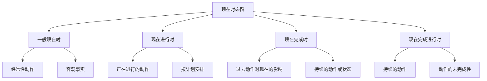

# 现在时态对比分析

## 🎯 学习目标
- 掌握现在时态群的基本概念和构成
- 理解现在时态群的各种用法
- 熟练运用现在时态群的各种形式

## 📚 基本概念

### 现在时态群（Present Tense Group）
**定义**：表示现在时间范畴的各种时态的总称

### 基本特征
- 表示现在时间范畴
- 包括四种时态
- 有各自的特点和用法
- 需要区分使用

## 🔄 现在时态群分类

## 📊 现在时态群对比表

### 基本对比表
| 时态 | 构成 | 基本用法 | 时间状语 | 示例 |
|------|------|----------|----------|------|
| 一般现在时 | 动词原形/第三人称单数 | 经常性动作、客观事实 | always, usually, often | I work every day. |
| 现在进行时 | am/is/are+现在分词 | 正在进行的动作 | now, at the moment | I am working now. |
| 现在完成时 | have/has+过去分词 | 过去动作对现在的影响 | already, never, just | I have finished my work. |
| 现在完成进行时 | have/has+been+现在分词 | 持续的动作 | for, since, recently | I have been working for 3 hours. |

## 🎯 一般现在时

### 1. 基本概念
**定义**：表示经常性、习惯性的动作或状态，以及客观事实和真理

**特征**：
- 表示经常性、习惯性
- 表示客观事实和真理
- 有肯定、否定、疑问形式
- 有第三人称单数变化

### 2. 基本用法
**用法**：
- 表示经常性、习惯性的动作
- 表示客观事实和真理
- 表示现在的状态
- 表示按计划、安排将要发生的动作

**示例**：
- ✅ I get up at 6:00 every day. (我每天6点起床)
- ✅ The sun rises in the east. (太阳从东方升起)
- ✅ I am a student. (我是学生)
- ✅ The train leaves at 8:00. (火车8点发车)

### 3. 时间状语
**时间状语**：
- 频率副词：always, usually, often, sometimes, rarely, never
- 时间短语：every day, on weekdays, on weekends, at noon, in the evening

## 🎯 现在进行时

### 1. 基本概念
**定义**：表示现在正在进行的动作或状态

**特征**：
- 表示现在正在进行的动作
- 表示现阶段正在进行的动作
- 有肯定、否定、疑问形式
- 用be动词+现在分词构成

### 2. 基本用法
**用法**：
- 表示现在正在进行的动作
- 表示现阶段正在进行的动作
- 表示按计划、安排将要发生的动作
- 表示经常性动作（带有感情色彩）

**示例**：
- ✅ I am reading a book now. (我现在正在读书)
- ✅ I am learning English these days. (我这些天在学英语)
- ✅ I am leaving for Beijing tomorrow. (我明天要去北京)
- ✅ He is always complaining. (他总是抱怨)

### 3. 时间状语
**时间状语**：
- 现在时间：now, at the moment, right now, at present, currently
- 现阶段时间：these days, this month, this week, this term, this year

## 🎯 现在完成时

### 1. 基本概念
**定义**：表示过去发生的动作对现在造成的影响或结果，或者表示从过去开始一直持续到现在的动作或状态

**特征**：
- 表示过去与现在的联系
- 表示动作的完成或持续
- 有肯定、否定、疑问形式
- 用have/has+过去分词构成

### 2. 基本用法
**用法**：
- 表示过去发生的动作对现在造成的影响或结果
- 表示从过去开始一直持续到现在的动作或状态
- 表示过去的经历
- 表示刚刚完成的动作

**示例**：
- ✅ I have finished my homework. (我已经完成了作业)
- ✅ I have lived here for 10 years. (我在这里住了10年)
- ✅ I have been to Beijing. (我去过北京)
- ✅ I have just finished my work. (我刚刚完成工作)

### 3. 时间状语
**时间状语**：
- 不确定时间：already, never, ever, just, recently
- 持续时间：for, since
- 次数：once, twice, three times, many times

## 🎯 现在完成进行时

### 1. 基本概念
**定义**：表示从过去开始一直持续到现在，并且可能继续下去的动作

**特征**：
- 表示持续的动作
- 表示动作的未完成性
- 有肯定、否定、疑问形式
- 用have/has+been+现在分词构成

### 2. 基本用法
**用法**：
- 表示从过去开始一直持续到现在，并且可能继续下去的动作
- 表示最近一直在进行的动作
- 表示动作的重复性
- 表示动作的渐进性

**示例**：
- ✅ I have been working for 3 hours. (我已经工作了3个小时)
- ✅ I have been reading this book recently. (我最近一直在读这本书)
- ✅ I have been calling you all day. (我一整天都在给你打电话)
- ✅ The weather has been getting warmer. (天气一直在变暖)

### 3. 时间状语
**时间状语**：
- 持续时间：for, since
- 最近时间：recently, lately, these days
- 频率：all day, constantly, repeatedly

## 🔄 现在时态群对比分析

### 1. 时间概念对比
| 时态 | 时间概念 | 特点 | 示例 |
|------|----------|------|------|
| 一般现在时 | 现在 | 经常性、习惯性 | I work every day. |
| 现在进行时 | 现在 | 正在进行的动作 | I am working now. |
| 现在完成时 | 过去与现在 | 过去动作对现在的影响 | I have finished my work. |
| 现在完成进行时 | 过去到现在 | 持续的动作 | I have been working for 3 hours. |

### 2. 动作性质对比
| 时态 | 动作性质 | 特点 | 示例 |
|------|----------|------|------|
| 一般现在时 | 经常性动作 | 习惯性、规律性 | I get up at 6:00 every day. |
| 现在进行时 | 进行性动作 | 正在进行的动作 | I am reading a book now. |
| 现在完成时 | 完成性动作 | 动作已完成 | I have finished my homework. |
| 现在完成进行时 | 持续性动作 | 动作持续进行 | I have been working for 3 hours. |

### 3. 语法构成对比
| 时态 | 构成 | 特点 | 示例 |
|------|------|------|------|
| 一般现在时 | 动词原形/第三人称单数 | 简单构成 | I work. / He works. |
| 现在进行时 | am/is/are+现在分词 | 进行时态 | I am working. |
| 现在完成时 | have/has+过去分词 | 完成时态 | I have worked. |
| 现在完成进行时 | have/has+been+现在分词 | 完成进行时态 | I have been working. |

## 🎯 现在时态群选择技巧

### 1. 根据时间概念选择
- 现在时间：一般现在时、现在进行时
- 过去与现在：现在完成时
- 过去到现在：现在完成进行时

### 2. 根据动作性质选择
- 经常性动作：一般现在时
- 进行性动作：现在进行时
- 完成性动作：现在完成时
- 持续性动作：现在完成进行时

### 3. 根据语法功能选择
- 简单表达：一般现在时
- 进行表达：现在进行时
- 完成表达：现在完成时
- 完成进行表达：现在完成进行时

## 🚫 常见错误分析

### 错误类型1：时态选择错误
**错误**：❌ I am work every day.
**正确**：✅ I work every day.
**分析**：经常性动作用一般现在时

### 错误类型2：时态构成错误
**错误**：❌ I have work for 3 hours.
**正确**：✅ I have been working for 3 hours.
**分析**：持续动作用现在完成进行时

### 错误类型3：时间状语使用错误
**错误**：❌ I have finished my work yesterday.
**正确**：✅ I finished my work yesterday.
**分析**：具体过去时间用一般过去时

### 错误类型4：动作性质判断错误
**错误**：❌ I am knowing English.
**正确**：✅ I know English.
**分析**：状态动词不用进行时

## 📊 现在时态群用法总结

| 时态 | 主要用法 | 时间状语 | 典型例句 |
|------|----------|----------|----------|
| 一般现在时 | 经常性动作、客观事实 | always, usually, every day | I work every day. |
| 现在进行时 | 正在进行的动作 | now, at the moment | I am working now. |
| 现在完成时 | 过去动作对现在的影响 | already, never, just | I have finished my work. |
| 现在完成进行时 | 持续的动作 | for, since, recently | I have been working for 3 hours. |

## 🔗 相关链接
- [[01-一般现在时]]：一般现在时的用法
- [[02-现在进行时]]：现在进行时的用法
- [[03-现在完成时]]：现在完成时的用法
- [[04-现在完成进行时]]：现在完成进行时的用法
- [[03-动词基本形式]]：动词的基本形式

## 💡 记忆口诀

**现在时态群记忆法**：
- 一般现在时表示经常性动作和客观事实，现在进行时表示正在进行的动作
- 现在完成时表示过去动作对现在的影响，现在完成进行时表示持续的动作
- 时间概念要分清，动作性质要判断
- 语法构成要记牢，时间状语要准确
- 时态选择要正确，错误用法要避免

---
*掌握现在时态群对比分析是语法学习的重要基础，需要大量练习才能熟练运用*
