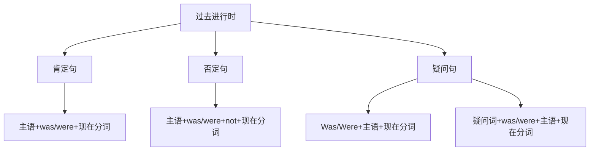

# 过去进行时

## 🎯 学习目标
- 掌握过去进行时的基本概念和构成
- 理解过去进行时的各种用法
- 熟练运用过去进行时的各种形式

## 📚 基本概念

### 过去进行时（Past Continuous Tense）
**定义**：表示过去某个时间正在进行的动作

### 基本特征
- 表示过去正在进行的动作
- 有肯定、否定、疑问形式
- 用was/were+现在分词构成
- 常与过去时间状语连用

## 🔄 过去进行时构成

## 📊 过去进行时变化表

### 基本变化表
| 人称 | 肯定句 | 否定句 | 疑问句 |
|------|--------|--------|--------|
| 第一人称单数 | I was working. | I was not working. | Was I working? |
| 第二人称单数 | You were working. | You were not working. | Were you working? |
| 第三人称单数 | He was working. | He was not working. | Was he working? |
| 第一人称复数 | We were working. | We were not working. | Were we working? |
| 第二人称复数 | You were working. | You were not working. | Were you working? |
| 第三人称复数 | They were working. | They were not working. | Were they working? |

## 🎯 基本用法

### 1. 表示过去某个时间正在进行的动作
**功能**：表示过去某个时间正在进行的动作

**示例**：
- ✅ I was reading a book at 8:00 yesterday. (我昨天8点正在读书)
- ✅ She was watching TV when I called her. (我给她打电话时，她正在看电视)
- ✅ He was playing football at 3:00 yesterday. (他昨天3点正在踢足球)
- ✅ We were having dinner when you arrived. (你到达时，我们正在吃晚饭)
- ✅ They were studying English at that time. (那时他们正在学英语)

**语法特点**：
- 表示过去正在进行的动作
- 常与过去时间状语连用
- 用was/were+现在分词构成

### 2. 表示过去某个时间段正在进行的动作
**功能**：表示过去某个时间段正在进行的动作

**示例**：
- ✅ I was working from 9:00 to 12:00 yesterday. (我昨天从9点到12点在工作)
- ✅ She was studying all day yesterday. (她昨天整天在学习)
- ✅ He was playing football for 2 hours yesterday. (他昨天踢了2个小时足球)
- ✅ We were traveling for a week last month. (我们上个月旅行了一个星期)
- ✅ They were building a house for 6 months last year. (他们去年建了6个月房子)

**语法特点**：
- 表示过去某个时间段正在进行的动作
- 常与时间段状语连用
- 用was/were+现在分词构成

### 3. 表示过去两个同时进行的动作
**功能**：表示过去两个同时进行的动作

**示例**：
- ✅ While I was reading, she was watching TV. (我在读书时，她在看电视)
- ✅ While he was playing football, she was studying. (他在踢足球时，她在学习)
- ✅ While we were having dinner, they were talking. (我们在吃晚饭时，他们在谈话)
- ✅ While I was working, my phone was ringing. (我在工作时，电话在响)
- ✅ While she was cooking, he was cleaning. (她在做饭时，他在打扫)

**语法特点**：
- 表示过去两个同时进行的动作
- 常用while连接
- 用was/were+现在分词构成

### 4. 表示过去按计划、安排将要发生的动作
**功能**：表示过去按计划、安排将要发生的动作

**示例**：
- ✅ I was leaving for Beijing tomorrow. (我明天要去北京)
- ✅ She was coming to see us next week. (她下星期要来看我们)
- ✅ He was starting a new job next month. (他下个月要开始新工作)
- ✅ We were moving to a new house next year. (我们明年要搬到新房子)
- ✅ They were getting married next month. (他们下个月要结婚)

**语法特点**：
- 表示过去按计划安排
- 常用于表示将来的动作
- 用was/were+现在分词构成

## 🎯 时间状语

### 1. 表示过去时间点的状语
**功能**：表示过去的具体时间点

**示例**：
- ✅ I was reading a book at 8:00 yesterday. (我昨天8点正在读书)
- ✅ She was watching TV at 3:00 yesterday. (她昨天3点正在看电视)
- ✅ He was playing football at 5:00 yesterday. (他昨天5点正在踢足球)
- ✅ We were having dinner at 7:00 yesterday. (我们昨天7点正在吃晚饭)
- ✅ They were studying at 9:00 yesterday. (他们昨天9点正在学习)

**语法特点**：
- 表示过去的具体时间点
- 常用at+时间点
- 放在句首或句末

### 2. 表示过去时间段的状语
**功能**：表示过去的时间段

**示例**：
- ✅ I was working from 9:00 to 12:00 yesterday. (我昨天从9点到12点在工作)
- ✅ She was studying all day yesterday. (她昨天整天在学习)
- ✅ He was playing football for 2 hours yesterday. (他昨天踢了2个小时足球)
- ✅ We were traveling for a week last month. (我们上个月旅行了一个星期)
- ✅ They were building a house for 6 months last year. (他们去年建了6个月房子)

**语法特点**：
- 表示过去的时间段
- 常用from...to..., for+时间段
- 放在句首或句末

### 3. 表示过去时间的状语从句
**功能**：表示过去时间的状语从句

**示例**：
- ✅ While I was reading, she was watching TV. (我在读书时，她在看电视)
- ✅ When I arrived, he was playing football. (我到达时，他在踢足球)
- ✅ As I was walking, I saw a cat. (我走路时，看见了一只猫)
- ✅ While we were having dinner, they were talking. (我们在吃晚饭时，他们在谈话)
- ✅ When she called, I was working. (她打电话时，我在工作)

**语法特点**：
- 表示过去时间的状语从句
- 常用while, when, as连接
- 放在句首或句末

## 🎯 现在分词构成

### 1. 规则变化
**规则**：动词原形+ing

**变化规则**：
| 规则 | 示例 | 说明 |
|------|------|------|
| 一般情况 | work→working, play→playing | 直接加-ing |
| 以e结尾 | live→living, hope→hoping | 去e加-ing |
| 以辅音字母+y结尾 | study→studying, try→trying | 直接加-ing |
| 以重读闭音节结尾 | stop→stopping, plan→planning | 双写辅音字母加-ing |

**示例**：
- ✅ work → working (工作)
- ✅ play → playing (玩)
- ✅ live → living (生活)
- ✅ hope → hoping (希望)
- ✅ study → studying (学习)
- ✅ try → trying (尝试)
- ✅ stop → stopping (停止)
- ✅ plan → planning (计划)

**语法特点**：
- 规则变化
- 直接加-ing
- 有特殊变化规则

### 2. 不规则变化
**规则**：不规则动词的现在分词

**示例**：
- ✅ go → going (去)
- ✅ come → coming (来)
- ✅ see → seeing (看)
- ✅ do → doing (做)
- ✅ have → having (有)
- ✅ be → being (是)

**语法特点**：
- 不规则变化
- 需要特殊记忆
- 大多数不规则动词现在分词规则

## 🎯 特殊用法

### 1. 表示过去两个同时进行的动作
**功能**：表示过去两个同时进行的动作

**示例**：
- ✅ While I was reading, she was watching TV. (我在读书时，她在看电视)
- ✅ While he was playing football, she was studying. (他在踢足球时，她在学习)
- ✅ While we were having dinner, they were talking. (我们在吃晚饭时，他们在谈话)
- ✅ While I was working, my phone was ringing. (我在工作时，电话在响)
- ✅ While she was cooking, he was cleaning. (她在做饭时，他在打扫)

**语法特点**：
- 表示过去两个同时进行的动作
- 常用while连接
- 用was/were+现在分词构成

### 2. 表示过去按计划、安排将要发生的动作
**功能**：表示过去按计划、安排将要发生的动作

**示例**：
- ✅ I was leaving for Beijing tomorrow. (我明天要去北京)
- ✅ She was coming to see us next week. (她下星期要来看我们)
- ✅ He was starting a new job next month. (他下个月要开始新工作)
- ✅ We were moving to a new house next year. (我们明年要搬到新房子)
- ✅ They were getting married next month. (他们下个月要结婚)

**语法特点**：
- 表示过去按计划安排
- 常用于表示将来的动作
- 用was/were+现在分词构成

### 3. 表示过去经常性动作（带有感情色彩）
**功能**：表示过去经常性动作，带有感情色彩

**示例**：
- ✅ He was always complaining. (他总是抱怨)
- ✅ She was constantly talking. (她不停地说话)
- ✅ He was forever asking questions. (他总是问问题)
- ✅ We were always helping others. (我们总是帮助别人)
- ✅ They were constantly making noise. (他们不停地制造噪音)

**语法特点**：
- 表示过去经常性动作
- 带有感情色彩
- 常与always, constantly等副词连用

## 📊 过去进行时用法对比表

| 用法 | 示例 | 说明 |
|------|------|------|
| 过去正在进行的动作 | I was reading at 8:00 yesterday. | 表示过去正在进行的动作 |
| 过去时间段正在进行的动作 | I was working from 9:00 to 12:00. | 表示过去时间段正在进行的动作 |
| 过去两个同时进行的动作 | While I was reading, she was watching TV. | 表示过去两个同时进行的动作 |
| 过去按计划安排的动作 | I was leaving for Beijing tomorrow. | 表示过去按计划安排的动作 |

## 🚫 常见错误分析

### 错误类型1：was/were使用错误
**错误**：❌ I were working yesterday.
**正确**：✅ I was working yesterday.
**分析**：第一人称单数用was，复数用were

### 错误类型2：现在分词构成错误
**错误**：❌ I was work yesterday.
**正确**：✅ I was working yesterday.
**分析**：过去进行时需要用现在分词

### 错误类型3：时间状语使用错误
**错误**：❌ I was working tomorrow.
**正确**：✅ I will be working tomorrow.
**分析**：将来时间用将来进行时

### 错误类型4：状态动词使用错误
**错误**：❌ I was knowing English.
**正确**：✅ I knew English.
**分析**：状态动词不用进行时

## 🔗 相关链接
- [[01-一般过去时]]：一般过去时的用法
- [[03-过去完成时]]：过去完成时的用法
- [[04-过去完成进行时]]：过去完成进行时的用法
- [[05-过去时态对比分析]]：过去时态的对比分析
- [[03-动词基本形式]]：动词的基本形式

## 💡 记忆口诀

**过去进行时记忆法**：
- 过去正在进行的动作用过去进行时，过去时间段正在进行的动作用过去进行时
- 过去两个同时进行的动作用过去进行时，过去按计划安排的动作用过去进行时
- 构成：was/were+现在分词，was用于单数，were用于复数
- 现在分词：动词原形+ing，有特殊变化规则
- 时间状语：at+时间点，from...to..., while, when
- 状态动词不用进行时，将来时间用将来进行时

---
*掌握过去进行时是语法学习的重要基础，需要大量练习才能熟练运用*
