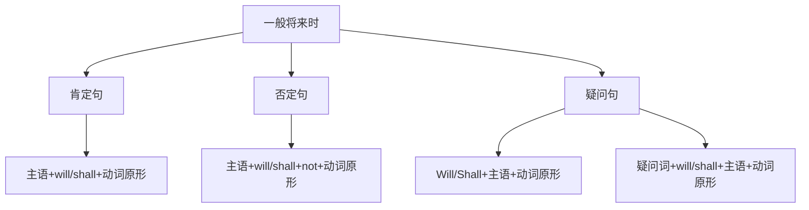

# 一般将来时

## 🎯 学习目标
- 掌握一般将来时的基本概念和构成
- 理解一般将来时的各种用法
- 熟练运用一般将来时的各种形式

## 📚 基本概念

### 一般将来时（Simple Future Tense）
**定义**：表示将来某个时间将要发生的动作或状态

### 基本特征
- 表示将来的动作或状态
- 有肯定、否定、疑问形式
- 用will/shall+动词原形构成
- 常与将来时间状语连用

## 🔄 一般将来时构成

## 📊 一般将来时变化表

### 基本变化表
| 人称 | 肯定句 | 否定句 | 疑问句 |
|------|--------|--------|--------|
| 第一人称单数 | I will work. | I will not work. | Will I work? |
| 第二人称单数 | You will work. | You will not work. | Will you work? |
| 第三人称单数 | He will work. | He will not work. | Will he work? |
| 第一人称复数 | We will work. | We will not work. | Will we work? |
| 第二人称复数 | You will work. | You will not work. | Will you work? |
| 第三人称复数 | They will work. | They will not work. | Will they work? |

## 🎯 基本用法

### 1. 表示将来某个时间将要发生的动作
**功能**：表示将来某个时间将要发生的动作

**示例**：
- ✅ I will go to Beijing tomorrow. (我明天要去北京)
- ✅ She will study English next year. (她明年要学英语)
- ✅ He will play football next week. (他下周要踢足球)
- ✅ We will have dinner at 7:00 tomorrow. (我们明天7点要吃晚饭)
- ✅ They will visit the museum next month. (他们下个月要参观博物馆)

**语法特点**：
- 表示将来发生的动作
- 常与将来时间状语连用
- 用will+动词原形构成

### 2. 表示将来存在的状态
**功能**：表示将来存在的状态

**示例**：
- ✅ I will be a student next year. (我明年将是学生)
- ✅ She will be beautiful when she grows up. (她长大后会很美丽)
- ✅ He will have a car next year. (他明年将有车)
- ✅ We will live in Shanghai next year. (我们明年将住在上海)
- ✅ They will be happy tomorrow. (他们明天将很快乐)

**语法特点**：
- 表示将来存在的状态
- 用will+be+形容词/名词构成
- 用will+have+名词构成

### 3. 表示将来的习惯性动作
**功能**：表示将来的习惯性动作

**示例**：
- ✅ I will always get up early. (我将总是早起)
- ✅ She will often go to the library. (她将经常去图书馆)
- ✅ He will usually play basketball after school. (他通常放学后将打篮球)
- ✅ We will sometimes have dinner together. (我们有时将一起吃晚饭)
- ✅ They will rarely watch TV. (他们将很少看电视)

**语法特点**：
- 表示将来的习惯性动作
- 常与频率副词连用
- 用will+动词原形构成

### 4. 表示将来的意愿
**功能**：表示将来的意愿

**示例**：
- ✅ I will help you. (我将帮助你)
- ✅ She will come to see us. (她将来看我们)
- ✅ He will do his best. (他将尽力而为)
- ✅ We will support you. (我们将支持你)
- ✅ They will try their best. (他们将尽力而为)

**语法特点**：
- 表示将来的意愿
- 强调主观意愿
- 用will+动词原形构成

## 🎯 时间状语

### 1. 表示将来时间的状语
**功能**：表示将来的时间

**示例**：
- ✅ I will go to Beijing tomorrow. (我明天要去北京)
- ✅ She will study English next year. (她明年要学英语)
- ✅ He will play football next week. (他下周要踢足球)
- ✅ We will have dinner at 7:00 tomorrow. (我们明天7点要吃晚饭)
- ✅ They will visit the museum next month. (他们下个月要参观博物馆)

**语法特点**：
- 表示将来时间
- 常用tomorrow, next year, next week等
- 放在句首或句末

### 2. 表示将来时间点的状语
**功能**：表示将来的具体时间点

**示例**：
- ✅ I will arrive at 8:00 tomorrow morning. (我明天早上8点将到达)
- ✅ She will leave at 3:00 tomorrow afternoon. (她明天下午3点将离开)
- ✅ He will call me at 9:00 tomorrow night. (他明晚9点将给我打电话)
- ✅ We will meet at 2:00 tomorrow. (我们明天2点将见面)
- ✅ They will start at 10:00 tomorrow. (他们明天10点将开始)

**语法特点**：
- 表示将来的具体时间点
- 常用at+时间点
- 放在句首或句末

### 3. 表示将来时间段的状语
**功能**：表示将来的时间段

**示例**：
- ✅ I will work for 8 hours tomorrow. (我明天将工作8个小时)
- ✅ She will study for 3 hours tomorrow night. (她明晚将学习3个小时)
- ✅ He will play football for 2 hours next week. (他下周将踢2个小时足球)
- ✅ We will stay there for a week next month. (我们下个月将在那里待一个星期)
- ✅ They will travel for 10 days next year. (他们明年将旅行10天)

**语法特点**：
- 表示将来的时间段
- 常用for+时间段
- 放在句首或句末

## 🎯 其他将来时表达方式

### 1. be going to结构
**功能**：表示按计划、安排将要发生的动作

**示例**：
- ✅ I am going to go to Beijing tomorrow. (我明天要去北京)
- ✅ She is going to study English next year. (她明年要学英语)
- ✅ He is going to play football next week. (他下周要踢足球)
- ✅ We are going to have dinner at 7:00 tomorrow. (我们明天7点要吃晚饭)
- ✅ They are going to visit the museum next month. (他们下个月要参观博物馆)

**语法特点**：
- 表示按计划安排
- 用be going to+动词原形构成
- 比will更强调计划性

### 2. be about to结构
**功能**：表示即将发生的动作

**示例**：
- ✅ I am about to leave. (我即将离开)
- ✅ She is about to start. (她即将开始)
- ✅ He is about to finish. (他即将完成)
- ✅ We are about to begin. (我们即将开始)
- ✅ They are about to arrive. (他们即将到达)

**语法特点**：
- 表示即将发生
- 用be about to+动词原形构成
- 强调动作的紧迫性

### 3. 现在进行时表示将来
**功能**：表示按计划、安排将要发生的动作

**示例**：
- ✅ I am leaving for Beijing tomorrow. (我明天要去北京)
- ✅ She is coming to see us next week. (她下星期要来看我们)
- ✅ He is starting a new job next month. (他下个月要开始新工作)
- ✅ We are moving to a new house next year. (我们明年要搬到新房子)
- ✅ They are getting married next month. (他们下个月要结婚)

**语法特点**：
- 表示按计划安排
- 用现在进行时表示将来
- 常用于表示将来的动作

## 🎯 特殊用法

### 1. 表示将来的意愿
**功能**：表示将来的意愿

**示例**：
- ✅ I will help you. (我将帮助你)
- ✅ She will come to see us. (她将来看我们)
- ✅ He will do his best. (他将尽力而为)
- ✅ We will support you. (我们将支持你)
- ✅ They will try their best. (他们将尽力而为)

**语法特点**：
- 表示将来的意愿
- 强调主观意愿
- 用will+动词原形构成

### 2. 表示将来的预测
**功能**：表示将来的预测

**示例**：
- ✅ It will rain tomorrow. (明天将下雨)
- ✅ She will be successful. (她将成功)
- ✅ He will pass the exam. (他将通过考试)
- ✅ We will win the game. (我们将赢得比赛)
- ✅ They will be happy. (他们将很快乐)

**语法特点**：
- 表示将来的预测
- 强调客观预测
- 用will+动词原形构成

### 3. 表示将来的承诺
**功能**：表示将来的承诺

**示例**：
- ✅ I will be there on time. (我将准时到达那里)
- ✅ She will finish the work. (她将完成工作)
- ✅ He will keep his promise. (他将遵守诺言)
- ✅ We will help you. (我们将帮助你)
- ✅ They will do their best. (他们将尽力而为)

**语法特点**：
- 表示将来的承诺
- 强调承诺的可靠性
- 用will+动词原形构成

## 📊 一般将来时用法对比表

| 用法 | 示例 | 说明 |
|------|------|------|
| 将来发生的动作 | I will go to Beijing tomorrow. | 表示将来发生的动作 |
| 将来存在的状态 | I will be a student next year. | 表示将来存在的状态 |
| 将来的习惯性动作 | I will always get up early. | 表示将来的习惯性动作 |
| 将来的意愿 | I will help you. | 表示将来的意愿 |
| 将来的预测 | It will rain tomorrow. | 表示将来的预测 |
| 将来的承诺 | I will be there on time. | 表示将来的承诺 |

## 🚫 常见错误分析

### 错误类型1：will使用错误
**错误**：❌ I will to go to Beijing tomorrow.
**正确**：✅ I will go to Beijing tomorrow.
**分析**：will后接动词原形

### 错误类型2：时间状语使用错误
**错误**：❌ I will go to Beijing yesterday.
**正确**：✅ I went to Beijing yesterday.
**分析**：过去时间用过去时态

### 错误类型3：be going to使用错误
**错误**：❌ I am going to will go to Beijing tomorrow.
**正确**：✅ I am going to go to Beijing tomorrow.
**分析**：be going to后接动词原形

### 错误类型4：现在进行时表示将来错误
**错误**：❌ I am going to Beijing tomorrow.
**正确**：✅ I am going to go to Beijing tomorrow.
**分析**：现在进行时表示将来需要动词原形

## 🔗 相关链接
- [[02-将来进行时]]：将来进行时的用法
- [[03-将来完成时]]：将来完成时的用法
- [[04-将来完成进行时]]：将来完成进行时的用法
- [[05-将来时态对比分析]]：将来时态的对比分析
- [[03-动词基本形式]]：动词的基本形式

## 💡 记忆口诀

**一般将来时记忆法**：
- 将来发生的动作用一般将来时，将来存在的状态用一般将来时
- 将来的习惯性动作用一般将来时，将来的意愿用一般将来时
- 构成：will+动词原形，will随人称变化
- 时间状语：tomorrow, next year, next week, next month
- 其他表达：be going to, be about to, 现在进行时表示将来
- 过去时间用过去时态，将来时间用将来时态

---
*掌握一般将来时是语法学习的重要基础，需要大量练习才能熟练运用*
