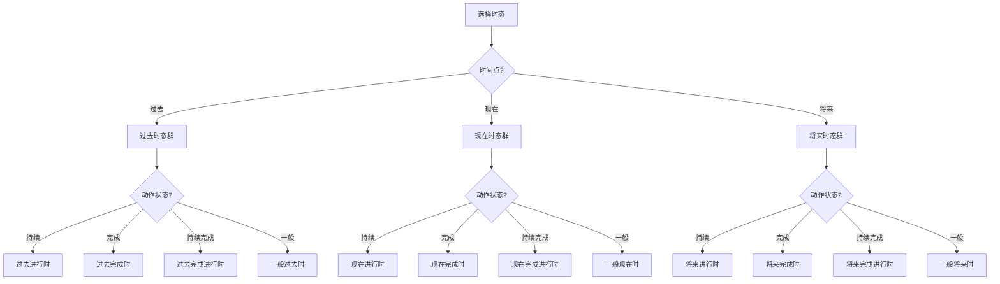
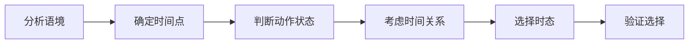
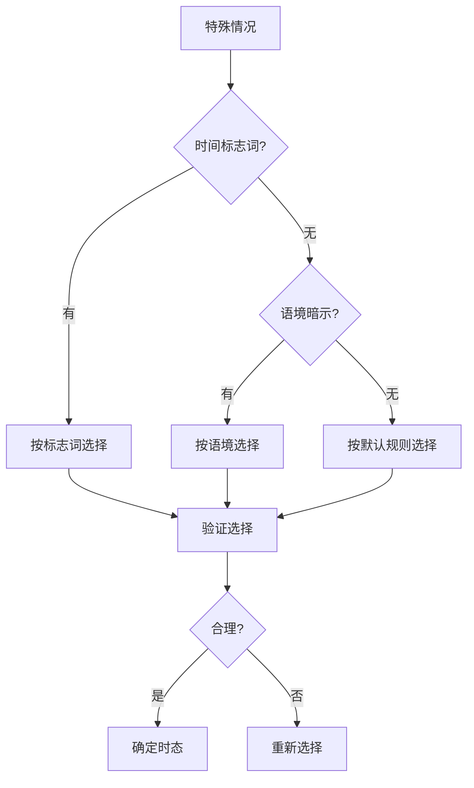

# 时态选择决策树

## 核心概念
时态选择决策树通过系统化的决策流程，帮助学习者在具体语境中准确选择最合适的时态，提高时态运用的准确性。

## 主要决策流程

### 1. 时态选择主决策树


### 2. 详细决策分支

#### 过去时态群决策
```mermaid
flowchart TD
    A[过去时态群] --> B{动作时间?}
    B -->|过去某时| C{动作状态?}
    B -->|过去之前| D{动作状态?}
    B -->|持续到过去| E{动作状态?}
    
    C --> C1|持续| C2[过去进行时]
    C --> C3|一般| C4[一般过去时]
    
    D --> D1|持续| D2[过去完成进行时]
    D --> D3|一般| D4[过去完成时]
    
    E --> E1|持续| E2[过去完成进行时]
    E --> E3|一般| E4[过去完成时]
```

#### 现在时态群决策
```mermaid
flowchart TD
    A[现在时态群] --> B{动作时间?}
    B -->|现在| C{动作状态?}
    B -->|现在之前| D{动作状态?}
    B -->|持续到现在| E{动作状态?}
    
    C --> C1|持续| C2[现在进行时]
    C --> C3|一般| C4[一般现在时]
    
    D --> D1|持续| D2[现在完成进行时]
    D --> D3|一般| D4[现在完成时]
    
    E --> E1|持续| E2[现在完成进行时]
    E --> E3|一般| E4[现在完成时]
```

#### 将来时态群决策
```mermaid
flowchart TD
    A[将来时态群] --> B{动作时间?}
    B -->|将来| C{动作状态?}
    B -->|将来之前| D{动作状态?}
    B -->|持续到将来| E{动作状态?}
    
    C --> C1|持续| C2[将来进行时]
    C --> C3|一般| C4[一般将来时]
    
    D --> D1|持续| D2[将来完成进行时]
    D --> D3|一般| D4[将来完成时]
    
    E --> E1|持续| E2[将来完成进行时]
    E --> E3|一般| E4[将来完成时]
```

## 决策标准

### 3. 时态选择标准表
| 决策因素 | 过去时态群 | 现在时态群 | 将来时态群 |
|----------|------------|------------|------------|
| **时间点** | 过去 | 现在 | 将来 |
| **动作状态** | 持续/完成/一般 | 持续/完成/一般 | 持续/完成/一般 |
| **时间关系** | 过去某时/之前/持续 | 现在/之前/持续 | 将来/之前/持续 |
| **典型标志** | yesterday, last week | now, at present | tomorrow, next week |

### 4. 动作状态判断标准
| 动作状态 | 判断标准 | 典型时态 | 示例 |
|----------|----------|----------|------|
| **持续** | 动作正在进行 | 进行时 | I am reading. |
| **完成** | 动作已经完成 | 完成时 | I have finished. |
| **持续完成** | 动作持续并完成 | 完成进行时 | I have been reading. |
| **一般** | 动作一般状态 | 一般时 | I read books. |

## 决策流程详解

### 5. 时态选择步骤


#### 步骤1: 分析语境
- **时间标志词**: yesterday, now, tomorrow
- **动作性质**: 瞬间动作、持续动作、重复动作
- **语境要求**: 正式、非正式、书面、口语

#### 步骤2: 确定时间点
- **过去**: 动作发生在过去
- **现在**: 动作发生在现在
- **将来**: 动作发生在将来

#### 步骤3: 判断动作状态
- **持续**: 动作正在进行
- **完成**: 动作已经完成
- **持续完成**: 动作持续并完成
- **一般**: 动作一般状态

#### 步骤4: 考虑时间关系
- **时间点**: 动作发生的具体时间
- **时间范围**: 动作持续的时间范围
- **时间先后**: 动作之间的时间关系

#### 步骤5: 选择时态
- **根据决策树**: 按照决策流程选择
- **考虑语境**: 结合具体语境
- **验证合理性**: 检查选择的合理性

#### 步骤6: 验证选择
- **语法正确性**: 检查语法是否正确
- **语义合理性**: 检查语义是否合理
- **语境适应性**: 检查是否适应语境

### 6. 特殊情况决策


## 决策树应用

### 7. 实际应用示例
**示例1**: 选择时态
```
语境: 昨天我在图书馆学习
分析: 
- 时间点: 过去
- 动作状态: 持续
- 时间关系: 过去某时进行
选择: 过去进行时
答案: I was studying in the library yesterday.
```

**示例2**: 选择时态
```
语境: 我已经学习英语三年了
分析:
- 时间点: 现在
- 动作状态: 持续完成
- 时间关系: 持续到现在
选择: 现在完成进行时
答案: I have been studying English for three years.
```

### 8. 决策树练习
**练习1**: 根据语境选择时态
```
语境: 明天这个时候我正在开会
选择: 将来进行时
答案: I will be having a meeting at this time tomorrow.
```

**练习2**: 分析时态选择过程
```
语境: 到明年我就完成学业了
分析过程:
1. 时间点: 将来
2. 动作状态: 完成
3. 时间关系: 将来某时之前完成
4. 选择: 将来完成时
5. 答案: By next year, I will have finished my studies.
```

## 记忆口诀
> **时态选择有规律，时间动作要分析**
> **过去现在将来分，持续完成要辨明**
> **时间标志要识别，语境要求要考虑**
> **决策树图要掌握，时态选择不困难**

## 刻意练习

### 练习1: 决策树应用
使用决策树选择下列语境的时态：
1. 现在我正在写作业
2. 昨天我去了图书馆
3. 明天我将要考试

### 练习2: 决策过程分析
分析下列时态选择的决策过程：
1. I have been waiting for you for two hours.
2. By the time you arrive, I will have finished my work.

### 练习3: 特殊情况处理
处理下列特殊情况：
1. 没有明确时间标志词的句子
2. 多个动作同时发生的句子
3. 时间关系复杂的句子

## 相关链接
- [[01-时态时间轴图]] - 理解时态时间关系
- [[03-时态易混点辨析]] - 避免时态混淆
- [[01-一般现在时]] - 深入学习一般现在时

## 学习要点
1. **理解**: 掌握时态选择的决策标准
2. **应用**: 能够运用决策树选择时态
3. **分析**: 能够分析时态选择的过程
4. **验证**: 能够验证时态选择的正确性

---
*学习建议: 通过大量练习掌握决策树的使用方法，形成时态选择的直觉*
