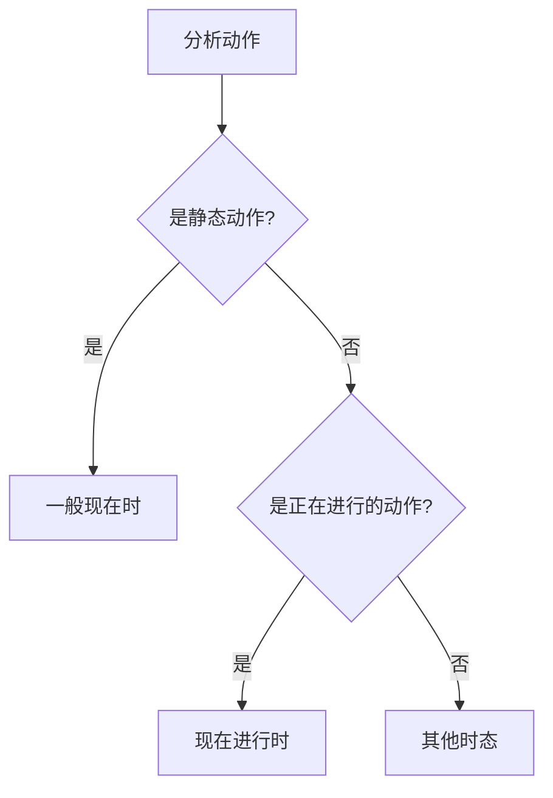
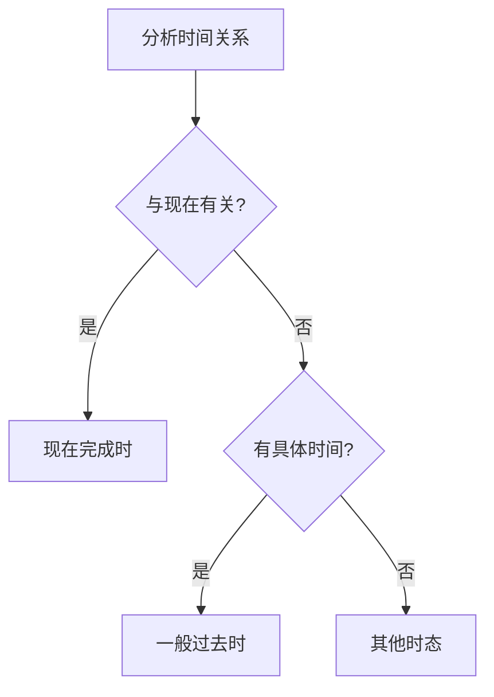
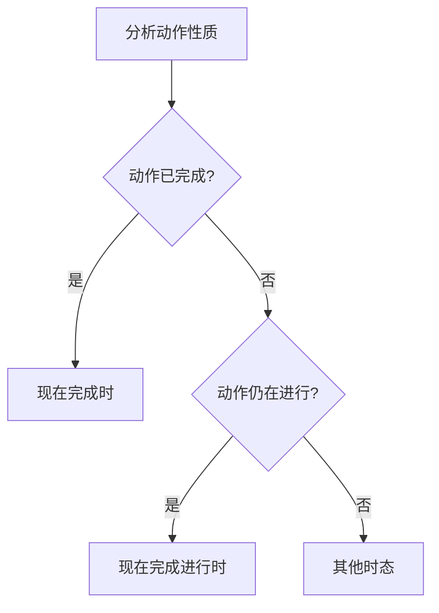
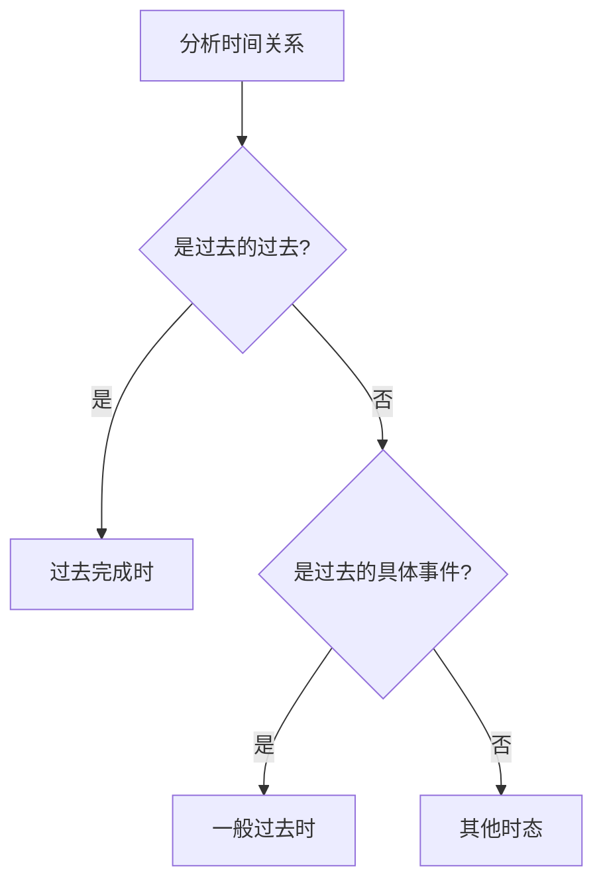
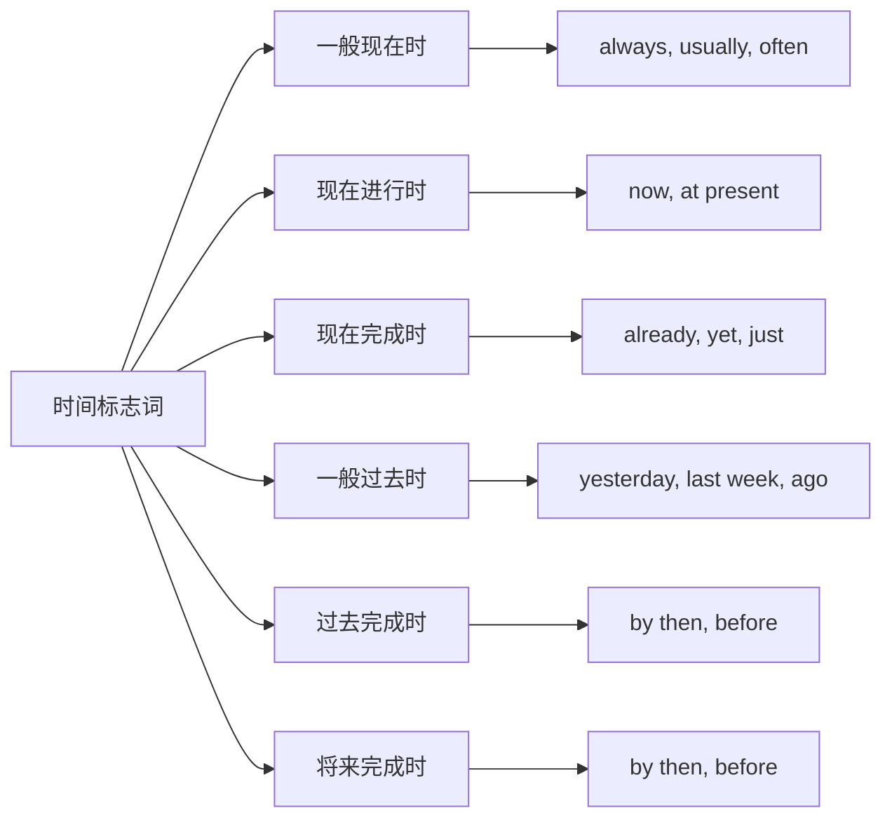
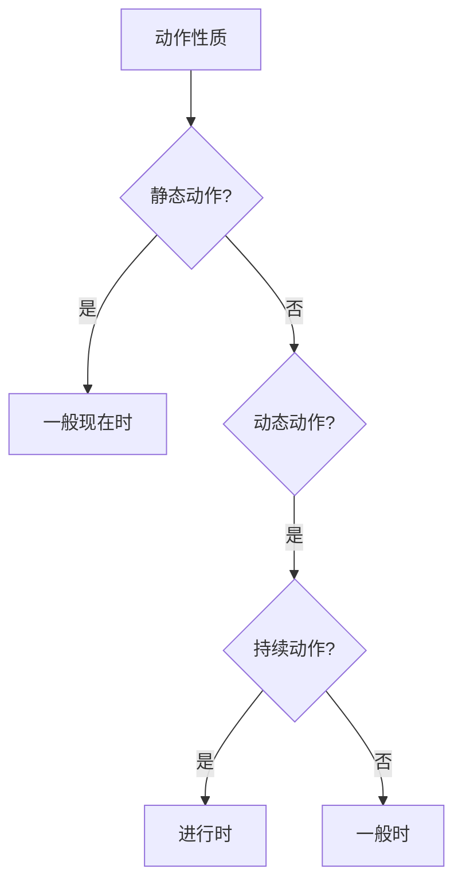
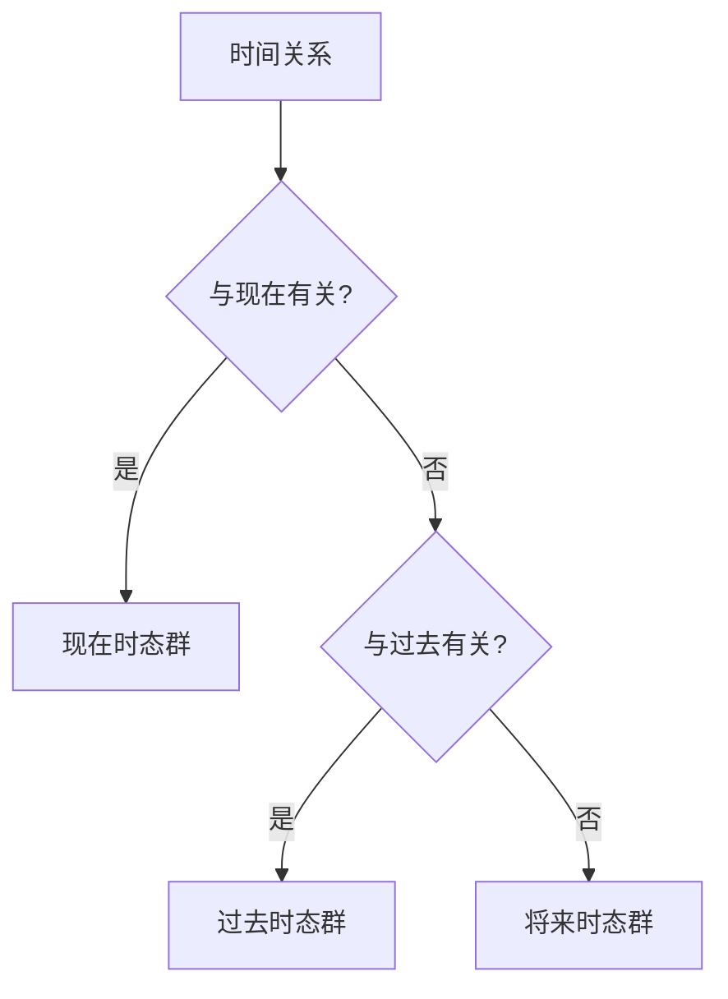

# 时态易混点辨析

## 核心概念
时态易混点辨析是英语语法学习中的重点难点，准确区分相似时态有助于提高语法运用的准确性和流畅性。

## 主要易混点

### 1. 一般现在时 vs 现在进行时

#### 区别要点
| 方面 | 一般现在时 | 现在进行时 |
|------|------------|------------|
| **时间概念** | 现在状态或习惯 | 现在正在进行的动作 |
| **动作性质** | 静态或重复性 | 动态或暂时性 |
| **时间标志** | always, usually, often | now, at present |
| **动词形式** | 动词原形/第三人称单数 | be + 现在分词 |
| **使用场景** | 事实、习惯、真理 | 正在进行的动作 |

#### 辨析方法

#### 典型例句对比
- **一般现在时**: I study English every day. (习惯性动作)
- **现在进行时**: I am studying English now. (正在进行的动作)

#### 常见错误
❌ 错误: I am knowing the answer.
✅ 正确: I know the answer. (know是静态动词)

### 2. 现在完成时 vs 一般过去时

#### 区别要点
| 方面 | 现在完成时 | 一般过去时 |
|------|------------|------------|
| **时间概念** | 过去发生，与现在有关 | 过去发生，与现在无关 |
| **时间标志** | already, yet, just, since | yesterday, last week, ago |
| **动词形式** | have/has + 过去分词 | 动词过去式 |
| **使用场景** | 经历、结果、持续 | 过去的具体事件 |
| **时间关系** | 与现在有联系 | 与现在无联系 |

#### 辨析方法

#### 典型例句对比
- **现在完成时**: I have seen this movie. (经历，与现在有关)
- **一般过去时**: I saw this movie yesterday. (过去的具体事件)

#### 常见错误
❌ 错误: I have seen this movie yesterday.
✅ 正确: I saw this movie yesterday. (有具体时间用一般过去时)

### 3. 现在完成时 vs 现在完成进行时

#### 区别要点
| 方面 | 现在完成时 | 现在完成进行时 |
|------|------------|----------------|
| **动作性质** | 已完成 | 持续进行 |
| **时间概念** | 过去完成，现在有结果 | 过去开始，现在仍在进行 |
| **动词形式** | have/has + 过去分词 | have/has + been + 现在分词 |
| **使用场景** | 经历、结果 | 持续动作 |
| **时间标志** | already, yet, just | for, since |

#### 辨析方法

#### 典型例句对比
- **现在完成时**: I have finished my homework. (已完成)
- **现在完成进行时**: I have been doing my homework. (仍在进行)

#### 常见错误
❌ 错误: I have been finished my homework.
✅ 正确: I have finished my homework. (已完成用现在完成时)

### 4. 过去完成时 vs 一般过去时

#### 区别要点
| 方面 | 过去完成时 | 一般过去时 |
|------|------------|------------|
| **时间概念** | 过去某时之前 | 过去某时 |
| **时间关系** | 过去的过去 | 过去 |
| **动词形式** | had + 过去分词 | 动词过去式 |
| **使用场景** | 过去的过去 | 过去的具体事件 |
| **时间标志** | by then, before | yesterday, last week |

#### 辨析方法

#### 典型例句对比
- **过去完成时**: By the time he arrived, I had finished my work. (过去的过去)
- **一般过去时**: He arrived yesterday. (过去的具体事件)

#### 常见错误
❌ 错误: By the time he arrived, I finished my work.
✅ 正确: By the time he arrived, I had finished my work. (过去的过去用过去完成时)

### 5. 将来完成时 vs 一般将来时

#### 区别要点
| 方面 | 将来完成时 | 一般将来时 |
|------|------------|------------|
| **时间概念** | 将来某时之前完成 | 将来发生 |
| **时间关系** | 将来的过去 | 将来 |
| **动词形式** | will have + 过去分词 | will + 动词原形 |
| **使用场景** | 将来完成 | 将来发生 |
| **时间标志** | by then, before | tomorrow, next week |

#### 辨析方法

#### 典型例句对比
- **将来完成时**: By next year, I will have graduated. (将来完成)
- **一般将来时**: I will graduate next year. (将来发生)

#### 常见错误
❌ 错误: By next year, I will graduate.
✅ 正确: By next year, I will have graduated. (将来完成用将来完成时)

## 综合辨析表

### 6. 时态易混点总结
| 易混点 | 关键区别 | 判断方法 | 典型例句 |
|--------|----------|----------|----------|
| 一般现在时 vs 现在进行时 | 静态 vs 动态 | 动作性质 | I study vs I am studying |
| 现在完成时 vs 一般过去时 | 与现在有关 vs 无关 | 时间关系 | I have seen vs I saw yesterday |
| 现在完成时 vs 现在完成进行时 | 已完成 vs 持续 | 动作状态 | I have finished vs I have been doing |
| 过去完成时 vs 一般过去时 | 过去的过去 vs 过去 | 时间关系 | I had finished vs I finished |
| 将来完成时 vs 一般将来时 | 将来完成 vs 将来发生 | 时间关系 | I will have finished vs I will finish |

## 辨析技巧

### 7. 时间标志词识别

### 8. 动作性质判断

### 9. 时间关系分析

## 记忆口诀
> **时态辨析要仔细，时间动作要分析**
> **一般现在表状态，现在进行表动作**
> **现在完成表经历，一般过去表事件**
> **过去完成表过去，将来完成表将来**
> **时间标志要识别，动作性质要判断**

## 刻意练习

### 练习1: 时态选择
选择正确的时态：
1. I ___ (study) English every day.
2. I ___ (study) English now.
3. I ___ (study) English for three years.

### 练习2: 错误纠正
找出并纠正下列句子中的时态错误：
1. I am knowing the answer.
2. I have seen this movie yesterday.
3. By next year, I will graduate.

### 练习3: 时态对比
对比下列时态的差异：
1. I study English. vs I am studying English.
2. I have finished my work. vs I finished my work yesterday.

## 相关链接
- [[01-时态时间轴图]] - 理解时态时间关系
- [[02-时态选择决策树]] - 学习时态选择方法
- [[01-一般现在时]] - 深入学习一般现在时

## 学习要点
1. **理解**: 掌握各易混点的本质区别
2. **识别**: 能够识别时态易混点
3. **辨析**: 能够区分相似时态
4. **应用**: 在实际中正确运用时态

---
*学习建议: 通过大量对比练习，逐步掌握时态辨析的方法*
