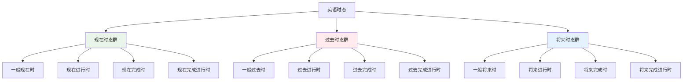
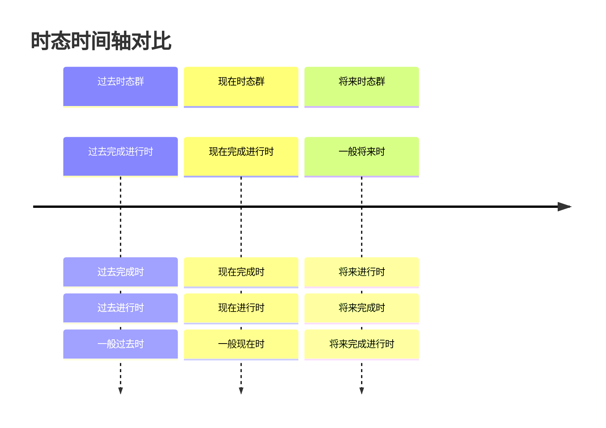

# 时态对比图表

## 核心概念
时态对比图表通过表格形式直观展示不同时态之间的相似点和差异点，帮助学习者快速掌握时态的特点和用法。

## 主要时态对比

### 1. 现在时态群对比

| 对比方面 | 一般现在时 | 现在进行时 | 现在完成时 | 现在完成进行时 |
|----------|------------|------------|------------|----------------|
| **定义** | 现在状态或习惯 | 现在正在进行的动作 | 过去发生但与现在有关 | 从过去开始持续到现在 |
| **时间概念** | 现在 | 现在进行 | 现在之前 | 持续到现在 |
| **动作性质** | 静态或重复性 | 动态或暂时性 | 已完成 | 持续进行 |
| **动词形式** | 动词原形/第三人称单数 | be + 现在分词 | have/has + 过去分词 | have/has + been + 现在分词 |
| **时间标志** | always, usually, often | now, at present | already, yet, just | for, since |
| **使用场景** | 事实、习惯、真理 | 正在进行的动作 | 经历、结果 | 持续动作 |
| **示例** | I study English. | I am studying English. | I have studied English. | I have been studying English. |

**记忆要点**:
- 一般现在时：表示现在的状态或习惯
- 现在进行时：表示现在正在进行的动作
- 现在完成时：表示过去发生但与现在有关
- 现在完成进行时：表示从过去开始持续到现在

### 2. 过去时态群对比

| 对比方面 | 一般过去时 | 过去进行时 | 过去完成时 | 过去完成进行时 |
|----------|------------|------------|------------|----------------|
| **定义** | 过去发生的具体事件 | 过去某时正在进行的动作 | 过去某时之前完成的动作 | 持续到过去某时的动作 |
| **时间概念** | 过去 | 过去进行 | 过去的过去 | 持续到过去 |
| **动作性质** | 已完成 | 进行中 | 已完成 | 持续进行 |
| **动词形式** | 动词过去式 | was/were + 现在分词 | had + 过去分词 | had + been + 现在分词 |
| **时间标志** | yesterday, last week, ago | at that time, then | by then, before | for, since |
| **使用场景** | 过去的具体事件 | 过去正在进行的动作 | 过去的过去 | 持续到过去的动作 |
| **示例** | I studied English. | I was studying English. | I had studied English. | I had been studying English. |

**记忆要点**:
- 一般过去时：表示过去发生的具体事件
- 过去进行时：表示过去某时正在进行的动作
- 过去完成时：表示过去某时之前完成的动作
- 过去完成进行时：表示持续到过去某时的动作

### 3. 将来时态群对比

| 对比方面 | 一般将来时 | 将来进行时 | 将来完成时 | 将来完成进行时 |
|----------|------------|------------|------------|----------------|
| **定义** | 将来发生的动作 | 将来某时正在进行的动作 | 将来某时之前完成的动作 | 持续到将来某时的动作 |
| **时间概念** | 将来 | 将来进行 | 将来的过去 | 持续到将来 |
| **动作性质** | 将要发生 | 将要进行 | 将要完成 | 将要持续 |
| **动词形式** | will + 动词原形 | will be + 现在分词 | will have + 过去分词 | will have been + 现在分词 |
| **时间标志** | tomorrow, next week | at this time tomorrow | by then, before | for, since |
| **使用场景** | 将来发生的动作 | 将来正在进行的动作 | 将来完成的动作 | 持续到将来的动作 |
| **示例** | I will study English. | I will be studying English. | I will have studied English. | I will have been studying English. |

**记忆要点**:
- 一般将来时：表示将来发生的动作
- 将来进行时：表示将来某时正在进行的动作
- 将来完成时：表示将来某时之前完成的动作
- 将来完成进行时：表示持续到将来某时的动作

## 时态功能对比表

### 4. 时态功能对比
| 时态 | 状态描述 | 动作进行 | 经历结果 | 持续动作 |
|------|----------|----------|----------|----------|
| **一般现在时** | ✅ | ❌ | ❌ | ❌ |
| **现在进行时** | ❌ | ✅ | ❌ | ❌ |
| **现在完成时** | ❌ | ❌ | ✅ | ❌ |
| **现在完成进行时** | ❌ | ❌ | ❌ | ✅ |
| **一般过去时** | ✅ | ❌ | ❌ | ❌ |
| **过去进行时** | ❌ | ✅ | ❌ | ❌ |
| **过去完成时** | ❌ | ❌ | ✅ | ❌ |
| **过去完成进行时** | ❌ | ❌ | ❌ | ✅ |
| **一般将来时** | ✅ | ❌ | ❌ | ❌ |
| **将来进行时** | ❌ | ✅ | ❌ | ❌ |
| **将来完成时** | ❌ | ❌ | ✅ | ❌ |
| **将来完成进行时** | ❌ | ❌ | ❌ | ✅ |

### 5. 时态时间关系对比
| 时态 | 时间点 | 时间范围 | 时间关系 | 典型时间词 |
|------|--------|----------|----------|------------|
| **一般现在时** | 现在 | 现在 | 现在状态 | always, usually, often |
| **现在进行时** | 现在 | 现在进行 | 现在进行 | now, at present |
| **现在完成时** | 现在 | 现在之前 | 现在之前 | already, yet, just |
| **现在完成进行时** | 现在 | 持续到现在 | 持续到现在 | for, since |
| **一般过去时** | 过去 | 过去某时 | 过去发生 | yesterday, last week |
| **过去进行时** | 过去 | 过去进行 | 过去进行 | at that time |
| **过去完成时** | 过去 | 过去之前 | 过去之前 | by then, before |
| **过去完成进行时** | 过去 | 持续到过去 | 持续到过去 | for, since |
| **一般将来时** | 将来 | 将来发生 | 将来发生 | tomorrow, next week |
| **将来进行时** | 将来 | 将来进行 | 将来进行 | at this time tomorrow |
| **将来完成时** | 将来 | 将来完成 | 将来完成 | by then, before |
| **将来完成进行时** | 将来 | 持续到将来 | 持续到将来 | for, since |

## 时态构成对比表

### 6. 时态构成规律
| 时态类型 | 构成规律 | 示例 | 变化规则 |
|----------|----------|------|----------|
| **一般时态** | 动词原形 | I study, he studies | 第三人称单数加s |
| **进行时态** | be + 现在分词 | I am studying, he is studying | be动词随人称变化 |
| **完成时态** | have/has + 过去分词 | I have studied, he has studied | have/has随人称变化 |
| **完成进行时态** | have/has + been + 现在分词 | I have been studying, he has been studying | have/has随人称变化 |
| **过去时态** | 动词过去式 | I studied, he studied | 规则动词加ed |
| **将来时态** | will + 动词原形 | I will study, he will study | will不变 |

### 7. 时态变化对比
| 时态 | 肯定式 | 否定式 | 疑问式 | 特殊疑问式 |
|------|--------|--------|--------|------------|
| **一般现在时** | I study. | I don't study. | Do you study? | What do you study? |
| **现在进行时** | I am studying. | I am not studying. | Are you studying? | What are you studying? |
| **现在完成时** | I have studied. | I haven't studied. | Have you studied? | What have you studied? |
| **现在完成进行时** | I have been studying. | I haven't been studying. | Have you been studying? | What have you been studying? |
| **一般过去时** | I studied. | I didn't study. | Did you study? | What did you study? |
| **过去进行时** | I was studying. | I wasn't studying. | Were you studying? | What were you studying? |
| **过去完成时** | I had studied. | I hadn't studied. | Had you studied? | What had you studied? |
| **过去完成进行时** | I had been studying. | I hadn't been studying. | Had you been studying? | What had you been studying? |
| **一般将来时** | I will study. | I won't study. | Will you study? | What will you study? |
| **将来进行时** | I will be studying. | I won't be studying. | Will you be studying? | What will you be studying? |
| **将来完成时** | I will have studied. | I won't have studied. | Will you have studied? | What will you have studied? |
| **将来完成进行时** | I will have been studying. | I won't have been studying. | Will you have been studying? | What will you have been studying? |

## 时态对比图

### 8. 时态关系图

### 9. 时态时间轴对比

## 记忆技巧

### 技巧1: 分类记忆
1. **按时间分类**: 过去、现在、将来
2. **按状态分类**: 一般、进行、完成、完成进行
3. **按功能分类**: 状态、动作、经历、持续

### 技巧2: 对比记忆
1. **相似时态对比**: 现在完成时 vs 一般过去时
2. **相反概念对比**: 持续 vs 完成
3. **相关概念对比**: 现在 vs 过去 vs 将来

### 技巧3: 规律记忆
1. **构成规律**: 掌握时态构成规律
2. **变化规律**: 掌握时态变化规律
3. **使用规律**: 掌握时态使用规律

## 刻意练习

### 练习1: 时态识别
判断下列句子的时态：
1. I study English every day.
2. I am studying English now.
3. I have studied English for three years.

### 练习2: 时态对比
对比下列时态的差异：
1. 一般现在时 vs 现在进行时
2. 现在完成时 vs 一般过去时
3. 过去完成时 vs 一般过去时

### 练习3: 时态选择
根据语境选择正确的时态：
1. 现在我正在写作业
2. 昨天我去了图书馆
3. 明天我将要考试

## 相关链接
- [[01-时态记忆口诀]] - 学习时态记忆口诀
- [[03-时态练习游戏]] - 进行时态练习游戏
- [[01-一般现在时]] - 深入学习一般现在时

## 学习要点
1. **对比**: 掌握不同时态的对比要点
2. **功能**: 理解各时态的语法功能
3. **构成**: 掌握各时态的构成规律
4. **应用**: 在实际中正确运用时态

---
*学习建议: 通过对比练习，加深对时态差异的理解*
