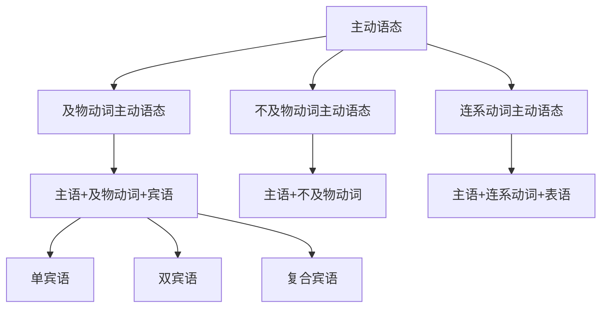

# 主动语态

## 🎯 学习目标
- 掌握主动语态的基本概念和构成
- 理解主动语态的各种用法
- 熟练运用主动语态的各种形式

## 📚 基本概念

### 主动语态（Active Voice）
**定义**：表示主语是动作的执行者，即主语主动发出动作

### 基本特征
- 主语是动作的执行者
- 动作由主语主动发出
- 是英语中最常用的语态
- 结构简单，表达直接

## 🔄 主动语态分类

## 📊 主动语态变化表

### 基本变化表
| 语态类型 | 结构 | 示例 | 说明 |
|----------|------|------|------|
| 及物动词主动语态 | 主语+及物动词+宾语 | I read a book. | 主语执行动作 |
| 不及物动词主动语态 | 主语+不及物动词 | I run. | 主语执行动作 |
| 连系动词主动语态 | 主语+连系动词+表语 | I am a student. | 主语的状态 |

## 🎯 及物动词主动语态

### 1. 单宾语主动语态
**功能**：主语执行动作，动作作用于一个宾语

**示例**：
- ✅ I read a book. (我读书)
- ✅ She writes a letter. (她写信)
- ✅ He buys a car. (他买车)
- ✅ We watch TV. (我们看电视)
- ✅ They play football. (他们踢足球)

**语法特点**：
- 主语是动作的执行者
- 动词是及物动词
- 有一个直接宾语
- 结构：主语+及物动词+宾语

### 2. 双宾语主动语态
**功能**：主语执行动作，动作作用于两个宾语

**示例**：
- ✅ I give him a book. (我给他一本书)
- ✅ She teaches us English. (她教我们英语)
- ✅ He tells me a story. (他给我讲一个故事)
- ✅ We send them a letter. (我们给他们寄一封信)
- ✅ They show me the way. (他们给我指路)

**语法特点**：
- 主语是动作的执行者
- 动词是及物动词
- 有间接宾语和直接宾语
- 结构：主语+及物动词+间接宾语+直接宾语

### 3. 复合宾语主动语态
**功能**：主语执行动作，动作作用于复合宾语

**示例**：
- ✅ I find the book interesting. (我发现书很有趣)
- ✅ She makes me happy. (她让我快乐)
- ✅ He considers the plan good. (他认为计划很好)
- ✅ We call him Tom. (我们叫他汤姆)
- ✅ They elect him president. (他们选他当总统)

**语法特点**：
- 主语是动作的执行者
- 动词是及物动词
- 有复合宾语（宾语+宾语补足语）
- 结构：主语+及物动词+宾语+宾语补足语

## 🎯 不及物动词主动语态

### 1. 完全不及物动词主动语态
**功能**：主语执行动作，动作不作用于任何宾语

**示例**：
- ✅ I run. (我跑步)
- ✅ She sleeps. (她睡觉)
- ✅ He works. (他工作)
- ✅ We study. (我们学习)
- ✅ They play. (他们玩)

**语法特点**：
- 主语是动作的执行者
- 动词是不及物动词
- 没有宾语
- 结构：主语+不及物动词

### 2. 带状语的不及物动词主动语态
**功能**：主语执行动作，动作不作用于宾语，但有状语修饰

**示例**：
- ✅ I run fast. (我跑得快)
- ✅ She sleeps well. (她睡得好)
- ✅ He works hard. (他工作努力)
- ✅ We study English. (我们学英语)
- ✅ They play football. (他们踢足球)

**语法特点**：
- 主语是动作的执行者
- 动词是不及物动词
- 没有宾语，但有状语
- 结构：主语+不及物动词+状语

## 🎯 连系动词主动语态

### 1. be动词主动语态
**功能**：主语的状态或特征

**示例**：
- ✅ I am a student. (我是学生)
- ✅ She is beautiful. (她很美丽)
- ✅ He is tall. (他很高)
- ✅ We are happy. (我们很快乐)
- ✅ They are friends. (他们是朋友)

**语法特点**：
- 主语是状态的主体
- 动词是连系动词be
- 有表语说明主语
- 结构：主语+be+表语

### 2. 其他连系动词主动语态
**功能**：主语的状态或特征

**示例**：
- ✅ I feel happy. (我感到快乐)
- ✅ She looks beautiful. (她看起来很美丽)
- ✅ He seems tired. (他看起来很累)
- ✅ We become friends. (我们成为朋友)
- ✅ They turn red. (它们变红了)

**语法特点**：
- 主语是状态的主体
- 动词是连系动词
- 有表语说明主语
- 结构：主语+连系动词+表语

## 🎯 主动语态时态变化

### 1. 一般现在时主动语态
**功能**：表示现在经常发生的动作或状态

**示例**：
- ✅ I read books every day. (我每天读书)
- ✅ She teaches English. (她教英语)
- ✅ He works in a company. (他在公司工作)
- ✅ We study hard. (我们努力学习)
- ✅ They play football. (他们踢足球)

**语法特点**：
- 表示现在经常发生的动作
- 动词用原形或第三人称单数
- 结构：主语+动词+宾语/状语

### 2. 现在进行时主动语态
**功能**：表示现在正在进行的动作

**示例**：
- ✅ I am reading a book. (我正在读书)
- ✅ She is teaching English. (她正在教英语)
- ✅ He is working in a company. (他正在公司工作)
- ✅ We are studying hard. (我们正在努力学习)
- ✅ They are playing football. (他们正在踢足球)

**语法特点**：
- 表示现在正在进行的动作
- 动词用be+现在分词
- 结构：主语+am/is/are+现在分词+宾语/状语

### 3. 现在完成时主动语态
**功能**：表示过去发生的动作对现在的影响

**示例**：
- ✅ I have read the book. (我已经读了这本书)
- ✅ She has taught English. (她已经教了英语)
- ✅ He has worked in a company. (他已经在公司工作了)
- ✅ We have studied hard. (我们已经努力学习)
- ✅ They have played football. (他们已经踢了足球)

**语法特点**：
- 表示过去动作对现在的影响
- 动词用have/has+过去分词
- 结构：主语+have/has+过去分词+宾语/状语

## 📊 主动语态用法对比表

| 语态类型 | 结构 | 示例 | 说明 |
|----------|------|------|------|
| 及物动词主动语态 | 主语+及物动词+宾语 | I read a book. | 主语执行动作 |
| 不及物动词主动语态 | 主语+不及物动词 | I run. | 主语执行动作 |
| 连系动词主动语态 | 主语+连系动词+表语 | I am a student. | 主语的状态 |
| 双宾语主动语态 | 主语+及物动词+间接宾语+直接宾语 | I give him a book. | 主语执行动作 |
| 复合宾语主动语态 | 主语+及物动词+宾语+宾语补足语 | I find the book interesting. | 主语执行动作 |

## 🚫 常见错误分析

### 错误类型1：主动语态构成错误
**错误**：❌ The book is read by me.
**正确**：✅ I read the book.
**分析**：主动语态中主语是动作的执行者

### 错误类型2：动词使用错误
**错误**：❌ I am read a book.
**正确**：✅ I am reading a book.
**分析**：现在进行时用be+现在分词

### 错误类型3：宾语使用错误
**错误**：❌ I give a book him.
**正确**：✅ I give him a book.
**分析**：双宾语中间接宾语在前，直接宾语在后

### 错误类型4：时态使用错误
**错误**：❌ I read a book yesterday.
**正确**：✅ I read a book yesterday.
**分析**：过去时间用过去时态

## 🔗 相关链接
- [[02-被动语态]]：被动语态的用法
- [[raw/英语语法/02-理解应用层/02-语态系统/03-语态转换]]：语态转换的规则
- [[04-语态易混点辨析]]：语态的易混点辨析
- [[01-基础认知层/01-词性系统/03-动词系统]]：动词系统

## 💡 记忆口诀

**主动语态记忆法**：
- 主动语态主语是动作执行者，动作由主语主动发出
- 及物动词有宾语，不及物动词无宾语
- 连系动词有表语，双宾语有间接和直接宾语
- 复合宾语有宾语和宾语补足语
- 时态变化要记牢，动词形式要正确
- 结构简单表达直接，是英语中最常用的语态

---
*掌握主动语态是语法学习的重要基础，需要大量练习才能熟练运用*
