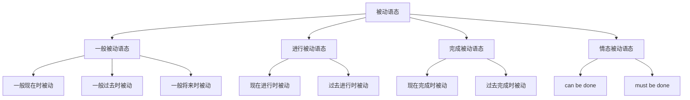

# 被动语态

## 🎯 学习目标
- 掌握被动语态的基本概念和构成
- 理解被动语态的各种用法
- 熟练运用被动语态的各种形式

## 📚 基本概念

### 被动语态（Passive Voice）
**定义**：表示主语是动作的承受者，即主语被动接受动作

### 基本特征
- 主语是动作的承受者
- 动作由主语被动接受
- 用be+过去分词构成
- 可以带by短语表示动作执行者

## 🔄 被动语态分类

## 📊 被动语态变化表

### 基本变化表
| 时态 | 主动语态 | 被动语态 | 示例 |
|------|----------|----------|------|
| 一般现在时 | I read a book. | A book is read by me. | 书被我读 |
| 一般过去时 | I read a book. | A book was read by me. | 书被我读了 |
| 一般将来时 | I will read a book. | A book will be read by me. | 书将被我读 |
| 现在进行时 | I am reading a book. | A book is being read by me. | 书正在被我读 |
| 过去进行时 | I was reading a book. | A book was being read by me. | 书正在被我读 |
| 现在完成时 | I have read a book. | A book has been read by me. | 书已经被我读了 |
| 过去完成时 | I had read a book. | A book had been read by me. | 书已经被我读了 |

## 🎯 被动语态构成

### 1. 基本构成
**规则**：be+过去分词

**构成要素**：
- be动词：根据时态和人称变化
- 过去分词：动词的过去分词形式
- by短语：表示动作执行者（可选）

**示例**：
- ✅ The book is read by me. (书被我读)
- ✅ The car was bought by him. (车被他买了)
- ✅ The house will be built by them. (房子将被他们建)
- ✅ The work is being done by us. (工作正在被我们做)
- ✅ The problem has been solved by her. (问题已经被她解决了)

**语法特点**：
- 用be+过去分词构成
- 主语是动作的承受者
- 可以带by短语
- 时态通过be动词体现

### 2. 时态变化
**规则**：be动词根据时态变化

**时态变化表**：
| 时态 | be动词 | 示例 |
|------|--------|------|
| 一般现在时 | am/is/are | The book is read. |
| 一般过去时 | was/were | The book was read. |
| 一般将来时 | will be | The book will be read. |
| 现在进行时 | am/is/are being | The book is being read. |
| 过去进行时 | was/were being | The book was being read. |
| 现在完成时 | have/has been | The book has been read. |
| 过去完成时 | had been | The book had been read. |

## 🎯 被动语态用法

### 1. 强调动作的承受者
**功能**：强调动作的承受者

**示例**：
- ✅ The book was written by Mark Twain. (这本书是马克·吐温写的)
- ✅ The car was stolen last night. (车昨晚被偷了)
- ✅ The house was built in 1990. (房子建于1990年)
- ✅ The letter was sent yesterday. (信昨天被寄出了)
- ✅ The problem was solved quickly. (问题很快被解决了)

**语法特点**：
- 强调动作的承受者
- 主语是动作的承受者
- 动作执行者不重要
- 用被动语态表达

### 2. 不知道动作执行者
**功能**：不知道动作执行者

**示例**：
- ✅ The window was broken. (窗户被打破了)
- ✅ The money was stolen. (钱被偷了)
- ✅ The car was damaged. (车被损坏了)
- ✅ The house was destroyed. (房子被摧毁了)
- ✅ The letter was lost. (信被丢失了)

**语法特点**：
- 不知道动作执行者
- 主语是动作的承受者
- 不需要by短语
- 用被动语态表达

### 3. 动作执行者不重要
**功能**：动作执行者不重要

**示例**：
- ✅ English is spoken all over the world. (英语在全世界被说)
- ✅ The bridge was built last year. (桥去年被建)
- ✅ The meeting will be held tomorrow. (会议明天将被举行)
- ✅ The work must be finished today. (工作今天必须被完成)
- ✅ The door should be closed. (门应该被关上)

**语法特点**：
- 动作执行者不重要
- 主语是动作的承受者
- 不需要by短语
- 用被动语态表达

### 4. 避免提及动作执行者
**功能**：避免提及动作执行者

**示例**：
- ✅ Mistakes were made. (错误被犯了)
- ✅ The decision was made. (决定被做了)
- ✅ The plan was changed. (计划被改变了)
- ✅ The rules were broken. (规则被违反了)
- ✅ The promise was kept. (承诺被遵守了)

**语法特点**：
- 避免提及动作执行者
- 主语是动作的承受者
- 不需要by短语
- 用被动语态表达

## 🎯 被动语态转换

### 1. 主动语态转被动语态
**规则**：主动语态转被动语态

**转换步骤**：
1. 找出主动语态的宾语
2. 将宾语变为主语
3. 将主动语态的动词变为被动语态
4. 将主动语态的主语变为by短语（可选）

**示例**：
- ✅ 主动：I read a book. → 被动：A book is read by me.
- ✅ 主动：She bought a car. → 被动：A car was bought by her.
- ✅ 主动：He will build a house. → 被动：A house will be built by him.
- ✅ 主动：We are doing the work. → 被动：The work is being done by us.
- ✅ 主动：They have solved the problem. → 被动：The problem has been solved by them.

**语法特点**：
- 宾语变主语
- 动词变被动语态
- 主语变by短语
- 时态保持不变

### 2. 被动语态转主动语态
**规则**：被动语态转主动语态

**转换步骤**：
1. 找出被动语态的主语
2. 将主语变为宾语
3. 将被动语态的动词变为主动语态
4. 将by短语变为主语（如果有）

**示例**：
- ✅ 被动：A book is read by me. → 主动：I read a book.
- ✅ 被动：A car was bought by her. → 主动：She bought a car.
- ✅ 被动：A house will be built by him. → 主动：He will build a house.
- ✅ 被动：The work is being done by us. → 主动：We are doing the work.
- ✅ 被动：The problem has been solved by them. → 主动：They have solved the problem.

**语法特点**：
- 主语变宾语
- 动词变主动语态
- by短语变主语
- 时态保持不变

## 🎯 特殊用法

### 1. 双宾语被动语态
**功能**：双宾语的被动语态

**示例**：
- ✅ 主动：I gave him a book. → 被动：He was given a book by me. / A book was given to him by me.
- ✅ 主动：She taught us English. → 被动：We were taught English by her. / English was taught to us by her.
- ✅ 主动：He told me a story. → 被动：I was told a story by him. / A story was told to me by him.
- ✅ 主动：We sent them a letter. → 被动：They were sent a letter by us. / A letter was sent to them by us.
- ✅ 主动：They showed me the way. → 被动：I was shown the way by them. / The way was shown to me by them.

**语法特点**：
- 双宾语有两个被动形式
- 间接宾语或直接宾语都可以作主语
- 另一个宾语保留
- 介词to可以省略

### 2. 复合宾语被动语态
**功能**：复合宾语的被动语态

**示例**：
- ✅ 主动：I found the book interesting. → 被动：The book was found interesting by me.
- ✅ 主动：She made me happy. → 被动：I was made happy by her.
- ✅ 主动：He considered the plan good. → 被动：The plan was considered good by him.
- ✅ 主动：We call him Tom. → 被动：He is called Tom by us.
- ✅ 主动：They elect him president. → 被动：He is elected president by them.

**语法特点**：
- 宾语变主语
- 宾语补足语保留
- 动词变被动语态
- 时态保持不变

### 3. 情态动词被动语态
**功能**：情态动词的被动语态

**示例**：
- ✅ The work can be done. (工作可以被做)
- ✅ The problem must be solved. (问题必须被解决)
- ✅ The door should be closed. (门应该被关上)
- ✅ The letter may be sent. (信可能被寄出)
- ✅ The house will be built. (房子将被建)

**语法特点**：
- 情态动词+be+过去分词
- 主语是动作的承受者
- 可以带by短语
- 时态通过情态动词体现

## 📊 被动语态用法对比表

| 用法 | 示例 | 说明 |
|------|------|------|
| 强调动作的承受者 | The book was written by Mark Twain. | 强调动作的承受者 |
| 不知道动作执行者 | The window was broken. | 不知道动作执行者 |
| 动作执行者不重要 | English is spoken all over the world. | 动作执行者不重要 |
| 避免提及动作执行者 | Mistakes were made. | 避免提及动作执行者 |
| 双宾语被动语态 | He was given a book by me. | 双宾语被动语态 |
| 复合宾语被动语态 | The book was found interesting by me. | 复合宾语被动语态 |
| 情态动词被动语态 | The work can be done. | 情态动词被动语态 |

## 🚫 常见错误分析

### 错误类型1：被动语态构成错误
**错误**：❌ The book is read by me.
**正确**：✅ The book is read by me.
**分析**：被动语态用be+过去分词

### 错误类型2：时态使用错误
**错误**：❌ The book was read by me yesterday.
**正确**：✅ The book was read by me yesterday.
**分析**：过去时间用过去时态的被动语态

### 错误类型3：by短语使用错误
**错误**：❌ The book is read by I.
**正确**：✅ The book is read by me.
**分析**：by短语用宾格

### 错误类型4：被动语态误用
**错误**：❌ The book is reading by me.
**正确**：✅ The book is being read by me.
**分析**：现在进行时被动语态用is being+过去分词

## 🔗 相关链接
- [[01-主动语态]]：主动语态的用法
- [[raw/英语语法/02-理解应用层/02-语态系统/03-语态转换]]：语态转换的规则
- [[04-语态易混点辨析]]：语态的易混点辨析
- [[01-基础认知层/01-词性系统/03-动词系统]]：动词系统

## 💡 记忆口诀

**被动语态记忆法**：
- 被动语态主语是动作承受者，动作由主语被动接受
- 构成：be+过去分词，时态通过be动词体现
- 强调动作承受者用被动语态，不知道动作执行者用被动语态
- 动作执行者不重要用被动语态，避免提及动作执行者用被动语态
- 双宾语有两个被动形式，复合宾语被动语态保留宾语补足语
- 情态动词被动语态：情态动词+be+过去分词

---
*掌握被动语态是语法学习的重要基础，需要大量练习才能熟练运用*
