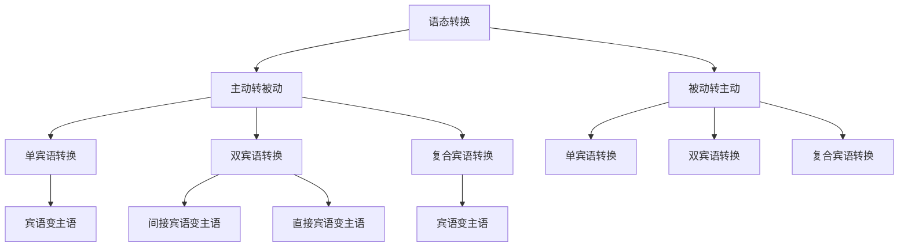

# 语态转换

## 🎯 学习目标
- 掌握语态转换的基本规则和方法
- 理解主动语态和被动语态的转换
- 熟练运用语态转换的各种技巧

## 📚 基本概念

### 语态转换（Voice Transformation）
**定义**：主动语态和被动语态之间的相互转换

### 基本特征
- 主动语态转被动语态
- 被动语态转主动语态
- 保持时态不变
- 保持语义不变

## 🔄 语态转换分类

## 📊 语态转换规则表

### 基本转换规则
| 转换类型 | 主动语态 | 被动语态 | 转换规则 |
|----------|----------|----------|----------|
| 单宾语 | I read a book. | A book is read by me. | 宾语变主语 |
| 双宾语 | I gave him a book. | He was given a book by me. | 间接宾语变主语 |
| 双宾语 | I gave him a book. | A book was given to him by me. | 直接宾语变主语 |
| 复合宾语 | I found the book interesting. | The book was found interesting by me. | 宾语变主语 |

## 🎯 主动语态转被动语态

### 1. 单宾语转换
**规则**：单宾语的主动语态转被动语态

**转换步骤**：
1. 找出主动语态的宾语
2. 将宾语变为主语
3. 将主动语态的动词变为被动语态
4. 将主动语态的主语变为by短语（可选）

**示例**：
- ✅ 主动：I read a book. → 被动：A book is read by me.
- ✅ 主动：She bought a car. → 被动：A car was bought by her.
- ✅ 主动：He will build a house. → 被动：A house will be built by him.
- ✅ 主动：We are doing the work. → 被动：The work is being done by us.
- ✅ 主动：They have solved the problem. → 被动：The problem has been solved by them.

**语法特点**：
- 宾语变主语
- 动词变被动语态
- 主语变by短语
- 时态保持不变

### 2. 双宾语转换
**规则**：双宾语的主动语态转被动语态

**转换方法1：间接宾语变主语**
**转换步骤**：
1. 找出主动语态的间接宾语
2. 将间接宾语变为主语
3. 将主动语态的动词变为被动语态
4. 将直接宾语保留
5. 将主动语态的主语变为by短语（可选）

**示例**：
- ✅ 主动：I gave him a book. → 被动：He was given a book by me.
- ✅ 主动：She taught us English. → 被动：We were taught English by her.
- ✅ 主动：He told me a story. → 被动：I was told a story by him.
- ✅ 主动：We sent them a letter. → 被动：They were sent a letter by us.
- ✅ 主动：They showed me the way. → 被动：I was shown the way by them.

**转换方法2：直接宾语变主语**
**转换步骤**：
1. 找出主动语态的直接宾语
2. 将直接宾语变为主语
3. 将主动语态的动词变为被动语态
4. 将间接宾语变为to短语
5. 将主动语态的主语变为by短语（可选）

**示例**：
- ✅ 主动：I gave him a book. → 被动：A book was given to him by me.
- ✅ 主动：She taught us English. → 被动：English was taught to us by her.
- ✅ 主动：He told me a story. → 被动：A story was told to me by him.
- ✅ 主动：We sent them a letter. → 被动：A letter was sent to them by us.
- ✅ 主动：They showed me the way. → 被动：The way was shown to me by them.

**语法特点**：
- 双宾语有两个被动形式
- 间接宾语或直接宾语都可以作主语
- 另一个宾语保留
- 介词to可以省略

### 3. 复合宾语转换
**规则**：复合宾语的主动语态转被动语态

**转换步骤**：
1. 找出主动语态的宾语
2. 将宾语变为主语
3. 将主动语态的动词变为被动语态
4. 将宾语补足语保留
5. 将主动语态的主语变为by短语（可选）

**示例**：
- ✅ 主动：I found the book interesting. → 被动：The book was found interesting by me.
- ✅ 主动：She made me happy. → 被动：I was made happy by her.
- ✅ 主动：He considered the plan good. → 被动：The plan was considered good by him.
- ✅ 主动：We call him Tom. → 被动：He is called Tom by us.
- ✅ 主动：They elect him president. → 被动：He is elected president by them.

**语法特点**：
- 宾语变主语
- 宾语补足语保留
- 动词变被动语态
- 时态保持不变

## 🎯 被动语态转主动语态

### 1. 单宾语转换
**规则**：单宾语的被动语态转主动语态

**转换步骤**：
1. 找出被动语态的主语
2. 将主语变为宾语
3. 将被动语态的动词变为主动语态
4. 将by短语变为主语（如果有）

**示例**：
- ✅ 被动：A book is read by me. → 主动：I read a book.
- ✅ 被动：A car was bought by her. → 主动：She bought a car.
- ✅ 被动：A house will be built by him. → 主动：He will build a house.
- ✅ 被动：The work is being done by us. → 主动：We are doing the work.
- ✅ 被动：The problem has been solved by them. → 主动：They have solved the problem.

**语法特点**：
- 主语变宾语
- 动词变主动语态
- by短语变主语
- 时态保持不变

### 2. 双宾语转换
**规则**：双宾语的被动语态转主动语态

**转换步骤**：
1. 找出被动语态的主语
2. 将主语变为间接宾语或直接宾语
3. 将被动语态的动词变为主动语态
4. 将另一个宾语保留
5. 将by短语变为主语（如果有）

**示例**：
- ✅ 被动：He was given a book by me. → 主动：I gave him a book.
- ✅ 被动：We were taught English by her. → 主动：She taught us English.
- ✅ 被动：I was told a story by him. → 主动：He told me a story.
- ✅ 被动：They were sent a letter by us. → 主动：We sent them a letter.
- ✅ 被动：I was shown the way by them. → 主动：They showed me the way.

**语法特点**：
- 主语变间接宾语或直接宾语
- 动词变主动语态
- 另一个宾语保留
- by短语变主语

### 3. 复合宾语转换
**规则**：复合宾语的被动语态转主动语态

**转换步骤**：
1. 找出被动语态的主语
2. 将主语变为宾语
3. 将被动语态的动词变为主动语态
4. 将宾语补足语保留
5. 将by短语变为主语（如果有）

**示例**：
- ✅ 被动：The book was found interesting by me. → 主动：I found the book interesting.
- ✅ 被动：I was made happy by her. → 主动：She made me happy.
- ✅ 被动：The plan was considered good by him. → 主动：He considered the plan good.
- ✅ 被动：He is called Tom by us. → 主动：We call him Tom.
- ✅ 被动：He is elected president by them. → 主动：They elect him president.

**语法特点**：
- 主语变宾语
- 动词变主动语态
- 宾语补足语保留
- by短语变主语

## 🎯 特殊转换

### 1. 情态动词转换
**规则**：情态动词的语态转换

**主动转被动**：
- ✅ 主动：I can do the work. → 被动：The work can be done by me.
- ✅ 主动：She must finish the task. → 被动：The task must be finished by her.
- ✅ 主动：He should close the door. → 被动：The door should be closed by him.
- ✅ 主动：We may send the letter. → 被动：The letter may be sent by us.
- ✅ 主动：They will build the house. → 被动：The house will be built by them.

**被动转主动**：
- ✅ 被动：The work can be done by me. → 主动：I can do the work.
- ✅ 被动：The task must be finished by her. → 主动：She must finish the task.
- ✅ 被动：The door should be closed by him. → 主动：He should close the door.
- ✅ 被动：The letter may be sent by us. → 主动：We may send the letter.
- ✅ 被动：The house will be built by them. → 主动：They will build the house.

**语法特点**：
- 情态动词+be+过去分词
- 情态动词保持不变
- 主语和宾语互换
- 时态保持不变

### 2. 不及物动词转换
**规则**：不及物动词的语态转换

**注意**：不及物动词不能直接转换为被动语态

**错误示例**：
- ❌ I run. → ❌ I am run. (错误)
- ❌ She sleeps. → ❌ She is slept. (错误)
- ❌ He works. → ❌ He is worked. (错误)

**正确方法**：
- ✅ I run fast. → ✅ Running is done by me fast. (改变结构)
- ✅ She sleeps well. → ✅ Sleeping is done by her well. (改变结构)
- ✅ He works hard. → ✅ Working is done by him hard. (改变结构)

**语法特点**：
- 不及物动词不能直接转换
- 需要改变句子结构
- 使用动名词形式
- 语义可能发生变化

### 3. 连系动词转换
**规则**：连系动词的语态转换

**注意**：连系动词不能转换为被动语态

**错误示例**：
- ❌ I am a student. → ❌ A student is been by me. (错误)
- ❌ She looks beautiful. → ❌ Beautiful is looked by her. (错误)
- ❌ He seems tired. → ❌ Tired is seemed by him. (错误)

**语法特点**：
- 连系动词不能转换
- 连系动词表示状态
- 没有动作概念
- 保持原句不变

## 📊 语态转换对比表

| 转换类型 | 主动语态 | 被动语态 | 转换规则 |
|----------|----------|----------|----------|
| 单宾语 | I read a book. | A book is read by me. | 宾语变主语 |
| 双宾语(间接宾语) | I gave him a book. | He was given a book by me. | 间接宾语变主语 |
| 双宾语(直接宾语) | I gave him a book. | A book was given to him by me. | 直接宾语变主语 |
| 复合宾语 | I found the book interesting. | The book was found interesting by me. | 宾语变主语 |
| 情态动词 | I can do the work. | The work can be done by me. | 情态动词+be+过去分词 |
| 不及物动词 | I run fast. | Running is done by me fast. | 改变结构 |
| 连系动词 | I am a student. | 不能转换 | 连系动词不能转换 |

## 🚫 常见错误分析

### 错误类型1：转换规则错误
**错误**：❌ I read a book. → A book is read by I.
**正确**：✅ I read a book. → A book is read by me.
**分析**：by短语用宾格

### 错误类型2：时态保持错误
**错误**：❌ I read a book. → A book was read by me.
**正确**：✅ I read a book. → A book is read by me.
**分析**：时态要保持一致

### 错误类型3：不及物动词转换错误
**错误**：❌ I run. → I am run.
**正确**：✅ I run. → 不能直接转换
**分析**：不及物动词不能直接转换

### 错误类型4：连系动词转换错误
**错误**：❌ I am a student. → A student is been by me.
**正确**：✅ I am a student. → 不能转换
**分析**：连系动词不能转换

## 🔗 相关链接
- [[01-主动语态]]：主动语态的用法
- [[02-被动语态]]：被动语态的用法
- [[04-语态易混点辨析]]：语态的易混点辨析
- [[01-基础认知层/01-词性系统/03-动词系统]]：动词系统

## 💡 记忆口诀

**语态转换记忆法**：
- 主动转被动：宾语变主语，动词变被动语态，主语变by短语
- 被动转主动：主语变宾语，动词变主动语态，by短语变主语
- 双宾语有两个被动形式，间接宾语或直接宾语都可以作主语
- 复合宾语被动语态保留宾语补足语，情态动词被动语态：情态动词+be+过去分词
- 不及物动词不能直接转换，连系动词不能转换
- 时态要保持一致，by短语用宾格

---
*掌握语态转换是语法学习的重要基础，需要大量练习才能熟练运用*
