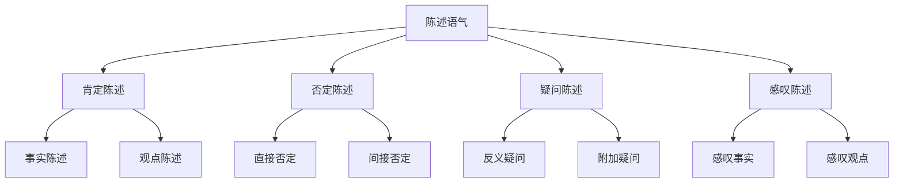

# 陈述语气

## 🎯 学习目标
- 掌握陈述语气的基本概念和用法
- 理解陈述语气的各种形式
- 熟练运用陈述语气的表达方式

## 📚 基本概念

### 陈述语气（Indicative Mood）
**定义**：用于陈述事实、描述情况、表达观点的语气

### 基本特征
- 陈述事实或情况
- 表达观点或态度
- 使用陈述句
- 语调平稳

## 🔄 陈述语气分类

## 📊 陈述语气变化表

### 基本变化表
| 类型 | 结构 | 示例 | 说明 |
|------|------|------|------|
| 肯定陈述 | 主语+谓语+宾语 | I like English. | 表达肯定观点 |
| 否定陈述 | 主语+助动词+not+谓语+宾语 | I don't like English. | 表达否定观点 |
| 疑问陈述 | 陈述句+疑问词 | I like English, don't I? | 表达疑问 |
| 感叹陈述 | What/How+陈述句 | What a beautiful day! | 表达感叹 |

## 🎯 肯定陈述

### 1. 事实陈述
**功能**：陈述客观事实

**示例**：
- ✅ The sun rises in the east. (太阳从东方升起)
- ✅ Water boils at 100 degrees Celsius. (水在100摄氏度沸腾)
- ✅ Beijing is the capital of China. (北京是中国的首都)
- ✅ English is widely spoken. (英语被广泛使用)
- ✅ Students study hard. (学生学习努力)

**语法特点**：
- 陈述客观事实
- 使用陈述句
- 语调平稳
- 表达确定性

### 2. 观点陈述
**功能**：表达个人观点

**示例**：
- ✅ I think English is interesting. (我认为英语很有趣)
- ✅ She believes that practice makes perfect. (她相信熟能生巧)
- ✅ He feels that grammar is important. (他觉得语法很重要)
- ✅ We hope to improve our English. (我们希望提高英语)
- ✅ They consider English useful. (他们认为英语有用)

**语法特点**：
- 表达个人观点
- 使用陈述句
- 语调平稳
- 表达主观性

### 3. 描述陈述
**功能**：描述情况或状态

**示例**：
- ✅ The weather is nice today. (今天天气很好)
- ✅ She looks beautiful in that dress. (她穿那件裙子很美丽)
- ✅ He seems tired after work. (他工作后看起来很累)
- ✅ We are happy with the result. (我们对结果很满意)
- ✅ They are excited about the trip. (他们对旅行很兴奋)

**语法特点**：
- 描述情况或状态
- 使用陈述句
- 语调平稳
- 表达描述性

## 🎯 否定陈述

### 1. 直接否定
**功能**：直接表达否定

**示例**：
- ✅ I don't like coffee. (我不喜欢咖啡)
- ✅ She doesn't speak French. (她不会说法语)
- ✅ He isn't working today. (他今天不工作)
- ✅ We haven't finished yet. (我们还没有完成)
- ✅ They won't come tomorrow. (他们明天不会来)

**语法特点**：
- 直接表达否定
- 使用否定词
- 语调平稳
- 表达否定性

### 2. 间接否定
**功能**：间接表达否定

**示例**：
- ✅ I hardly ever watch TV. (我几乎不看电视)
- ✅ She rarely goes out. (她很少出去)
- ✅ He seldom makes mistakes. (他很少犯错误)
- ✅ We barely have time. (我们几乎没有时间)
- ✅ They scarcely know each other. (他们几乎不认识)

**语法特点**：
- 间接表达否定
- 使用否定副词
- 语调平稳
- 表达委婉否定

### 3. 部分否定
**功能**：表达部分否定

**示例**：
- ✅ Not all students like English. (不是所有学生都喜欢英语)
- ✅ Not everyone agrees with you. (不是每个人都同意你)
- ✅ Not everything is perfect. (不是一切都是完美的)
- ✅ Not every book is interesting. (不是每本书都有趣)
- ✅ Not all teachers are strict. (不是所有老师都严格)

**语法特点**：
- 表达部分否定
- 使用not+all/every
- 语调平稳
- 表达限定性

## 🎯 疑问陈述

### 1. 反义疑问
**功能**：表达反义疑问

**示例**：
- ✅ You like English, don't you? (你喜欢英语，不是吗？)
- ✅ She speaks French, doesn't she? (她说法语，不是吗？)
- ✅ He is working, isn't he? (他在工作，不是吗？)
- ✅ We have finished, haven't we? (我们已经完成了，不是吗？)
- ✅ They will come, won't they? (他们会来，不是吗？)

**语法特点**：
- 表达反义疑问
- 使用反义疑问句
- 语调上升
- 表达确认性

### 2. 附加疑问
**功能**：表达附加疑问

**示例**：
- ✅ I like English, do I? (我喜欢英语，是吗？)
- ✅ She speaks French, does she? (她说法语，是吗？)
- ✅ He is working, is he? (他在工作，是吗？)
- ✅ We have finished, have we? (我们已经完成了，是吗？)
- ✅ They will come, will they? (他们会来，是吗？)

**语法特点**：
- 表达附加疑问
- 使用附加疑问句
- 语调上升
- 表达询问性

### 3. 修辞疑问
**功能**：表达修辞疑问

**示例**：
- ✅ Who doesn't like English? (谁不喜欢英语？)
- ✅ What's wrong with that? (那有什么问题？)
- ✅ How can you say that? (你怎么能那样说？)
- ✅ Why not try again? (为什么不再试一次？)
- ✅ Where is the problem? (问题在哪里？)

**语法特点**：
- 表达修辞疑问
- 使用疑问句形式
- 语调平稳
- 表达强调性

## 🎯 感叹陈述

### 1. 感叹事实
**功能**：感叹客观事实

**示例**：
- ✅ What a beautiful day! (多么美好的一天！)
- ✅ How interesting the book is! (这本书多么有趣！)
- ✅ What a good student he is! (他是多么好的学生！)
- ✅ How fast she runs! (她跑得多快！)
- ✅ What a big house! (多么大的房子！)

**语法特点**：
- 感叹客观事实
- 使用感叹句
- 语调上升
- 表达感叹性

### 2. 感叹观点
**功能**：感叹个人观点

**示例**：
- ✅ What a great idea! (多么好的想法！)
- ✅ How wonderful it is! (多么美妙！)
- ✅ What a surprise! (多么令人惊讶！)
- ✅ How amazing! (多么令人惊叹！)
- ✅ What a pity! (多么遗憾！)

**语法特点**：
- 感叹个人观点
- 使用感叹句
- 语调上升
- 表达感叹性

### 3. 感叹描述
**功能**：感叹描述情况

**示例**：
- ✅ What a mess! (多么混乱！)
- ✅ How beautiful! (多么美丽！)
- ✅ What a noise! (多么吵闹！)
- ✅ How quiet! (多么安静！)
- ✅ What a view! (多么美的景色！)

**语法特点**：
- 感叹描述情况
- 使用感叹句
- 语调上升
- 表达感叹性

## 🎯 陈述语气时态

### 1. 现在时态陈述
**功能**：现在时态的陈述

**示例**：
- ✅ I study English every day. (我每天学英语)
- ✅ She teaches at a university. (她在大学教书)
- ✅ He works in a company. (他在公司工作)
- ✅ We live in Beijing. (我们住在北京)
- ✅ They speak English well. (他们英语说得很好)

**语法特点**：
- 现在时态
- 陈述句形式
- 语调平稳
- 表达现在情况

### 2. 过去时态陈述
**功能**：过去时态的陈述

**示例**：
- ✅ I studied English yesterday. (我昨天学了英语)
- ✅ She taught at a university last year. (她去年在大学教书)
- ✅ He worked in a company before. (他以前在公司工作)
- ✅ We lived in Beijing. (我们以前住在北京)
- ✅ They spoke English well. (他们以前英语说得很好)

**语法特点**：
- 过去时态
- 陈述句形式
- 语调平稳
- 表达过去情况

### 3. 将来时态陈述
**功能**：将来时态的陈述

**示例**：
- ✅ I will study English tomorrow. (我明天将学英语)
- ✅ She will teach at a university next year. (她明年将在大学教书)
- ✅ He will work in a company. (他将在公司工作)
- ✅ We will live in Beijing. (我们将住在北京)
- ✅ They will speak English well. (他们将英语说得很好)

**语法特点**：
- 将来时态
- 陈述句形式
- 语调平稳
- 表达将来情况

## 📊 陈述语气用法对比表

| 用法 | 示例 | 说明 |
|------|------|------|
| 事实陈述 | The sun rises in the east. | 陈述客观事实 |
| 观点陈述 | I think English is interesting. | 表达个人观点 |
| 描述陈述 | The weather is nice today. | 描述情况或状态 |
| 直接否定 | I don't like coffee. | 直接表达否定 |
| 间接否定 | I hardly ever watch TV. | 间接表达否定 |
| 部分否定 | Not all students like English. | 表达部分否定 |
| 反义疑问 | You like English, don't you? | 表达反义疑问 |
| 附加疑问 | I like English, do I? | 表达附加疑问 |
| 修辞疑问 | Who doesn't like English? | 表达修辞疑问 |
| 感叹事实 | What a beautiful day! | 感叹客观事实 |
| 感叹观点 | What a great idea! | 感叹个人观点 |
| 感叹描述 | What a mess! | 感叹描述情况 |

## 🚫 常见错误分析

### 错误类型1：语气使用错误
**错误**：❌ Do you like English?
**正确**：✅ I like English.
**分析**：陈述语气用陈述句

### 错误类型2：时态使用错误
**错误**：❌ I will study English yesterday.
**正确**：✅ I studied English yesterday.
**分析**：过去时间用过去时态

### 错误类型3：否定形式错误
**错误**：❌ I not like English.
**正确**：✅ I don't like English.
**分析**：否定用助动词+not

### 错误类型4：感叹句错误
**错误**：❌ What beautiful day!
**正确**：✅ What a beautiful day!
**分析**：感叹句需要冠词

## 🔗 相关链接
- [[02-疑问语气]]：疑问语气的用法
- [[03-祈使语气]]：祈使语气的用法
- [[04-虚拟语气]]：虚拟语气的用法
- [[05-语气易混点辨析]]：语气的易混点辨析
- [[01-基础认知层/01-词性系统/03-动词系统]]：动词系统

## 💡 记忆口诀

**陈述语气记忆法**：
- 陈述语气用于陈述事实、描述情况、表达观点
- 肯定陈述表达肯定观点，否定陈述表达否定观点
- 疑问陈述表达疑问，感叹陈述表达感叹
- 现在时态陈述表达现在情况，过去时态陈述表达过去情况
- 将来时态陈述表达将来情况，时态要保持一致
- 语调平稳表达确定性，语调上升表达疑问性

---
*掌握陈述语气是语法学习的重要基础，需要大量练习才能熟练运用*
