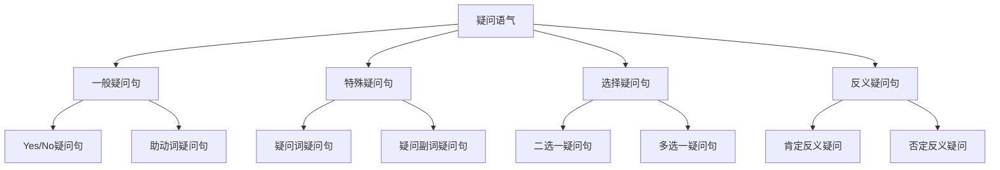

# 疑问语气

## 🎯 学习目标
- 掌握疑问语气的基本概念和用法
- 理解疑问语气的各种形式
- 熟练运用疑问语气的表达方式

## 📚 基本概念

### 疑问语气（Interrogative Mood）
**定义**：用于提出问题、询问信息、表达疑问的语气

### 基本特征
- 提出问题或询问
- 表达疑问或不确定
- 使用疑问句
- 语调上升

## 🔄 疑问语气分类

## 📊 疑问语气变化表

### 基本变化表
| 类型 | 结构 | 示例 | 说明 |
|------|------|------|------|
| 一般疑问句 | 助动词+主语+谓语+宾语 | Do you like English? | 询问是否 |
| 特殊疑问句 | 疑问词+助动词+主语+谓语+宾语 | What do you like? | 询问具体信息 |
| 选择疑问句 | 主语+谓语+宾语+or+宾语 | Do you like tea or coffee? | 询问选择 |
| 反义疑问句 | 陈述句+助动词+主语 | You like English, don't you? | 询问确认 |

## 🎯 一般疑问句

### 1. Yes/No疑问句
**功能**：询问是否

**示例**：
- ✅ Do you like English? (你喜欢英语吗？)
- ✅ Are you a student? (你是学生吗？)
- ✅ Can you speak French? (你会说法语吗？)
- ✅ Have you finished your homework? (你完成作业了吗？)
- ✅ Will you come tomorrow? (你明天会来吗？)

**语法特点**：
- 询问是否
- 用Yes/No回答
- 语调上升
- 表达疑问性

### 2. 助动词疑问句
**功能**：使用助动词提问

**示例**：
- ✅ Do you study English? (你学英语吗？)
- ✅ Does she teach English? (她教英语吗？)
- ✅ Did he work yesterday? (他昨天工作了吗？)
- ✅ Will they come tomorrow? (他们明天会来吗？)
- ✅ Have you been to Beijing? (你去过北京吗？)

**语法特点**：
- 使用助动词提问
- 助动词提前
- 语调上升
- 表达疑问性

### 3. Be动词疑问句
**功能**：使用Be动词提问

**示例**：
- ✅ Are you happy? (你快乐吗？)
- ✅ Is she beautiful? (她美丽吗？)
- ✅ Was he tired? (他累了吗？)
- ✅ Were they excited? (他们兴奋吗？)
- ✅ Will you be here? (你会在这里吗？)

**语法特点**：
- 使用Be动词提问
- Be动词提前
- 语调上升
- 表达疑问性

## 🎯 特殊疑问句

### 1. 疑问词疑问句
**功能**：使用疑问词提问

**示例**：
- ✅ What do you like? (你喜欢什么？)
- ✅ Who is she? (她是谁？)
- ✅ Which book do you want? (你想要哪本书？)
- ✅ Whose car is this? (这是谁的车？)
- ✅ Whom did you meet? (你遇到了谁？)

**语法特点**：
- 使用疑问词提问
- 疑问词提前
- 语调上升
- 表达疑问性

### 2. 疑问副词疑问句
**功能**：使用疑问副词提问

**示例**：
- ✅ Where do you live? (你住在哪里？)
- ✅ When did you arrive? (你什么时候到达的？)
- ✅ Why are you crying? (你为什么哭？)
- ✅ How do you feel? (你感觉怎么样？)
- ✅ How often do you exercise? (你多久锻炼一次？)

**语法特点**：
- 使用疑问副词提问
- 疑问副词提前
- 语调上升
- 表达疑问性

### 3. 疑问形容词疑问句
**功能**：使用疑问形容词提问

**示例**：
- ✅ What time is it? (现在几点了？)
- ✅ What color do you like? (你喜欢什么颜色？)
- ✅ What size do you wear? (你穿什么尺码？)
- ✅ What kind of music do you like? (你喜欢什么类型的音乐？)
- ✅ What type of car do you drive? (你开什么类型的车？)

**语法特点**：
- 使用疑问形容词提问
- 疑问形容词提前
- 语调上升
- 表达疑问性

## 🎯 选择疑问句

### 1. 二选一疑问句
**功能**：在两个选项中选择

**示例**：
- ✅ Do you like tea or coffee? (你喜欢茶还是咖啡？)
- ✅ Are you going by bus or by train? (你坐公交车还是火车去？)
- ✅ Is she a teacher or a student? (她是老师还是学生？)
- ✅ Did you buy the red one or the blue one? (你买了红色的还是蓝色的？)
- ✅ Will you stay here or go home? (你留在这里还是回家？)

**语法特点**：
- 在两个选项中选择
- 使用or连接
- 语调上升
- 表达选择性

### 2. 多选一疑问句
**功能**：在多个选项中选择

**示例**：
- ✅ Do you like apples, oranges, or bananas? (你喜欢苹果、橙子还是香蕉？)
- ✅ Are you going to Beijing, Shanghai, or Guangzhou? (你去北京、上海还是广州？)
- ✅ Is he a doctor, a teacher, or a lawyer? (他是医生、老师还是律师？)
- ✅ Did you buy the red, blue, or green one? (你买了红色、蓝色还是绿色的？)
- ✅ Will you stay here, go home, or travel? (你留在这里、回家还是旅行？)

**语法特点**：
- 在多个选项中选择
- 使用or连接
- 语调上升
- 表达选择性

### 3. 否定选择疑问句
**功能**：在否定选项中选择

**示例**：
- ✅ Don't you like tea or coffee? (你不喜欢茶还是咖啡？)
- ✅ Aren't you going by bus or by train? (你不坐公交车还是火车去？)
- ✅ Isn't she a teacher or a student? (她不是老师还是学生？)
- ✅ Didn't you buy the red one or the blue one? (你没买红色的还是蓝色的？)
- ✅ Won't you stay here or go home? (你不留在这里还是回家？)

**语法特点**：
- 在否定选项中选择
- 使用or连接
- 语调上升
- 表达否定选择性

## 🎯 反义疑问句

### 1. 肯定反义疑问
**功能**：肯定陈述+否定疑问

**示例**：
- ✅ You like English, don't you? (你喜欢英语，不是吗？)
- ✅ She speaks French, doesn't she? (她说法语，不是吗？)
- ✅ He is working, isn't he? (他在工作，不是吗？)
- ✅ We have finished, haven't we? (我们已经完成了，不是吗？)
- ✅ They will come, won't they? (他们会来，不是吗？)

**语法特点**：
- 肯定陈述+否定疑问
- 语调上升
- 表达确认性
- 期待肯定回答

### 2. 否定反义疑问
**功能**：否定陈述+肯定疑问

**示例**：
- ✅ You don't like English, do you? (你不喜欢英语，是吗？)
- ✅ She doesn't speak French, does she? (她不会说法语，是吗？)
- ✅ He isn't working, is he? (他不工作，是吗？)
- ✅ We haven't finished, have we? (我们还没有完成，是吗？)
- ✅ They won't come, will they? (他们不会来，是吗？)

**语法特点**：
- 否定陈述+肯定疑问
- 语调上升
- 表达确认性
- 期待否定回答

### 3. 特殊反义疑问
**功能**：特殊形式的反义疑问

**示例**：
- ✅ Let's go, shall we? (我们走吧，好吗？)
- ✅ Let me help you, will you? (让我帮助你，好吗？)
- ✅ Don't be late, will you? (不要迟到，好吗？)
- ✅ Be careful, won't you? (小心点，好吗？)
- ✅ Have a good time, won't you? (玩得开心，好吗？)

**语法特点**：
- 特殊形式的反义疑问
- 语调上升
- 表达建议性
- 期待肯定回答

## 🎯 疑问语气时态

### 1. 现在时态疑问
**功能**：现在时态的疑问

**示例**：
- ✅ Do you study English? (你学英语吗？)
- ✅ Are you happy? (你快乐吗？)
- ✅ Can you speak English? (你会说英语吗？)
- ✅ Have you finished? (你完成了吗？)
- ✅ Are you working? (你在工作吗？)

**语法特点**：
- 现在时态
- 疑问句形式
- 语调上升
- 表达现在疑问

### 2. 过去时态疑问
**功能**：过去时态的疑问

**示例**：
- ✅ Did you study English? (你学英语了吗？)
- ✅ Were you happy? (你快乐吗？)
- ✅ Could you speak English? (你会说英语吗？)
- ✅ Had you finished? (你完成了吗？)
- ✅ Were you working? (你在工作吗？)

**语法特点**：
- 过去时态
- 疑问句形式
- 语调上升
- 表达过去疑问

### 3. 将来时态疑问
**功能**：将来时态的疑问

**示例**：
- ✅ Will you study English? (你将学英语吗？)
- ✅ Will you be happy? (你将快乐吗？)
- ✅ Will you be able to speak English? (你将能说英语吗？)
- ✅ Will you have finished? (你将完成吗？)
- ✅ Will you be working? (你将在工作吗？)

**语法特点**：
- 将来时态
- 疑问句形式
- 语调上升
- 表达将来疑问

## 📊 疑问语气用法对比表

| 用法 | 示例 | 说明 |
|------|------|------|
| Yes/No疑问句 | Do you like English? | 询问是否 |
| 助动词疑问句 | Do you study English? | 使用助动词提问 |
| Be动词疑问句 | Are you happy? | 使用Be动词提问 |
| 疑问词疑问句 | What do you like? | 使用疑问词提问 |
| 疑问副词疑问句 | Where do you live? | 使用疑问副词提问 |
| 疑问形容词疑问句 | What time is it? | 使用疑问形容词提问 |
| 二选一疑问句 | Do you like tea or coffee? | 在两个选项中选择 |
| 多选一疑问句 | Do you like apples, oranges, or bananas? | 在多个选项中选择 |
| 否定选择疑问句 | Don't you like tea or coffee? | 在否定选项中选择 |
| 肯定反义疑问 | You like English, don't you? | 肯定陈述+否定疑问 |
| 否定反义疑问 | You don't like English, do you? | 否定陈述+肯定疑问 |
| 特殊反义疑问 | Let's go, shall we? | 特殊形式的反义疑问 |

## 🚫 常见错误分析

### 错误类型1：疑问句结构错误
**错误**：❌ You like English?
**正确**：✅ Do you like English?
**分析**：一般疑问句需要助动词

### 错误类型2：疑问词使用错误
**错误**：❌ What you like?
**正确**：✅ What do you like?
**分析**：特殊疑问句需要助动词

### 错误类型3：反义疑问句错误
**错误**：❌ You like English, do you?
**正确**：✅ You like English, don't you?
**分析**：反义疑问句要相反

### 错误类型4：语调错误
**错误**：❌ Do you like English. (降调)
**正确**：✅ Do you like English? (升调)
**分析**：疑问句用升调

## 🔗 相关链接
- [[01-陈述语气]]：陈述语气的用法
- [[03-祈使语气]]：祈使语气的用法
- [[04-虚拟语气]]：虚拟语气的用法
- [[05-语气易混点辨析]]：语气的易混点辨析
- [[01-基础认知层/01-词性系统/03-动词系统]]：动词系统

## 💡 记忆口诀

**疑问语气记忆法**：
- 疑问语气用于提出问题、询问信息、表达疑问
- 一般疑问句询问是否，特殊疑问句询问具体信息
- 选择疑问句询问选择，反义疑问句询问确认
- 现在时态疑问表达现在疑问，过去时态疑问表达过去疑问
- 将来时态疑问表达将来疑问，时态要保持一致
- 语调上升表达疑问性，语调下降表达陈述性

---
*掌握疑问语气是语法学习的重要基础，需要大量练习才能熟练运用*
