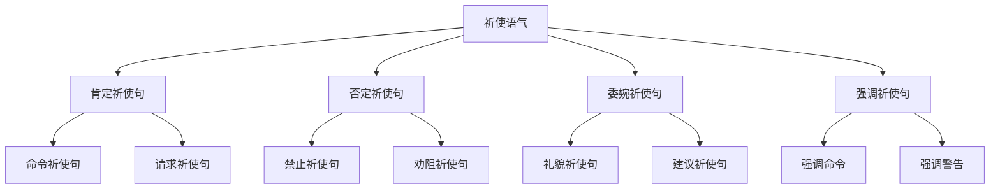

# 祈使语气

## 🎯 学习目标
- 掌握祈使语气的基本概念和用法
- 理解祈使语气的各种形式
- 熟练运用祈使语气的表达方式

## 📚 基本概念

### 祈使语气（Imperative Mood）
**定义**：用于表达命令、请求、建议、警告等语气的语气

### 基本特征
- 表达命令或请求
- 表达建议或警告
- 使用祈使句
- 语调下降

## 🔄 祈使语气分类

## 📊 祈使语气变化表

### 基本变化表
| 类型 | 结构 | 示例 | 说明 |
|------|------|------|------|
| 肯定祈使句 | 动词原形+宾语 | Open the door. | 表达命令或请求 |
| 否定祈使句 | Don't+动词原形+宾语 | Don't open the door. | 表达禁止或劝阻 |
| 委婉祈使句 | Please+动词原形+宾语 | Please open the door. | 表达礼貌请求 |
| 强调祈使句 | Do+动词原形+宾语 | Do open the door. | 表达强调命令 |

## 🎯 肯定祈使句

### 1. 命令祈使句
**功能**：表达命令

**示例**：
- ✅ Open the door. (开门)
- ✅ Close the window. (关窗)
- ✅ Sit down. (坐下)
- ✅ Stand up. (站起来)
- ✅ Come here. (过来)

**语法特点**：
- 表达命令
- 使用动词原形
- 语调下降
- 表达强制性

### 2. 请求祈使句
**功能**：表达请求

**示例**：
- ✅ Help me, please. (请帮助我)
- ✅ Pass me the salt. (把盐递给我)
- ✅ Give me a hand. (帮我一下)
- ✅ Lend me your pen. (借我你的笔)
- ✅ Show me the way. (给我指路)

**语法特点**：
- 表达请求
- 使用动词原形
- 语调下降
- 表达请求性

### 3. 建议祈使句
**功能**：表达建议

**示例**：
- ✅ Try again. (再试一次)
- ✅ Take your time. (慢慢来)
- ✅ Be careful. (小心点)
- ✅ Have a rest. (休息一下)
- ✅ Enjoy yourself. (玩得开心)

**语法特点**：
- 表达建议
- 使用动词原形
- 语调下降
- 表达建议性

### 4. 邀请祈使句
**功能**：表达邀请

**示例**：
- ✅ Come in. (进来)
- ✅ Have a seat. (请坐)
- ✅ Make yourself at home. (别客气)
- ✅ Help yourself. (请自便)
- ✅ Join us. (加入我们)

**语法特点**：
- 表达邀请
- 使用动词原形
- 语调下降
- 表达邀请性

## 🎯 否定祈使句

### 1. 禁止祈使句
**功能**：表达禁止

**示例**：
- ✅ Don't smoke here. (不要在这里吸烟)
- ✅ Don't touch that. (不要碰那个)
- ✅ Don't be late. (不要迟到)
- ✅ Don't make noise. (不要吵闹)
- ✅ Don't waste time. (不要浪费时间)

**语法特点**：
- 表达禁止
- 使用Don't+动词原形
- 语调下降
- 表达禁止性

### 2. 劝阻祈使句
**功能**：表达劝阻

**示例**：
- ✅ Don't worry. (不要担心)
- ✅ Don't be afraid. (不要害怕)
- ✅ Don't give up. (不要放弃)
- ✅ Don't be sad. (不要难过)
- ✅ Don't be angry. (不要生气)

**语法特点**：
- 表达劝阻
- 使用Don't+动词原形
- 语调下降
- 表达劝阻性

### 3. 警告祈使句
**功能**：表达警告

**示例**：
- ✅ Don't go there. (不要去那里)
- ✅ Don't do that. (不要那样做)
- ✅ Don't say that. (不要说那样的话)
- ✅ Don't think about it. (不要想那个)
- ✅ Don't mention it. (不要提那个)

**语法特点**：
- 表达警告
- 使用Don't+动词原形
- 语调下降
- 表达警告性

### 4. 提醒祈使句
**功能**：表达提醒

**示例**：
- ✅ Don't forget. (不要忘记)
- ✅ Don't miss it. (不要错过)
- ✅ Don't lose it. (不要丢失)
- ✅ Don't break it. (不要弄坏)
- ✅ Don't spoil it. (不要破坏)

**语法特点**：
- 表达提醒
- 使用Don't+动词原形
- 语调下降
- 表达提醒性

## 🎯 委婉祈使句

### 1. 礼貌祈使句
**功能**：表达礼貌请求

**示例**：
- ✅ Please open the door. (请开门)
- ✅ Please help me. (请帮助我)
- ✅ Please sit down. (请坐下)
- ✅ Please come in. (请进来)
- ✅ Please wait a moment. (请等一下)

**语法特点**：
- 表达礼貌请求
- 使用Please+动词原形
- 语调下降
- 表达礼貌性

### 2. 建议祈使句
**功能**：表达建议

**示例**：
- ✅ Please try again. (请再试一次)
- ✅ Please take your time. (请慢慢来)
- ✅ Please be careful. (请小心点)
- ✅ Please have a rest. (请休息一下)
- ✅ Please enjoy yourself. (请玩得开心)

**语法特点**：
- 表达建议
- 使用Please+动词原形
- 语调下降
- 表达建议性

### 3. 邀请祈使句
**功能**：表达邀请

**示例**：
- ✅ Please come in. (请进来)
- ✅ Please have a seat. (请坐)
- ✅ Please make yourself at home. (请别客气)
- ✅ Please help yourself. (请自便)
- ✅ Please join us. (请加入我们)

**语法特点**：
- 表达邀请
- 使用Please+动词原形
- 语调下降
- 表达邀请性

### 4. 请求祈使句
**功能**：表达请求

**示例**：
- ✅ Please pass me the salt. (请把盐递给我)
- ✅ Please give me a hand. (请帮我一下)
- ✅ Please lend me your pen. (请借我你的笔)
- ✅ Please show me the way. (请给我指路)
- ✅ Please tell me the truth. (请告诉我真相)

**语法特点**：
- 表达请求
- 使用Please+动词原形
- 语调下降
- 表达请求性

## 🎯 强调祈使句

### 1. 强调命令
**功能**：表达强调命令

**示例**：
- ✅ Do open the door. (一定要开门)
- ✅ Do help me. (一定要帮助我)
- ✅ Do sit down. (一定要坐下)
- ✅ Do come in. (一定要进来)
- ✅ Do wait a moment. (一定要等一下)

**语法特点**：
- 表达强调命令
- 使用Do+动词原形
- 语调下降
- 表达强调性

### 2. 强调警告
**功能**：表达强调警告

**示例**：
- ✅ Do be careful. (一定要小心)
- ✅ Do take your time. (一定要慢慢来)
- ✅ Do have a rest. (一定要休息)
- ✅ Do enjoy yourself. (一定要玩得开心)
- ✅ Do try again. (一定要再试一次)

**语法特点**：
- 表达强调警告
- 使用Do+动词原形
- 语调下降
- 表达强调性

### 3. 强调建议
**功能**：表达强调建议

**示例**：
- ✅ Do try this. (一定要试试这个)
- ✅ Do believe me. (一定要相信我)
- ✅ Do trust me. (一定要信任我)
- ✅ Do follow me. (一定要跟着我)
- ✅ Do listen to me. (一定要听我说)

**语法特点**：
- 表达强调建议
- 使用Do+动词原形
- 语调下降
- 表达强调性

### 4. 强调邀请
**功能**：表达强调邀请

**示例**：
- ✅ Do come in. (一定要进来)
- ✅ Do have a seat. (一定要坐下)
- ✅ Do make yourself at home. (一定要别客气)
- ✅ Do help yourself. (一定要自便)
- ✅ Do join us. (一定要加入我们)

**语法特点**：
- 表达强调邀请
- 使用Do+动词原形
- 语调下降
- 表达强调性

## 🎯 祈使语气时态

### 1. 现在时态祈使
**功能**：现在时态的祈使

**示例**：
- ✅ Open the door now. (现在开门)
- ✅ Help me now. (现在帮助我)
- ✅ Sit down now. (现在坐下)
- ✅ Come here now. (现在过来)
- ✅ Wait here now. (现在在这里等)

**语法特点**：
- 现在时态
- 祈使句形式
- 语调下降
- 表达现在祈使

### 2. 将来时态祈使
**功能**：将来时态的祈使

**示例**：
- ✅ Open the door tomorrow. (明天开门)
- ✅ Help me later. (稍后帮助我)
- ✅ Sit down when you come. (你来时坐下)
- ✅ Come here next week. (下周过来)
- ✅ Wait here until I come back. (在这里等到我回来)

**语法特点**：
- 将来时态
- 祈使句形式
- 语调下降
- 表达将来祈使

### 3. 条件祈使
**功能**：条件祈使

**示例**：
- ✅ If you see him, tell him to call me. (如果你看到他，告诉他给我打电话)
- ✅ If you have time, help me. (如果你有时间，帮助我)
- ✅ If you want, come with us. (如果你想，和我们一起来)
- ✅ If you can, do it now. (如果你能，现在就做)
- ✅ If you like, stay here. (如果你喜欢，留在这里)

**语法特点**：
- 条件祈使
- 祈使句形式
- 语调下降
- 表达条件祈使

## 📊 祈使语气用法对比表

| 用法 | 示例 | 说明 |
|------|------|------|
| 命令祈使句 | Open the door. | 表达命令 |
| 请求祈使句 | Help me, please. | 表达请求 |
| 建议祈使句 | Try again. | 表达建议 |
| 邀请祈使句 | Come in. | 表达邀请 |
| 禁止祈使句 | Don't smoke here. | 表达禁止 |
| 劝阻祈使句 | Don't worry. | 表达劝阻 |
| 警告祈使句 | Don't go there. | 表达警告 |
| 提醒祈使句 | Don't forget. | 表达提醒 |
| 礼貌祈使句 | Please open the door. | 表达礼貌请求 |
| 建议祈使句 | Please try again. | 表达建议 |
| 邀请祈使句 | Please come in. | 表达邀请 |
| 请求祈使句 | Please help me. | 表达请求 |
| 强调命令 | Do open the door. | 表达强调命令 |
| 强调警告 | Do be careful. | 表达强调警告 |
| 强调建议 | Do try this. | 表达强调建议 |
| 强调邀请 | Do come in. | 表达强调邀请 |

## 🚫 常见错误分析

### 错误类型1：祈使句结构错误
**错误**：❌ You open the door.
**正确**：✅ Open the door.
**分析**：祈使句不需要主语

### 错误类型2：否定祈使句错误
**错误**：❌ Not open the door.
**正确**：✅ Don't open the door.
**分析**：否定祈使句用Don't

### 错误类型3：委婉祈使句错误
**错误**：❌ Open the door please.
**正确**：✅ Please open the door.
**分析**：Please放在句首

### 错误类型4：语调错误
**错误**：❌ Open the door? (升调)
**正确**：✅ Open the door. (降调)
**分析**：祈使句用降调

## 🔗 相关链接
- [[01-陈述语气]]：陈述语气的用法
- [[02-疑问语气]]：疑问语气的用法
- [[04-虚拟语气]]：虚拟语气的用法
- [[05-语气易混点辨析]]：语气的易混点辨析
- [[01-基础认知层/01-词性系统/03-动词系统]]：动词系统

## 💡 记忆口诀

**祈使语气记忆法**：
- 祈使语气用于表达命令、请求、建议、警告
- 肯定祈使句表达命令或请求，否定祈使句表达禁止或劝阻
- 委婉祈使句表达礼貌请求，强调祈使句表达强调命令
- 现在时态祈使表达现在祈使，将来时态祈使表达将来祈使
- 条件祈使表达条件祈使，时态要保持一致
- 语调下降表达命令性，语调上升表达疑问性

---
*掌握祈使语气是语法学习的重要基础，需要大量练习才能熟练运用*
