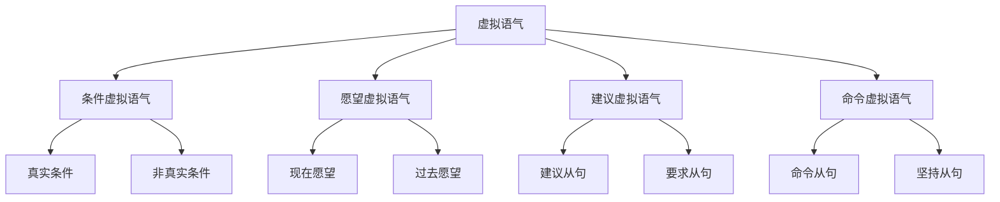

# 虚拟语气

## 🎯 学习目标
- 掌握虚拟语气的基本概念和用法
- 理解虚拟语气的各种形式
- 熟练运用虚拟语气的表达方式

## 📚 基本概念

### 虚拟语气（Subjunctive Mood）
**定义**：用于表达假设、愿望、建议、命令等非现实情况的语气

### 基本特征
- 表达非现实情况
- 表达假设或愿望
- 使用特殊动词形式
- 语调平稳

## 🔄 虚拟语气分类

## 📊 虚拟语气变化表

### 基本变化表
| 类型 | 结构 | 示例 | 说明 |
|------|------|------|------|
| 条件虚拟语气 | If+主语+动词过去式, 主语+would+动词原形 | If I were you, I would go. | 表达非真实条件 |
| 愿望虚拟语气 | 主语+wish+that+主语+动词过去式 | I wish I were rich. | 表达现在愿望 |
| 建议虚拟语气 | 主语+suggest+that+主语+(should)+动词原形 | I suggest that he (should) go. | 表达建议 |
| 命令虚拟语气 | 主语+demand+that+主语+(should)+动词原形 | I demand that he (should) go. | 表达命令 |

## 🎯 条件虚拟语气

### 1. 真实条件
**功能**：表达真实条件

**示例**：
- ✅ If it rains, I will stay home. (如果下雨，我将待在家里)
- ✅ If you study hard, you will pass the exam. (如果你努力学习，你将通过考试)
- ✅ If he comes, I will tell him. (如果他来，我将告诉他)
- ✅ If we have time, we will visit you. (如果我们有时间，我们将拜访你)
- ✅ If they help us, we will succeed. (如果他们帮助我们，我们将成功)

**语法特点**：
- 表达真实条件
- 使用一般现在时
- 主句用一般将来时
- 表达可能性

### 2. 非真实条件（现在）
**功能**：表达非真实条件（现在）

**示例**：
- ✅ If I were you, I would go. (如果我是你，我会去)
- ✅ If he were here, he would help us. (如果他在这里，他会帮助我们)
- ✅ If we had money, we would buy a car. (如果我们有钱，我们会买车)
- ✅ If they knew the truth, they would be angry. (如果他们知道真相，他们会生气)
- ✅ If you studied hard, you would pass the exam. (如果你努力学习，你会通过考试)

**语法特点**：
- 表达非真实条件
- 使用动词过去式
- 主句用would+动词原形
- 表达不可能性

### 3. 非真实条件（过去）
**功能**：表达非真实条件（过去）

**示例**：
- ✅ If I had known, I would have told you. (如果我早知道，我会告诉你)
- ✅ If he had come, I would have met him. (如果他来了，我会见到他)
- ✅ If we had had money, we would have bought a car. (如果我们有钱，我们会买车)
- ✅ If they had known the truth, they would have been angry. (如果他们知道真相，他们会生气)
- ✅ If you had studied hard, you would have passed the exam. (如果你努力学习，你会通过考试)

**语法特点**：
- 表达非真实条件
- 使用had+过去分词
- 主句用would have+过去分词
- 表达过去不可能性

### 4. 混合条件
**功能**：表达混合条件

**示例**：
- ✅ If I had studied hard, I would be successful now. (如果我努力学习，我现在会成功)
- ✅ If he had come yesterday, he would be here now. (如果他昨天来了，他现在会在这里)
- ✅ If we had had money, we would be rich now. (如果我们有钱，我们现在会富有)
- ✅ If they had known the truth, they would be happy now. (如果他们知道真相，他们现在会快乐)
- ✅ If you had studied hard, you would be a good student now. (如果你努力学习，你现在会是个好学生)

**语法特点**：
- 表达混合条件
- 条件句用had+过去分词
- 主句用would+动词原形
- 表达混合时间

## 🎯 愿望虚拟语气

### 1. 现在愿望
**功能**：表达现在愿望

**示例**：
- ✅ I wish I were rich. (我希望我富有)
- ✅ I wish he were here. (我希望他在这里)
- ✅ I wish we had money. (我希望我们有钱)
- ✅ I wish they knew the truth. (我希望他们知道真相)
- ✅ I wish you studied hard. (我希望你努力学习)

**语法特点**：
- 表达现在愿望
- 使用动词过去式
- 表达不可能实现
- 表达遗憾

### 2. 过去愿望
**功能**：表达过去愿望

**示例**：
- ✅ I wish I had known. (我希望我早知道)
- ✅ I wish he had come. (我希望他来了)
- ✅ I wish we had had money. (我希望我们有钱)
- ✅ I wish they had known the truth. (我希望他们知道真相)
- ✅ I wish you had studied hard. (我希望你努力学习)

**语法特点**：
- 表达过去愿望
- 使用had+过去分词
- 表达过去不可能实现
- 表达过去遗憾

### 3. 将来愿望
**功能**：表达将来愿望

**示例**：
- ✅ I wish I would be rich. (我希望我将富有)
- ✅ I wish he would come. (我希望他将来)
- ✅ I wish we would have money. (我希望我们将有钱)
- ✅ I wish they would know the truth. (我希望他们将知道真相)
- ✅ I wish you would study hard. (我希望你将努力学习)

**语法特点**：
- 表达将来愿望
- 使用would+动词原形
- 表达将来可能性
- 表达希望

## 🎯 建议虚拟语气

### 1. 建议从句
**功能**：表达建议

**示例**：
- ✅ I suggest that he (should) go. (我建议他去)
- ✅ I suggest that she (should) study hard. (我建议她努力学习)
- ✅ I suggest that we (should) have a meeting. (我建议我们开会)
- ✅ I suggest that they (should) know the truth. (我建议他们知道真相)
- ✅ I suggest that you (should) be careful. (我建议你小心)

**语法特点**：
- 表达建议
- 使用(should)+动词原形
- should可以省略
- 表达建议性

### 2. 要求从句
**功能**：表达要求

**示例**：
- ✅ I demand that he (should) go. (我要求他去)
- ✅ I demand that she (should) study hard. (我要求她努力学习)
- ✅ I demand that we (should) have a meeting. (我要求我们开会)
- ✅ I demand that they (should) know the truth. (我要求他们知道真相)
- ✅ I demand that you (should) be careful. (我要求你小心)

**语法特点**：
- 表达要求
- 使用(should)+动词原形
- should可以省略
- 表达要求性

### 3. 坚持从句
**功能**：表达坚持

**示例**：
- ✅ I insist that he (should) go. (我坚持他去)
- ✅ I insist that she (should) study hard. (我坚持她努力学习)
- ✅ I insist that we (should) have a meeting. (我坚持我们开会)
- ✅ I insist that they (should) know the truth. (我坚持他们知道真相)
- ✅ I insist that you (should) be careful. (我坚持你小心)

**语法特点**：
- 表达坚持
- 使用(should)+动词原形
- should可以省略
- 表达坚持性

## 🎯 命令虚拟语气

### 1. 命令从句
**功能**：表达命令

**示例**：
- ✅ I order that he (should) go. (我命令他去)
- ✅ I order that she (should) study hard. (我命令她努力学习)
- ✅ I order that we (should) have a meeting. (我命令我们开会)
- ✅ I order that they (should) know the truth. (我命令他们知道真相)
- ✅ I order that you (should) be careful. (我命令你小心)

**语法特点**：
- 表达命令
- 使用(should)+动词原形
- should可以省略
- 表达命令性

### 2. 要求从句
**功能**：表达要求

**示例**：
- ✅ I require that he (should) go. (我要求他去)
- ✅ I require that she (should) study hard. (我要求她努力学习)
- ✅ I require that we (should) have a meeting. (我要求我们开会)
- ✅ I require that they (should) know the truth. (我要求他们知道真相)
- ✅ I require that you (should) be careful. (我要求你小心)

**语法特点**：
- 表达要求
- 使用(should)+动词原形
- should可以省略
- 表达要求性

### 3. 建议从句
**功能**：表达建议

**示例**：
- ✅ I recommend that he (should) go. (我推荐他去)
- ✅ I recommend that she (should) study hard. (我推荐她努力学习)
- ✅ I recommend that we (should) have a meeting. (我推荐我们开会)
- ✅ I recommend that they (should) know the truth. (我推荐他们知道真相)
- ✅ I recommend that you (should) be careful. (我推荐你小心)

**语法特点**：
- 表达建议
- 使用(should)+动词原形
- should可以省略
- 表达建议性

## 🎯 特殊虚拟语气

### 1. as if/as though
**功能**：表达虚拟比较

**示例**：
- ✅ He talks as if he were rich. (他说话好像他富有)
- ✅ She looks as though she were tired. (她看起来好像她累了)
- ✅ He acts as if he knew everything. (他表现得好像他知道一切)
- ✅ She speaks as though she were a native speaker. (她说话好像她是母语者)
- ✅ He behaves as if he were the boss. (他表现得好像他是老板)

**语法特点**：
- 表达虚拟比较
- 使用动词过去式
- 表达非现实情况
- 表达假设

### 2. It's time
**功能**：表达时间虚拟

**示例**：
- ✅ It's time we went home. (是我们回家的时候了)
- ✅ It's time she studied hard. (是她努力学习的时候了)
- ✅ It's time we had a meeting. (是我们开会的时候了)
- ✅ It's time they knew the truth. (是他们知道真相的时候了)
- ✅ It's time you were careful. (是你小心的时候了)

**语法特点**：
- 表达时间虚拟
- 使用动词过去式
- 表达时间紧迫
- 表达建议

### 3. would rather
**功能**：表达偏好虚拟

**示例**：
- ✅ I would rather you went. (我宁愿你去)
- ✅ I would rather she studied hard. (我宁愿她努力学习)
- ✅ I would rather we had a meeting. (我宁愿我们开会)
- ✅ I would rather they knew the truth. (我宁愿他们知道真相)
- ✅ I would rather you were careful. (我宁愿你小心)

**语法特点**：
- 表达偏好虚拟
- 使用动词过去式
- 表达偏好选择
- 表达建议

## 📊 虚拟语气用法对比表

| 用法 | 示例 | 说明 |
|------|------|------|
| 真实条件 | If it rains, I will stay home. | 表达真实条件 |
| 非真实条件（现在） | If I were you, I would go. | 表达非真实条件（现在） |
| 非真实条件（过去） | If I had known, I would have told you. | 表达非真实条件（过去） |
| 混合条件 | If I had studied hard, I would be successful now. | 表达混合条件 |
| 现在愿望 | I wish I were rich. | 表达现在愿望 |
| 过去愿望 | I wish I had known. | 表达过去愿望 |
| 将来愿望 | I wish I would be rich. | 表达将来愿望 |
| 建议从句 | I suggest that he (should) go. | 表达建议 |
| 要求从句 | I demand that he (should) go. | 表达要求 |
| 坚持从句 | I insist that he (should) go. | 表达坚持 |
| 命令从句 | I order that he (should) go. | 表达命令 |
| 要求从句 | I require that he (should) go. | 表达要求 |
| 建议从句 | I recommend that he (should) go. | 表达建议 |
| 虚拟比较 | He talks as if he were rich. | 表达虚拟比较 |
| 时间虚拟 | It's time we went home. | 表达时间虚拟 |
| 偏好虚拟 | I would rather you went. | 表达偏好虚拟 |

## 🚫 常见错误分析

### 错误类型1：虚拟语气结构错误
**错误**：❌ If I am you, I will go.
**正确**：✅ If I were you, I would go.
**分析**：非真实条件用虚拟语气

### 错误类型2：时态使用错误
**错误**：❌ If I had known, I will tell you.
**正确**：✅ If I had known, I would have told you.
**分析**：时态要保持一致

### 错误类型3：should使用错误
**错误**：❌ I suggest that he goes.
**正确**：✅ I suggest that he (should) go.
**分析**：建议从句用虚拟语气

### 错误类型4：wish使用错误
**错误**：❌ I wish I am rich.
**正确**：✅ I wish I were rich.
**分析**：wish后用虚拟语气

## 🔗 相关链接
- [[01-陈述语气]]：陈述语气的用法
- [[02-疑问语气]]：疑问语气的用法
- [[03-祈使语气]]：祈使语气的用法
- [[05-语气易混点辨析]]：语气的易混点辨析
- [[01-基础认知层/01-词性系统/03-动词系统]]：动词系统

## 💡 记忆口诀

**虚拟语气记忆法**：
- 虚拟语气用于表达假设、愿望、建议、命令等非现实情况
- 条件虚拟语气表达非真实条件，愿望虚拟语气表达愿望
- 建议虚拟语气表达建议，命令虚拟语气表达命令
- 真实条件用一般现在时，非真实条件用虚拟语气
- 现在愿望用动词过去式，过去愿望用had+过去分词
- 建议从句用(should)+动词原形，should可以省略

---
*掌握虚拟语气是语法学习的重要基础，需要大量练习才能熟练运用*
