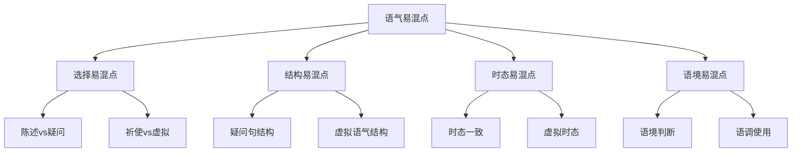

# 语气易混点辨析

## 🎯 学习目标
- 识别语气使用中的常见易混点
- 掌握易混点的正确用法
- 避免语气使用中的常见错误

## 🔍 易混点分类

## 🔄 选择易混点

### 1. 陈述语气vs疑问语气
**易混点**：陈述语气和疑问语气的选择错误

**常见错误**：
| 错误 | 正确 | 分析 |
|------|------|------|
| You like English? | Do you like English? | 疑问语气需要助动词 |
| I like English? | I like English. | 陈述语气用陈述句 |
| She speaks French? | Does she speak French? | 疑问语气需要助动词 |
| He is working? | Is he working? | 疑问语气需要助动词 |
| We have finished? | Have we finished? | 疑问语气需要助动词 |

**辨析技巧**：
- 陈述语气用陈述句
- 疑问语气用疑问句
- 疑问句需要助动词
- 根据语境判断

**示例对比**：
- ✅ I like English. (我喜欢英语) - 陈述语气
- ✅ Do you like English? (你喜欢英语吗？) - 疑问语气
- ✅ She speaks French. (她说法语) - 陈述语气
- ✅ Does she speak French? (她说法语吗？) - 疑问语气

### 2. 祈使语气vs虚拟语气
**易混点**：祈使语气和虚拟语气的选择错误

**常见错误**：
| 错误 | 正确 | 分析 |
|------|------|------|
| If you go, go now. | If you go, go now. | 祈使语气用动词原形 |
| If I were you, I go. | If I were you, I would go. | 虚拟语气用would |
| Go home now. | Go home now. | 祈使语气用动词原形 |
| I wish I go. | I wish I could go. | 虚拟语气用could |
| Don't go there. | Don't go there. | 祈使语气用Don't |

**辨析技巧**：
- 祈使语气用动词原形
- 虚拟语气用特殊形式
- 根据语境判断
- 注意动词形式

**示例对比**：
- ✅ Go home now. (现在回家) - 祈使语气
- ✅ If I were you, I would go home. (如果我是你，我会回家) - 虚拟语气
- ✅ Don't go there. (不要去那里) - 祈使语气
- ✅ I wish I could go there. (我希望我能去那里) - 虚拟语气

### 3. 疑问语气vs反义疑问
**易混点**：疑问语气和反义疑问的选择错误

**常见错误**：
| 错误 | 正确 | 分析 |
|------|------|------|
| You like English, do you? | You like English, don't you? | 反义疑问要相反 |
| She speaks French, does she? | She speaks French, doesn't she? | 反义疑问要相反 |
| He is working, is he? | He is working, isn't he? | 反义疑问要相反 |
| We have finished, have we? | We have finished, haven't we? | 反义疑问要相反 |
| They will come, will they? | They will come, won't they? | 反义疑问要相反 |

**辨析技巧**：
- 反义疑问要相反
- 肯定陈述+否定疑问
- 否定陈述+肯定疑问
- 注意助动词形式

**示例对比**：
- ✅ Do you like English? (你喜欢英语吗？) - 疑问语气
- ✅ You like English, don't you? (你喜欢英语，不是吗？) - 反义疑问
- ✅ Does she speak French? (她说法语吗？) - 疑问语气
- ✅ She speaks French, doesn't she? (她说法语，不是吗？) - 反义疑问

## 🎯 结构易混点

### 1. 疑问句结构错误
**易混点**：疑问句结构错误

**常见错误**：
| 错误 | 正确 | 分析 |
|------|------|------|
| You like English? | Do you like English? | 一般疑问句需要助动词 |
| What you like? | What do you like? | 特殊疑问句需要助动词 |
| Where you live? | Where do you live? | 特殊疑问句需要助动词 |
| When you come? | When do you come? | 特殊疑问句需要助动词 |
| Why you cry? | Why do you cry? | 特殊疑问句需要助动词 |

**辨析技巧**：
- 一般疑问句需要助动词
- 特殊疑问句需要助动词
- 助动词要提前
- 注意时态一致

**示例对比**：
- ✅ You like English. (你喜欢英语) - 陈述句
- ✅ Do you like English? (你喜欢英语吗？) - 一般疑问句
- ✅ What do you like? (你喜欢什么？) - 特殊疑问句
- ✅ Where do you live? (你住在哪里？) - 特殊疑问句

### 2. 虚拟语气结构错误
**易混点**：虚拟语气结构错误

**常见错误**：
| 错误 | 正确 | 分析 |
|------|------|------|
| If I am you, I will go. | If I were you, I would go. | 非真实条件用虚拟语气 |
| I wish I am rich. | I wish I were rich. | wish后用虚拟语气 |
| I suggest that he goes. | I suggest that he (should) go. | 建议从句用虚拟语气 |
| It's time we go. | It's time we went. | It's time后用虚拟语气 |
| I would rather you go. | I would rather you went. | would rather后用虚拟语气 |

**辨析技巧**：
- 非真实条件用虚拟语气
- wish后用虚拟语气
- 建议从句用虚拟语气
- It's time后用虚拟语气

**示例对比**：
- ✅ If I am you, I will go. (如果我是你，我将去) - 真实条件
- ✅ If I were you, I would go. (如果我是你，我会去) - 虚拟语气
- ✅ I wish I am rich. (我希望我富有) - 错误
- ✅ I wish I were rich. (我希望我富有) - 虚拟语气

### 3. 祈使句结构错误
**易混点**：祈使句结构错误

**常见错误**：
| 错误 | 正确 | 分析 |
|------|------|------|
| You open the door. | Open the door. | 祈使句不需要主语 |
| Not open the door. | Don't open the door. | 否定祈使句用Don't |
| Open the door please. | Please open the door. | Please放在句首 |
| You don't open the door. | Don't open the door. | 祈使句不需要主语 |
| You please open the door. | Please open the door. | 祈使句不需要主语 |

**辨析技巧**：
- 祈使句不需要主语
- 否定祈使句用Don't
- Please放在句首
- 注意句子结构

**示例对比**：
- ✅ You open the door. (你开门) - 陈述句
- ✅ Open the door. (开门) - 祈使句
- ✅ Not open the door. (不要开门) - 错误
- ✅ Don't open the door. (不要开门) - 祈使句

## 🎯 时态易混点

### 1. 时态一致错误
**易混点**：时态一致错误

**常见错误**：
| 错误 | 正确 | 分析 |
|------|------|------|
| If I had known, I will tell you. | If I had known, I would have told you. | 时态要保持一致 |
| If I were you, I will go. | If I were you, I would go. | 时态要保持一致 |
| If it rains, I would stay home. | If it rains, I will stay home. | 时态要保持一致 |
| If he comes, I would tell him. | If he comes, I will tell him. | 时态要保持一致 |
| If we have time, I would visit you. | If we have time, I will visit you. | 时态要保持一致 |

**辨析技巧**：
- 时态要保持一致
- 真实条件用一般现在时
- 非真实条件用虚拟语气
- 注意时态搭配

**示例对比**：
- ✅ If it rains, I will stay home. (如果下雨，我将待在家里) - 真实条件
- ✅ If I were you, I would go. (如果我是你，我会去) - 虚拟语气
- ✅ If I had known, I would have told you. (如果我早知道，我会告诉你) - 虚拟语气

### 2. 虚拟时态错误
**易混点**：虚拟时态错误

**常见错误**：
| 错误 | 正确 | 分析 |
|------|------|------|
| I wish I am rich. | I wish I were rich. | 现在愿望用过去式 |
| I wish I was rich. | I wish I were rich. | 现在愿望用were |
| I wish I will be rich. | I wish I would be rich. | 将来愿望用would |
| I wish I have known. | I wish I had known. | 过去愿望用had+过去分词 |
| I wish I can go. | I wish I could go. | 现在愿望用could |

**辨析技巧**：
- 现在愿望用过去式
- 过去愿望用had+过去分词
- 将来愿望用would
- 注意时态形式

**示例对比**：
- ✅ I wish I am rich. (我希望我富有) - 错误
- ✅ I wish I were rich. (我希望我富有) - 现在愿望
- ✅ I wish I had known. (我希望我早知道) - 过去愿望
- ✅ I wish I would be rich. (我希望我将富有) - 将来愿望

### 3. 建议时态错误
**易混点**：建议时态错误

**常见错误**：
| 错误 | 正确 | 分析 |
|------|------|------|
| I suggest that he goes. | I suggest that he (should) go. | 建议从句用虚拟语气 |
| I suggest that he went. | I suggest that he (should) go. | 建议从句用虚拟语气 |
| I suggest that he will go. | I suggest that he (should) go. | 建议从句用虚拟语气 |
| I suggest that he is going. | I suggest that he (should) go. | 建议从句用虚拟语气 |
| I suggest that he has gone. | I suggest that he (should) go. | 建议从句用虚拟语气 |

**辨析技巧**：
- 建议从句用虚拟语气
- 使用(should)+动词原形
- should可以省略
- 注意动词形式

**示例对比**：
- ✅ I suggest that he goes. (我建议他去) - 错误
- ✅ I suggest that he (should) go. (我建议他去) - 建议从句
- ✅ I suggest that he went. (我建议他去) - 错误
- ✅ I suggest that he (should) go. (我建议他去) - 建议从句

## 🎯 语境易混点

### 1. 语境判断错误
**易混点**：语境判断错误

**常见错误**：
| 错误 | 正确 | 分析 |
|------|------|------|
| You like English? | Do you like English? | 疑问语气需要助动词 |
| I like English? | I like English. | 陈述语气用陈述句 |
| Open the door? | Open the door. | 祈使语气用降调 |
| If I am you, I will go. | If I were you, I would go. | 非真实条件用虚拟语气 |
| I wish I am rich. | I wish I were rich. | wish后用虚拟语气 |

**辨析技巧**：
- 根据语境判断语气
- 疑问语气需要助动词
- 陈述语气用陈述句
- 祈使语气用降调

**示例对比**：
- ✅ You like English? (你喜欢英语？) - 错误
- ✅ Do you like English? (你喜欢英语吗？) - 疑问语气
- ✅ I like English. (我喜欢英语) - 陈述语气
- ✅ Open the door. (开门) - 祈使语气

### 2. 语调使用错误
**易混点**：语调使用错误

**常见错误**：
| 错误 | 正确 | 分析 |
|------|------|------|
| Do you like English. (降调) | Do you like English? (升调) | 疑问句用升调 |
| I like English? (升调) | I like English. (降调) | 陈述句用降调 |
| Open the door? (升调) | Open the door. (降调) | 祈使句用降调 |
| What do you like. (降调) | What do you like? (升调) | 疑问句用升调 |
| Please help me? (升调) | Please help me. (降调) | 祈使句用降调 |

**辨析技巧**：
- 疑问句用升调
- 陈述句用降调
- 祈使句用降调
- 注意语调变化

**示例对比**：
- ✅ Do you like English? (你喜欢英语吗？) - 升调
- ✅ I like English. (我喜欢英语) - 降调
- ✅ Open the door. (开门) - 降调
- ✅ What do you like? (你喜欢什么？) - 升调

## 📊 易混点对比表

| 易混点类型 | 错误示例 | 正确示例 | 辨析要点 |
|------------|----------|----------|----------|
| 陈述vs疑问 | You like English? | Do you like English? | 疑问语气需要助动词 |
| 祈使vs虚拟 | If I were you, I go. | If I were you, I would go. | 虚拟语气用would |
| 疑问句结构 | What you like? | What do you like? | 特殊疑问句需要助动词 |
| 虚拟语气结构 | If I am you, I will go. | If I were you, I would go. | 非真实条件用虚拟语气 |
| 祈使句结构 | You open the door. | Open the door. | 祈使句不需要主语 |
| 时态一致 | If I had known, I will tell you. | If I had known, I would have told you. | 时态要保持一致 |
| 虚拟时态 | I wish I am rich. | I wish I were rich. | 现在愿望用过去式 |
| 建议时态 | I suggest that he goes. | I suggest that he (should) go. | 建议从句用虚拟语气 |
| 语境判断 | You like English? | Do you like English? | 根据语境判断语气 |
| 语调使用 | Do you like English. (降调) | Do you like English? (升调) | 疑问句用升调 |

## 🎯 辨析技巧总结

### 1. 语气选择法
- 陈述语气用陈述句
- 疑问语气用疑问句
- 祈使语气用祈使句
- 虚拟语气用特殊形式

### 2. 结构分析法
- 疑问句需要助动词
- 虚拟语气用特殊形式
- 祈使句不需要主语
- 注意句子结构

### 3. 时态一致法
- 时态要保持一致
- 真实条件用一般现在时
- 非真实条件用虚拟语气
- 注意时态搭配

### 4. 语境判断法
- 根据语境判断语气
- 疑问语气需要助动词
- 陈述语气用陈述句
- 祈使语气用降调

## 🔗 相关链接
- [[01-陈述语气]]：陈述语气的用法
- [[02-疑问语气]]：疑问语气的用法
- [[03-祈使语气]]：祈使语气的用法
- [[04-虚拟语气]]：虚拟语气的用法
- [[01-基础认知层/01-词性系统/03-动词系统]]：动词系统

## 💡 记忆口诀

**语气易混点辨析记忆法**：
- 陈述语气用陈述句，疑问语气用疑问句
- 祈使语气用祈使句，虚拟语气用特殊形式
- 疑问句需要助动词，虚拟语气用特殊形式
- 祈使句不需要主语，注意句子结构
- 时态要保持一致，真实条件用一般现在时
- 非真实条件用虚拟语气，注意时态搭配
- 根据语境判断语气，疑问语气需要助动词
- 陈述语气用陈述句，祈使语气用降调

---
*掌握语气易混点辨析是提高语法准确性的关键，需要大量练习和对比分析*
