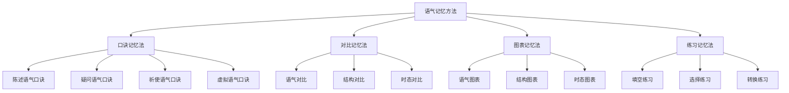

# 语气记忆辅助

## 🎯 学习目标
- 掌握语气记忆的有效方法
- 理解语气记忆的技巧和策略
- 提高语气学习的效率和准确性

## 📚 记忆方法分类



## 🎯 口诀记忆法

### 1. 陈述语气口诀
**口诀**：
```
陈述语气要记牢，陈述事实描述情况表达观点
肯定陈述表达肯定观点，否定陈述表达否定观点
疑问陈述表达疑问，感叹陈述表达感叹
现在时态陈述表达现在情况，过去时态陈述表达过去情况
将来时态陈述表达将来情况，时态要保持一致
语调平稳表达确定性，语调上升表达疑问性
```

**记忆要点**：
- 陈述事实或情况
- 表达观点或态度
- 使用陈述句
- 语调平稳

**应用示例**：
- ✅ The sun rises in the east. (太阳从东方升起) - 事实陈述
- ✅ I think English is interesting. (我认为英语很有趣) - 观点陈述
- ✅ The weather is nice today. (今天天气很好) - 描述陈述
- ✅ I don't like coffee. (我不喜欢咖啡) - 否定陈述

### 2. 疑问语气口诀
**口诀**：
```
疑问语气要记牢，提出问题询问信息表达疑问
一般疑问句询问是否，特殊疑问句询问具体信息
选择疑问句询问选择，反义疑问句询问确认
现在时态疑问表达现在疑问，过去时态疑问表达过去疑问
将来时态疑问表达将来疑问，时态要保持一致
语调上升表达疑问性，语调下降表达陈述性
```

**记忆要点**：
- 提出问题或询问
- 表达疑问或不确定
- 使用疑问句
- 语调上升

**应用示例**：
- ✅ Do you like English? (你喜欢英语吗？) - 一般疑问句
- ✅ What do you like? (你喜欢什么？) - 特殊疑问句
- ✅ Do you like tea or coffee? (你喜欢茶还是咖啡？) - 选择疑问句
- ✅ You like English, don't you? (你喜欢英语，不是吗？) - 反义疑问句

### 3. 祈使语气口诀
**口诀**：
```
祈使语气要记牢，表达命令请求建议警告
肯定祈使句表达命令或请求，否定祈使句表达禁止或劝阻
委婉祈使句表达礼貌请求，强调祈使句表达强调命令
现在时态祈使表达现在祈使，将来时态祈使表达将来祈使
条件祈使表达条件祈使，时态要保持一致
语调下降表达命令性，语调上升表达疑问性
```

**记忆要点**：
- 表达命令或请求
- 表达建议或警告
- 使用祈使句
- 语调下降

**应用示例**：
- ✅ Open the door. (开门) - 命令祈使句
- ✅ Help me, please. (请帮助我) - 请求祈使句
- ✅ Try again. (再试一次) - 建议祈使句
- ✅ Don't smoke here. (不要在这里吸烟) - 禁止祈使句

### 4. 虚拟语气口诀
**口诀**：
```
虚拟语气要记牢，表达假设愿望建议命令等非现实情况
条件虚拟语气表达非真实条件，愿望虚拟语气表达愿望
建议虚拟语气表达建议，命令虚拟语气表达命令
真实条件用一般现在时，非真实条件用虚拟语气
现在愿望用动词过去式，过去愿望用had+过去分词
建议从句用(should)+动词原形，should可以省略
```

**记忆要点**：
- 表达非现实情况
- 表达假设或愿望
- 使用特殊动词形式
- 语调平稳

**应用示例**：
- ✅ If I were you, I would go. (如果我是你，我会去) - 条件虚拟语气
- ✅ I wish I were rich. (我希望我富有) - 愿望虚拟语气
- ✅ I suggest that he (should) go. (我建议他去) - 建议虚拟语气
- ✅ I demand that he (should) go. (我要求他去) - 命令虚拟语气

## 🎯 对比记忆法

### 1. 语气对比
**对比表**：
| 语气 | 功能 | 结构 | 语调 | 示例 |
|------|------|------|------|------|
| 陈述语气 | 陈述事实 | 陈述句 | 降调 | I like English. |
| 疑问语气 | 提出问题 | 疑问句 | 升调 | Do you like English? |
| 祈使语气 | 表达命令 | 祈使句 | 降调 | Open the door. |
| 虚拟语气 | 表达假设 | 特殊形式 | 降调 | If I were you, I would go. |

**记忆技巧**：
- 陈述语气：陈述事实，降调
- 疑问语气：提出问题，升调
- 祈使语气：表达命令，降调
- 虚拟语气：表达假设，降调

**应用示例**：
- ✅ I like English. (我喜欢英语) - 陈述语气
- ✅ Do you like English? (你喜欢英语吗？) - 疑问语气
- ✅ Open the door. (开门) - 祈使语气
- ✅ If I were you, I would go. (如果我是你，我会去) - 虚拟语气

### 2. 结构对比
**对比表**：
| 语气 | 结构特点 | 示例 | 说明 |
|------|----------|------|------|
| 陈述语气 | 主语+谓语+宾语 | I like English. | 陈述句结构 |
| 疑问语气 | 助动词+主语+谓语+宾语 | Do you like English? | 疑问句结构 |
| 祈使语气 | 动词原形+宾语 | Open the door. | 祈使句结构 |
| 虚拟语气 | 特殊动词形式 | If I were you, I would go. | 虚拟语气结构 |

**记忆技巧**：
- 陈述语气：陈述句结构
- 疑问语气：疑问句结构
- 祈使语气：祈使句结构
- 虚拟语气：特殊结构

**应用示例**：
- ✅ I like English. (我喜欢英语) - 陈述句结构
- ✅ Do you like English? (你喜欢英语吗？) - 疑问句结构
- ✅ Open the door. (开门) - 祈使句结构
- ✅ If I were you, I would go. (如果我是你，我会去) - 虚拟语气结构

### 3. 时态对比
**对比表**：
| 语气 | 时态特点 | 示例 | 说明 |
|------|----------|------|------|
| 陈述语气 | 各种时态 | I like English. | 时态丰富 |
| 疑问语气 | 各种时态 | Do you like English? | 时态丰富 |
| 祈使语气 | 现在时态 | Open the door. | 现在时态 |
| 虚拟语气 | 特殊时态 | If I were you, I would go. | 特殊时态 |

**记忆技巧**：
- 陈述语气：时态丰富
- 疑问语气：时态丰富
- 祈使语气：现在时态
- 虚拟语气：特殊时态

**应用示例**：
- ✅ I like English. (我喜欢英语) - 现在时态
- ✅ Do you like English? (你喜欢英语吗？) - 现在时态
- ✅ Open the door. (开门) - 现在时态
- ✅ If I were you, I would go. (如果我是你，我会去) - 虚拟时态

## 🎯 图表记忆法

### 1. 语气图表
**语气功能图**：
```
陈述语气 → 陈述事实、描述情况、表达观点
疑问语气 → 提出问题、询问信息、表达疑问
祈使语气 → 表达命令、请求、建议、警告
虚拟语气 → 表达假设、愿望、建议、命令等非现实情况
```

**记忆技巧**：
- 陈述语气：陈述事实
- 疑问语气：提出问题
- 祈使语气：表达命令
- 虚拟语气：表达假设

### 2. 结构图表
**语气结构图**：
```
陈述语气：主语 + 谓语 + 宾语
疑问语气：助动词 + 主语 + 谓语 + 宾语
祈使语气：动词原形 + 宾语
虚拟语气：特殊动词形式
```

**记忆技巧**：
- 陈述语气：陈述句结构
- 疑问语气：疑问句结构
- 祈使语气：祈使句结构
- 虚拟语气：特殊结构

### 3. 时态图表
**语气时态图**：
```
陈述语气：各种时态（现在、过去、将来）
疑问语气：各种时态（现在、过去、将来）
祈使语气：现在时态
虚拟语气：特殊时态（过去式、had+过去分词、would+动词原形）
```

**记忆技巧**：
- 陈述语气：时态丰富
- 疑问语气：时态丰富
- 祈使语气：现在时态
- 虚拟语气：特殊时态

## 🎯 练习记忆法

### 1. 填空练习
**练习1：语气识别**
```
1. I like English. (_____语气)
2. Do you like English? (_____语气)
3. Open the door. (_____语气)
4. If I were you, I would go. (_____语气)
5. You like English, don't you? (_____语气)
```

**答案**：
1. 陈述
2. 疑问
3. 祈使
4. 虚拟
5. 反义疑问

**练习2：语气转换**
```
1. I like English. → _____ you like English?
2. Open the door. → _____ open the door.
3. If I am you, I will go. → If I _____ you, I _____ go.
4. I wish I am rich. → I wish I _____ rich.
5. I suggest that he goes. → I suggest that he (should) _____.
```

**答案**：
1. Do
2. Don't
3. were, would
4. were
5. go

### 2. 选择练习
**练习1：语气选择**
```
1. _____ you like English? (Do/Does/Did)
2. _____ the door. (Open/Opens/Opening)
3. If I _____ you, I would go. (am/were/was)
4. I wish I _____ rich. (am/were/was)
5. I suggest that he (should) _____. (go/goes/going)
```

**答案**：
1. Do
2. Open
3. were
4. were
5. go

**练习2：时态选择**
```
1. I _____ English every day. (study/studies/studied)
2. Do you _____ English? (study/studies/studied)
3. If I _____ you, I would go. (am/were/was)
4. I wish I _____ known. (know/knew/had known)
5. I suggest that he (should) _____. (go/goes/going)
```

**答案**：
1. study
2. study
3. were
4. had known
5. go

### 3. 转换练习
**练习1：陈述转疑问**
```
1. I like English. → _____ you like English?
2. She speaks French. → _____ she speak French?
3. He is working. → _____ he working?
4. We have finished. → _____ we finished?
5. They will come. → _____ they come?
```

**答案**：
1. Do
2. Does
3. Is
4. Have
5. Will

**练习2：真实转虚拟**
```
1. If it rains, I will stay home. → If it _____ rain, I _____ stay home.
2. If you study hard, you will pass. → If you _____ hard, you _____ pass.
3. If he comes, I will tell him. → If he _____, I _____ tell him.
4. If we have time, we will visit you. → If we _____ time, we _____ visit you.
5. If they help us, we will succeed. → If they _____ us, we _____ succeed.
```

**答案**：
1. rained, would
2. studied, would
3. came, would
4. had, would
5. helped, would

## 📊 记忆效果评估

### 1. 记忆程度测试
**测试1：概念理解**
- 陈述语气的定义是什么？
- 疑问语气的定义是什么？
- 祈使语气的定义是什么？
- 虚拟语气的定义是什么？
- 各种语气的区别是什么？

**测试2：结构识别**
- 识别陈述语气结构
- 识别疑问语气结构
- 识别祈使语气结构
- 识别虚拟语气结构
- 识别错误用法

**测试3：实际应用**
- 选择正确的语气
- 进行语气转换
- 识别语气错误
- 理解语气含义
- 运用语气表达

### 2. 记忆巩固方法
**方法1：重复练习**
- 每天练习语气识别
- 反复记忆口诀
- 多次练习填空
- 持续练习选择
- 定期复习巩固

**方法2：对比分析**
- 对比各种语气
- 分析结构差异
- 比较时态特点
- 总结记忆要点
- 归纳规律

**方法3：实际应用**
- 在写作中运用语气
- 在口语中练习语气
- 在阅读中识别语气
- 在听力中理解语气
- 在翻译中转换语气

## 🔗 相关链接
- [[01-陈述语气]]：陈述语气的用法
- [[02-疑问语气]]：疑问语气的用法
- [[03-祈使语气]]：祈使语气的用法
- [[04-虚拟语气]]：虚拟语气的用法
- [[05-语气易混点辨析]]：语气的易混点辨析
- [[01-基础认知层/01-词性系统/03-动词系统]]：动词系统

## 💡 记忆口诀总结

**语气记忆总口诀**：
```
陈述疑问祈使虚拟要分清，功能结构时态是关键
陈述语气陈述事实，疑问语气提出问题
祈使语气表达命令，虚拟语气表达假设
结构特点要记牢，时态变化要一致
口诀对比图表法，多种方法结合用
实际应用多练习，语气掌握没问题
```

---
*掌握语气记忆辅助方法是提高语法学习效率的关键，需要多种方法结合使用*
