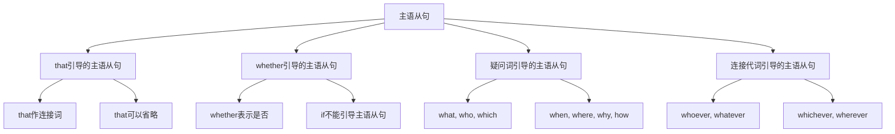

# 主语从句

## 🎯 学习目标
- 掌握主语从句的基本概念和用法
- 理解主语从句的各种形式
- 熟练运用主语从句的表达方式

## 📚 基本概念

### 主语从句（Subject Clause）
**定义**：在复合句中充当主语的从句

### 基本特征
- 在复合句中充当主语
- 由连接词引导
- 有完整的主谓结构
- 表达完整的意思

## 🔄 主语从句分类

## 📊 主语从句变化表

### 基本变化表
| 类型 | 连接词 | 示例 | 说明 |
|------|--------|------|------|
| that从句 | that | That he is honest is true. | that作连接词 |
| whether从句 | whether | Whether he will come is unknown. | whether表示是否 |
| 疑问词从句 | what, who, which | What he said is important. | 疑问词作连接词 |
| 连接代词从句 | whoever, whatever | Whoever comes is welcome. | 连接代词作连接词 |

## 🎯 that引导的主语从句

### 1. 基本用法
**功能**：that引导的主语从句

**示例**：
- ✅ That he is honest is true. (他是诚实的是真的)
- ✅ That she passed the exam is good news. (她通过考试是好消息)
- ✅ That we should help each other is important. (我们应该互相帮助是重要的)
- ✅ That he will come tomorrow is certain. (他明天会来是确定的)
- ✅ That the earth is round is a fact. (地球是圆的是事实)

**语法特点**：
- that作连接词
- that可以省略
- 从句有完整的主谓结构
- 表达完整的意思

### 2. 形式主语it
**功能**：使用形式主语it

**示例**：
- ✅ It is true that he is honest. (他是诚实的是真的)
- ✅ It is good news that she passed the exam. (她通过考试是好消息)
- ✅ It is important that we should help each other. (我们应该互相帮助是重要的)
- ✅ It is certain that he will come tomorrow. (他明天会来是确定的)
- ✅ It is a fact that the earth is round. (地球是圆的是事实)

**语法特点**：
- 使用形式主语it
- 真正的主语是that从句
- 避免句子头重脚轻
- 表达更自然

### 3. 常见句型
**功能**：常见的that主语从句句型

**示例**：
- ✅ It is said that he is rich. (据说他很富有)
- ✅ It is believed that he will succeed. (相信他会成功)
- ✅ It is known that he is talented. (众所周知他有天赋)
- ✅ It is reported that he has left. (据报道他已经离开)
- ✅ It is expected that he will win. (期望他会赢)

**语法特点**：
- 使用被动语态
- 表达客观事实
- 避免主观判断
- 表达更客观

## 🎯 whether引导的主语从句

### 1. 基本用法
**功能**：whether引导的主语从句

**示例**：
- ✅ Whether he will come is unknown. (他是否会来是未知的)
- ✅ Whether she is right is doubtful. (她是否正确是可疑的)
- ✅ Whether we should go is a question. (我们是否应该去是个问题)
- ✅ Whether he can do it is uncertain. (他是否能做是不确定的)
- ✅ Whether they will help us is unclear. (他们是否会帮助我们是不清楚的)

**语法特点**：
- whether表示是否
- if不能引导主语从句
- 从句有完整的主谓结构
- 表达疑问或不确定

### 2. 形式主语it
**功能**：使用形式主语it

**示例**：
- ✅ It is unknown whether he will come. (他是否会来是未知的)
- ✅ It is doubtful whether she is right. (她是否正确是可疑的)
- ✅ It is a question whether we should go. (我们是否应该去是个问题)
- ✅ It is uncertain whether he can do it. (他是否能做是不确定的)
- ✅ It is unclear whether they will help us. (他们是否会帮助我们是不清楚的)

**语法特点**：
- 使用形式主语it
- 真正的主语是whether从句
- 避免句子头重脚轻
- 表达更自然

### 3. 常见句型
**功能**：常见的whether主语从句句型

**示例**：
- ✅ It is not clear whether he will come. (不清楚他是否会来)
- ✅ It is not known whether she is right. (不知道她是否正确)
- ✅ It is not certain whether we should go. (不确定我们是否应该去)
- ✅ It is not decided whether he can do it. (没决定他是否能做)
- ✅ It is not sure whether they will help us. (不确定他们是否会帮助我们)

**语法特点**：
- 使用否定形式
- 表达不确定
- 避免主观判断
- 表达更客观

## 🎯 疑问词引导的主语从句

### 1. what引导的主语从句
**功能**：what引导的主语从句

**示例**：
- ✅ What he said is important. (他说的很重要)
- ✅ What she did is wrong. (她做的是错的)
- ✅ What we need is time. (我们需要的是时间)
- ✅ What he wants is money. (他想要的是钱)
- ✅ What they think is interesting. (他们想的是有趣的)

**语法特点**：
- what作连接词
- what在从句中作成分
- 从句有完整的主谓结构
- 表达完整的意思

### 2. who引导的主语从句
**功能**：who引导的主语从句

**示例**：
- ✅ Who will come is unknown. (谁会来是未知的)
- ✅ Who is right is unclear. (谁是对的是不清楚的)
- ✅ Who can do it is a question. (谁能做是个问题)
- ✅ Who will help us is uncertain. (谁会帮助我们是不确定的)
- ✅ Who is the best is doubtful. (谁是最好的是可疑的)

**语法特点**：
- who作连接词
- who在从句中作主语
- 从句有完整的主谓结构
- 表达疑问或不确定

### 3. which引导的主语从句
**功能**：which引导的主语从句

**示例**：
- ✅ Which book is better is a question. (哪本书更好是个问题)
- ✅ Which way is correct is unclear. (哪种方法是正确的是不清楚的)
- ✅ Which car to buy is difficult. (买哪辆车是困难的)
- ✅ Which school to choose is important. (选择哪所学校是重要的)
- ✅ Which job to take is a decision. (接受哪份工作是决定)

**语法特点**：
- which作连接词
- which在从句中作定语
- 从句有完整的主谓结构
- 表达选择或疑问

### 4. 疑问副词引导的主语从句
**功能**：疑问副词引导的主语从句

**示例**：
- ✅ When he will come is unknown. (他什么时候来是未知的)
- ✅ Where he lives is unclear. (他住在哪里是不清楚的)
- ✅ Why he left is a mystery. (他为什么离开是个谜)
- ✅ How he did it is amazing. (他怎么做的是令人惊讶的)
- ✅ How much it costs is important. (它花费多少是重要的)

**语法特点**：
- 疑问副词作连接词
- 疑问副词在从句中作状语
- 从句有完整的主谓结构
- 表达疑问或不确定

## 🎯 连接代词引导的主语从句

### 1. whoever引导的主语从句
**功能**：whoever引导的主语从句

**示例**：
- ✅ Whoever comes is welcome. (无论谁来都受欢迎)
- ✅ Whoever helps us is our friend. (无论谁帮助我们都是我们的朋友)
- ✅ Whoever breaks the rule will be punished. (无论谁违反规则都会受到惩罚)
- ✅ Whoever wins the game will get a prize. (无论谁赢得比赛都会得到奖品)
- ✅ Whoever solves the problem will be rewarded. (无论谁解决问题都会得到奖励)

**语法特点**：
- whoever作连接词
- whoever在从句中作主语
- 从句有完整的主谓结构
- 表达泛指或条件

### 2. whatever引导的主语从句
**功能**：whatever引导的主语从句

**示例**：
- ✅ Whatever he says is true. (无论他说什么都是真的)
- ✅ Whatever she does is right. (无论她做什么都是对的)
- ✅ Whatever we need is available. (无论我们需要什么都是可用的)
- ✅ Whatever he wants is expensive. (无论他想要什么都是昂贵的)
- ✅ Whatever they think is interesting. (无论他们想什么都是有趣的)

**语法特点**：
- whatever作连接词
- whatever在从句中作宾语
- 从句有完整的主谓结构
- 表达泛指或条件

### 3. whichever引导的主语从句
**功能**：whichever引导的主语从句

**示例**：
- ✅ Whichever book you choose is good. (无论你选择哪本书都是好的)
- ✅ Whichever way you take is correct. (无论你走哪条路都是正确的)
- ✅ Whichever car you buy is fine. (无论你买哪辆车都是好的)
- ✅ Whichever school you choose is excellent. (无论你选择哪所学校都是优秀的)
- ✅ Whichever job you take is suitable. (无论你接受哪份工作都是合适的)

**语法特点**：
- whichever作连接词
- whichever在从句中作定语
- 从句有完整的主谓结构
- 表达选择或条件

### 4. wherever引导的主语从句
**功能**：wherever引导的主语从句

**示例**：
- ✅ Wherever he goes is interesting. (无论他去哪里都是有趣的)
- ✅ Wherever she lives is beautiful. (无论她住在哪里都是美丽的)
- ✅ Wherever we travel is exciting. (无论我们旅行到哪里都是令人兴奋的)
- ✅ Wherever they work is important. (无论他们在哪里工作都是重要的)
- ✅ Wherever you study is good. (无论你在哪里学习都是好的)

**语法特点**：
- wherever作连接词
- wherever在从句中作状语
- 从句有完整的主谓结构
- 表达地点或条件

## 🎯 主语从句的时态

### 1. 现在时态
**功能**：现在时态的主语从句

**示例**：
- ✅ That he is honest is true. (他是诚实的是真的)
- ✅ What he says is important. (他说的很重要)
- ✅ Whether he will come is unknown. (他是否会来是未知的)
- ✅ Whoever comes is welcome. (无论谁来都受欢迎)
- ✅ Whatever he does is right. (无论他做什么都是对的)

**语法特点**：
- 现在时态
- 表达现在情况
- 时态要一致
- 注意主谓一致

### 2. 过去时态
**功能**：过去时态的主语从句

**示例**：
- ✅ That he was honest was true. (他是诚实的是真的)
- ✅ What he said was important. (他说的是重要的)
- ✅ Whether he would come was unknown. (他是否会来是未知的)
- ✅ Whoever came was welcome. (无论谁来都受欢迎)
- ✅ Whatever he did was right. (无论他做什么都是对的)

**语法特点**：
- 过去时态
- 表达过去情况
- 时态要一致
- 注意主谓一致

### 3. 将来时态
**功能**：将来时态的主语从句

**示例**：
- ✅ That he will be honest is true. (他将诚实是真的)
- ✅ What he will say is important. (他将说的是重要的)
- ✅ Whether he will come is unknown. (他是否会来是未知的)
- ✅ Whoever will come is welcome. (无论谁来都受欢迎)
- ✅ Whatever he will do is right. (无论他将做什么都是对的)

**语法特点**：
- 将来时态
- 表达将来情况
- 时态要一致
- 注意主谓一致

## 📊 主语从句用法对比表

| 类型 | 连接词 | 示例 | 说明 |
|------|--------|------|------|
| that从句 | that | That he is honest is true. | that作连接词 |
| whether从句 | whether | Whether he will come is unknown. | whether表示是否 |
| what从句 | what | What he said is important. | what作连接词 |
| who从句 | who | Who will come is unknown. | who作连接词 |
| which从句 | which | Which book is better is a question. | which作连接词 |
| 疑问副词从句 | when, where, why, how | When he will come is unknown. | 疑问副词作连接词 |
| whoever从句 | whoever | Whoever comes is welcome. | whoever作连接词 |
| whatever从句 | whatever | Whatever he says is true. | whatever作连接词 |
| whichever从句 | whichever | Whichever book you choose is good. | whichever作连接词 |
| wherever从句 | wherever | Wherever he goes is interesting. | wherever作连接词 |

## 🚫 常见错误分析

### 错误类型1：连接词使用错误
**错误**：❌ If he will come is unknown.
**正确**：✅ Whether he will come is unknown.
**分析**：if不能引导主语从句

### 错误类型2：时态不一致
**错误**：❌ That he is honest was true.
**正确**：✅ That he is honest is true.
**分析**：时态要保持一致

### 错误类型3：主谓不一致
**错误**：❌ That he are honest is true.
**正确**：✅ That he is honest is true.
**分析**：主谓要一致

### 错误类型4：从句结构不完整
**错误**：❌ That he honest is true.
**正确**：✅ That he is honest is true.
**分析**：从句要有完整的主谓结构

## 🔗 相关链接
- [[02-宾语从句]]：宾语从句的用法
- [[03-表语从句]]：表语从句的用法
- [[04-同位语从句]]：同位语从句的用法
- [[05-名词性从句对比分析]]：名词性从句的对比分析
- [[06-名词性从句易混点辨析]]：名词性从句的易混点辨析
- [[01-基础认知层/01-词性系统/03-动词系统]]：动词系统

## 💡 记忆口诀

**主语从句记忆法**：
- 主语从句在复合句中充当主语，由连接词引导
- that引导的主语从句，that可以省略
- whether引导的主语从句，if不能引导主语从句
- 疑问词引导的主语从句，疑问词在从句中作成分
- 连接代词引导的主语从句，表达泛指或条件
- 时态要保持一致，主谓要一致，从句要有完整的主谓结构

---
*掌握主语从句是语法学习的重要基础，需要大量练习才能熟练运用*
